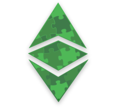
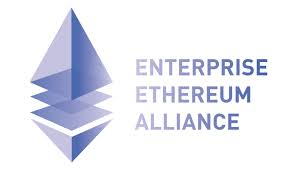
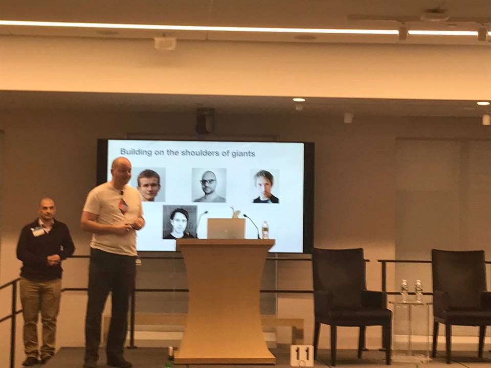

** 18 Oktober 2019 - Vancouver, Kanada ** - Die [ETC Cooperative](https://etccooperative.org) gab heute bekannt, dass sie der [Enterprise Ethereum Alliance (EEA)](https://entethalliance.org), beigetreten ist, einer Organisation für Enterprise Blockchain - eine, die von der größten Entwickler-Community der Welt und einer weltweiten Mitgliederbasis unterstützt wird.

Als Mitglied der EEA wird die ETC Cooperative mit Branchenführern zusammenarbeiten, um bewährte Verfahren für Unternehmenstechnologien, offene Standards und Open-Source-Referenzarchitekturen auf Basis von Ethereum zu entwickeln.

Die ETC Cooperative ist eine in Delaware eingetragene gemeinnützige Organisation nach 501(c)(3), die das Wachstum von Ethereum Classic beschleunigen will. Die Cooperative arbeitet mit der Ethereum-Community und der Ethereum Foundation an gemeinsamen Herausforderungen zwischen Ethereum und Ethereum Classic.

Der Geschäftsführer der ETC Cooperative, [Bob Summerwill](https://bobsummerwill.com/about), war während der Startphase der EEA Co-Lead Architekt (Softwarebranche) und fungierte dann als erster Sekretär der Technischen Arbeitsgruppe und anschließend als stellvertretender Vorsitzender des Technischen Lenkungsausschusses.

Bob Summerwill sagt: „Ich freue mich sehr, in den EEA zurückzukehren - eine Organisation, die mir sehr am Herzen liegt. Wir von der ETC-Cooperative planen uns intensiv mit der EEA-Mainnet-Initiative zu befassen und bei der Standardisierung des „Ethereum-Stacks“ mitzuwirken, der sich als Defacto-Standard für intelligente Verträge herauskristallisiert. Dieser Tech-Stack ist bei Ethereum, Ethereum Classic, Enterprise Ethereum, EVM-in-Fabric und anderen aufkommenden, verwandten Smart Contract-Plattformen üblich. Ethereum ist in seiner Spanne sowohl für öffentliche als auch für private Zwecke einzigartig, und der EEA ist der beste Ort auf dem Planeten, um Mitarbeiter zu finden, die diese Technologie auf eine Art und Weise weiterentwickeln, von der ich weiß, dass sie möglich ist.“

Die Mitgliederbasis der EEA repräsentiert hunderte von Unternehmen aus allen Regionen der Welt in einer Vielzahl von Geschäftsbereichen, einschließlich Technologie, Bankwesen, Recht, Regierung, Gesundheitswesen, Energie, Pharma, Marketing und Versicherungen. Die auf die Branche ausgerichteten, von Mitgliedern betriebenen Arbeitsgruppen für besondere Interessen und technische Fragen der EEA definieren die Marktanforderungen, die erforderlich sind, um zukünftigen Versionen der EEA-Spezifikation beizutragen, und helfen dabei, die Anzahl der von der Spezifikation unterstützten Marktkategorien zu skalieren. Die EEA-Spezifikationen und verwandte Materialien stehen auf der EEA-Internetseite unter entethalliance.org zum öffentlichen Download zur Verfügung.

## Über die EEA

Die EEA ist eine von Mitgliedern betriebene Standardisierungsorganisation, deren Charta darin besteht, offene Blockchain-Spezifikationen zu entwickeln, die die Harmonisierung und Interoperabilität für Unternehmen und Verbraucher weltweit vorantreiben. Unsere globale Mitgliedergemeinschaft besteht aus Führungskräften, Anwendern, Innovatoren, Entwicklern und Unternehmen, die zusammenarbeiten, um ein offenes, dezentrales Web zum Nutzen aller zu schaffen. Weitere Informationen zum Beitritt zur EEA erhalten Sie unter membership@entethalliance.org.

## Über ETC Cooperative

Die ETC Cooperative ist eine in Delaware eingetragene gemeinnützige Organisation nach 501(c)(3), die das Wachstum von Ethereum Classic beschleunigen will.