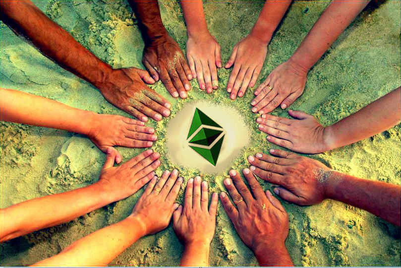

2020- Ethereum Classic suffered a second round of 51% attacks. As a result of the attacks, the development ecosystem around Ethereum Classic has seen a surge in activity via proposed solutions to safeguard the network.

* [July 31, 2020](https://blog.bitquery.io/attacker-stole-807k-etc-in-ethereum-classic-51-attack)
* [August 6, 2020](https://blog.bitquery.io/ethereum-classic-attack-8-august-catch-me-if-you-can).

The 8/20 Core Dev Call set out with the intent of "proposal gathering and discussion only" for the next hard fork for Ethereum Classic. Many of the participants felt the call lacked adequate time for proposal explanation, discussion, and constructive dialogue. These topics are technical in nature and cannot be accomplished in a one hour audio call. In fact, an hour call for each topic likely is not a sufficient amount of time to thoroughly analyze each proposal. Charles of Input Output Global offered some feedback on his experience with the CDC: [Process for Decision Making and Innovation for ETC](https://www.youtube.com/watch?v=F0lR_u7BVho). Everyone's time is valuable and no one likes to feel like they wasted their resources. Hopefully the consensus builders can take this feedback constructively and adjust the modus operandi for future technical calls. Also development teams have the freedom to host their own calls to adequately discuss their proposals. Participation in the network is encouraged, there are no centralized leaders in Ethereum Classic. Your voice is valuable. Join the conversation and be heard.

In an effort to steer the dialogue down a constructive path, please engage in the technical threads related to the proposals. The following is not an exhaustive list, due to the volume of new proposals, but this article will be updated as proposals formalize to the ECIP process.

# Proposed Solutions addressing Ethereum Classic's PoW Security agnostic to ETC's mining algorithm

* [ECIP 1092 "Pirlguard"](https://ecips.ethereumclassic.org/ECIPs/ecip-51attack-solution) - Technical [Discussion](https://github.com/ethereumclassic/ECIPs/issues/327)
* [ECIP 1094 "VeriBlock"](https://github.com/ethereumclassic/ECIPs/pull/340)
* [ECIP xxxx "Checkpointing and Timestamping"](https://www.youtube.com/watch?v=aasUIB1W81E) - [Video](https://www.youtube.com/watch?v=aasUIB1W81E), [Whitepaper](https://eprint.iacr.org/2020/173.pdf)

# Proposed Solutions addressing Ethereum Classic's Mining Algorithm for PoW Security

## Active Proposals
* Do Nothing.
* [ECIP 1043 "Fixed DAG"](https://ecips.ethereumclassic.org/ECIPs/ecip-1043) - Technical [Discussion](https://github.com/ethereumclassic/ECIPs/issues/11)
* [ECIP 1049 "Keccak256"](https://ecips.ethereumclassic.org/ECIPs/ecip-1049) - Technical [Discussion](https://github.com/ethereumclassic/ECIPs/issues/13)
* [ECIP 1093 "RandomX"](https://ecips.ethereumclassic.org/ECIPs/ecip-randomX)  - Technical [Discussion](https://github.com/ethereumclassic/ECIPs/issues/329)

## Miner Signaling
* [ECBP 1076 "Miner Signaling"](https://ecips.ethereumclassic.org/ECIPs/ecip-1076)  - Technical [Discussion](https://github.com/ethereumclassic/ECIPs/issues/333), [Archived Discussion](https://github.com/ethereumclassic/ECIPs/issues/174)

# Parity with [ETH](https://medium.com/ethereum-cat-herders) Discussions:
* EIP-2315: Simple Subroutines for the EVM
* EIP-2537: BLS12-381 curve operations
* EIP-2046: Reduced gas cost for static calls made to precompiles
* EIP-2565: Repricing of the EIP-198 ModExp precompile

# Other ETC topics:
* Gas related proposals: [ECIP 1042](https://ecips.ethereumclassic.org/ECIPs/ecip-1042), [ECIP 1047](https://ecips.ethereumclassic.org/ECIPs/ecip-1047), [ECIP 1083](https://ecips.ethereumclassic.org/ECIPs/ecip-1083), [ECIP 1084](https://ecips.ethereumclassic.org/ECIPs/ecip-1084)
* Backwards Compatibility proposals: [ECIP 1040](https://ecips.ethereumclassic.org/ECIPs/ecip-1040), [ECIP 1068](https://ecips.ethereumclassic.org/ECIPs/ecip-1068), [ECIP 1069](https://ecips.ethereumclassic.org/ECIPs/ecip-1069)
* Slower blocks

# Contribute to the Discussion

The development proposals are where technical discussions occur. To stay current on Ethereum Classic development, please read and participate in the [ECIP repo](https://github.com/ethereumclassic/ECIPs/issues).

### Documentation of August 20, 20202 Core Devs Call

* [Action Items: ETC Q3 Hard Fork Draft 1](https://docs.google.com/document/d/1f0a0sqb0OW3n4ki6nM3q9hvJ91HeZoj9Rpjp2fDCZIQ)
* IOHK CDC Feedback: [Process for Decision Making and Innovation for ETC](https://www.youtube.com/watch?v=F0lR_u7BVho)

