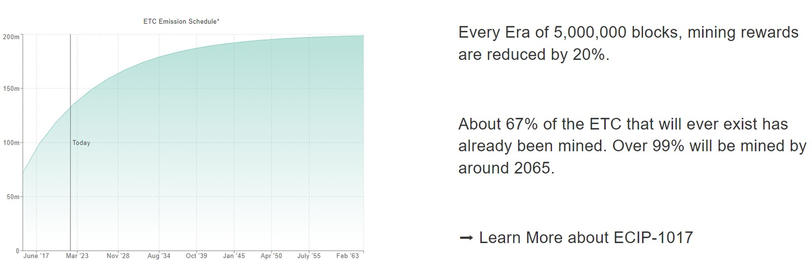

# 5M20 Era 4 Fifthening: ETC Nears Bitcoin inspired Block Reward Reduction

## Ethereum Classic's Fixed Monetary Policy

[Ethereum Classic](https://ethereumclassic.org/why-classic) is the original Ethereum network launched in 2015. One of ETC's most desirable properties, is its Bitcoin inspired monetary policy which features a fixed total supply and known emission schedule via [ECIP-1017](https://ecips.ethereumclassic.org/ECIPs/ecip1017). The fixed total supply of Ethereum Classic is 210,700,000 ETC. To date, 67% of all ETC has been emitted and are circulating in the market. The emission schedule is a block reward reduction of 20% every 5,000,000 blocks, known as the 5M20 monetary policy. A visual countdown and chart of the 5M20 emission schedule can be found at [ETCis.Money](https://etcis.money).

## 5M20 Era 4: Block Reward Reduction

Toward the end of April, 2022 the Ethereum Classic network is expected to cross the 15,000,000 block and enter the fourth era of the 5M20 emission schedule. This will result in a decrease of block rewards from 3.2 ETC to 2.56 ETC per block. This reduces the avaialable sell side liquidity provided to miners for securing the Ethererum Classic network via its ETChash [Proof of Work](https://ethereumclassic.org/why-classic/proof-of-work) consensus mechanism. We see similar market properties with Bitcoin's emission schedule every four years.

The table below shows the block reduction amounts and the total ETC emitted to miners during each 5M20 Era. Note, this table only highlights the first five 5M20 Eras. This 5M20 monetary policy will continue as long as the Ethereum Classic network continues to operate.

## ETC is Sound Money

The 5M20 emission schedule was inspired by Bitcoin. However the authors of [ECIP-1017](https://ecips.ethereumclassic.org/ECIPs/ecip1017) desired a faster emission schedule to catch up to Bitcoin's low inflation rate. The "Fifthening" event for ETC occurs more frequently than Bitcoin's 4 year "Halvening" event. Also, the 5M20 features a smoother reduction curve with a 20% decrease compared to Bitcoins 50% reduction. The result is a decrease in Ethereum Classic's inflation at a quicker rate than Bitcoin. ETC uniquely provides the digital asset space with sound, programmable money on a censorship resistant, decentralized network.

So when someone asks you: "What are the unique properties that make Ethereum Classic special in a crowded cryptocurrency space?"

The logic is easy to convey: ETC is programmable [sound money](https://ethereumclassic.org/why-classic/sound-money) built on top of the largest [Proof of Work](https://ethereumclassic.org/why-classic/proof-of-work) smart contract blockchain. Ethereum Classic is censorship resistant and the premiere network to build unstoppable applications. Code is law.

## Plan C

**If Bitcoin is Plan B. Ethereum Classic is Plan C.**

**Stay Classy. Stack ETC.** ~ r0n1n

The [Ethereum Classic Discord](https://ethereumclassic.org/discord) is an open and active community. Please join the conversation. It is unlikely there will ever be another network like Ethereum Classic due to its [origin story](https://ethereumclassic.org/knowledge/history). There is no centralized foundation that controls this network. There is no corporation or centralized planning that controls this network. There are no gatekeepers for your involvement in this network. Join the Ethereum Classic network and [contribute](https://github.com/ethereumclassic) to one of the very few truly decentralized and open source networks in the blockchain space. Build Unstoppable Applications.

## Learn More About ETC

[Why Ethereum Classic](https://ethereumclassic.org/why-classic)

> But some, like yourself, decide to dive a little deeper, and they discover some interesting facts that debunk that initial skepticism. Their journey down the rabbit hole begins when they find out that Ethereum Classic is not a clone of Ethereum™, but a continuation of the original Ethereum launched in 2015, which The Ethereum Foundation forked away from by launching a new protocol one year later in 2016.

* https://ethereumclassic.org
