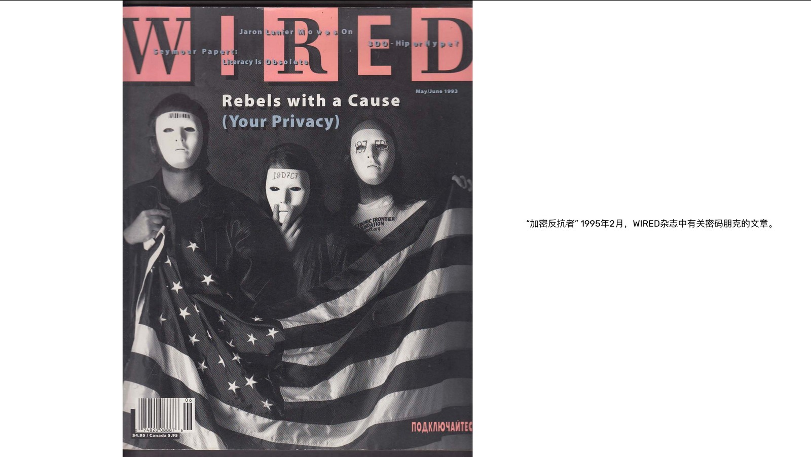
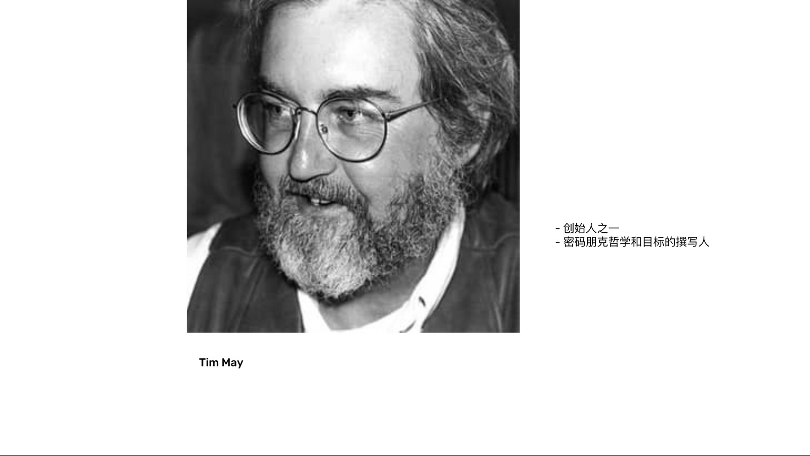
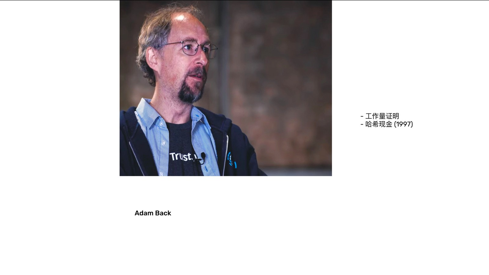
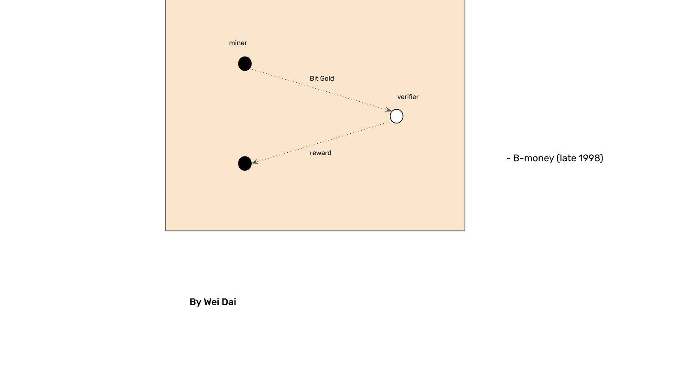

---
**欢迎由此收听或观看本期内容:**

<iframe width="560" height="315" src="https://www.youtube.com/embed/EV0cGsUnaYE" title="YouTube video player" frameborder="0" allow="accelerometer; autoplay; clipboard-write; encrypted-media; gyroscope; picture-in-picture" allowfullscreen></iframe>

---

## 以太坊经典和密码朋克

以太坊经典(ETC)及其令人难以置信的安全和多功能功能，是人们数十年工作的产物，他们看到了公钥密码学的潜力，可以创建一个免受集中化、捕获和特殊利益操纵的互联网。

在以太坊经典课程的第二节课中，我们将看到ETC的支柱 - 硬货币、工作证明和智能合约 - 是如何由一群有远见的计算机科学家、工程师和博学多才的人设计和建造的组件，以及他们是如何自称为密码朋克的。

## 公钥密码学综述

正如我们在上一节课中看到的，公钥密码学是区块链(如ETC)的关键组成部分，其中私钥将其财富和应用程序的主权赋予个人，通过它在区块链上控制的地址，个人持有加密资产。

在 1980 年代，后来形成密码朋克的人最初担心的是当时新兴的互联网有双重承诺：一个积极的承诺，它将为世界各地的人们带来令人难以置信的连接和交流自由，以及，消极的是，公司和政府很容易通过大规模监视和任意干预来捕获它。

## 密码朋克思想和原则

为了解决这个问题，Cypherpunks 在 20 世纪 90 年代初期组建了一个由有远见的计算机科学家、工程师和哲学家组成的在线小组，他们开始研究可能的解决方案。他们的主要目标有四个：

1. **隐私:** 为了避免监视和审查，他们会使用公钥加密的新技术，以确保人们可以在保密的情况下进行通信和交易。
2. **硬货币:** 为了将贸易从政府货币的控制和贬值中解放出来，他们将研究货币，并试图为互联网创造一种原生的交换媒介和价值储存。
3.**智能合约:** 为了取代易于捕获的传统代理和中介的角色，他们需要发明能够实现其功能的自主软件实体。
4. **信任最小化:** 为了实现去中心化和具有言论自由和贸易自由的点对点互联网，首要原则将是信任最小化，或显著减少第三方在所有人类行为中调解的需求。

## 密码朋克之名人与发明: Tim May

蒂姆·梅(Tim May)是密码朋克运动的创始人之一。他致力于解释理念、术语和概念、组织邮件组，甚至是他们在硅谷举行的实体会议。

梅先生就像一个榜样，为团队提供建议、激励和方向。

像许多自由意志主义者一样，他的兴趣围绕着隐私，减少对互联网的任意干预。他对税务人员特别鄙视。

梅先生于2018年12月去世。

##  密码朋克之名人与发明: Adam Back

Adam Back是另一个密码朋克。他在1997年致力于在点对点电子邮件系统中避免垃圾邮件的方法。如果互联网要去中心化，那么应该避免科技公司的电子邮件服务，并使得每个用户都能够防止垃圾邮件。

他的解决方案是一个通过使用工作量证明使用名为HashCash（哈希现金）的系统;它拥有比特币技术的核心，以及ETC今天使用的共识机制的核心;该发明作为阻止垃圾邮件的一种方式。

##  密码朋克之名人与发明: Nick Szabo

Nick Szabo是一名密码朋克。为了创建信任最小化的自主代理，他在1994年发明了智能合约的概念。这个概念可以在人们在线交流或交易时在很大程度上取代第三方的角色。

当他在1998年初读到HashCash时，他立即建立了工作量证明算法中的证明与数字黄金的联系，数字黄金是现实世界中黄金的类比，但应用于数字世界。

有了这个想法，他创建了一个名为比特金（Bit Gold）的系统，成为比特币和ETC的前身。

作为一个博学的人，他还写了一些关于密码朋克哲学的关键文章。它们关于金钱的起源，为什么可信的第三方是安全漏洞，以及计算可扩展性和社会可扩展性之间的反比关系。

##  密码朋克之名人与发明: Wei Dai

戴伟在1998年初与Nick Szabo讨论了工作量证明和Bit Gold的想法，并在1998年底提出了Bit Gold的变体B-money。

B-money作为网络协议的工作方式与比特币的设计方式非常相似，它也是以太坊经典使用的点对点和货币奖励方法。

##  密码朋克之名人与发明: Hal Finney

Hal Finney是一个传奇性的密码朋克人和比特币人。因为他也试图创建一个基于比特金模型的工作量证明货币系统，他称之为RPOW，代表可重用的工作量证明。

Finney是比特币的第一个用户，他写了很多关于比特币网络及其未来成功的文章。

与HashCash、Bit Gold和B-money一样，RPOW的一些设计被中本聪(Satoshi Nakamoto)纳入了比特币当中，也构成了ETC蓝图的一部分。

哈尔·芬尼于2014年8月去世。

## 下节课亮点

在我们的下一节课中，我们将解释这些密码朋克们发明的四种先驱技术，以及这些技术是如何最终让位于比特币，并形成了现在的以太坊经典:

1. HashCash 哈希现金
2. Bit Gold 比特金
3. B-money
4. RPOW

---

**感谢您阅读本期文章!**

了解更多有关以太坊经典，请访问: https://ethereumclassic.org
