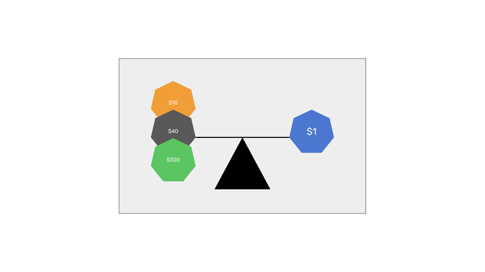

---
**您可以由此收听或观看本期内容:**

<iframe width="560" height="315" src="https://www.youtube.com/embed/J1s7uyDgIZI" title="YouTube video player" frameborder="0" allow="accelerometer; autoplay; clipboard-write; encrypted-media; gyroscope; picture-in-picture; web-share" allowfullscreen></iframe>

---

稳定币是追求价值稳定的加密货币，通常模仿像美元这样的法定货币的价值，通过与资产进行挂钩或抵押来维持其价值，这些资产可以是与它们模仿的法定货币相同的货币，也可以是其他作为担保储备支持其价值的加密货币。

最流行的稳定币包括：

USDT - 由Tether Limited Inc.发行。
USDC - 由由Circle和Coinbase组成的Center共同发行。
BUSD - 由Binance发行。
DAI - 由Maker DAO发行。
稳定币可以分为可兑换和算法稳定币。在本课中，我们将解释后者。

## 什么是算法稳定币？

算法稳定币是稳定币的两个主要类别之一。其中最受欢迎且主要的算法稳定币示例是 DAI。

这些加密货币与它们模仿的法定货币保持一比一的锚定。

算法稳定币是由其他加密货币（如比特币、以太坊、USDC等）作为担保，而不是像可兑换稳定币一样通过模仿的法定货币的外部储备进行担保。

算法稳定币本身在诸如 ETC 的区块链中是 ERC-20 代币。

## 稳定币行业的规模

从上图[来自 CoinMarketCap](https://coinmarketcap.com/view/stablecoin/) 中可以看出，该图表于 2023 年 9 月 5 日更新，市场上排名前 9 的稳定币总市值超过 超过 1210 亿美元。

在该组中，最常用的是：

- USDT - 由 Tether Limited Inc 发行 - 该公司市值超过 820 亿美元，是区块链行业可兑换稳定币领域最大的参与者。
- USDC - 由 Circle 和 Coinbase 创立的财团 Center 发行 - 该财团市值超过 250 亿美元。
- BUSD - 由币安发行 - 市值为 28 亿。
- DAI - 由 Maker DAO 发行，是最大的算法稳定币，市值为 53 亿美元。

自我们于 2023 年 6 月撰写本文以来，顶级可转换稳定币中的新进入者是由 TrustToken 推出的 TrueUSD，市值为 32 亿美元。

## 算法稳定币的工作原理

1. 持有符合条件的加密资产的任何人可以将它们发送到算法稳定币保险库智能合约中以生成稳定币代币。

2. 当算法稳定币保险库智能合约收到加密资产时，它按照一定的比例创建（铸造）稳定币代币。例如，某人可以发送 300 美元的加密资产，并获得 100 美元的稳定币或 100 个稳定币。

3. 一旦算法稳定币发行，它们可以用于支付、交易其他代币、非同质化代币（NFT）或加密资产，或者只是将其保持为稳定币。

4. 算法稳定币与法定货币保持1比1的价值的方式是，如果稳定币的交易价格高于1美元，那么人们会将更多的加密资产兑换为稳定币以降低其价格。反之亦然，如果稳定币的交易价格低于1美元，人们会购买它并将其兑换回加密资产。

5. 当算法稳定币保险库智能合约从用户处收到稳定币代币时，它会赎回这些代币并返还相应的抵押品。用户在赎回算法稳定币时需要支付费用。
   
## 算法稳定币的风险是什么？

尽管这些稳定币的名称暗示其机制是算法驱动或自动化的，但事实上，维持算法稳定币稳定的所有参数和比例都是由一个DAO决定的，DAO的代币持有人基于市场分析和主观意见对所有变量进行投票。

这意味着如果支持算法稳定币的总体抵押加密资产崩溃或失败超出投票成员的估计范围，那么稳定币可能会失去与相应法定货币的等值性。

算法稳定币是非常复杂的系统，需要精心校准多个部分才能正常运作。

---

**感谢您阅读本期文章!**

了解更多有关ETC，欢迎访问: https://ethereumclassic.org

