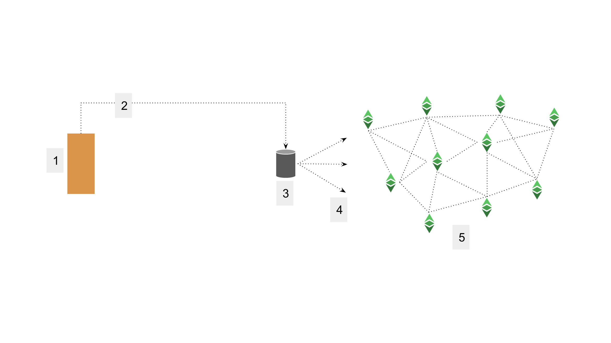
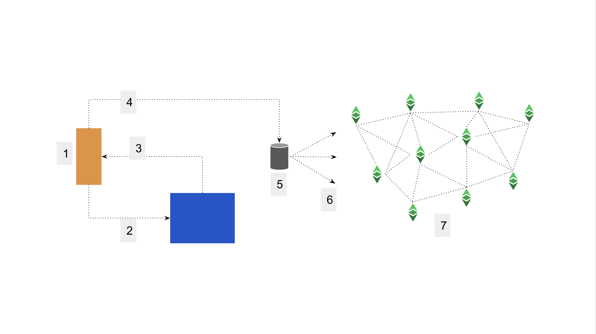

---
**您可以由此收听或观看本期内容:**

<iframe width="560" height="315" src="https://www.youtube.com/embed/PD_aluJ_MVU" title="YouTube video player" frameborder="0" allow="accelerometer; autoplay; clipboard-write; encrypted-media; gyroscope; picture-in-picture; web-share" allowfullscreen></iframe>

---

以太经典（ETC）是一个全球范围内的点对点计算机网络，持有一个包含账户、余额和智能合约的完全复制的分类帐。

为了改变账户的状态，也就是将资金从一个账户转移到另一个账户，或者与智能合约进行交互，网络会不断接收来自全球用户的交易。

当一笔交易被发送到ETC网络中的任何一个节点时，该节点会立即将其转发给网络中的其他节点，以确保所有节点都收到该交易。这个过程在毫秒级别内完成。

在所有的节点中，有一部分被称为“矿工”，这些机器通过“工作量证明”来生成区块，包括将这些交易写入区块链（即复制的分类帐）。

所以，问题是：当一笔交易被发送到ETC时会发生什么？交易何时被网络接受？交易何时是最终的或安全的？

## 普通交易

用户通常使用钱包向以太经典（ETC）发送两种类型的交易：普通交易或dapp或web3交易。

普通交易通常用于将ETC从一个地址转移到另一个地址。其工作方式如下：

1. 用户在使用的钱包应用中输入要发送的金额和接收地址，然后点击发送。
2. 钱包应用将交易发送到所使用的远程ETC网络节点以处理交易。
3. 远程节点接收交易，确认发送地址具有足够的余额，并且交易已使用私钥正确签名。
4. 交易被发送到网络中的其他节点。
5. 其他节点也会验证和处理该交易，并将其永久地包含在区块链中

## Dapp或Web3交易

Dapp或Web3交易使用更多的步骤，并调用区块链上的智能合约来执行更复杂的操作。其工作方式如下：

1. 用户访问Dapp或Web3网站，并将其钱包连接到该应用程序。
2. 用户启动一个交易，例如DeFi交易或购买/销售NFT，并在Dapp或Web3应用程序上点击发送。
3. Dapp或Web3应用程序生成交易，通常是与区块链上的智能合约进行交互，并将其反馈给用户的钱包。
4. 用户的钱包要求用户使用其私钥接受和签署交易，然后将其发送到所使用的远程ETC网络节点以处理交易。
5. 远程节点接收交易并验证其正确性和签名。
6. 交易被发送到网络中的其他节点。
7. 其他节点也会验证和处理该交易，并将其永久地包含在区块链中。

## 矿工需要做什么？

当我们上面提到网络“验证和处理交易，并将其永久地包含在区块链中”时，我们指的是网络中的子组——矿工节点获取这些交易并将它们包含在区块中。他们的工作方式如下：

1. 内存池：所有新的交易都会积累在一个未处理交易的池子中，称为“内存池”（mempool）。
2. 工作量证明：矿工选择尽可能多的支付较高费用的交易（这就是为什么发送交易时正确设置矿工费很重要），将它们创建为一个批次，并进行加密哈希运算，这个过程称为工作量证明。
3. 区块：经过大量计算工作和消耗大量电力后，矿工使用加密哈希为交易批次盖上戳，创建了所谓的交易区块。
4. 网络：当他们准备好区块后，立即将其发送到网络中的其他节点进行验证，并在系统的所有节点中进行完全复制。

## 如何知道交易是否已包含在区块链中？

当用户发送的任何交易通过上述所有步骤时，它将永久地记录在区块链中，如前所述。

如果交易使用正确的矿工费发送，交易本身可能需要13秒（一个区块时间）到39秒（三个区块时间）才能被包含在ETC区块链中。这是因为ETC的矿工每13秒创建一个区块，并且有时将交易完全复制并包含在区块中可能需要一到三个区块的时间。

如果交易的矿工费很低或者网络中有很多交通量，可能需要更长时间。

一旦交易被处理，用户可以通过访问ETC的区块链浏览器（如[Blockscout](https://blockscout.com/etc/mainnet/)来检查它们是否被包含在网络中。

在上面的图像中，您可以看到Blockscout，主要的ETC区块链浏览器上的一个示例交易。您可以通过以下链接查看它：

https://blockscout.com/etc/mainnet/tx/0x486c889edde1857c99aa925eb48bdfe494ca7653abed7045c2ebb3b315098ece

## 发送方与接收方的不同风险

在ETC中进行经济交易时，通常承担风险的是接收方。

这是因为虽然交易可能已经发送，但无法确定何时将最终包含在区块链中，发送方是否输入了正确的矿工费，它是否包含在已经确认的区块或陈旧的区块（也称为叔区块）中，或者它是否可能被51%攻击撤销。

要了解更多关于如何计算这些风险以及何时确保交易是最终的信息，请参阅我们接下来的文章，“什么是良好的区块确认数？”该文章将在本文之后发布！

---

**感谢您阅读本期文章!**

了解更多有关ETC，欢迎访问: https://ethereumclassic.org
