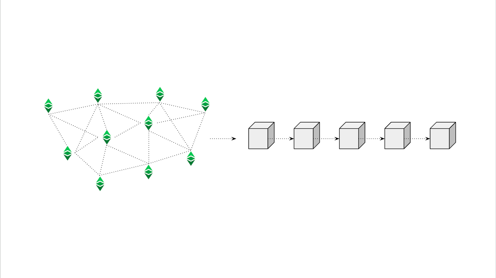
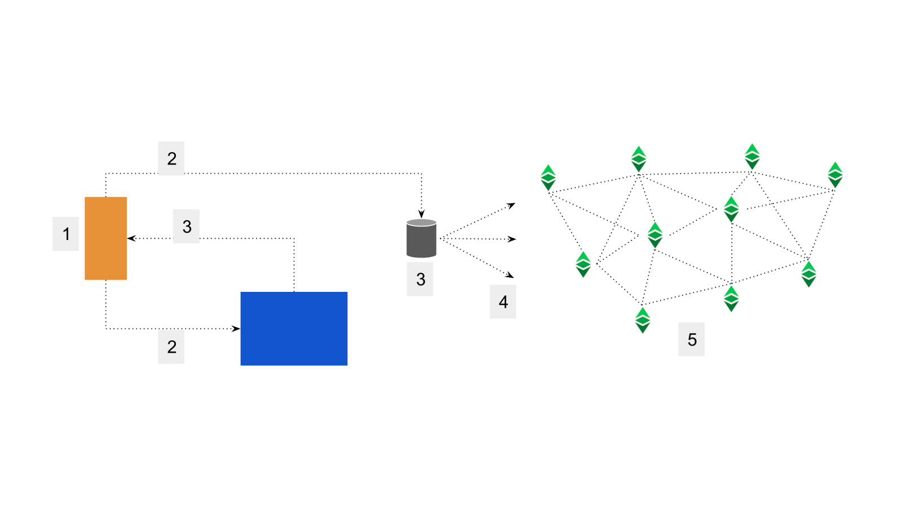

---
**You can listen to or watch this video here:**

<iframe width="560" height="315" src="https://www.youtube.com/embed/GdZhTavyLCQ" title="YouTube video player" frameborder="0" allow="accelerometer; autoplay; clipboard-write; encrypted-media; gyroscope; picture-in-picture; web-share" allowfullscreen></iframe>

---

In the [previous post](https://ethereumclassic.org/blog/2023-06-27-the-life-cycle-of-an-etc-transaction) we explained the life cycle of a transaction from its creation until it is included in the Ethereum Classic (ETC) blockchain.

We described how plain and dapp or web3 transactions are processed, what miners do to produce blocks to include them in the blockchain, how to know whether a transaction has been included, and we stated that usually the receivers of ETC are the ones who have to be more careful with transaction security.

In this post, we will explain how many block confirmations are necessary for transactions to be considered final or secure. The main concept to understand is that transactions become more secure as more blocks are built on top of them.

We will consider the stage of the transaction, the possibility of more than one block being a candidate for the canonical chain, and determining the confirmation security thresholds based on transaction value vs block value.

## Sending a Transaction Is Not Enough to Consider it Secure

As seen in the diagram in this section and as explained in our previous article, an ETC transaction may go through up to seven steps before being included in a block.

Any transaction that is not included in a block yet is insecure because it is not even entered into the history of the ledger. 

For those who can’t wait more than 13 to 39 seconds; which is 1 to 3 blocks in ETC at 13 seconds per block, the typical time that an ETC transaction takes to be included; they should wait at least until the transaction is included in 1 block and posted on the blockchain.

This kind of low security may be adequate for low value transactions, for example between $1 and $100 dollars. 

For higher value transactions, there are other things to consider.

## How Transactions Are More Secure As Time Passes By

The beauty of proof of work blockchains is that they have physical security because the deeper transactions are in the blockchain, the more secure they get.

As blocks cost a lot of computational power and electricity to produce, in ETC it is currently around $38.40 dollars per block every 13 seconds, then the latest blocks may be easier to revert by dishonest actors. But, to revert older blocks to delete or change transactions, it would require redoing all the blocks in the chain all over again, making it extremely costly for attackers.

The cost per block is the reward per block by the current ETC market price. ETC is paying 2.56 ETC per block and the market price at the time of this writing is $15, therefore the cost per block is $38.40.

As examples, below is a list of how much it would cost at current ETC price to revert a transaction by its age:

- 1 day = 6,646 blocks = $255,206
- 1 week = 46,522 blocks = $1,786,445
- 1 month = 199,380 blocks = $7,565,192
- 1 year = 2,425,790 blocks = $93,150,336

## Avoiding Uncle Block Risk

One of the occurrences in proof of work blockchains is that sometimes there may be more than one valid block mined in a round. This happens very rarely in Bitcoin because the block time in that network is 10 minutes, but happens 5% of the time in ETC because the block frequency of 13 seconds increases the chances of this phenomenon. In ETC, these extra valid blocks are called “uncle blocks”.

In both Bitcoin and Ethereum Classic this situation is solved by using the “chain with the most work done” rule, which means that if half the network is working on one block and the other on another, but any side sends a new block first, then the new block establishes the chain with the most work done and all the other nodes throw away the one that was left behind and align with the winning side.

In Bitcoin, this dilemma is solved in one block, so the security measure to use to make sure that a transaction will not be thrown away with a losing block is to wait for 2 block confirmations or 20 minutes.

In ETC, because of the way the protocol is designed and the frequency of the blocks, it was established that the situation was going to be clear after 7 blocks or a minute and a half, so this is the number of confirmations that needs to be used to make sure that a transaction will be on the winning chain.

However, that a transaction is accepted on a block and that the uncle block risk is avoided with 7 confirmations, is still not sufficient to consider it safe.

## Avoiding Transaction Reversal Risk

The true risk of a proof of work blockchain is what is called a 51% attack. These attacks are perpetrated by accumulating sufficient hash power to create a longer chain than the one considered the longest one, and then suddenly sending it to the rest of the network which will immediately adopt it as the canonical chain because it is the one with the most work done.

Attackers usually do this to delete a previous transaction they had sent, in effect recovering the money they had sent to a victim. Because the victim thought that they had received the money, they had given the attacker something of value in exchange for the payment. Whenever a 51% attack is done, it usually targets an exchange because the attackers use the fake transaction to send them crypto, then purchase another token and withdraw it, so when they delete the previous transfer they end up with both the money they used to purchase the new token in the first place and the new token.

The way to protect yourself from this kind of attack is to use many confirmations, more specifically, a number that is proportional to the amount of money received.

The logic of this defense mechanism is to use sufficient confirmations to make it economically unfeasible for the attacker to make any money.

This is how it works: If each block has a cost to build, then, when receiving crypto assets, one should wait a number of confirmations that would make the value of that number of blocks equal or greater to the value of the crypto assets received.

For example, if a block in ETC currently costs $38.40 to build, and someone sends you $384.00 in ETC, then if you just wait 10 blocks you would be safe because if any attacker were to spend more capital in making blocks to reverse that transaction they would lose money.

With this logic, we can make these calculations for different transactions values to be safe:

- $1,000 -> wait 26 blocks
- $5,000 -> wait 130 blocks
- $10,000 -> wait 260 blocks
- $100,000 -> wait 2,604 blocks
- $1,000,000 -> wait 26,041 blocks

## How to Check Transaction Block Confirmations

As explained in our previous post, the way to check the statistics of a transaction is to use a block explorer. The most commonly used block explorer for ETC is [Blockscout](https://blockscout.com/etc/mainnet).

Each transaction on the ETC blockchain has a transaction ID called the “transaction hash”. By entering that ID in the search field on Blockscout, you can check all its information. In one section at the top is shown the confirmation times with the tag “Confirmed by”.

In the transaction in the image, for example, there have been 6,585 confirmations since that transaction was sent.

You may check out the transaction in the image by going to the following link:

https://blockscout.com/etc/mainnet/tx/0x486c889edde1857c99aa925eb48bdfe494ca7653abed7045c2ebb3b315098ece

By the time you see it, it will have many more confirmations!

## Counterparty Trust

Ironically, the highest-value transactions may be the ones that are the most dependent on trust between the parties!

Many times we see mega transactions on the ETC blockchain and other networks. These may be in the hundreds of millions of dollars.

However, if someone sends, for example, $150 million in ETC to someone else, they would have to wait 3,906,250 confirmations or 1.6 years to be safe!

Nevertheless, these types of transactions do happen every now and then and are usually internal transactions within the same corporation, usually exchanges, or between entities that have a long standing relationship.

This means that there is trust between the sender and the receiver, so they know that there will be no 51% attack. Or, at least, they have done their due diligence to make sure that that possibility is very limited, or near zero!

---

**Thank you for reading this article!**

To learn more about ETC please go to: https://ethereumclassic.org
