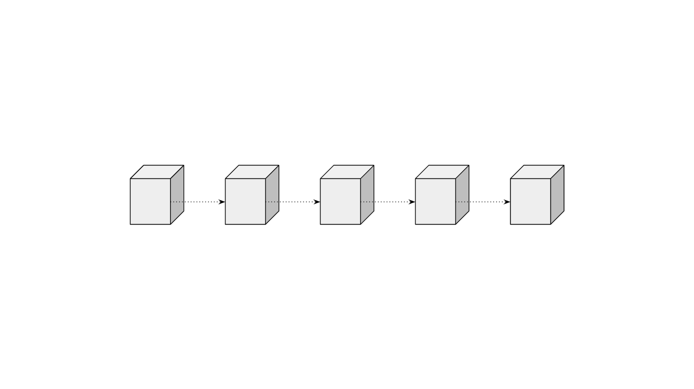

---
**您可以由此收听或观看本期内容:**

<iframe width="560" height="315" src="https://www.youtube.com/embed/GdZhTavyLCQ" title="YouTube video player" frameborder="0" allow="accelerometer; autoplay; clipboard-write; encrypted-media; gyroscope; picture-in-picture; web-share" allowfullscreen></iframe>

---

在[之前的文章](https://ethereumclassic.org/blog/2023-06-27-the-life-cycle-of-an-etc-transaction)中，我们解释了交易的生命周期，直到它被包含在以太坊经典区块链中。

我们描述了如何处理普通交易和dapp或web3交易，矿工如何生成区块并将其包含在区块链中，如何确定交易是否已包含，以及通常情况下接收ETC的人在交易安全方面需要更加小心。

在本文中，我们将解释需要多少个区块确认才能将交易视为最终或安全。要理解的主要概念是，交易在其之上构建的区块越多，其安全性就越高。

我们将考虑的变量包括交易所处的阶段，有时可能有多个区块作为规范链的候选项，并基于交易价值与区块价值之间的比值确定确认安全阈值。

## 仅发送交易还不足以被视为安全

正如本节中的图表所示，并且正如我们在先前的文章中解释的那样，在被包含在一个区块中之前，ETC交易可能需要经历多达七个步骤。

任何尚未包含在区块中的交易都是不安全的，因为它甚至还未被记录在账本的历史中。

对于那些无法等待超过13至39秒的人来说，也就是ETC每个区块13秒所需的时间，ETC交易通常需要被包含的时间，他们至少应该等待交易被包含在1个区块中并在区块链上发布。

对于低价值交易（例如1美元到100美元之间），这种较低的安全性可能是足够的。

对于更高价值的交易，还有其他要考虑的因素。

## 随着时间的推移，交易变得更加安全

工作量证明（Proof of Work）区块链的美妙之处在于，随着交易在区块链中的深度增加，它们变得更加安全。

由于在ETC中生成区块需要大量的计算能力和电力，每个区块的成本目前约为38.40美元，每13秒产生一个区块。因此，最新的区块可能更容易被不诚实的参与者回滚。但是，要回滚较旧的区块以删除或更改交易，就需要重新执行整个区块链中的所有区块，对攻击者来说成本极高。

每个区块的成本是当前ETC市场价格下的每个区块奖励。ETC每个区块支付2.56个ETC，而本文撰写时的市场价格为15美元，因此每个区块的成本为38.40美元。

以下是以当前ETC价格计算的示例，回滚一笔交易所需的成本：

- 1天 = 6,646个区块 = 255,206美元
- 1周 = 46,522个区块 = 1,786,445美元
- 1个月 = 199,380个区块 = 7,565,192美元
- 1年 = 2,425,790个区块 = 93,150,336美元

## 避免叔块风险

在工作量证明区块链中，有时会在同一轮内挖掘出多个有效的区块。在比特币中，由于区块时间为10分钟，这种情况发生得非常少，但在ETC中发生的概率为5%，因为13秒的区块频率增加了这种现象发生的机会。在ETC中，这些额外的有效区块被称为“叔块”。

无论是比特币还是以太坊经典，都通过使用“工作量最大的链”规则来解决这种情况，这意味着如果一半的网络在一个区块上工作，另一半在另一个区块上工作，但任何一方先发送一个新的区块，那么新的区块将建立工作量最大的链，所有其他节点都会丢弃落后的那个区块，并与获胜方保持一致。

在比特币中，这个困境在一个区块内解决，因此确保交易不会在一个失败的区块中被丢弃的安全措施是等待2个区块确认或20分钟。

在ETC中，由于协议的设计方式和区块的频率，人们认为在7个区块或一个半分钟后情况会变得清晰，因此需要使用7个确认来确保交易将位于获胜的链上。

然而，仅仅接受交易并通过7次确认避免叔块风险仍然不足以将其视为安全。

## 避免交易撤销风险

工作量证明区块链真正的风险是所谓的51%攻击。攻击者通过积累足够的哈希算力来创建比被认为是最长链更长的链，然后突然将其发送给网络的其他节点，其他节点会立即接受它作为主链，因为它是工作量最大的链。

攻击者通常这样做是为了删除他们之前发送的交易，实际上是收回他们发送给受害者的资金。因为受害者认为他们已经收到了资金，所以他们曾经为了付款而交付了有价值的东西给攻击者。每当进行51%攻击时，通常会针对一个交易所，因为攻击者使用虚假交易向交易所发送加密货币，然后购买另一种代币并将其提取，因此当他们删除之前的转账时，他们最终获得了用于购买新代币的资金和新代币。

保护自己免受这种攻击的方法是使用许多确认，更具体地说，是与收到的资金金额成比例的确认数。

这种防御机制的逻辑是使用足够的确认使攻击者无法从中获利。

具体做法如下：如果每个区块构建的成本都是固定的，那么在接收加密资产时，应等待足够多的确认，使得这些确认所代表的区块价值等于或大于所收到的加密资产的价值。

例如，如果在ETC中每个区块的构建成本目前为38.40美元，而有人向您发送了384.00美元的ETC，那么只需等待10个区块，您就会安全，因为如果有任何攻击者在逆转该交易方面投入更多资金制造区块，他们将会亏钱。

根据这种逻辑，我们可以为不同的交易金额进行以下安全计算：

- 1000美元 -> 等待26个区块
- 5000美元 -> 等待130个区块
- 10000美元 -> 等待260个区块
- 100000美元 -> 等待2604个区块
- 1000000美元 -> 等待26041个区块

## 如何检查交易的区块确认次数

如我们在之前的文章中解释的那样，检查交易的统计信息的方法是使用区块浏览器。ETC的主要区块浏览器是[Blockscout](https://blockscout.com/etc/mainnet).

每个在ETC区块链上的交易都有一个称为"交易哈希"的交易ID。通过在Blockscout上输入该ID，您可以查看该交易的所有信息，并且在顶部的一个部分中，它显示了确认次数，使用"Confirmed by"标签进行标注。

例如，在上图中的交易中，从该交易发送以来已经有6,585次确认。

您可以通过访问以下链接查看该图中的交易：

https://blockscout.com/etc/mainnet/tx/0x486c889edde1857c99aa925eb48bdfe494ca7653abed7045c2ebb3b315098ece

当您查看时，它将会有更多的确认次数！

## 对手方的信任

具有讽刺意味的是，价值最高的交易可能是最依赖各方之间信任的交易！

在ETC区块链和其他网络上，我们经常看到巨额交易。这些交易的价值可能达到数亿美元。

然而，如果有人向他人发送了1.5亿美元的ETC，他们将需要等待3,906,250次确认，或者1.6年才能安全！

尽管如此，这类交易偶尔还是会发生，并且通常是同一公司内部的交易，通常是在交易所之间进行，或者是在长期存在的关系实体之间进行。

这意味着发送方和接收方之间存在信任，因此他们知道不会发生51%攻击。或者至少，他们已经尽了自己的职责，确保这种可能性非常有限，或者接近零！

---

**感谢您阅读本期文章!**

了解更多有关ETC，欢迎访问: https://ethereumclassic.org
