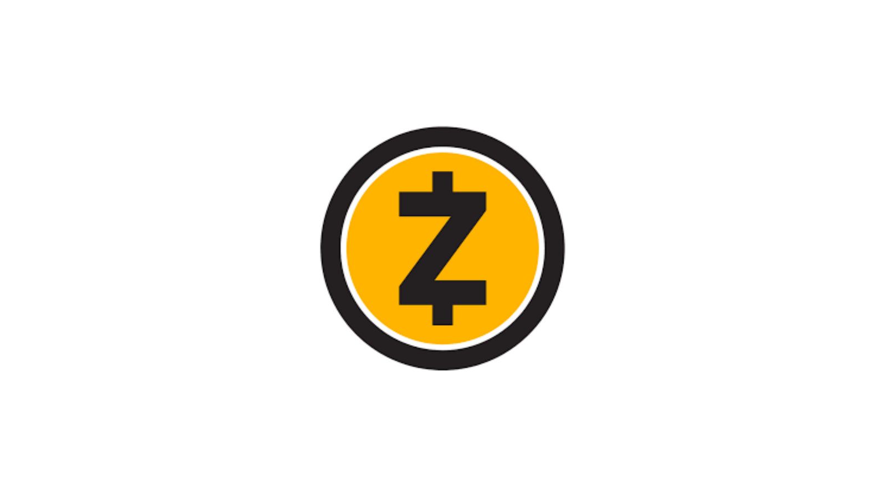

---
**您可以由此收听或观看本期内容:**

<iframe width="560" height="315" src="https://www.youtube.com/embed/sdpE3g55lOk" title="YouTube video player" frameborder="0" allow="accelerometer; autoplay; clipboard-write; encrypted-media; gyroscope; picture-in-picture; web-share" allowfullscreen></iframe>

---

在以太坊经典（ETC）课程的前一节中，我们解释了什么是稳定币，特别是算法稳定币，它们的工作原理以及风险。

在本节课中，我们将解释什么是隐私币，从标准区块链中的默认隐私级别开始，介绍隐私币实现更深层隐私的主要方法，以及隐私币的风险。

在接下来的两节课中，我们将涵盖以下主题：

- 第29节课：去中心化金融（DeFi）币是什么？
- 第30节课：文件存储币是什么？

## 标准区块链中的默认隐私

以太坊经典（ETC）和比特币（BTC）等区块链非常透明，所有的交易、智能合约、余额甚至软件客户端的代码都是公开信息，因此任何人都可以审计它们并检查是否按设计工作。

这些系统中的隐私是由于用户只需掌握秘密私钥即可控制其地址，因此相应的公共地址与其身份、个人或实体没有关联。因此，如果用户在保持其在区块链上的动态的隐私方面谨慎，那么一定程度的隐私是可能的。

然而，随着数据科学的进步，从多个来源获取信息并对经济交易进行三角测量，外部观察者更容易、更常见地了解公开透明系统中的所有者。

## 什么是隐私币？

在上述描述的背景下，为增强个人用户的安全性，隐私币做出了权衡，降低了系统的透明度以增加交易、地址和余额的保密性。

隐私币使用不同的方法，在它们的区块链上对交易的发送者地址、金额和接收者地址进行加密或隐藏。

有几种币已经推出以增强隐私性，其中一些经常被使用并具有大量的交易活动。

整个隐私币领域已经达到了显著的市值。

## 隐私方法：零知识证明

如果有两个处理秘密信息的参与方，其中一个以隐藏的方式将信息发送给另一个，接收方即使不知道也可以修改或不修改数据，然后向发送方展示，并询问数据是否被修改。因为发送方知道信息，他们可以轻松地正确回答问题，而不向接收方透露内容。

经过大量的尝试，如果发送方完美地回答了所有的问题，那么信息是真实的可能性是极高的，即使接收方不知道其内容。这就是“零知识证明”的基础。

Zcash是一种采用这种方法创建隐私区块链的加密货币。截至撰写本文时，它是行业中市值第二大的隐私币，市值为4.05亿美元。

在Zcash上，用户可以选择发送私密或透明的交易。

## 隐私方法：综合技术

行业中市值最大的隐私币是Monero，市值达到了24.8亿美元，它同时使用了三种不同的隐私技术：

**隐身地址**： 这项技术通过为每个接收者和每笔交易创建“隐身地址”来隐藏资金的接收者。

**环签名**： 这种类型的签名将多个发送方的签名混合在每个交易中，因此无法知道谁是发送方。

**环保密交易**： 交易中的这个组件使用密码学来隐藏系统中每次货币转移的金额。

这三种技术的组合为用户提供了很高程度的隐私保护。在Monero上，所有交易默认都是隐藏的，并且都使用了上述三种方法。

## 其他隐私方法

行业中还有其他几种隐私技术，例如混币和Mimblewimble。

目前，行业中有超过70个网络使用本文中提到的技术及其组合来提供隐私保护。

截至本文撰写时，这一行业领域的总市值为53亿美元。

在本节的图片中，您可以看到CoinMarketCap上排名前十的隐私币。

## 隐私币的风险

通常会指出的一种普遍风险是，传统区块链的透明性使得它们易于审计并揭示可能存在的错误或缺陷，然后可以对其进行修复。但是，如果隐私币隐藏了全部或部分信息，那么就无法对其设计、功能、货币供应以及其他关键指标进行审计。

对于个体用户来说，这些区块链在区块链层面提供了隐私，但交易对手仍可能向竞争对手、当局或任何其他第三方透露其交易数据。

基于以上原因，行业内形成了一种常规智慧，即隐私应该是建立在技术堆栈的更高层次上的特性，而不是在基础区块链层面。

---

**感谢您阅读本期文章!**

了解更多有关ETC相关内容，请访问: https://ethereumclassic.org
