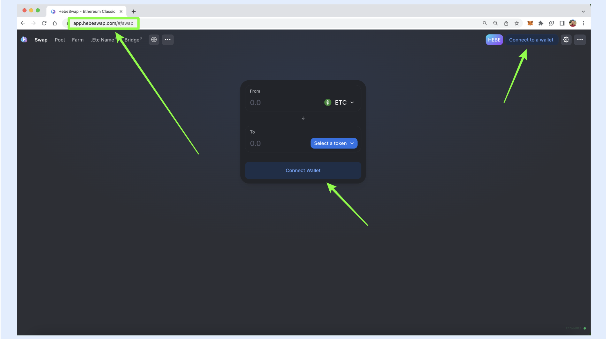
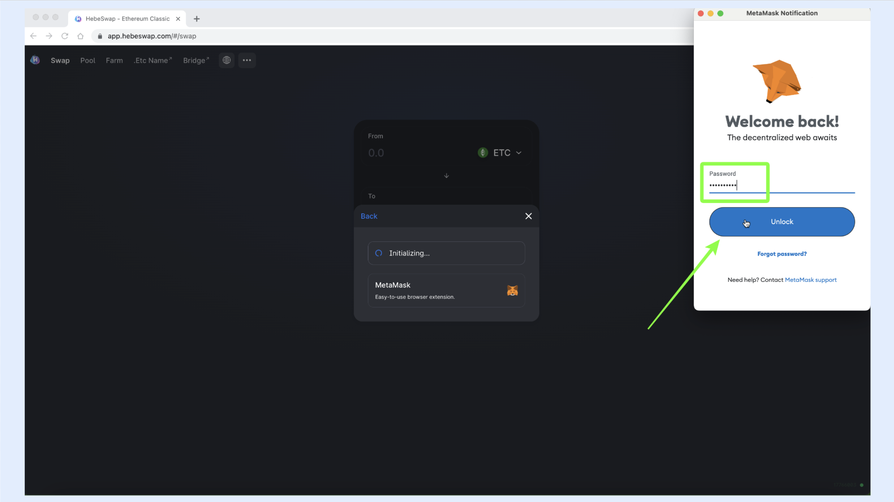
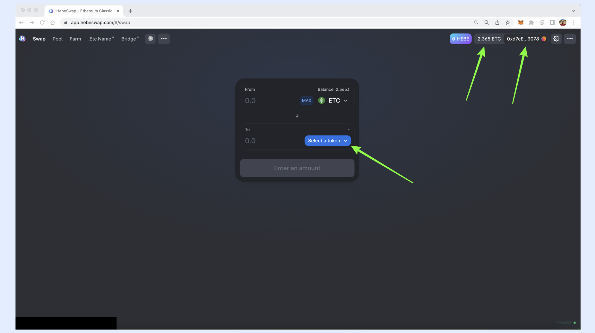
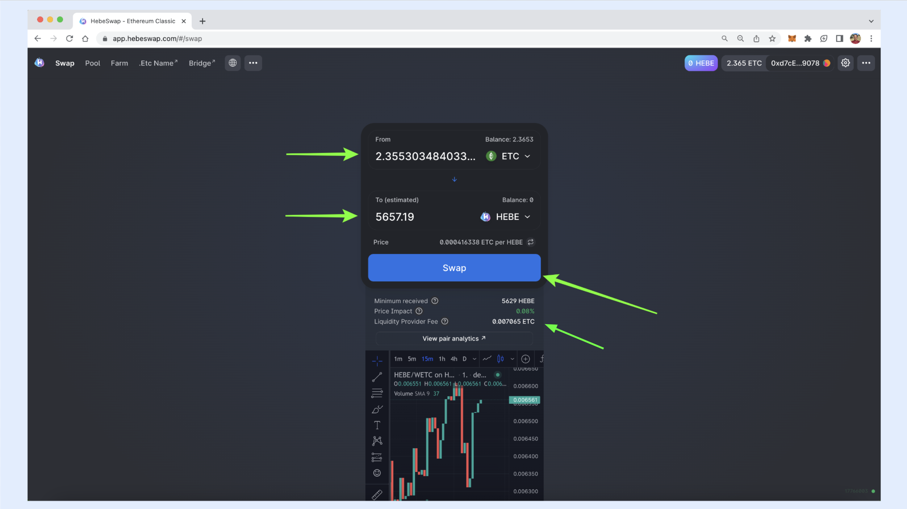
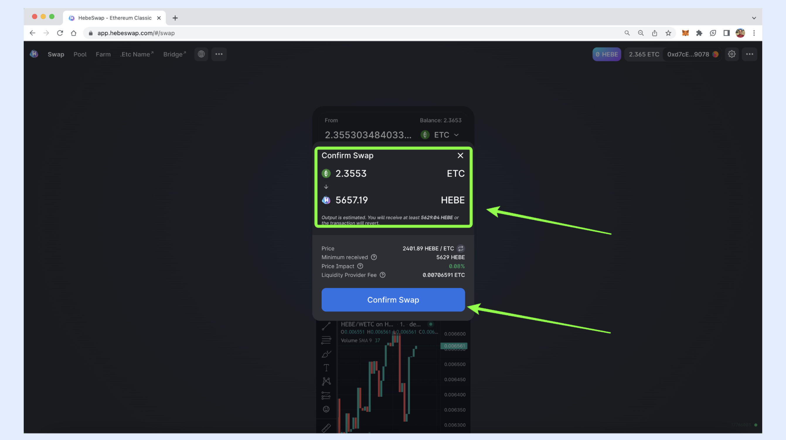
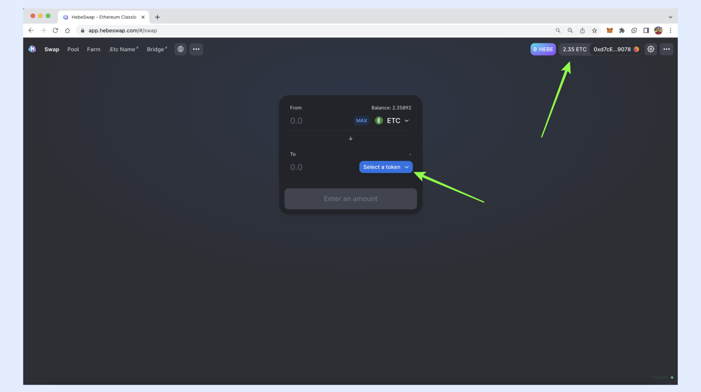
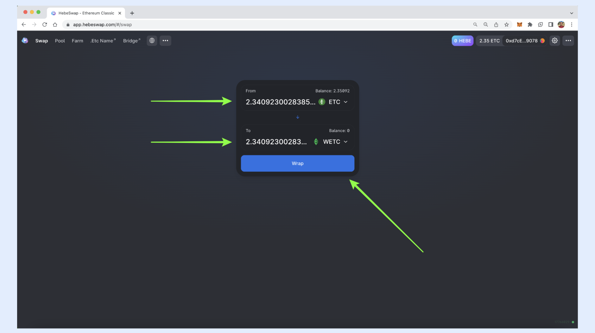
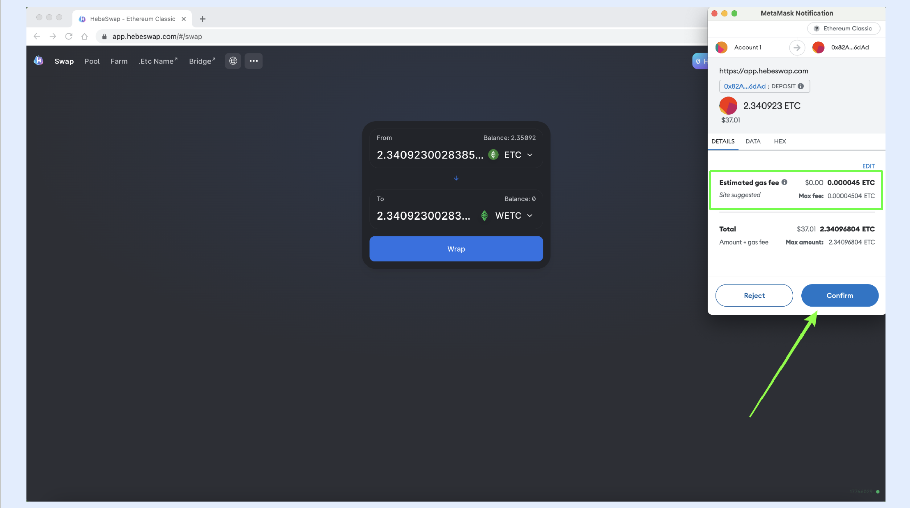

---
**You can listen to or watch this video here:**

<iframe width="560" height="315" src="https://www.youtube.com/embed/xYpgq4Q7t-4" title="YouTube video player" frameborder="0" allow="accelerometer; autoplay; clipboard-write; encrypted-media; gyroscope; picture-in-picture; web-share" allowfullscreen></iframe>

---

## Trading HEBE and WETC on HebeSwap

This is part two of a two part ETC ecosystem series about the decentralized exchange, HebeSwap. You can read part one in the link below:

Link: https://ethereumclassic.org/blog/2023-06-20-etc-ecosystem-spotlight-hebeswap-part-I

In the first part we described the team behind HebeSwap, a decentralized exchange (DEX) in Ethereum Classic (ETC), their other products, their plans for a DAO, and that they issued a token called HEBE to finance their operations.

In this post we will explain how to use the DEX to trade ETC for HEBE and how to transform ETC into WETC (wrapped ETC) which is one of the features that the platform offers.

## How to Trade ETC for HEBE on HebeSwap

1. Go to [app.hebeswap.com/#/swap](https://app.hebeswap.com/#/swap). Then, connect your wallet to the HebeSwap decentralized application (dapp) by pressing “Connect to a wallet” at the top right or pressing the button “Connect Wallet” at the center of the home page.

2. A list of wallets that you may connect will pop up. In our case we will connect MetaMask, but you may use the wallet you prefer from the list. Click on the wallet you will connect. We will continue this guide with MetaMask.

3. In the next step, HebeSwap will call MetaMask to connect. When the Metamask window opens, we will log in to our MetaMask and press unlock.

4. In the next screen, MetaMask asks us what account to connect to HebeSwap. When you select the account, press “Next”.

5. In the next step, MetaMask is ready to connect. To continue, press, “Connect”.

6. Now our wallet is connected to HebeSwap, and we will see the account we selected displayed and our ETC balance on the top right. To proceed to exchange ETC for HEBE press on the button “Select a token”.

7. In the next step, a list of tokens that trade on HebeSwap will appear. We will select HEBE by clicking on it. 

8. Once we have selected the pair to trade, ETC/HEBE, we need to enter the amount of ETC we want to trade. For this example, we will select “MAX” to invest the entire ETC balance in this wallet.

9. In the next step, HebeSwap will show us the total amount of ETC we will use to buy HEBE and the amount of HEBE we will purchase at the current price. To execute the trade, press “Swap”. Note that the transaction will pay a 0.30% fee for liquidity providers and then the gas fees for the ETC network.

10. In the next screen, we will see the data of the transaction so we may check it and confirm it. If everything is ok, then press “Confirm Swap”.

11. In the next step, HebeSwap will call our Metamask wallet again to relay the transaction. MetaMask will open and show us the data of the transaction that will be sent to the ETC network, including the gas fees. To continue press “Confirm”. 

12.  Finally, after a few seconds, the transaction will be executed in the ETC blockchain, and the resulting balances will be shown on HebeSwap on the top right. We exchanged 2.3553 ETC for 5,657 HEBE.

## How to Transform ETC into WETC on HebeSwap

1. To transform ETC into the wrapped ETC token WETC on HebeSwap connect your wallet as explained in the previous section then press “Select a token”. 

2. In the menu that displays select WETC.

3. In the next step enter the amount of ETC you wish to transform into WETC. For this example, we will press “MAX”.

4. In the next screen, HebeSwap will show us how much ETC we will invest. In our case, it will be 2.34092 ETC which will get the exact same amount of WETC because it is a token that is convertible one-to-one with ETC. To execute the trade, press “Wrap”.

5. In the next step, HebeSwap will relay the transaction to MetaMask so it is sent to the ETC blockchain. When your MetaMask opens, press “Confirm” to execute the transaction. Note that you will need to pay the regular ETC gas fee. 

6. In the next step, Metamask will close and you will see on the top right of HebeSwap that your ETC were debited, but there is no field that shows your WETC balance. However, you do have your WETC in your wallet. To see your balance, open MetaMask again.

7. Once MetaMask opens, you will see your WETC balance. In our case, it is 2.34092, which is the amount of ETC we transformed to WETC.

---

**Thank you for reading this article!**

To learn more about ETC please go to: https://ethereumclassic.org
