---
**You can listen to or watch this video here:**

<iframe width="560" height="315" src="https://www.youtube.com/embed/y1lnzzAgaV0" title="YouTube video player" frameborder="0" allow="accelerometer; autoplay; clipboard-write; encrypted-media; gyroscope; picture-in-picture; web-share" allowfullscreen></iframe>

---

In our previous post about the Catacomb ETC Wallet, which is a multisignature wallet dapp on Ethereum Classic (ETC), we explained how to setup multisignature wallets by connecting your non-custodial wallet to the dapp, adding several signatories, and setting up the number of confirmations needed to send transactions.

You may read the previous post in the following link:

https://ethereumclassic.org/blog/2023-06-19-using-the-newly-redesigned-ethereum-classic-multisig-wallet

In this post we will explain how to use your existing multisig wallet on Catacomb, how to send transactions, and the process of signing and confirming them with a second signature.

## Exporting a Catacomb ETC Wallet

1. In the previous post we created a multisig wallet with the three addresses of Donald, Bob, and Alice that may move funds if 2 of 3 signatures authorize it. This wallet may be exported to a file for storage, to use it with other apps, or to send it to the other signatories. To do this, go to multisig.etccooperative.org and connect your wallet as we showed before.

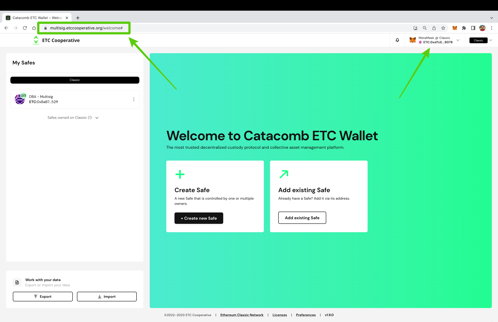

2. Then, to export the wallet, click on the button “Export” at the bottom left of the screen.

3. In the next step, Catacomb will transform your multisig wallet into a JSON file, which is a format used for machine to machine communications, and download it into your computer drive.

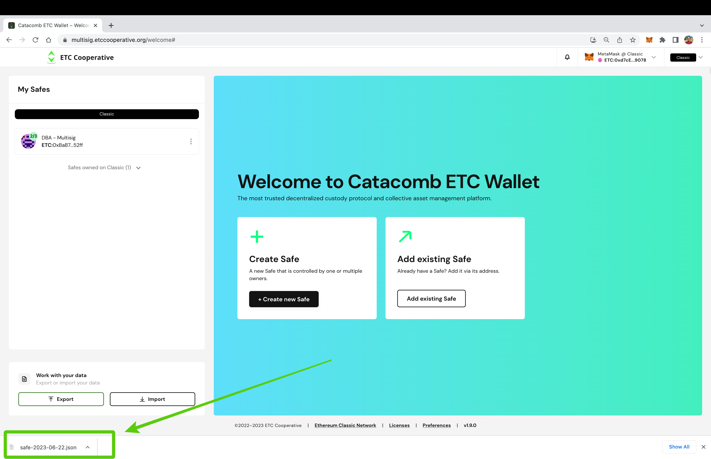

4. The file will look like in the image in this section on your downloads folder. The format will be “safe-yyyy-mm-dd.json”.

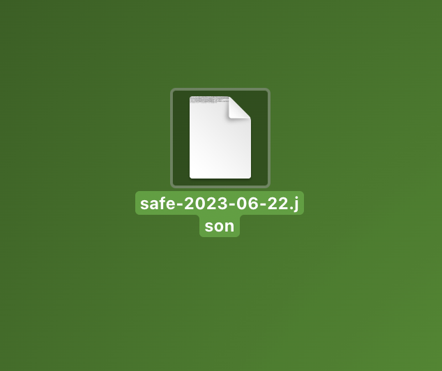

## Importing a Catacomb ETC Wallet

1. To import a Catacomb wallet into the app, you need to go to multisig.etccooperative.org and click on the button that says “Import” at the bottom left of the screen.

2. In the next screen, a window will pop up that you can use to drag and drop the JSON file of your Catacomb wallet or you may click on “choose a file” to get the file from your computer.

3. If you pressed “choose a file” then go to the folder where you have your Catacomb wallet stored and select it. Then, press “Open” to upload it.

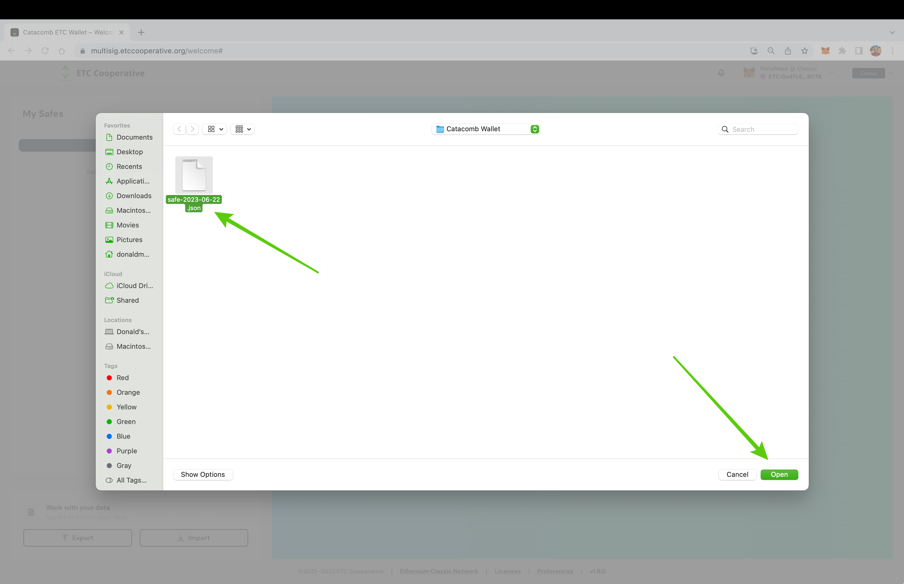

4. In the next step, you will see a pop up window. Press “Import” to import your Catacomb wallet.

5. Now when you go to the home of Catacomb ETC Wallet, you will see your newly imported multisig wallet on the left hand column.

## Opening the Catacomb ETC Wallet

1. Once you see your Catacomb multisignature wallet on the app, then click it to open it.

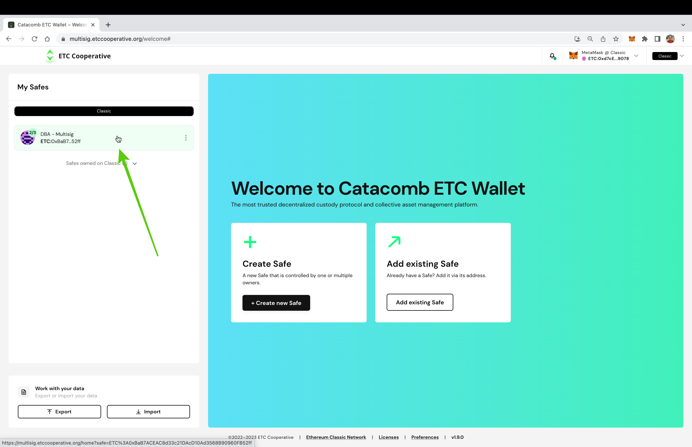

2. In the next screen, you will see the home of your wallet with an overview, a transaction queue if any, the two standard dapps connected to it, and a section with space for more apps for you to connect in the future. On the left you will also find the wallet’s menu. We will go over it, item by item, in the next sections.

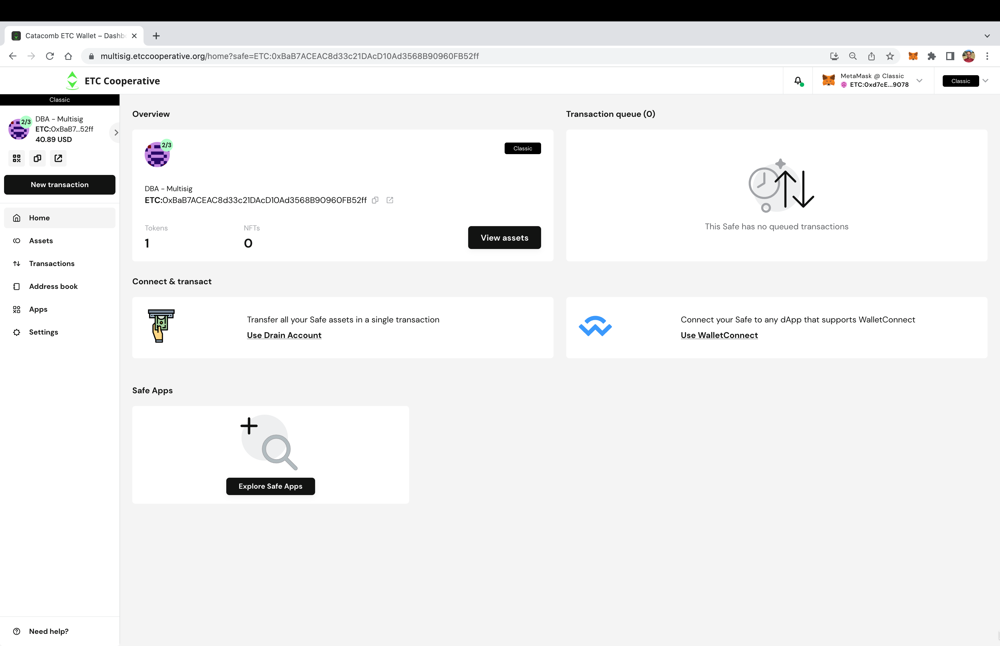

## Checking Assets

1. To see what assets your Catacomb wallet has, press on the “Assets” item on the menu.

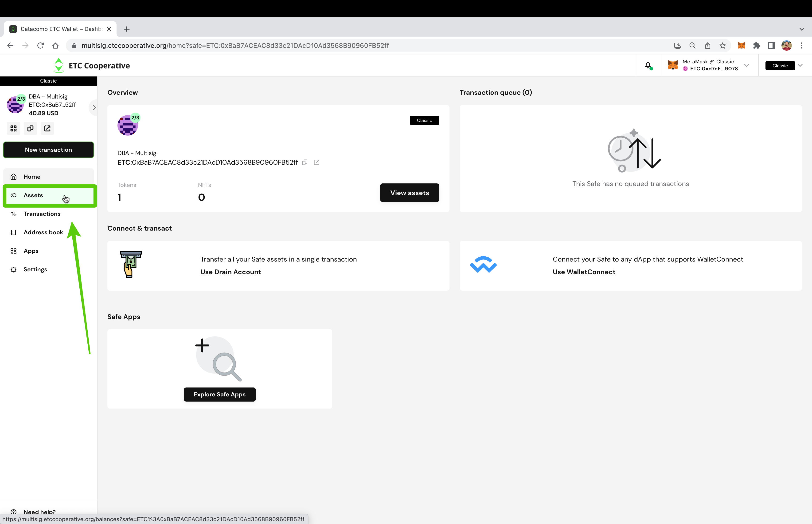

2. In the next screen, you will see the assets under this multisig wallet. In our case, we have 2.35 ETC.

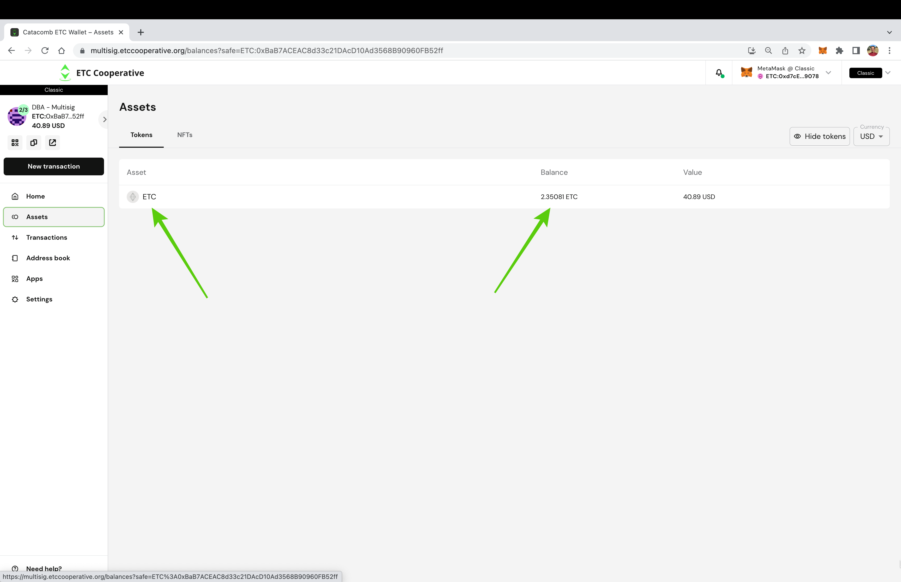

## Checking Transactions

To check transaction history, click on the “Transactions” button. In our case we can only see one transaction, which is the reception of the 2.35 ETC for this demo that we saw in the previous section. 

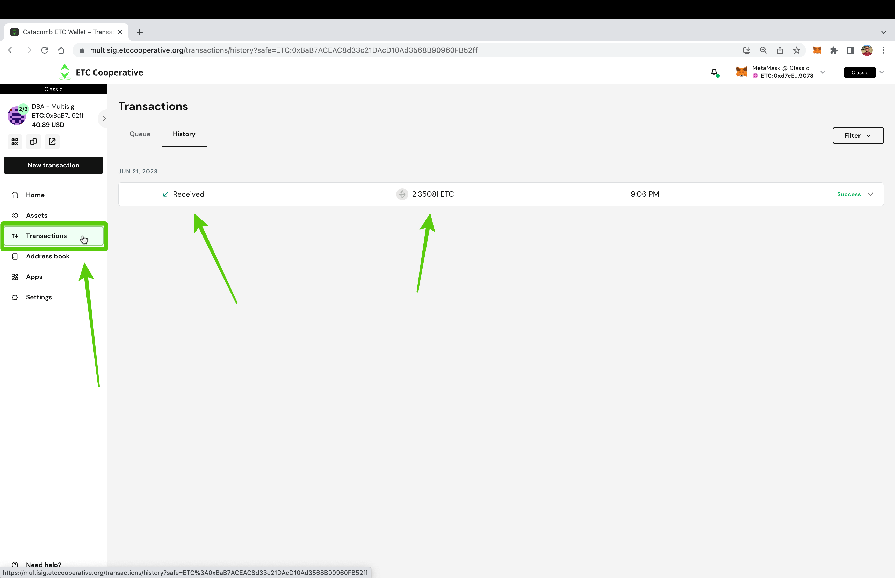

## Checking the Address Book

To see the address book of this Catacomb wallet, click on “Address book”. There you will see the address of the multisig wallet, the addresses connected to it, and other commonly used addresses that you may add for convenience. 

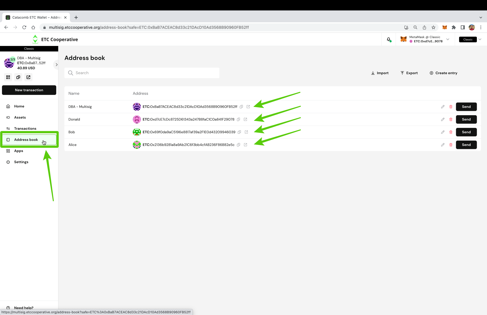

## Checking Apps

You may connect apps to your Catacomb wallet. To check the available apps or the ones you connected, click on the “Apps” link on the left menu. The default apps are “Drain account” and “WalletConnect”.

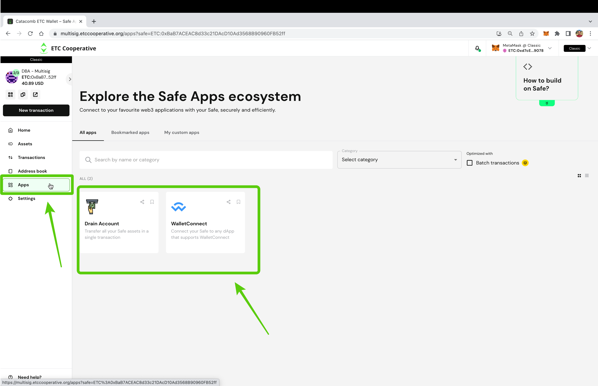

## Checking the Settings

1. To see or modify the settings of your Catacomb wallet, click on “Settings” on the left menu. Here you may manage several aspects of your wallet, such as changing or adding owners, appearance, modules, spending limits, and more. For example, if you wish to change the required confirmations, click on “Change” in the “Required confirmations” section.  

2. In the next screen, you will see a dropdown menu on the top left of the pop up window where you may change the required signature confirmations for this Catacomb wallet.

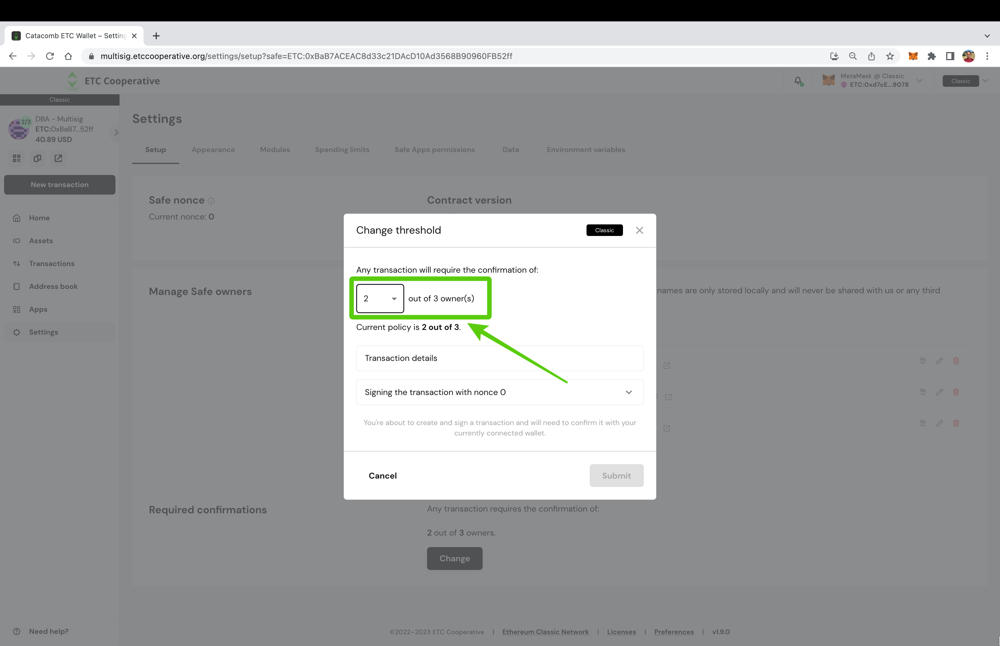

## Sending a Multisig Transaction

1. To send a multisig transaction, click on the “New transaction” link at the top of the left menu.

2. A pop up window will appear with two options, “Send tokens” or “Send NFTs”. Click on “Send tokens”.

3. In the next step, fill out the fields of the recipient, the asset you will send, and then the amount. In our case we are sending the “Max” amount to Donald’s address. Then, press “Next”.

4. In the next step, Catacomb will show you the data of the transaction for you to verify. If everything is ok, then press “Submit”.

5. Now Catacomb will relay the transaction to your connected wallet for you to sign with your private key. In this case we have our MetaMask wallet connected, so it opened the corresponding screen for us to sign. Press “Sign” to send the transaction to the ETC blockchain.

6. In the next step, after a few seconds, Catacomb will show you the transaction that you just sent in the queue for a second confirmation. As you may see, it says “1/2” indicating that one of two signatures has already signed this transaction. Click on the pending transaction to see it.

7. In the next screen, you will see the data of the transaction you sent. It shows it is awaiting confirmations. Now, one of the other signatories must open their Catacomb to confirm it. We will see this in the next section.

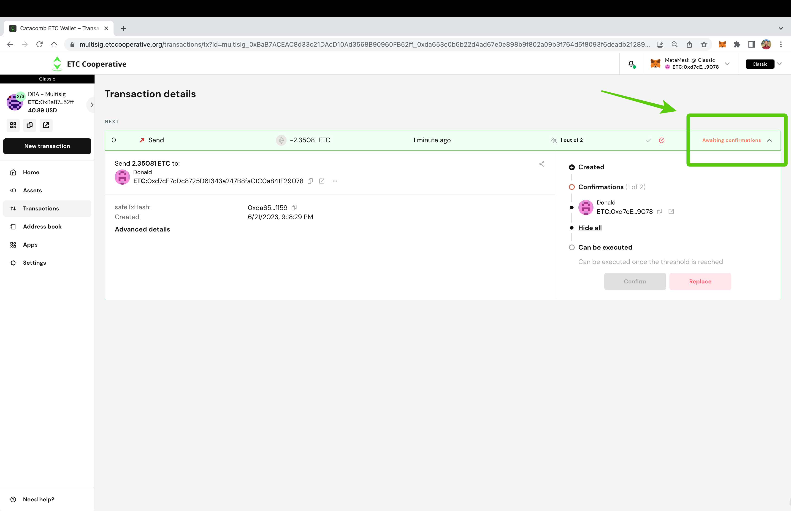

## Confirming the Transaction With a 2nd Signature

1. To confirm the transaction with a second signature, the other person, in our case Bob, must go to multisig.etccooperative.org, connect his wallet to Catacomb as explain before, and import the wallets’ JSON file as we explained before, or just add the wallet address.

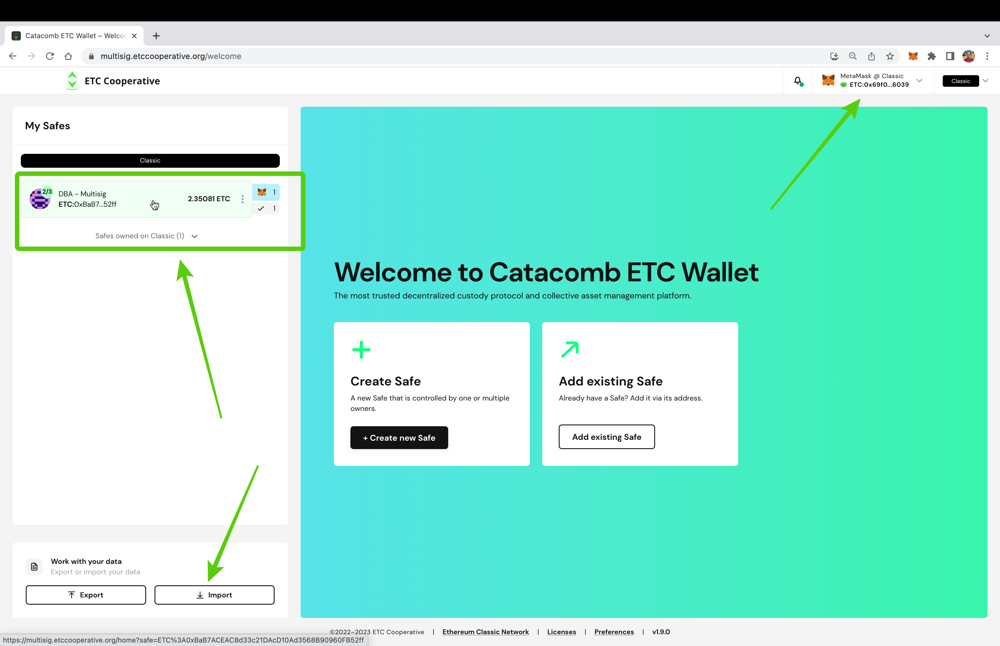

2. Once the Catacomb wallet is imported, Bob may open it and he will see the same pending transaction in the queue that we created in the previous section. Now Bob must click on it to see it.

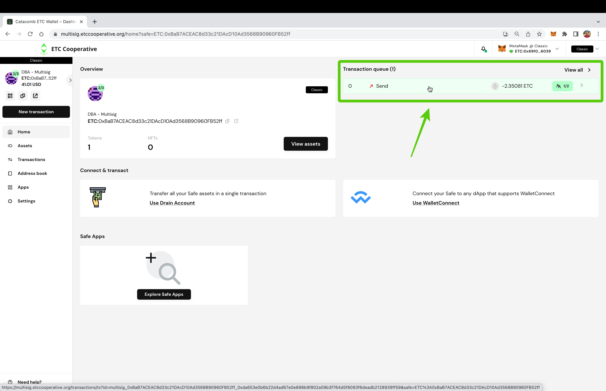

3. When the transaction is opened on Bob’s Catacomb, he will see its data and the option to “Confirm”. To add his signature so the transaction may be executed, he must press “Confirm”.

4. In the next step, a pop up window will open and Bob must press “Submit” to send his signature. Note that he will spend gas fees by adding his signature to this transactions.

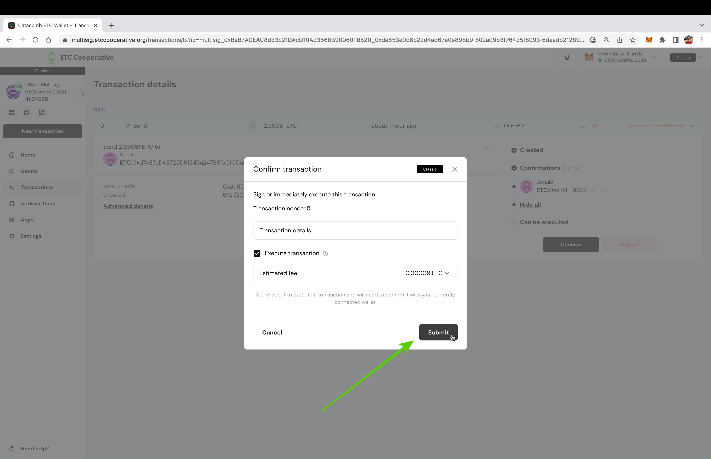

5. In the next step, Bob’s connected wallet will open, in this case we used Metamask again, with the data of the transaction to send to the ETC blockchain. To confirm it, Bob must click the “Confirm” button.

6. After a few seconds, Catacomb will show the transaction as executed on the ETC network because it received the two required signatures. This will show on all Catacomb wallets of all the signatories of this wallet.

---

**Thank you for reading this article!**

To learn more about ETC please go to: https://ethereumclassic.org
