---
** 您可以由此收听或观看本期内容:**

<iframe width="560" height="315" src="https://www.youtube.com/embed/y1lnzzAgaV0" title="YouTube video player" frameborder="0" allow="accelerometer; autoplay; clipboard-write; encrypted-media; gyroscope; picture-in-picture; web-share" allowfullscreen></iframe>

---

在我们之前的帖子中，我们介绍了Catacomb ETC钱包，这是一个基于以太经典（ETC）的多重签名钱包Dapp。我们解释了如何通过将您的非托管钱包连接到Dapp，添加多个签名者，并设置所需的确认数量来设置多重签名钱包。

您可以在以下链接中阅读之前的帖子：

https://ethereumclassic.org/blog/2023-06-19-using-the-newly-redesigned-ethereum-classic-multisig-wallet

在本帖子中，我们将解释如何在Catacomb上使用现有的多重签名钱包，如何发送交易，以及使用第二个签名进行签名和确认的过程。

## 导出Catacomb ETC钱包

1. 在之前的帖子中，我们创建了一个多重签名钱包，其中包括Donald、Bob和Alice的三个地址，如果其中2个地址授权，就可以移动资金。可以将此钱包导出为文件进行存储，以便在其他应用程序中使用，或将其发送给其他签名者。要做到这一点，请转到multisig.etccooperative.org，并按照我们之前展示的方式连接您的钱包。

2. 然后，要导出钱包，请点击屏幕左下方的“导出”按钮。

3. 在接下来的步骤中，Catacomb将把您的多重签名钱包转换为一个JSON文件，这是一种用于机器之间通信的格式，并将其下载到您的计算机驱动器中。

4. 在您的下载文件夹中，该文件的外观将如本节中的图片所示。格式将为“safe-yyyy-mm-dd.json”。

## 导入Catacomb ETC钱包

1. 要将Catacomb钱包导入应用程序中，您需要转到multisig.etccooperative.org，并点击屏幕左下角的“导入”按钮。

2. 在接下来的屏幕中，会弹出一个窗口，您可以使用该窗口拖放Catacomb钱包的JSON文件，或者点击“选择文件”从您的计算机获取文件。
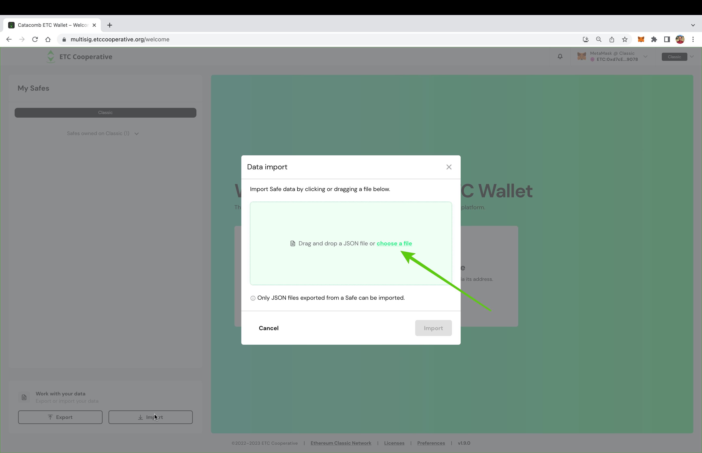

3. 如果您点击了“选择文件”，请转到存储Catacomb钱包的文件夹，并选择该文件。然后，点击“打开”进行上传。

4. 在下一步中，您将看到一个弹出窗口。点击“导入”以导入您的Catacomb钱包。

5. 现在，当您转到Catacomb ETC钱包的主页时，您将在左侧栏中看到您新导入的多重签名钱包。

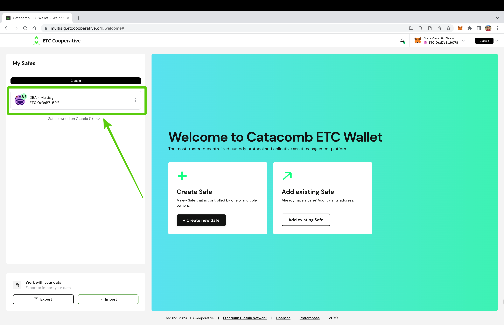

## 打开Catacomb ETC钱包

1. 一旦您在应用程序中看到您的Catacomb多重签名钱包，请点击它以打开它。

2. 在接下来的屏幕中，您将看到您的钱包主页，包括概览、如果有的话，交易队列，以及与之连接的两个标准Dapp，还有一个为您将来连接更多应用程序留出空间的部分。在左侧，您还可以找到钱包的菜单。我们将在接下来的章节中逐项介绍。

## 查看资产

1. 要查看您的Catacomb钱包拥有的资产，请点击菜单中的“资产”项。

2. 在接下来的屏幕中，您将看到这个多重签名钱包下的资产。在我们的例子中，我们有2.35个ETC。

## 查看交易记录

要查看交易历史记录，请点击“交易”按钮。在我们的例子中，我们只能看到一笔交易，即在前一节中看到的2.35个ETC的接收。

## 查看地址簿

要查看此Catacomb钱包的地址簿，请点击“地址簿”。在那里，您将看到多重签名钱包的地址，与之连接的地址，以及您可以为方便起见添加的其他常用地址。

## 查看应用程序

您可以将应用程序连接到您的Catacomb钱包。要查看可用的应用程序或您连接的应用程序，请点击左侧菜单中的“应用程序”链接。默认的应用程序是“Drain account”和“WalletConnect”。

## 查看设置

1. 要查看或修改您的Catacomb钱包的设置，请点击左侧菜单中的“设置”。在这里，您可以管理钱包的多个方面，例如更改或添加所有者、外观、模块、花费限制等。例如，如果您想要更改所需确认数，请在“所需确认”部分点击“更改”。

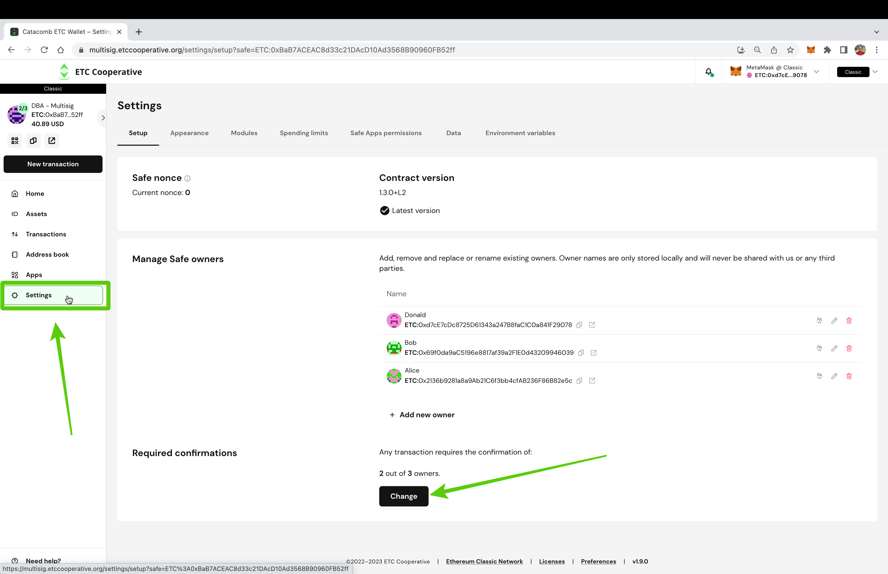

2. 在接下来的屏幕中，您将在弹出窗口的左上方看到一个下拉菜单，您可以在那里更改该Catacomb钱包所需的签名确认数量。

## 发送多重签名交易

1. 要发送多重签名交易，请点击左侧菜单顶部的“新交易”链接。

2. 会弹出一个窗口，显示两个选项：“发送代币”或“发送NFT”。点击“发送代币”。

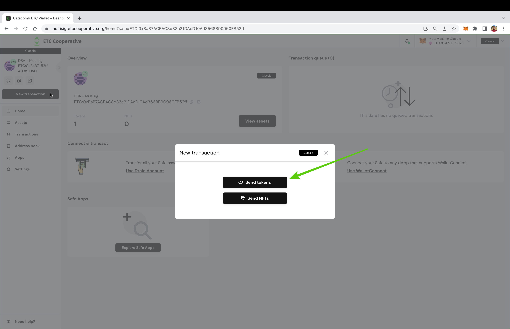

3. 在接下来的步骤中，填写接收者的字段、您将发送的资产，然后填写金额。在我们的例子中，我们将发送“最大”金额给Donald的地址。然后，点击“下一步”。

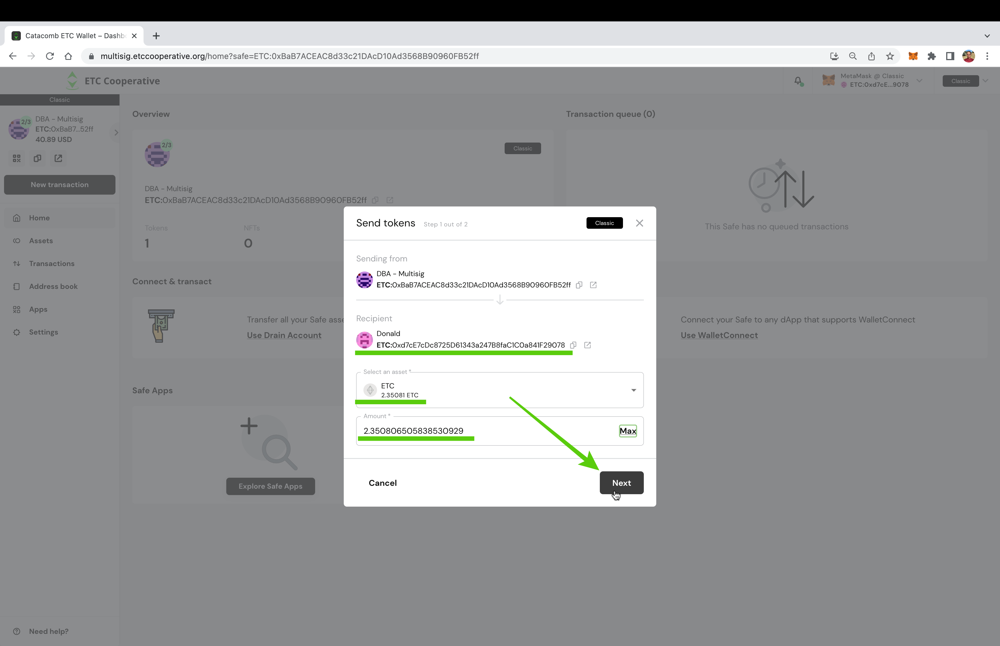

4. 在下一步中，Catacomb将向您显示交易的数据，供您进行验证。如果一切正常，点击“提交”。

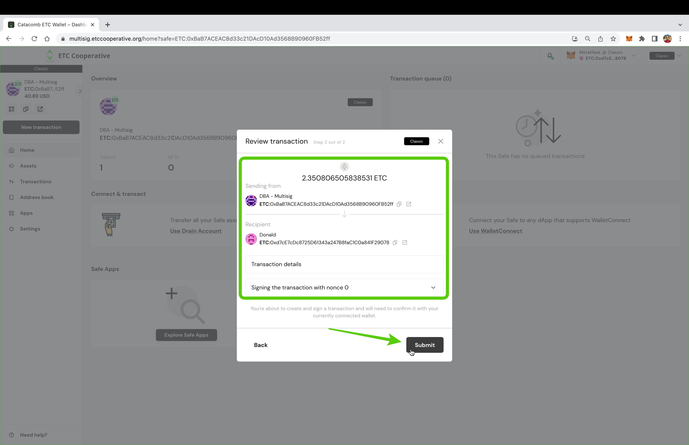

5. 现在，Catacomb将向您连接的钱包中继该交易，以便您使用私钥进行签名。在这种情况下，我们已连接了MetaMask钱包，因此它会打开相应的屏幕供我们进行签名。点击“签名”将交易发送到ETC区块链。
   
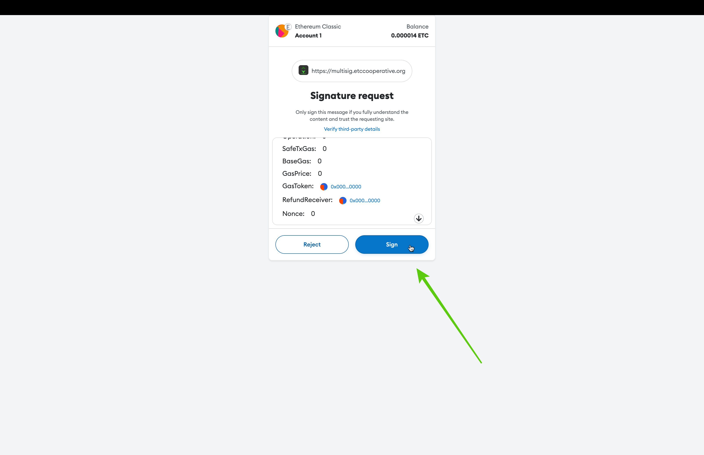

6. 在下一步中，几秒钟后，Catacomb将在待确认队列中显示您刚刚发送的交易，等待第二个确认。正如您所看到的，它显示为“1/2”，表示两个签名之中已有一个签署了此交易。点击待处理的交易以查看它。

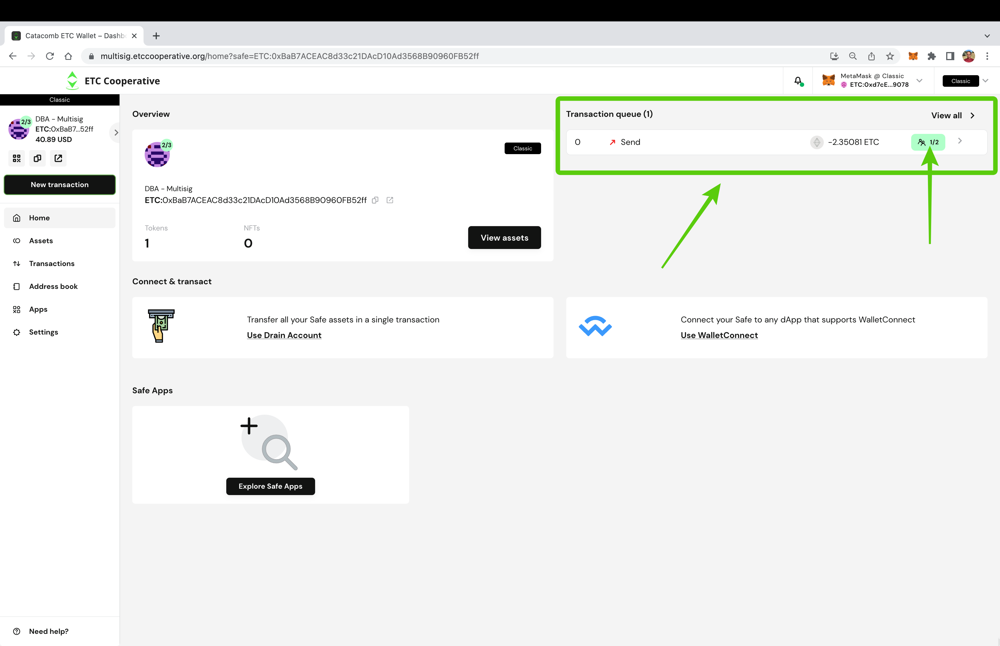

7. 在下一个屏幕中，您将看到您发送的交易的数据。它显示正在等待确认。现在，其他签名者之一必须打开他们的Catacomb进行确认。我们将在下一节中看到这一点。

## 使用第二个签名确认交易

1. 要使用第二个签名确认交易，另一个人，也就是我们的Bob，在我们的例子中，必须前往multisig.etccooperative.org，将他的钱包连接到Catacomb，如之前所述，然后按照之前所述导入钱包的JSON文件，或者只需添加钱包地址。

2. 一旦导入Catacomb钱包，Bob可以打开它，他将在队列中看到与我们在前一节中创建的相同待处理交易。现在，Bob必须点击它以查看它。

3. 当Bob在他的Catacomb上打开交易时，他将看到交易的数据以及“确认”的选项。为了添加他的签名以执行交易，他必须点击“确认”。

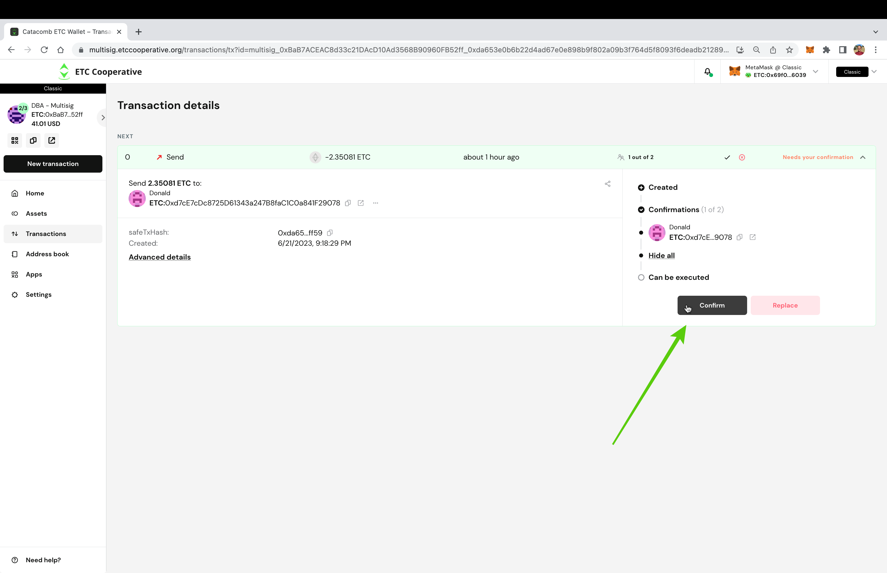

4. 在接下来的步骤中，将打开一个弹出窗口，Bob必须点击“提交”以发送他的签名。请注意，通过为此交易添加签名，他将支付燃气费用。

5. 在下一步中，Bob所连接的钱包将打开，在这种情况下，我们再次使用了Metamask，并显示要发送到ETC区块链的交易数据。为了确认，Bob必须点击“确认”按钮。

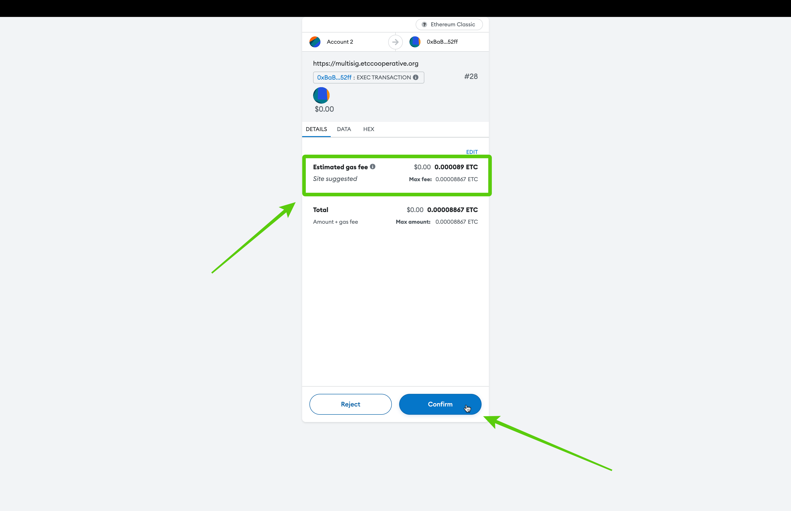

6. 几秒钟后，Catacomb将显示该交易在ETC网络上已执行，因为它收到了两个所需的签名。这将在此钱包的所有签名者的所有Catacomb钱包上显示。

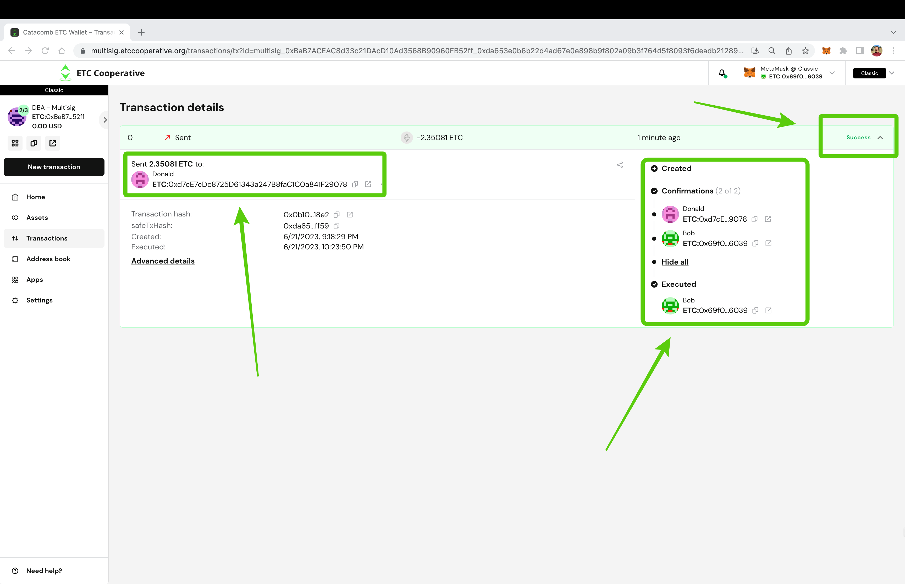

---

**感谢您阅读本期文章!**

了解更多有关ETC，欢迎访问: https://ethereumclassic.org
