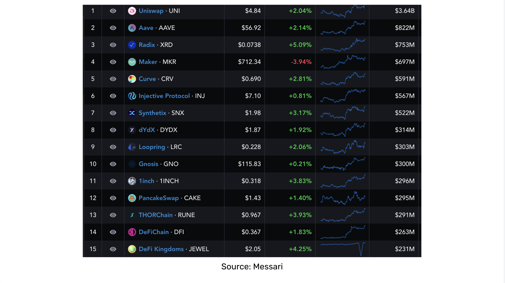

---
**您可以由此收听或观看本期内容:**

<iframe width="560" height="315" src="https://www.youtube.com/embed/x3YzWOhs1uE" title="YouTube video player" frameborder="0" allow="accelerometer; autoplay; clipboard-write; encrypted-media; gyroscope; picture-in-picture; web-share" allowfullscreen></iframe>

---

在以太经典（ETC）课程的上一堂课中，我们解释了什么是隐私币，从标准区块链的默认隐私级别开始，介绍了隐私币实现更深层隐私的主要方法，以及隐私币的风险。

在本节课中，我们将解释什么是去中心化金融（DeFi）代币，从什么是DeFi开始，介绍DeFi代币本身，DeFi代币的分类，DeFi代币的示例，该领域的市值以及DeFi代币的风险。

在接下来的第30节课中，我们将介绍文件存储币是什么。

## 什么是DeFi？

传统金融服务如银行、券商、保险公司、共同基金公司、信用卡和支付系统都是集中化的，因为它们持有我们的资金并且是我们金融合同的中央交易对手，例如存款、贷款、保险和投资管理。这些类型的服务可以称为“CeFi”（中心化金融）。

“DeFi”代表“去中心化金融”，并且通过可编程区块链（如以太经典ETC）中的软件程序来实现。

这些软件程序被创建来取代金融的各个方面，包括银行、保险、交易和投资等。由于它们位于ETC内部，它们是去中心化的，信任程度降低。

DeFi的理念是实现去中心化的程度，使得没有任何团体、特殊利益或可信任的第三方可以篡改或限制用户的资金或金融产品的访问。

## 什么是DeFi代币？

随着开发者在以太经典等区块链内构建了许多模拟金融服务的协议，他们找到了一种方法来融资、决定如何协调和升级系统，并对基础金融产品进行其他类型的技术决策。

用于进行所有这些过程的主要方法是发行与各种DeFi去中心化应用（dapp）相关联的代币。这些代币被公众购买以资助开发团队，并且持有者可能获得多种收益。

通常，这些代币会产生利息或股息，也被称为“被动收入”，因为底层应用向用户收取费用。另一个好处是代币持有者可以对开发团队提出的协议升级进行投票。在其他情况下，在需要金融参数决策（如算法稳定币）的协议中，用户可以对保证金水平和其他产品安全策略进行投票。

## DeFi代币的类别

DeFi代币主要分为两大类别：

**Dapp DAO代币:** 这些是由去中心化自治组织（DAO）发行的ERC-20代币，因此它们可能具有除了可转移和互换的价值单位之外的更多功能。当一个dapp与DAO相连时，代币持有者可以通过DAO赚取利息，在协议治理方面进行投票，或者对基础DeFi服务的参数进行决策。

**Dapp代币:** 这些是没有与DAO任何关联的ERC-20代币，因此它们只是作为可转移的价值单位的普通ERC-20代币。然而，这些代币可能会获得利息或股息，或者具有特殊功能，如新发行或销毁计划。

DeFi dapp，如去中心化交易所（DEX）、复杂的算法稳定币，甚至质押池，都使用了dapp DAO代币或普通的dapp代币来融资开发、决定升级或设置产品参数。

## DeFi代币示例

以下是四个使用dapp DAO或普通dapp代币的DeFi代币示例：

**Uniswap:** Uniswap（UNI）是市场上最大的DeFi dapp DAO代币，根据本文撰写时的估值为28亿美元。它用于决策DEX平台的升级，为流动性池提供流动性，并从向用户收取的费用中获得股息。

**Maker DAO:** Maker DAO（MKR）根据本文撰写时的市值为6.97亿美元，是用于治理和管理算法稳定币Dai风险的代币。Maker DAO代币用于对协议升级进行投票，从向Dai用户收取的费用中获得股息，并用于决定支持Dai的加密资产的安全参数，如保证金水平和可接受的加密资产作为抵押品。

**Lido DAO:** Lido DAO（LDO）根据本文撰写时的市值为16.9亿美元。它是在以太坊和其他权益证明区块链上运行的Lido质押池的治理代币。LDO持有者对质押池升级和理事会调整进行投票，并从协议中获得股息。它还具有经济价值，因为用户可以在Lido平台上质押它以获得奖励并用于支付费用。

**Hebe:** HEBE是由HebeBlock发行的普通代币，HebeBlock团队在ETC和其他dapp上构建和部署了HebeSwap DEX。作为普通代币，它用于为HebeBlock团队提供资金，为DEX提供流动性，并从向用户收取的费用中获得利息。然而，它目前没有投票功能，但HebeBlock团队计划将HEBE迁移到完整的DAO代币，以便用户可以对其平台的升级和其他重要问题进行投票。

## DeFi代币的市值

在本节的图片中，我们展示了由[Messari](https://messari.io/screener/defi-assets-7EE8EDB1)研究服务提供的市值排名前15的DeFi代币。

该平台跟踪了165个DeFi代币。

这个列表的总市值在撰写本文时约为150亿美元。

## DeFi代币的风险

DeFi代币存在以下三个主要风险：

**欺诈风险:** DeFi行业一直面临的问题之一是欺诈，许多黑客和不诚实的开发者承诺推出DeFi协议，尤其是在Binance Smart Chain、Cardano或Avalanche等替代链上，他们从公众那里获得资金，然后关闭并消失，窃取资金，形成了通常所说的“抢跑”。

**中心化风险:** 尽管这些dapp部署在诸如ETC等信任最小化的区块链上，给人们带来了安全和去中心化的印象，但当它们由一组通过DeFi代币进行投票的投资者“治理”时，这些系统可能会随着时间的推移倾向于中心化。另一个风险因素是这些协议本身可能具有中心化特征，例如嵌入其中的身份过滤器和KYC规则，即使它们存在于区块链中。

**被归类为证券:** 随着全球监管机构应对欺诈、市场波动和消费者损失的问题，尤其是在熊市期间，它们正在加大对DeFi协议及其代币的监管和控制力度。其中一个风险是它们可能被归类为证券，这将大大限制它们的交易范围、可以进行经纪的实体、必须如何注册和分发、谁可以购买以及在哪些司法管辖区内。所有这些措施可能导致代币的价值暴跌，因为市场受到官僚主义的限制。

---

**感谢您阅读本期文章!**

了解更多有关ETC，欢迎访问: https://ethereumclassic.org
