---
**You can listen to or watch this video here:**

<iframe width="560" height="315" src="https://www.youtube.com/embed/vXKem76WbD4" title="YouTube video player" frameborder="0" allow="accelerometer; autoplay; clipboard-write; encrypted-media; gyroscope; picture-in-picture; web-share" allowfullscreen></iframe>

---

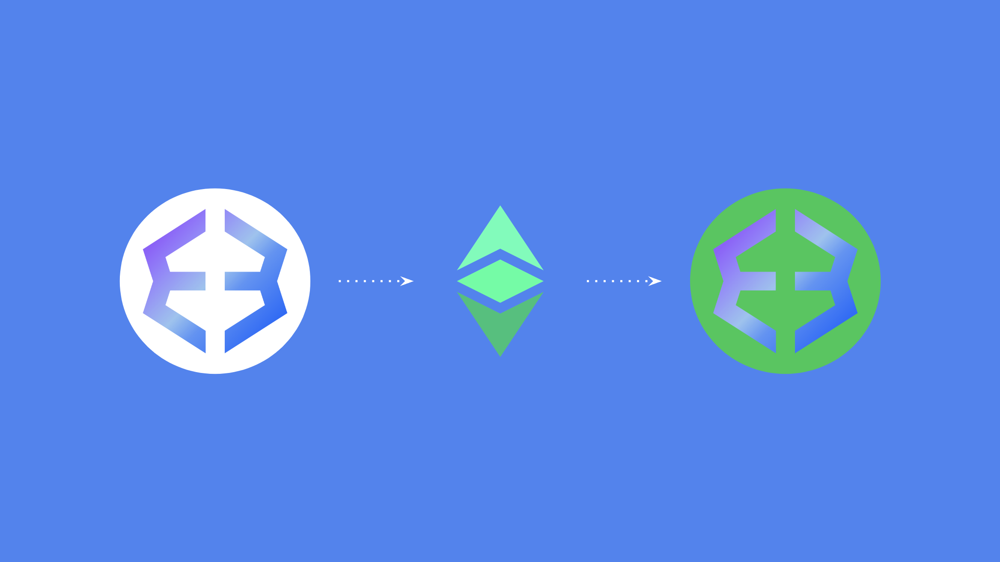

In this article we will guide you through the installation and general use of Ethereum Classic (ETC) with the Exodus wallet for desktop.

## Download and Install Exodus for Desktop

1. The first thing you need to do is go to https://www.exodus.com/download and download the Exodus package for your computer. 

In our case we selected Exodus for Mac.

2. Once installed, when you open Exodus, the first thing you will see is the portfolio screen with some initial steps to follow and offers. Before doing anything, the best practice is to back up your Exodus wallet.

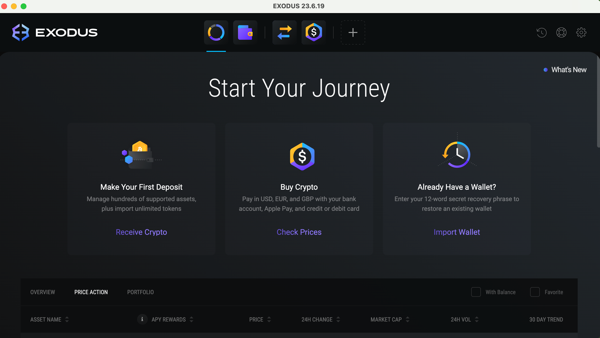

## Backing Up Your Exodus Wallet

1. To back up your Exodus wallet, click on the “Settings” menu at the top right corner of the screen.

2. In the next step, click on the “Backup” tab on the top horizontal menu. 

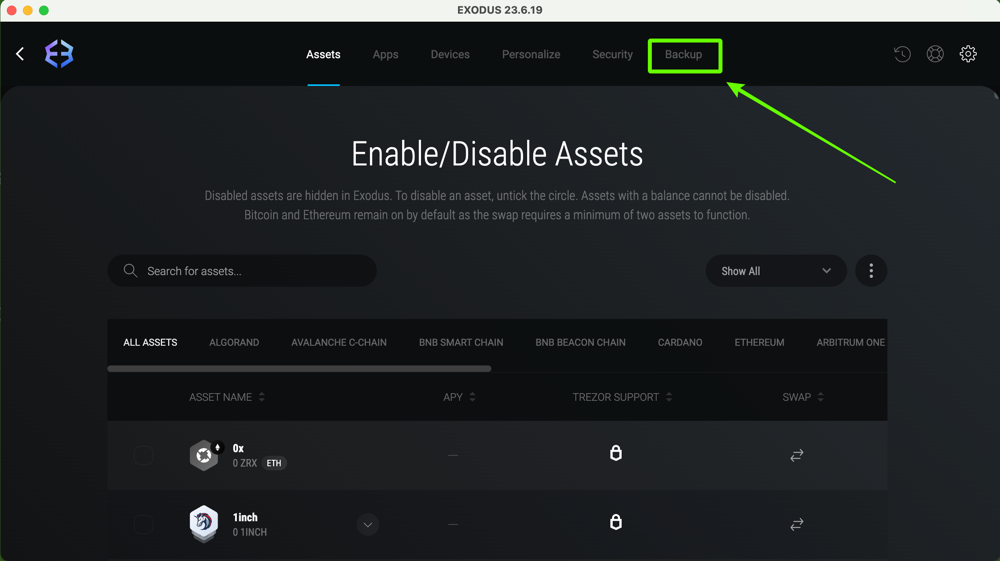

3. In the next step, enter a strong password which will be the global password for your Exodus wallet. This password will be requested for many steps that require security when using the wallet.

To continue, press “NEXT”.

4. In the next screen, Exodus will ask you to enter your password again to confirm it. Once this is done, press on “NEXT”.

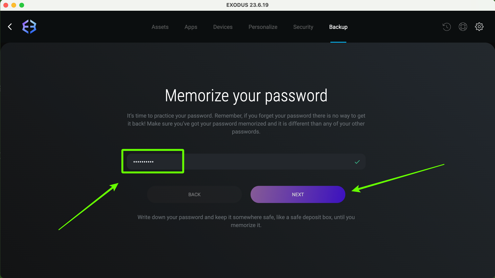

5. In the next screen, Exodus will give you some important security recommendations which you need to follow. To reveal your 12 word secret passphrase so you may back it up, press on the “VIEW SECRET PHRASE” button.

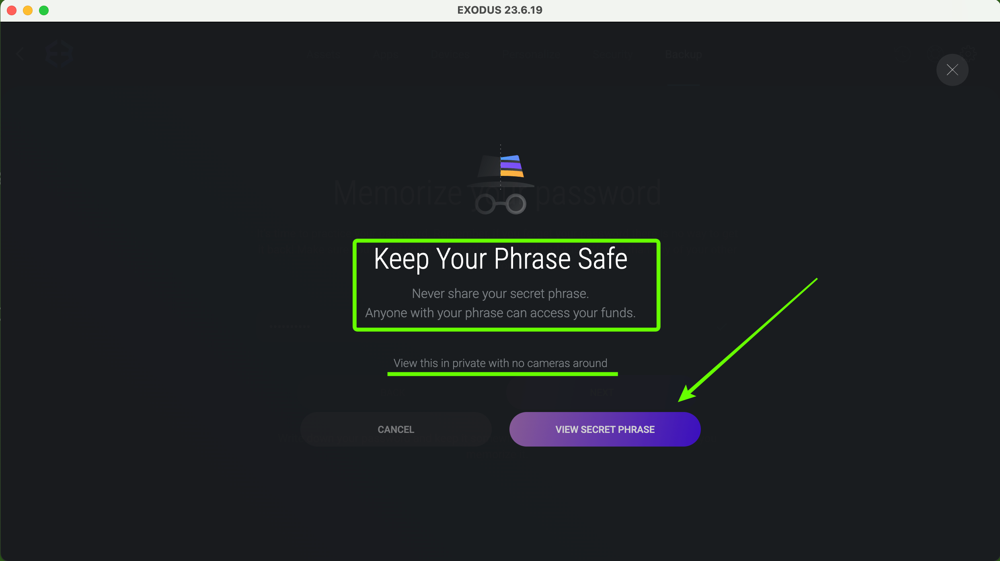

6. In the next screen, you will be able to roll over on each of the words to reveal them. As you go seeing them, write them down on paper in the same exact order and make sure not to make any spelling mistakes. 

Once you copied them, press “DONE” to continue.

7. In the next step, Exodus will check if you wrote the 12 word secret phrase correctly. For this it will ask you the order of a random word in your list. In our case, it asked which was the 11th word, which we answered it was “math”. When you answer yours, then press “DONE”.

8. In the next screen, Exodus will confirm that your backup is complete. Now you can go back to the portfolio home by clicking on the wallet logo on the top left corner.

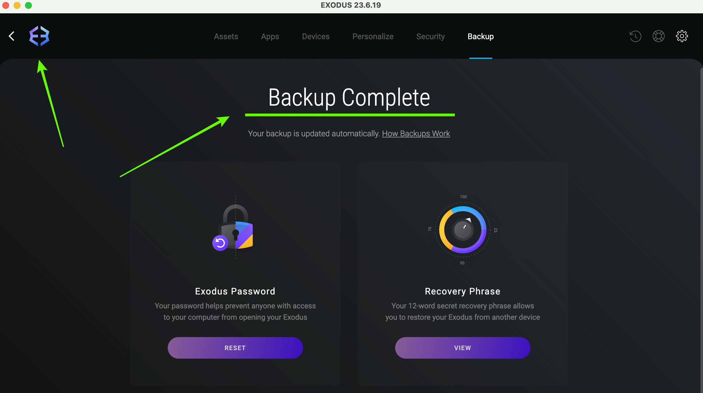

## Enable Ethereum Classic on Exodus Wallet

1. Once back on the home of Exodus, to enable ETC as an asset, click on the “Settings” button again on the top right corner of the wallet.

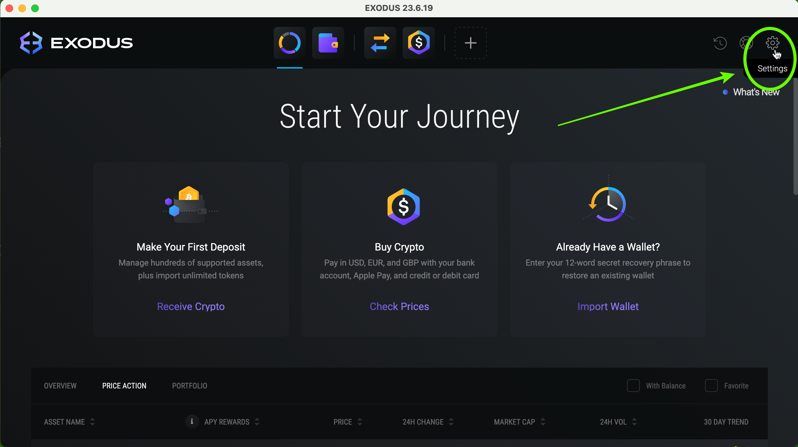

2. In the next screen, select the “Assets” tab on the top horizontal menu.

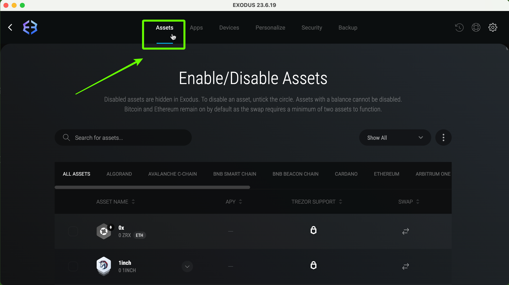

3. In the next screen, you will see a long list of crypto assets. Scroll down to find “Ethereum Classic”, which will be below “Ethereum”. As you can see “Ethereum” is checked, but ETC is not. 

To add ETC, roll over the small box on its left.

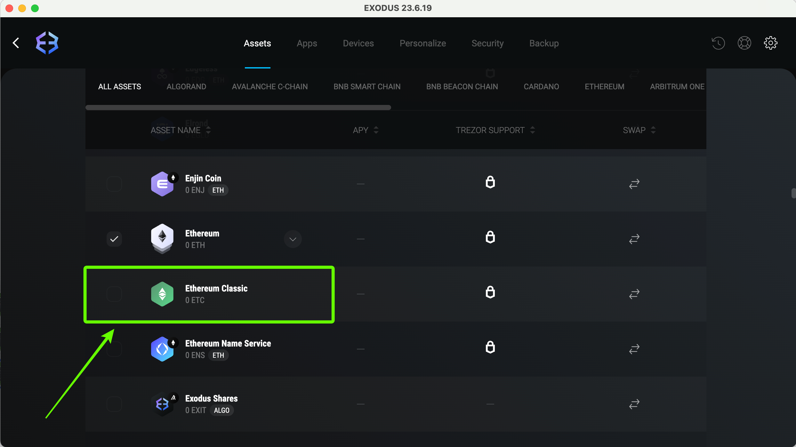

4. On the box you will see that you can put a check on ETC as an asset. Click on the box so you check it and activate ETC on Exodus. 

5. Once ETC is checked, click on the wallet logo on the top left corner to see ETC on the home page.

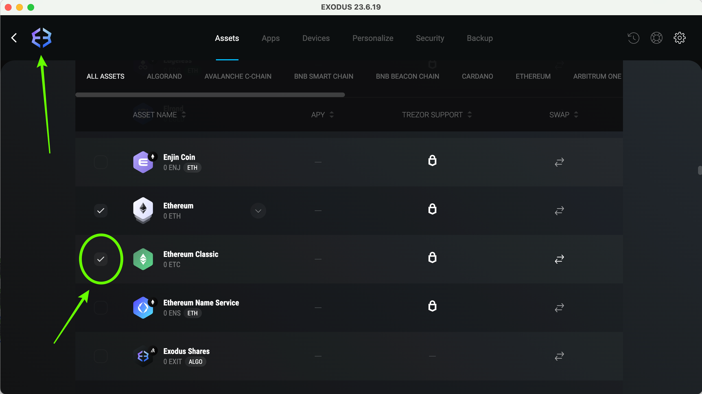

6. When you go to the wallet home and scroll down, you will find ETC within the assets list. In our case, we unchecked all assets except Bitcoin, Ethereum, DogeCoin, Litecoin, and Ethereum Classic so we don’t have so much clutter on the home.

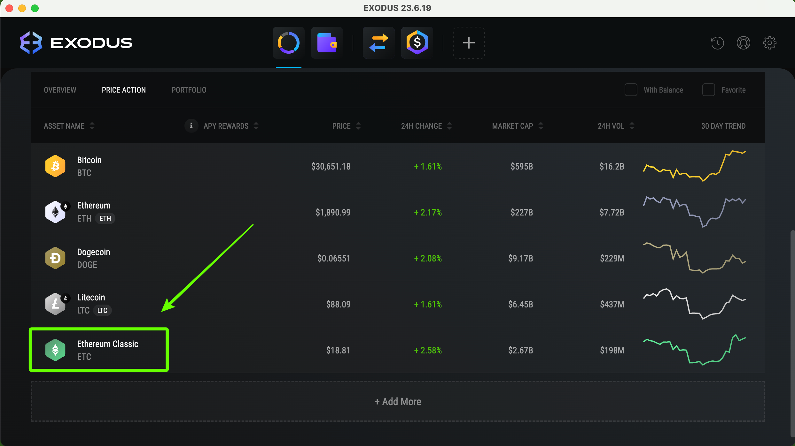

7. If you go to the menu at the top of the assets list and click on “OVERVIEW”, you will see on the right side of the list the “balance”, “value”, and “portfolio” columns to track your crypto assets’ valuations and shares within your portfolio.

## Receive ETC on Your Exodus Wallet

1. To receive ETC, first you need to click on the Ethereum Classic row area on the wallet.

2. In the next screen, you will see the ETC asset home on Exodus. In it, press the “Receive” button.

3. In the next screen, you will see your ETC address. Copy it to send it to others, or show the QR code to others so they may send you ETC.

4. For this example, we sent ourselves 2 ETC. As you may see, our new balance now shows on our ETC asset home.

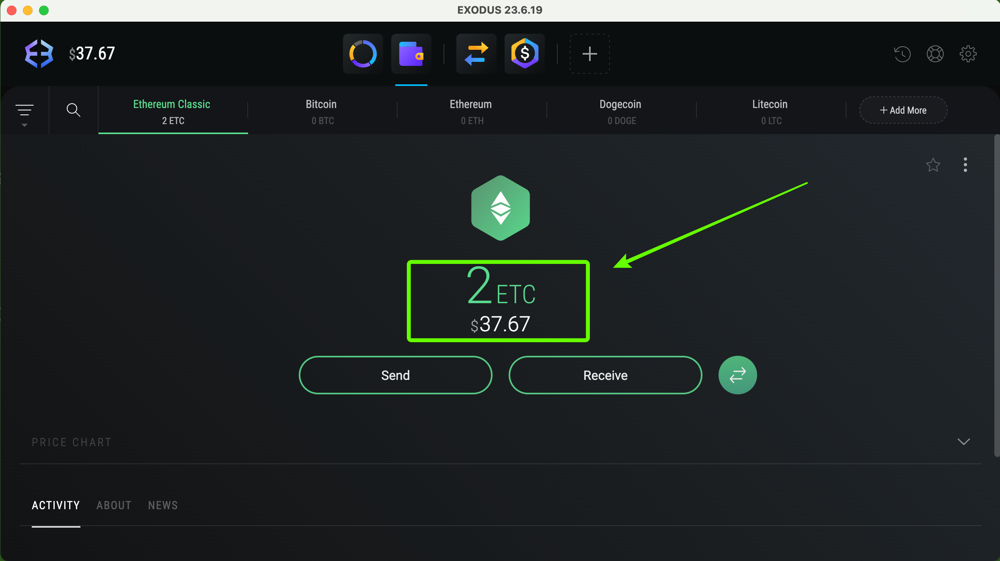

5. If we click on the logo on the top left corner to go back to our portfolio home, we will see that now the portfolio shows a pie chart with our assets. In this case we only have one, but if you have more it would show you all assets in their total value and percentage proportions.

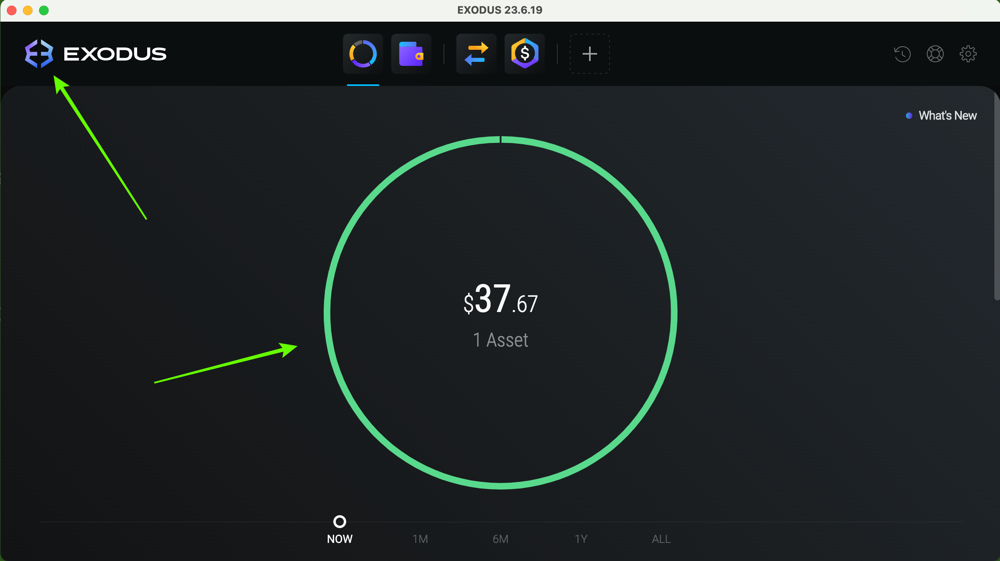

6. When you scroll down in the wallet home page, you will see your assets in list form and ETC will show in order by its value relative to the rest of the assets in the portfolio. In our case it now shows first because it is our only asset with a balance in our Exodus wallet. 

## Send ETC From Your Exodus Wallet

1. To send ETC, click on the “Ethereum Classic” asset row area on your Exodus wallet.

2. In the next screen, you will go back to the ETC asset home. To send ETC, press on the “Send” button.

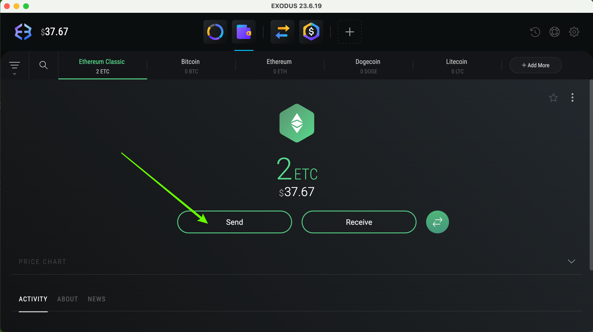

3. In the next step, paste the address to which you are sending and enter the amount of ETC you wish to send. In our case we selected “ALL” to send all our balance of ETC to the address we posted in the recipient’s field.

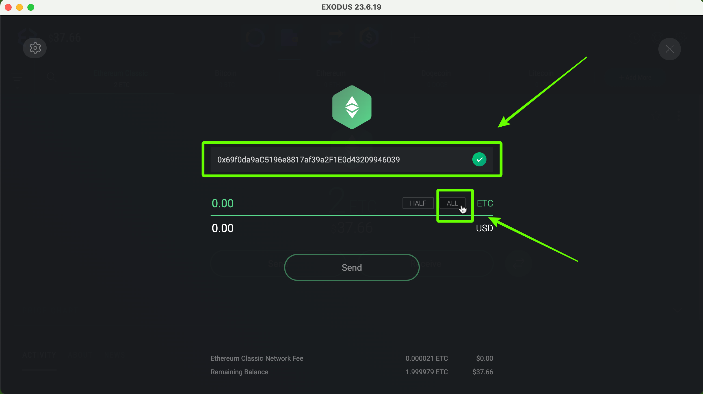

4. When you fill the fields, you will see the amount you selected. To continue, press “Send”.

5. In the next screen, Exodus will show you the data of the transaction you are sending to the ETC blockchain. If everything is ok, then press “Send”.

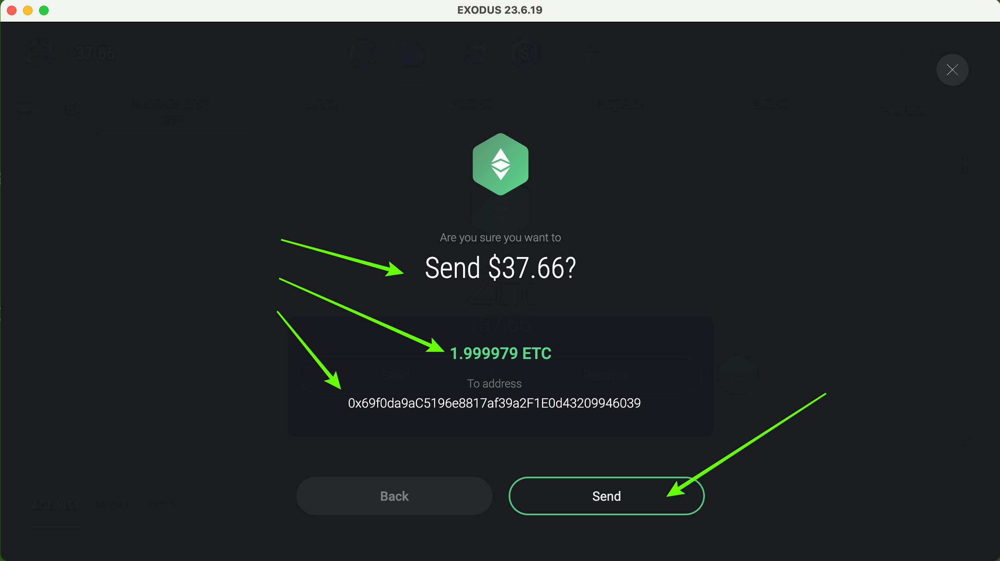

6. If the transaction was processed and sent correctly, Exodus will let you know with a success notification. 

Press “ok” to go back to the ETC asset page. 

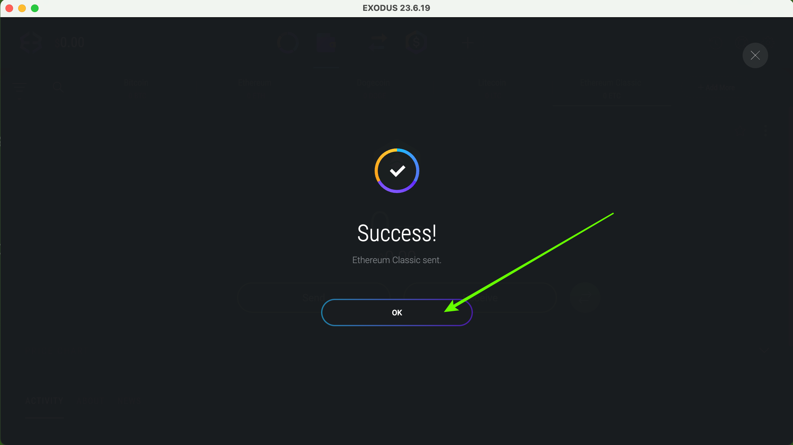

7. In the next screen you will see that now your ETC balance is zero or less than before depending on how much you decided to send.

8. When you go back to the wallet home you will see the portfolio balance change as well. In our case it is zero because we sent all of our ETC and it was the only asset we had on our Exodus wallet.

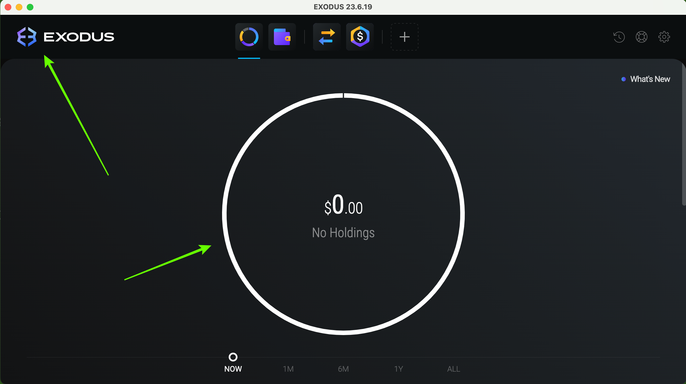

9. If you scroll down, you will also see your ETC asset relocate in the list according to its value or network market capitalization. In our case, it went down to the bottom of the list again because all of our accounts are at zero and Exodus then orders them by each blockchain’s market capitalization.

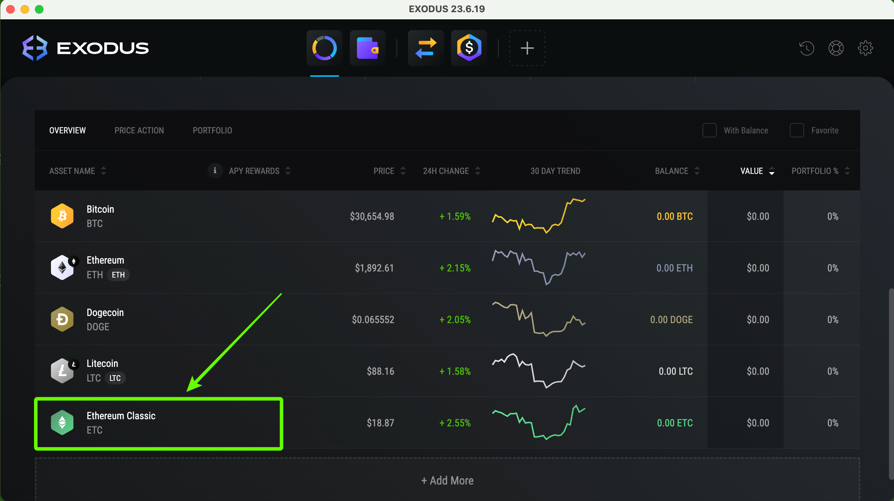

## Export Your Address From Exodus Wallet

1. To export your ETC address from Exodus, click on the ETC asset row area.

2. When on the ETC asset home, click on the three dot dropdown menu on the right of the asset screen. Then, press on the “Export Address” link.

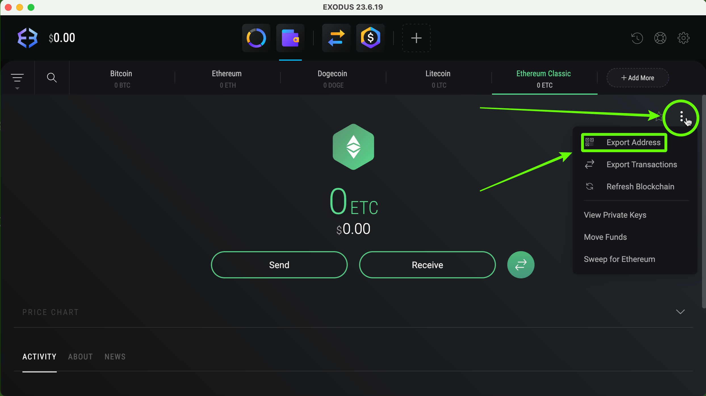

3. In the next screen, Exodus will report success of the download as it was downloaded to your computer. 

Exodus will also show you where in your computer the folder was downloaded to. 

Press “OK” to go back to the asset page.

4. When you go to your computer, you will see a new folder named “exodus-exports”. When you open it you will see a .cvs file compatible with Excel or Google Sheets.  

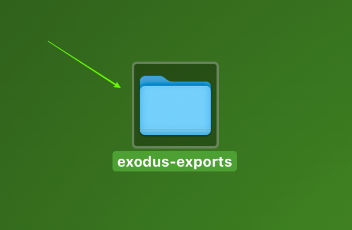

## Reveal the Private Key of Your ETC Address

1. If for any reason you need the private key of your ETC address on Exodus, you may reveal it by clicking again on the three dot dropdown menu on the right of the ETC asset page. In the menu, click on “View Private Keys”.

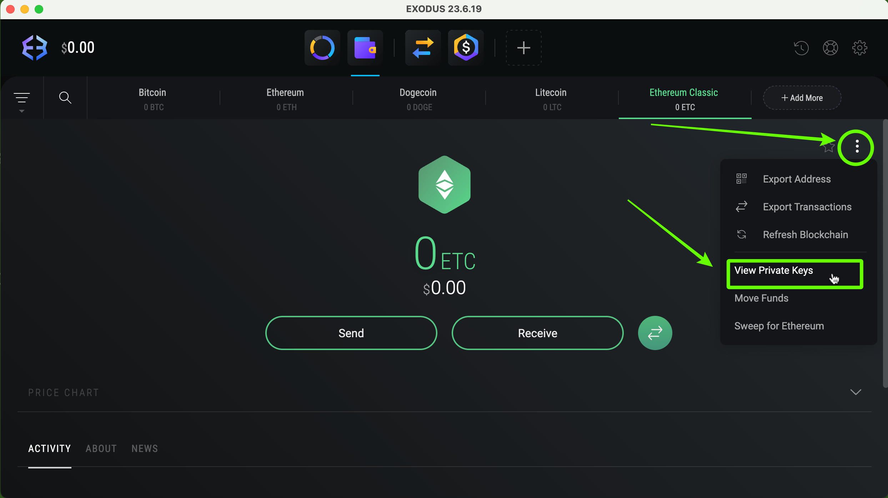

2. In the next page, Exodus will give you a security warning, be sure to follow the warning. To reveal your private key, press on “YES, I’M SURE”. 

3. Because this is a high security step, Exodus will ask you for your global password before unlocking your ETC address private key. When you enter your password press “UNLOCK NOW”.

4. In the next screen, Exodus will show you a pop up screen with your ETC address and its corresponding private key.

## Restore Your Exodus Wallet Using Your 12 Word Secret Passphrase

1. If you lost your computer, or it got corrupted, or for any reason you need to restore your 12 word passphrase, then install Exodus again on your machine and open it. 

On the home, you will see on the right the option to “Import Wallet”. Click on it.

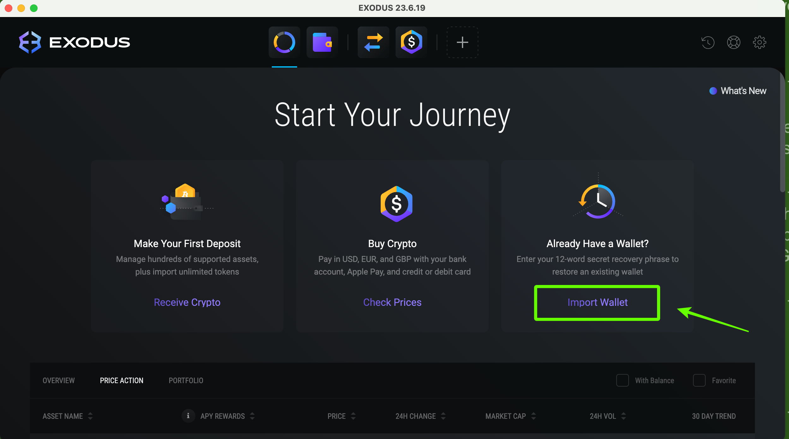

2. In the screen screen, Exodus will tell you that it needs to restart to be able to import your existing 12 word passphrase.

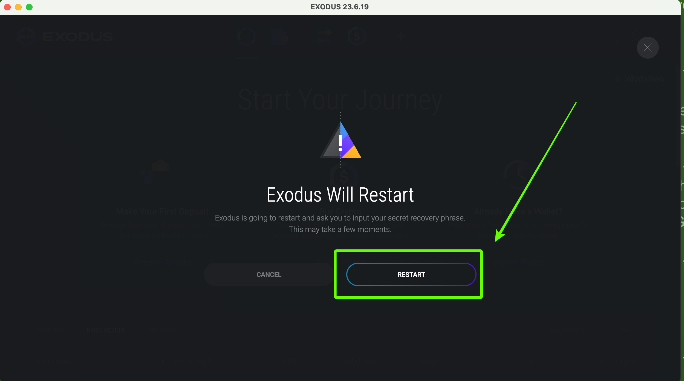

3. In the next step, you will see a blank form so you may enter your 12 word secret passphrase. 

4. Enter your 12 word secret passphrase and then press the arrow on the right.

WARNING: DO NOT USE THE 12 WORDS IN THIS EXAMPLE, THEY ARE A DUMMY SET JUST FOR THIS GUIDE. EVERY USER MUST HAVE THEIR OWN UNIQUE SECRET PASSPHRASE.

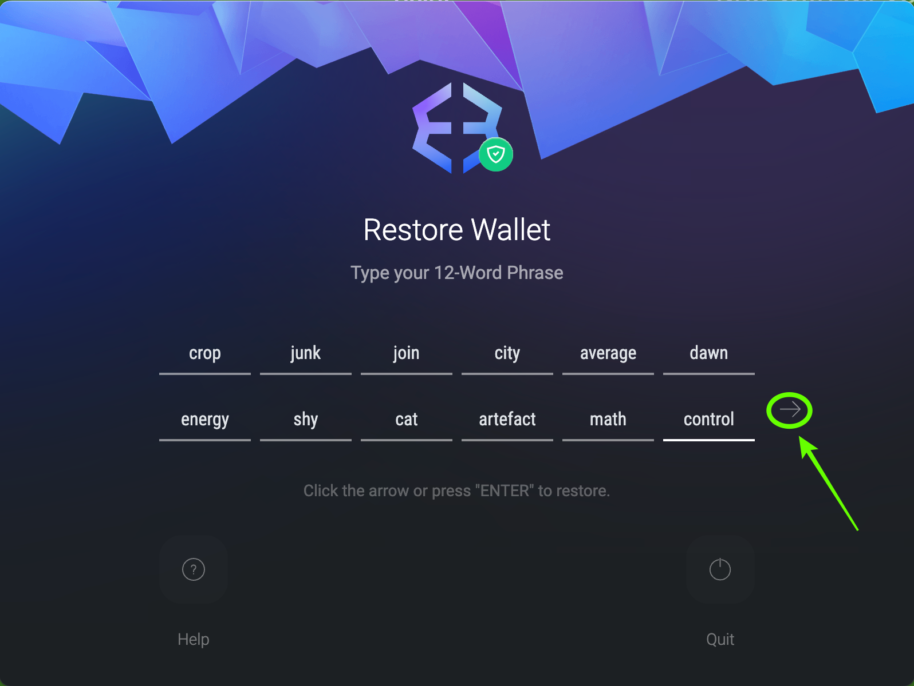

5. If the 12 words were entered correctly, then Exodus will show you a message saying “Restore Complete”. 

Press “OK”.

6. In the next screen, Exodus will ask you to enter a global password again to protect your wallet. When you enter it, press “NEXT”.

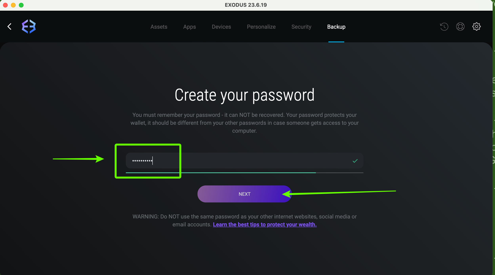

7. In the next screen, confirm your password. 

Once you enter your password again, press “NEXT” to continue using Exodus as usual.

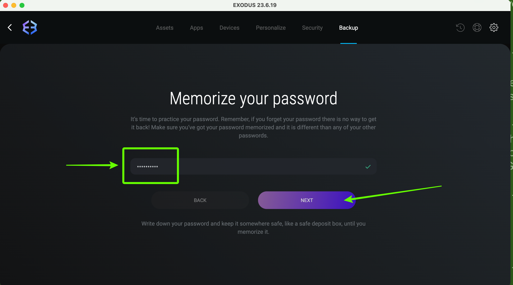

---

**Thank you for reading this article!**

To learn more about ETC please go to: https://ethereumclassic.org
