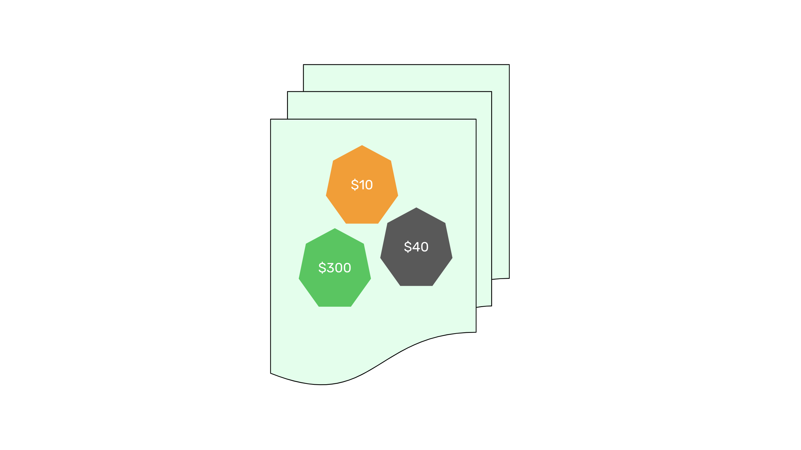
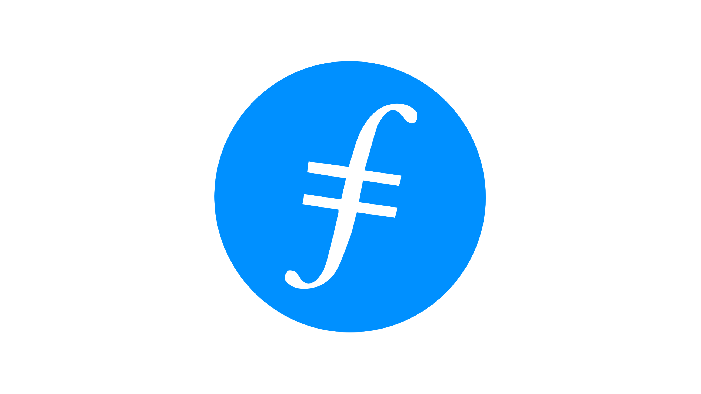
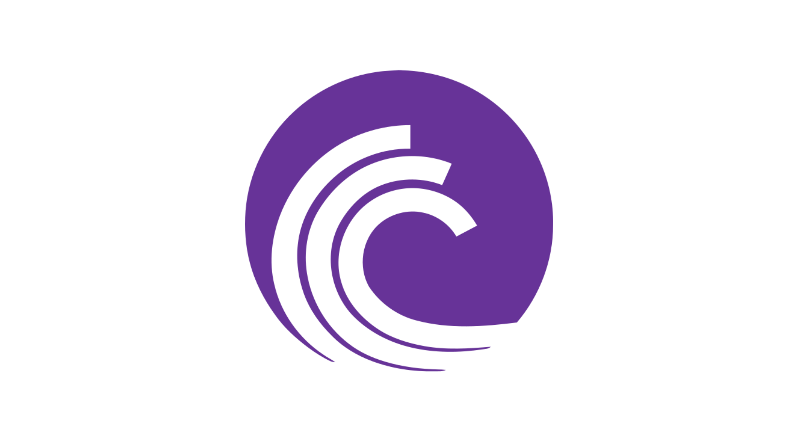

---
**欢迎由此收听或观看本期内容:**

<iframe width="560" height="315" src="https://www.youtube.com/embed/Xk3Uw1AM1M0" title="YouTube video player" frameborder="0" allow="accelerometer; autoplay; clipboard-write; encrypted-media; gyroscope; picture-in-picture; web-share" allowfullscreen></iframe>

---

在以太经典（ETC）课程的上一堂课中，我们解释了去中心化金融（DeFi）币是什么，从什么是DeFi开始，什么是DeFi币本身，DeFi代币的分类，DeFi代币的示例，该领域的市值以及DeFi代币的风险。

在本节课中，我们将解释文件存储币是什么，从什么是文件存储网络开始，然后是IPFS网络和协议是什么，什么是文件存储币本身，文件存储币的示例，该领域的市值，文件存储币在web3中的用途，以及文件存储币的风险。

这是课程的这一部分中解释区块链行业中不同币种类别的最后一堂课。

## 什么是文件存储网络？

正如我们在这门课程中学到的，区块链行业有几种类型的网络，专注于不同的解决方案和领域。例如，我们学到了具有本机加密货币、账户和余额的简单网络；支持智能合约的可编程加密货币；以及其他类型，如ERC-20代币、稳定币、隐私币和DeFi币。

文件存储网络是市场上的另一个重要领域。这些系统通常是由提供磁盘空间存储用户文件的节点网络和具有账本功能的区块链组成，后者作为其相应网络中不同功能的支付系统。

从本质上讲，这些技术旨在去中心化大型全球云服务，如AWS、谷歌云、微软Azure、IBM云等。

## 什么是IPFS？

IPFS是一个点对点的内容寻址网络和协议，其中内容单元存储在许多节点中，并具有独特的地址，而不是像传统互联网中的整个网站一样具有地址。例如，与整个网站的“HTTP”地址不同，内容单元的地址具有“IPFS”地址加上哈希值，因此每个图像、视频和文件在互联网上都有自己的地址。

这种去中心化协议托管文件的方式是将文件分成块，并且每个块可以存储在网络中的不同机器上。是的，每个块都有自己的地址！

通过分布式哈希表（DHT）进行内容块的路由查找，并将它们组合为原始文件。系统中的参与节点频繁更新。

该协议类似于一种自愿加入的系统，因此并非所有参与节点都有义务上传、下载和共享内容。如果用户在其计算机上运行IPFS软件，他们可以上传内容，并且在检索内容时可以选择是否成为这些内容单元的文件存储服务。然而，很多人都这样做。

## 什么是文件存储币？

如前所述，文件存储区块链通常是由一个节点网络和一个提供支付系统以补偿这些提供者的账本的区块链组成，通过IPFS等文件共享协议提供存储空间。

因此，文件存储加密货币本身托管在系统的区块链侧。在一些文件存储网络中，该币种用于每次存储文件时支付费用。在其他情况下，它用于每次下载文件时支付费用。

文件存储币的经济价值在于用户需求，用于支付去中心化文件存储服务的费用。其想法是通过加密货币和支付机制，存储提供者将更有动力保持文件并有效地为网络提供服务。

这些系统中的典型参与者是用户，他们存储和检索文件；存储提供者，他们为网络提供他们的磁盘空间；以及检索提供者，他们搜索并使更广泛地可用的文件更受欢迎。

## 文件存储币示例：Filecoin

Filecoin是一种使用IPFS协议进行文件存储的区块链，并使用“FIL”币作为支付提供者的货币。它有三种主要类型的用户：内容使用者和上传者、存储提供者和检索提供者。

存储提供者是IPFS协议节点，但实际上他们通过FIL收取用户的费用来存储其文件。IPFS和Filecoin是两个不同的网络，它们使用IPFS协议（IPFS之所以有相同的名称，是因为它是由Filecoin的创始人创办的）。

存储提供者必须定期向点对点网络提供他们存储的数据的完整性作为存储证明。内容使用者是使用网络来存储他们的数据的人。检索提供者类似于经纪人，他们获得报酬与用户保持联系，并从存储提供者那里检索最受欢迎的内容单元，以更快地交付给用户。

实质上，Filecoin就像一个市场，全球的数据存储都放在销售中，协议充当定价和支付系统，用户为存储和检索提供者支付费用，以使其内容得到有效的存储和交付。

存储提供者通过证明他们可以正确执行工作来获得声誉。

截至撰写本文时，FIL的当前市值为17亿美元。

## 文件存储币示例：BitTorrent

BitTorrent是一种先进的文件共享协议和网络，始于2000年代初。它于2018年被TRON基金会收购，并将“BTT”代币整合到其生态系统中，旨在为web3和流媒体服务创建一个去中心化的文件共享系统。

它与Filecoin类似，是一个内容寻址网络，内容单元被分割成块并存储在系统中的多个节点中。在这种情况下，使用的代币是BTT。

用户支付存储提供者以使其文件能够更快地下载。

“Torrent”是由数据块组成的数据组，它们一起构成一个单一的内容单元，这些数据块是分布和存储在网络中的。

“Seeding”是保留数据并与网络其他部分共享的行为。基本上，当用户下载电影或其他文件等数据时，它们自动转变为这些文件的种子。

“Swarm”是一组持有单个内容单元块的机器，当它们上传块时，它们就像一个集体提供数据的群体。

BTT实际上是TRON区块链中的一种TRC-20代币，因此Bittorrent实际上没有独立的分布式账本，没有账户和余额，而是使用TRON。

截至撰写本文时，BTT的当前市值为4.44亿美元。

## 文件存储领域的市值

撰写本文时，据Messari统计，区块链行业中文件存储领域的市值为21.4亿美元。

链接：

https://messari.io/screener/file-storage-A75CCE80

Filecoin和BitTorrent是该领域最大且最知名的币种。

## 用于Web3的用途

正如我们将在接下来的8节《Ethereum Classic课程》中所看到的，区块链行业将被划分为不同的层级，并且每个层级中都会存在许多组件。这些层级将根据安全性和可扩展性的程度进行组织，其中最安全但可扩展性较低的工作量证明币将构成基础层级，而其他可扩展性更高但安全性较低的系统，包括权益证明，将存在于安全层级之上。

在未来，用户在使用去中心化应用程序（dapps）或执行交易时将不再与单个区块链进行交互。交易将跨越多个链，因此面向用户的钱包和dapps将使用每个链条中最好的服务。

在这种情况下，dapps将需要去中心化的网站来为其用户提供服务，因为价值链中的任何中心化故障都将破坏信任最小化的整个目标。

如今的网站将其后端代码、图像、视频、文本文件和数据托管在集中式服务器中，而在未来，这些相同的组件将托管在去中心化网络中，从而实现去中心化网站，或称为“web3”。

其中一些网络将用于托管后端代码的智能合约区块链，另一些将用于存储图像、视频和文本文件的文件存储币，而另一些将用于专用数据库存储链。

所有这些组件的组合，以及其他更多类型的区块链，将为最终用户提供与今天所知的Web相同的完整体验，但安全性更高。

Web3是继90年代的静态Web1和2000年代以社交媒体为中心的Web2之后出现的一个术语。

## 文件存储币的风险

然而，尽管文件存储网络和币使用去中心化账本和点对点协议来管理大量数据，但这并不意味着它们完全去中心化。

这些网络中的文件存储协议只是点对点文件系统，实际上并不是所有节点都存储文件，而只有那些希望存储文件并期望得到报酬的节点才会存储。

另一方面，用于保存文件存储币的账户和余额以及为文件存储提供者进行支付的去中心化账本均为权益证明或授权证明系统。这些系统的安全性远远低于工作量证明网络。

尽管文件存储系统在信任最小化方面取得了巨大进展，但它们仍然需要改进，以真正去中心化的方式为未来的Web3服务。

---

**感谢您阅读本期文章!**

了解更多有关ETC，欢迎访问: https://ethereumclassic.org
