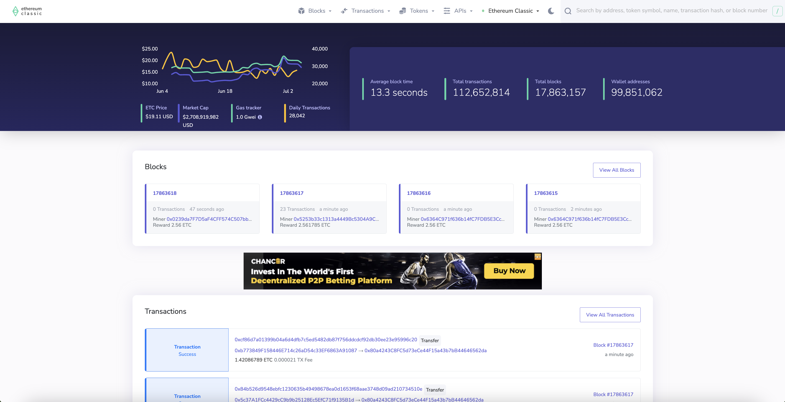
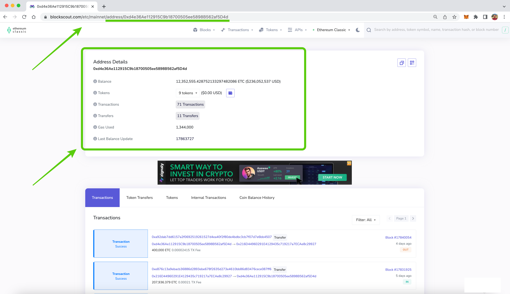
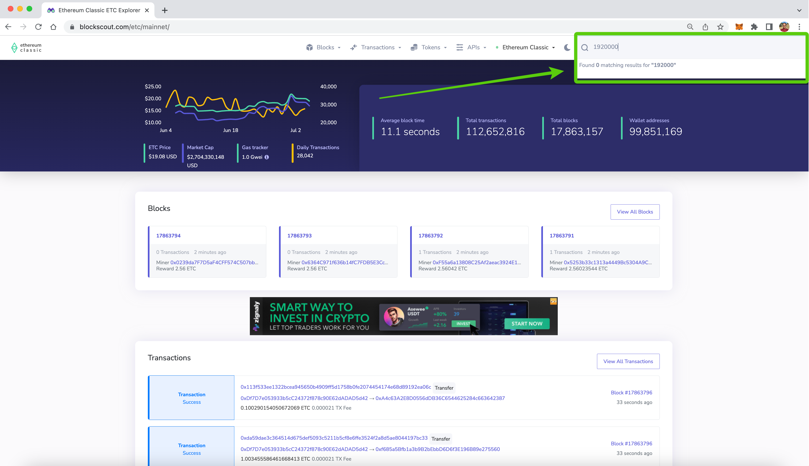
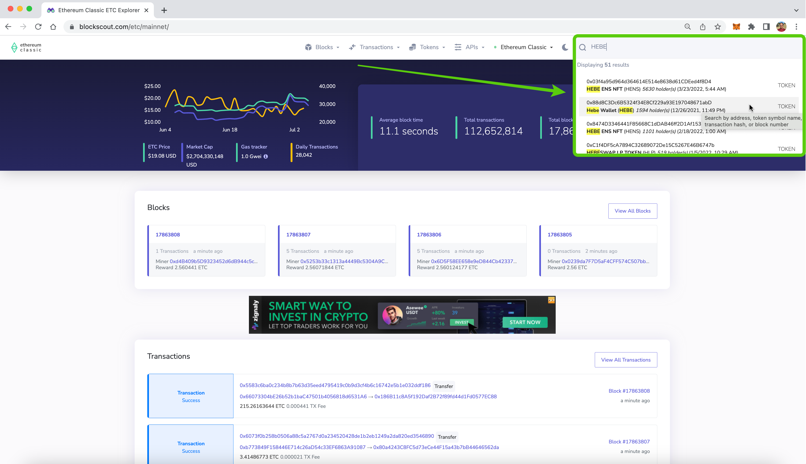
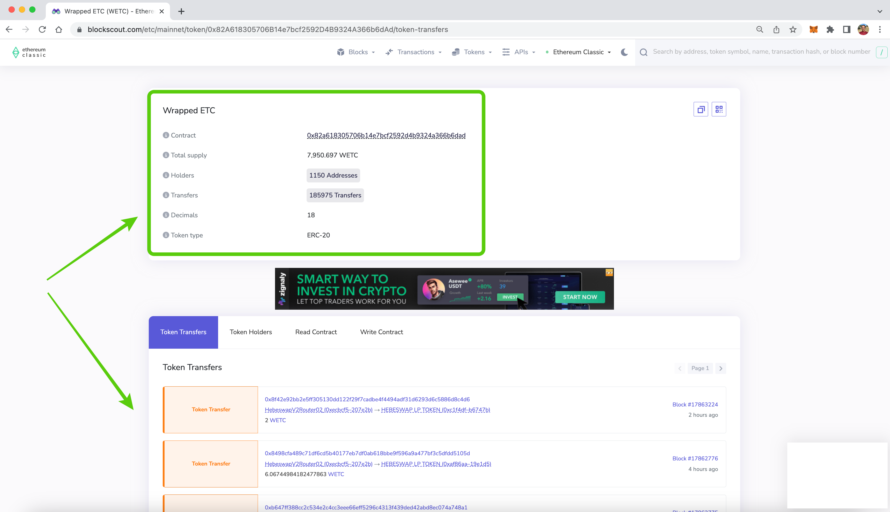

---
**You can listen to or watch this video here:**

<iframe width="560" height="315" src="https://www.youtube.com/embed/nw-dLA6-koQ" title="YouTube video player" frameborder="0" allow="accelerometer; autoplay; clipboard-write; encrypted-media; gyroscope; picture-in-picture; web-share" allowfullscreen></iframe>

---

Two things I initially noticed when I used a blockchain, the Bitcoin blockchain, for the first time back in 2013 were that money would move from one place to another in ten to sixty minutes and that every single transaction was public, totally transparent, and traceable through some special websites. After twenty-three years of working in banking and finance, this was a mind-boggling experience and a huge change in paradigm.

At the time, I was living in Denver and using Mt. Gox at the time and it was incredible to be able to send one BTC from Colorado to Tokyo, and it arrived in minutes. In addition, I could follow the transaction as it was being processed live on one of these special websites while the deposit was in transit!

If I remember correctly, because Mt. Gox used two confirmations, it would take up to twenty minutes for them to show me my new deposit, but on one of these websites I could see the transaction from the moment it was included in a block.

These websites that show everything that is happening inside blockchains are what we call “block explorers”.

## What Are Block Explorers?

Block explorers are websites that run full archival nodes of the various blockchains, index the information of the networks’ databases, and show the information to the public.

This is a new level of transparency in the world of finance, not only because the information is available, but because ordinary users can use these third-party services to track and audit the blockchains. In banking all this information is a black box.

The data on these websites may be organized by block, by transactions, or address, and often have more statistics and charts that are useful to analyze the activity in the networks.

Some examples of popular block explorers and the blockchains with which they are most often associated are:

Blockscout.com -> Ethereum Classic (ETC)

Blockchain.com -> Bitcoin (BTC)

Etherscan.io -> Ethereum (ETH)

For the rest of this article, we will focus on Blockscout, a popular explorer for ETC.

## Blockscout Works With Ethereum Classic and Mordor Testnet

The first thing to say about Blockscout is that it supports the Ethereum Classic mainnet and Mordor testnet.

The link to see the ETC network statistics is the following:

https://blockscout.com/etc/mainnet

The link to the Mordor testnet is the following:

https://blockscout.com/etc/mordor

In the next sections, we will explain how to use Blockscout with the Ethereum Classic blockchain. 

## The Blockscout Home

In order to use Blockscout with Ethereum Classic, users should point their browser to https://blockscout.com/etc/mainnet which will take them to the Blockscout home page.

On the home page, at the top right is the basic information of the ETC blockchain including average block time, total transactions since inception, total blocks (or block height), and total number of wallet addresses created inside the ledger. At the top left, a chart with the market price and other statistics can be found while in the body of the page, the latest blocks and transactions are displayed. To search for addresses, specific transactions, blocks, or tokens, there is a search field at the top right-hand corner of the home page where one may enter the search query.

## Search ETC by Address

1. To search an ETC address on Blockscout, you need to go to the top right hand corner field, paste the address, and press enter.

[Just for fun, we used for this example one of the largest addresses in ETC, which must belong to one of the big exchanges. To see a list of the largest addresses in ETC you can also do this on Blockcout! The page is: https://blockscout.com/etc/mainnet/accounts]

2. In the next screen, Blockscout will show you a box at the top with the main statistics of that address. This includes: the balance, tokens it holds (if any), total transactions done in this address, token transfers, total gas used in this address, and the latest block in which the balance was updated.

Note that the address has its own URL on Blockscout, which is: 

https://blockscout.com/etc/mainnet/address/0xd4e36Ae112915C9b18700505ee5898B562af5D4d/

3. By scrolling down, you may see the transaction history of the address you searched with every single transaction that was done in it with all their data. This is why block explorers use what are called “archival nodes”, which are network software clients that actually store all the information of the history of the blockchain. 

## Search ETC by Transaction (TX)

1. On Blockscout, you can search individual transactions as well. To search a specific transaction, you need to enter the transaction hash on the top right hand corner field and press enter.

2. In the next screen you will see that the transaction URL is also unique for each transaction. On the body of the page you will see the top box with the following data points: transaction hash (also called transaction ID), result (if the transaction has been processed successfully), status, the block number in which it was included, timestamp, from which and to which addresses the money was moved, value of the transaction, the fee, and the gas price.

## Search ETC by Block Number

1. In the same way that you look up ETC addresses or transactions on Blockscout, you can also search individual blocks by their number. For this example, just for fun, we typed in the search field the block number 1,920,000, which is the infamous block in which the Ethereum network split from ETC in 2016. You may enter the block number you wish to search, then press enter.

2. In the next screen you will see that the block also has its specific URL. In the body of the page, the top box shows the statistics of the block. These include: block height, the timestamp, how many transactions it contained, which was the miner that mined the block, block size in bytes, the block cryptographic stamp or hash, the hash of the previous block or parent hash, the mining difficulty, total difficulty of the chain up to this block, the gas used, the gas limit of this block, the nonce used to create the block hash, and the miner reward, which was 5 ETC at the time in 2016.

Because ETC is the original chain and did not participate in TheDAO hard fork, this is a typical and boring block!

As a comparison, that same block on the Ethereum blockchain has much different information. It even contains a note reading “dao-hard-fork (Hex:0x64616f2d686172642d666f726b)”!

3. Going back to ETC block 1,920,000, if you scroll down you will be able to see the list of all the transactions on that block. 

## Search ETC by Token Symbol: HEBE

1. Another thing that may be done on Blockscout is to search tokens by their symbol. For example, to search the HEBE token issued by the HebeBlock team, you just need to type its symbol “HEBE” in the top right-hand corner field and press `Enter`.

2. In the next screen, the page will contain the top box with the main data of the ERC-20 token. This includes: the contract address, total supply, how many addresses hold the token, how many transfers have been done since its inception, how many decimals it is denominated in, and the token type (usually an ERC-20 token).

## Search ETC by Token Symbol: WETC

1. Just as we may search dapp tokens, we can also search wrapped tokens, such as WETC, on Blockscout because they are also ERC-20 tokens. To do this just enter “WETC” on the right-hand side corner field and press `Enter`.

2. In the next screen, the page will contain the top box with the main data of the WETC ERC-20 token. This includes: the contract address, total supply, how many addresses hold the token, how many transfers have been done since its inception, how many decimals it is denominated in, and the token type (usually an ERC-20 token, as well).

---

**Thank you for reading this article!**

To learn more about ETC please go to: https://ethereumclassic.org
