---
**欢迎由此收听或观看本期内容:**

<iframe width="560" height="315" src="https://www.youtube.com/embed/nw-dLA6-koQ" title="YouTube video player" frameborder="0" allow="accelerometer; autoplay; clipboard-write; encrypted-media; gyroscope; picture-in-picture; web-share" allowfullscreen></iframe>

---

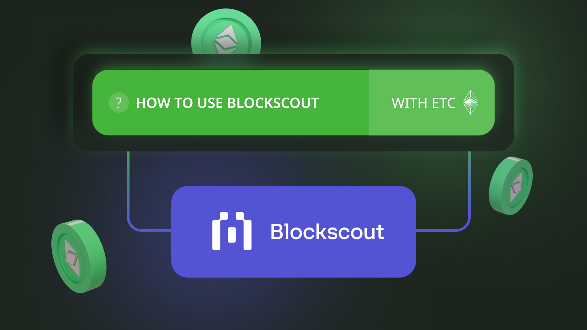

2013年我第一次使用区块链，当时是比特币区块链，有两件事给我留下了深刻印象。第一是资金在十到六十分钟内从一个地方转移到另一个地方，第二是每一笔交易都是公开的，完全透明的，并且可以通过特定的网站进行追踪。在银行和金融领域工作了23年后，这是一次令人难以置信的经历，也是一个巨大的范式转变。

让人难以置信的是，我可以将一枚比特币从科罗拉多州发送到东京（当时我住在丹佛，并使用Mt. Gox交易所！），它只需要几分钟就能到达目的地。而在资金转移过程中，我可以在其中一个特定网站上实时查看交易的处理过程！

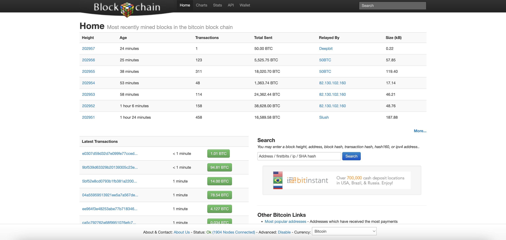

如果我没记错的话，由于Mt. Gox使用了两个确认，他们需要多达二十分钟才能显示我的新存款，但在这些网站之一上，我可以从交易被纳入区块开始就查看交易。

这些展示区块链内部所有信息的网站就是我们所说的“区块浏览器”。

## 什么是区块浏览器？

区块浏览器是运行各种区块链的全归档节点的网站，对网络数据库的信息进行索引，并向公众显示这些信息。

这在金融世界是一个新的透明度水平，不仅因为信息是可获取的，而且普通用户可以使用这些第三方服务来跟踪和审计区块链。在银行业中，所有这些信息都是一个黑匣子。

这些网站上的数据可以按照区块、交易或地址进行组织，并且通常还有更多的统计数据和图表，有助于分析网络中的活动。

流行的区块浏览器以及它们最常被识别为哪种区块链的示例：

Blockscout.com -> 以太坊经典 (ETC)

Blockchain.com -> 比特币 (BTC)

Etherscan.io -> 以太坊 (ETH)

在本文的其余部分，我们将重点介绍Blockscout，这是一个流行的ETC区块浏览器。

## Blockscout支持以太坊经典和Mordor测试网络

首先要说的是，Blockscout支持以太坊经典主网和Mordor测试网络。

查看以太坊经典网络统计信息的链接如下：

https://blockscout.com/etc/mainnet

Mordor测试网络的链接如下：

https://blockscout.com/etc/mordor

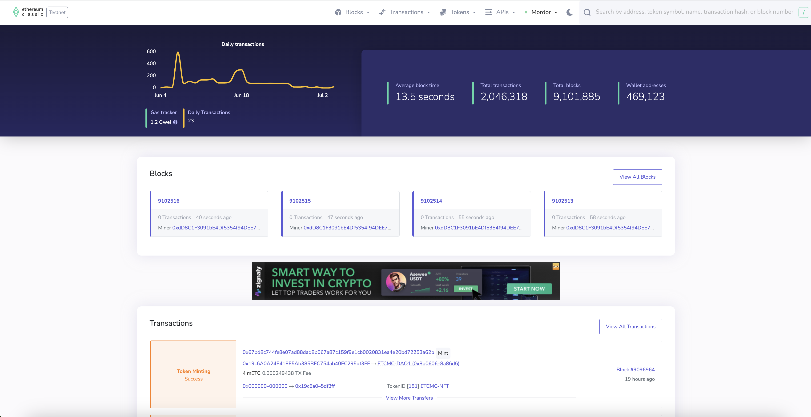

在接下来的部分，我们将解释如何使用Blockscout与以太坊经典区块链交互。

## Blockscout主页

要使用Blockscout与以太坊经典交互，用户需要在浏览器中输入 https://blockscout.com/etc/mainnet 并访问该网站。

在主页的右上角，它显示了以太坊经典区块链的基本信息，包括平均区块时间、自创建以来的总交易次数、总区块数（或区块高度）以及账本内创建的总钱包地址。在左上角，有一个图表显示市场价格和其他统计数据，而页面主体则显示了最新的区块和交易。为了搜索地址、特定交易、区块或代币，页面右上角有一个字段可以输入搜索查询。

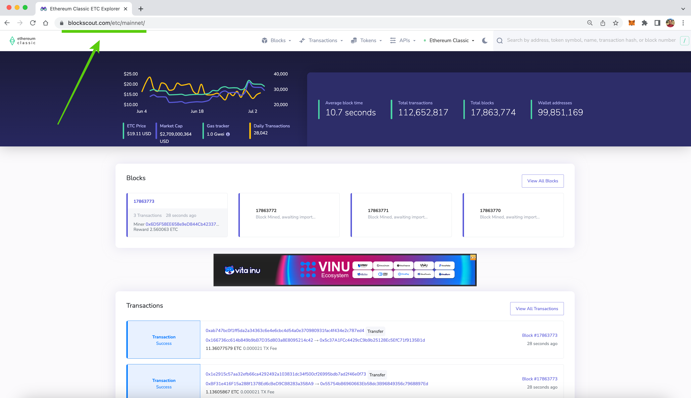

## 按地址搜索ETC

1. 要在Blockscout上搜索以太坊经典地址，您需要转到右上角的搜索字段，粘贴地址并按回车键。

[仅供娱乐，我们在此示例中使用了以太坊经典中最大的地址之一，该地址可能属于其中一家大型交易所。您还可以在Blockscout上查看以太坊经典中最大的地址列表！网页链接是：

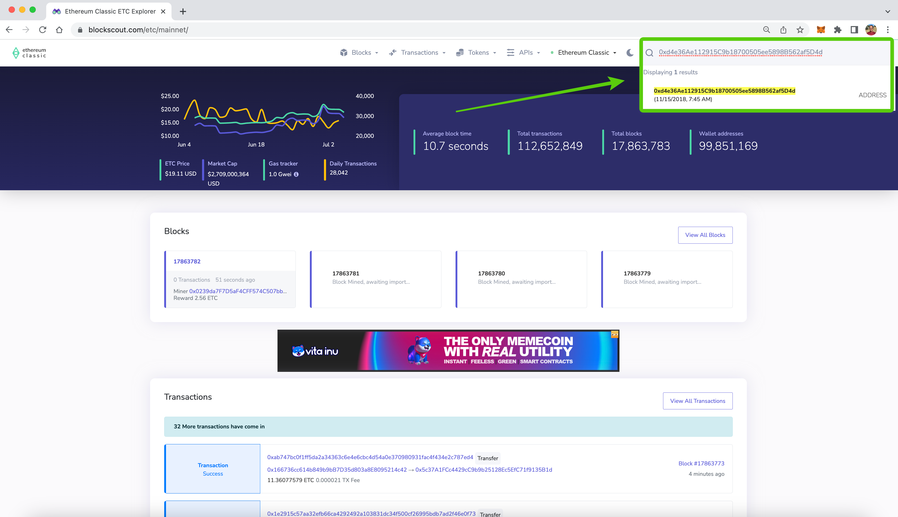

2. 在下一个页面，Blockscout将在页面顶部显示一个框，显示该地址的主要统计信息。这些信息包括：余额、持有的代币（如果有）、在该地址完成的总交易次数、代币转账、该地址使用的总燃气量以及最近更新余额的区块。
请注意，地址在Blockscout上有自己的URL，即：

https://blockscout.com/etc/mainnet/address/0xd4e36Ae112915C9b18700505ee5898B562af5D4d/

3. 向下滚动，您可以看到您搜索的地址的交易历史，其中包含所有交易及其数据。这就是为什么区块浏览器使用所谓的“归档节点”，这些节点是实际上存储区块链历史所有信息的网络软件客户端。
   
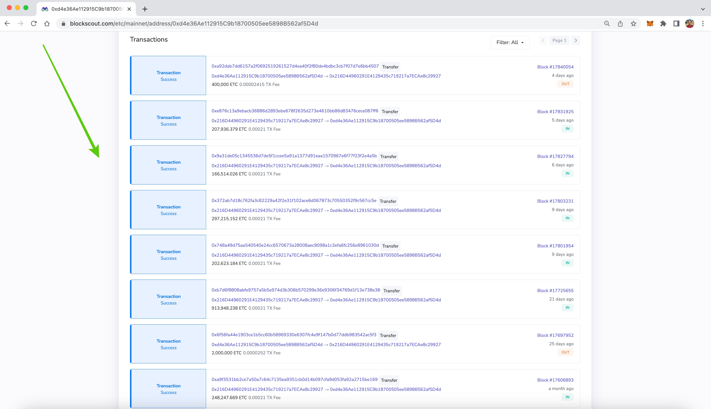

## 按交易（TX）搜索ETC

1. 在Blockscout上，您还可以搜索单个交易。要搜索特定交易，您需要在右上角的搜索字段中输入交易哈希并按回车键。

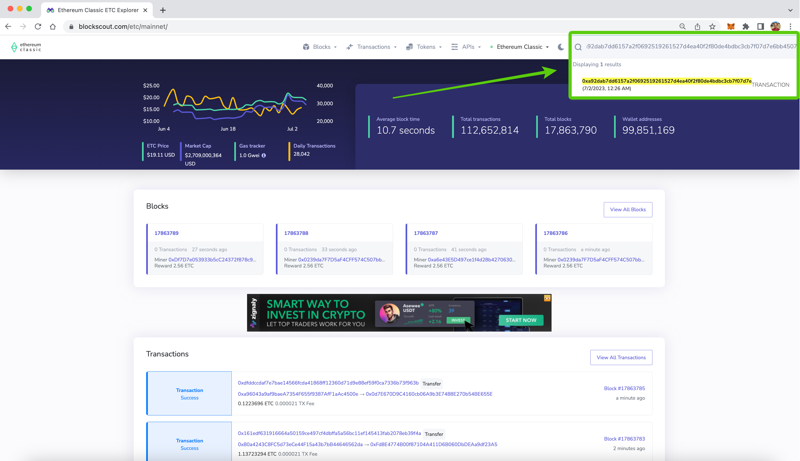

2. 在下一个页面上，您将看到每个交易都有其独特的URL。页面主体显示顶部框中的以下数据点：交易哈希（也称为交易ID），结果（如果交易已成功处理），状态，它所在的区块号，时间戳，资金从哪个地址移动到哪个地址，交易的价值，交易费用和燃气价格。

## 按区块号搜索ETC

1. 在Blockscout上，您可以通过区块号来搜索单个区块，就像您查找ETC地址或交易一样。为了举例，我们在搜索字段中输入了区块号1,920,000，这是2016年以太坊网络从ETC分叉的著名区块。您可以输入您想要搜索的区块号，然后按回车键。

2. 在下一个页面上，您将看到该区块也有其特定的URL。页面主体中，顶部框显示了区块的统计信息。这些包括：区块高度，时间戳，包含的交易数量，挖掘该区块的矿工，区块大小（以字节为单位），区块的加密戳或哈希，上一个区块或父哈希的哈希，挖矿难度，截至该区块的链的总难度，使用的燃气量，该区块的燃气限制，用于创建区块哈希的nonce，以及当时2016年的矿工奖励，为5个ETC。

如您所见，由于ETC是原始链且未执行TheDAO硬分叉，因此这是一个典型且无趣的区块！

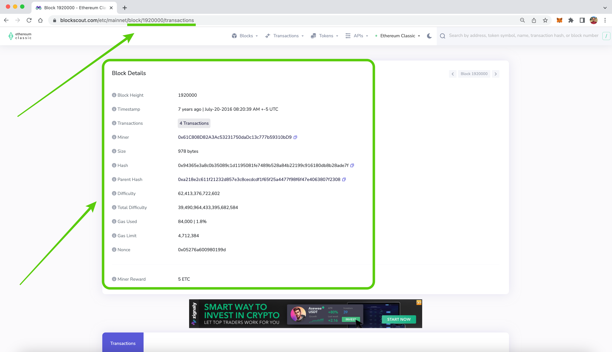

作为比较，以太坊区块链上的相同区块具有不同的信息，实际上还有一条注释“dao-hard-fork (Hex:0x64616f2d686172642d666f726b)”。

3. 回到ETC区块1,920,000，如果您向下滚动，您将看到该区块上所有交易的列表。

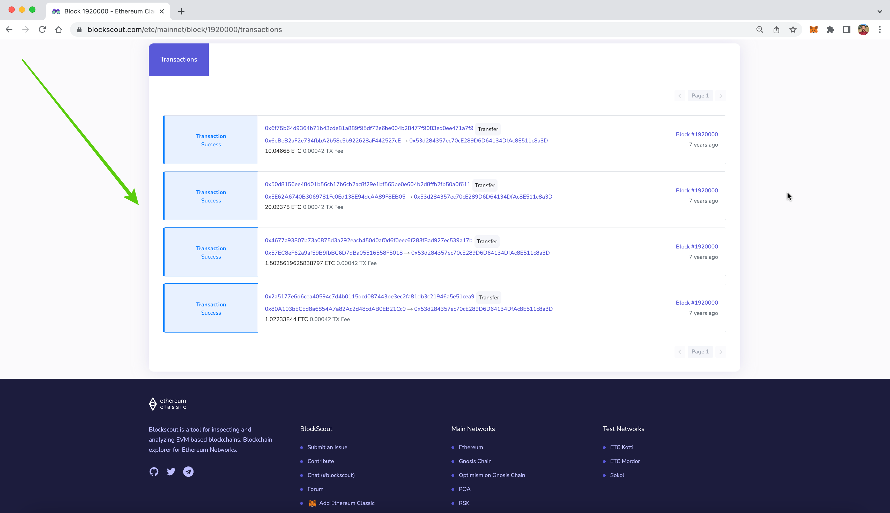

## 按Token符号搜索ETC：HEBE

1. 在Blockscout上，另一件可以做的事情是按Token符号搜索。例如，要搜索HebeBlock团队发行的HEBE代币，您只需在右上角的搜索字段输入其符号“HEBE”，然后按回车键。

2. 在下一个页面，页面顶部框将显示ERC-20代币的主要数据。这包括：合约地址、总供应量、持有该代币的地址数量、自创建以来的转账次数、代币的小数位数，以及代币类型（通常是ERC-20代币）。

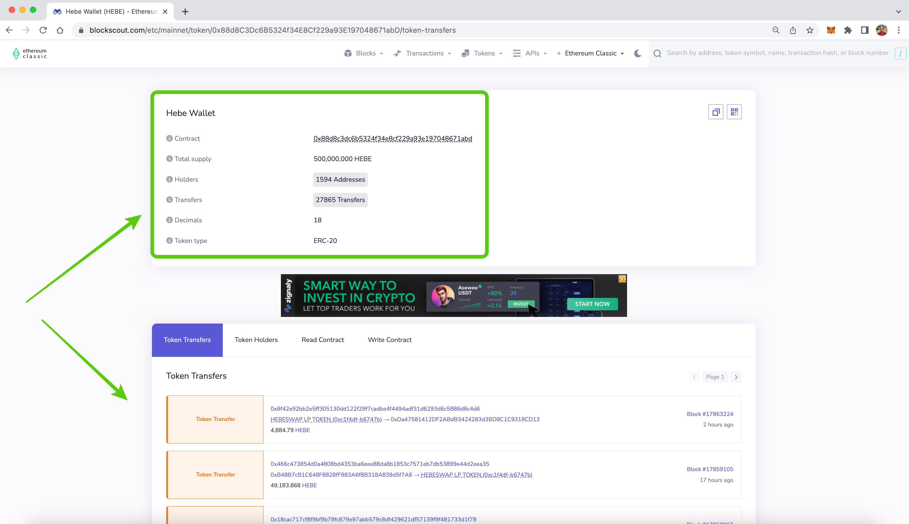

## 按Token符号搜索ETC：WETC

1. 就像我们可以搜索dapp代币一样，我们也可以在Blockscout上搜索Wrapped代币，比如WETC，因为它们也是ERC-20代币。要搜索WETC，只需在右上角的搜索字段中输入“WETC”，然后按回车键。

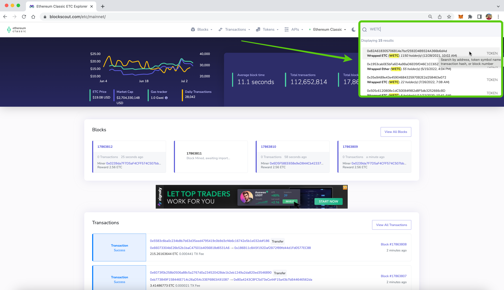

2. 在下一个页面，页面顶部框将显示WETC ERC-20代币的主要数据。这包括：合约地址、总供应量、持有该代币的地址数量、自创建以来的转账次数、代币的小数位数，以及代币类型（通常也是ERC-20代币）。

---

**感谢您阅读本期文章!**

了解更多有关ETC，欢迎访问: https://ethereumclassic.org
