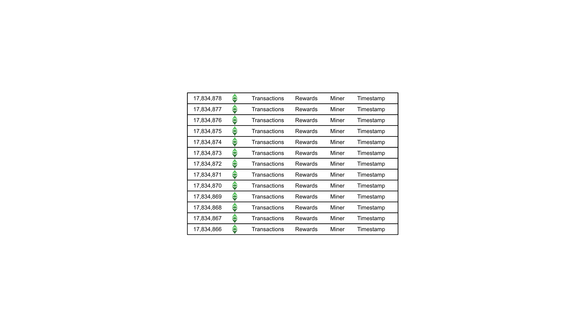
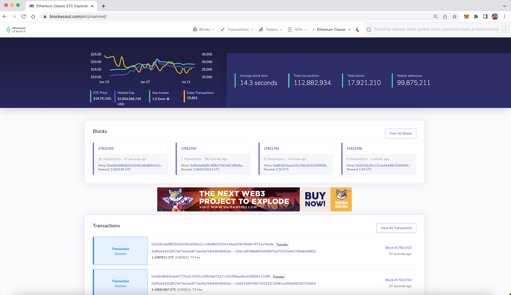
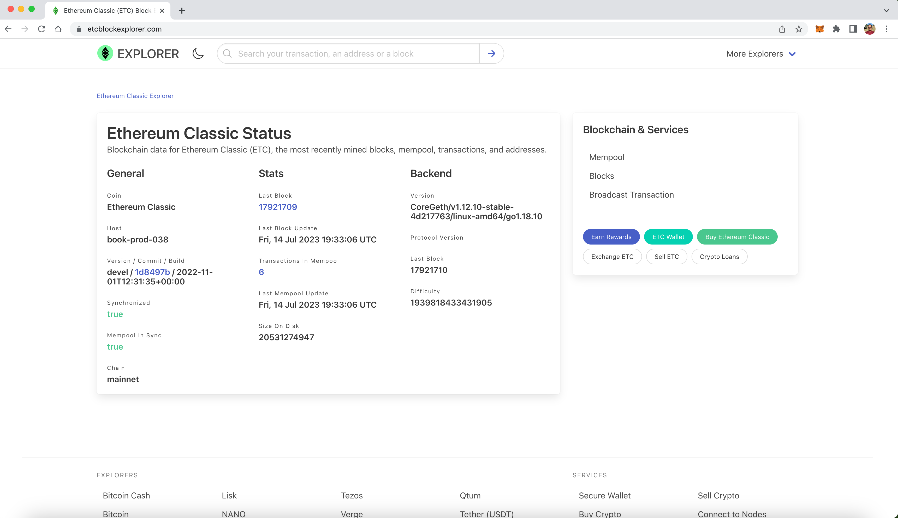
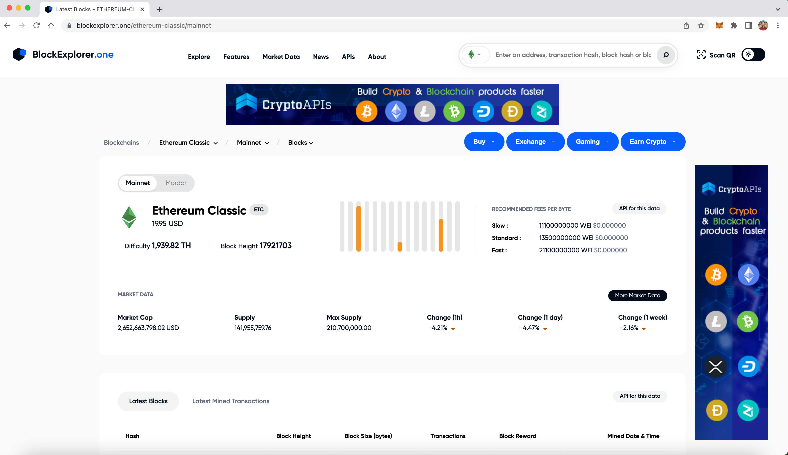
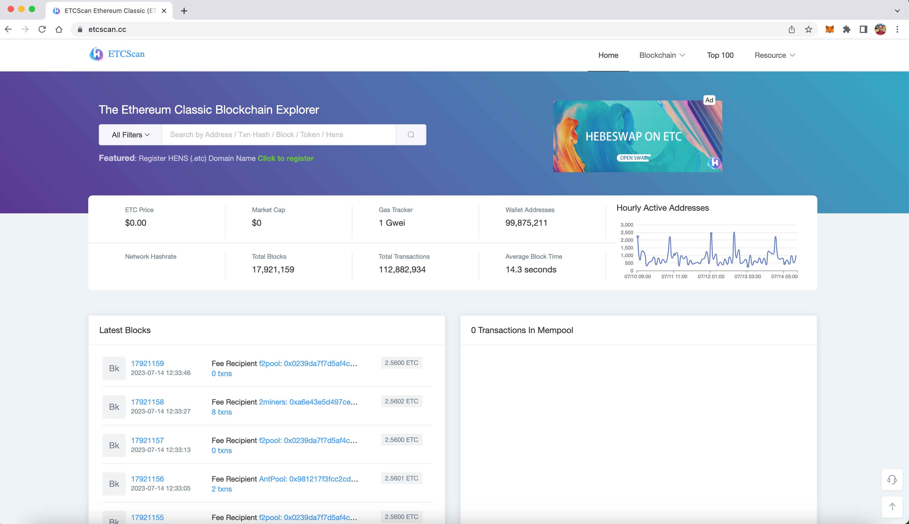
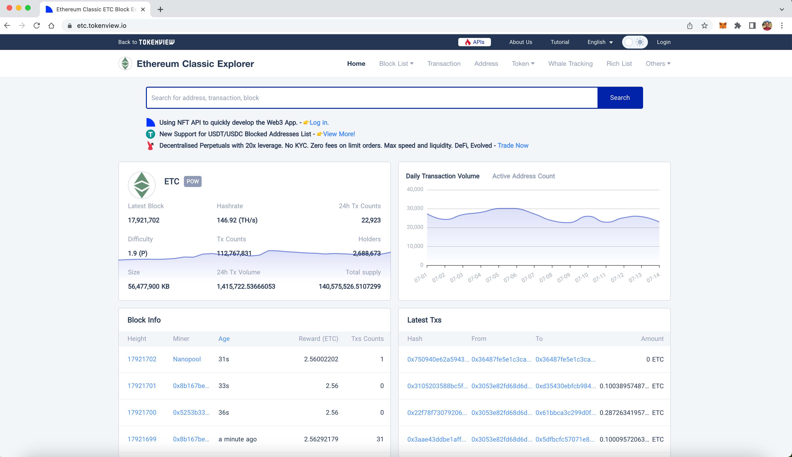

---
**You can listen to or watch this video here:**

[video]

---

In the previous class 31, we saw where to find cryptocurrency lists and prices by describing the quotation services CoinMarketCap, CoinGecko, and Messari. 

In this class we will learn what was the transparency paradigm change that the blockchain industry brought as compared to banking, how data exists in a blockchain as Ethereum Classic (ETC), what are block explorers, and a description of several block explorers that support ETC. 

In the next class 33 we will explain what are centralized and decentralized exchanges.

## The Paradigm Change in Transparency

When we make payments with credit cards and mobile apps, or use banking transfer systems such as wire transfers or other settlement systems, we usually initiate the payments and then many hours or days must pass for all the steps of the process to go through and the money to be moved from the initiating account to the destination account. 

From an end user perspective, or even for insiders in different parts of the process, there is no transparency of what is the state of these movements of money. The system is a black box for everyone. Only when funds are debited from one account and, long after, credited in the other do the parties of a transaction have visibility of the payment.

The blockchain industry changed this completely with complete transparency. When anyone sends a transaction to a blockchain such as ETC, the whole lifecycle of that transaction is visible by anyone running a node or using special websites that index all this data and offer it for free for anyone to search and audit.

The longest it takes in the blockchain industry for a transaction to settle is ten minutes, which is the time it takes for the Bitcoin network to process blocks. In ETC this happens every 13 seconds.

The interesting thing is that not only the transfers are faster, global, and transparent, but that users may constantly monitor their transactions on the special websites mentioned above that are sort of third party witnesses of all the action.

## How Does Blockchain Data Exist in ETC and Other Blockchains?

When any transaction is sent to a blockchain such as ETC, it is received by nodes and re-transmitted immediately to the rest of the of the network. Each node has a full copy of all transactions, therefore everyone may know the state of all transfers live, even if they have not been included in a block yet. The state or place where transactions are in this stage is called the mempool.

Then, transactions that are correctly signed, have the right balances, and are formed according to protocol rules will eventually be included in a block by miners.

When Miners create new blocks of transactions, they send them to the rest of the network for full replication as happens with individual transactions.

When all nodes in the network receive the new blocks, they add them to what is called the chain of blocks, or blockchain, which is the end  state of all blocks, transactions, and data of the system.

As mentioned above, the blockchain, as a database, is replicated in all nodes of the system, so anyone running a node has all the information of the history and what is going on in the network.

## What Are Block Explorers?

Block explorers are the special websites mentioned before that run nodes of the various blockchains, including ETC, index the information of their databases, and show the information to the public on demand.

This is a new level of transparency in the world of finance, not only because the information is available, but because ordinary users can use these third party services to track and audit the blockchains.

The data on these websites may be organized by block, by transaction, or by address, and often have more statistics and charts that are useful to analyze the activity in the networks.

Examples of popular block explorers, and what is the blockchain for which they are most identified for, are:

Blockscout.com -> Ethereum Classic (ETC)

Blockchain.com -> Bitcoin (BTC)

Etherscan.io -> Ethereum (ETH)

In the following sections we will describe several block explorers that support ETC.

## Blockscout

Blockscout is the most popular ETC block explorer and is maintained by the ETC Cooperative. To use Blockscout with ETC you may go to the following link:

https://blockscout.com/etc/mainnet

Blockscout enables users to search the ETC blockchain by address, transaction, block, or token symbol.

**Address:** Users may enter the address they wish to check and see the balance, tokens it holds, total transactions, token transfers, total gas used, and the latest block in which the balance was updated.

**Transaction:** Users may enter a transaction ID and see the status, the block number in which it was included, timestamp, from which and to which addresses the money was moved, value of the transaction, the fee, and the gas price.

**Block:** Users may enter a block number and see its timestamp, how many transactions it contained, which was the miner that mined the block, block size in bytes, the block cryptographic stamp or hash, the hash of the previous block or parent hash, the mining difficulty, total difficulty of the chain up to this block, the gas used, the gas limit, the nonce used to create the block hash, and the miner reward.

**Token symbol:** Users may search tokens by their symbol. For example, to see the HebeSwap token they can enter HEBE and its profile page and stats will appear. The same with WETC, the ETC wrapped token that is used on dapps.

## EtcBlockExplorer

EtcBlockExplorer is maintained by the team that created the Guarda wallet. To use EtcBlockExplorer with ETC you may go to:

https://etcblockexplorer.com

EtcBlockExplorer enables users to search the ETC blockchain by address, transaction, or block, and also has a section that shows the mempool.

**Address:** Users may enter the address they wish to check and see the balance, the transaction history, non-contract transactions, and token balances.

**Transaction:** Users may enter a transaction ID and see the block in which it was included, the value, the transaction fee, timestamp, the raw code of the transaction, and number of confirmations.

**Block:** Users may enter a block number and see the block stamp or hash, number of transactions, timestamp, bytes, the nonce, and the difficulty.

**Mempool:** By clicking on the link “Mempool” on the home, users may check the mempool of the ETC pending transactions.

## BlockExplorer.one

BlockExplorer.one is maintained by a company with the same name. To use BlockExplorer.one with ETC you may go to:

https://blockexplorer.one/ethereum-classic/mainnet

BlockExplorer.one enables users to search the ETC blockchain by address, transaction, or block, and also has a market data list and page for Ethereum Classic.

**Address:** Users may enter the address they wish to check and see the balance, total received, total sent, the transactions in the address, and the tokens it holds, if any.

**Transaction:** Users may enter a transaction ID and see the amount, the transaction block number, fee, number of confirmations, and the date and time of the transaction.

**Block:** Users may enter a block number and see the received time, total transactions, confirmations, difficulty, reward, block hash, gas limit, and gas used.

**Market data:** By clicking on the “More Market Data” link on the ETC page, users may go to the token list quotation service and by clicking on “ETC” they can see its market data page.

## EtcScan

EtcScan is maintained by the team who created the HebeSwap decentralized exchange. To use EtcScan with ETC you may go to:

https://etcscan.cc

EtcScan enables users to search the ETC blockchain by address, transaction, block, token, or ETC domain name.

**Address:** Users may enter an address and see the balance, tokens, and transactions. They also have the option to enter a name tag for the address by pressing on the “Submit info” link.

**Transaction:** By entering a transaction ID, users may see the status, block, confirmations, timestamp, “from” and “to” addresses, value, fee, and gas price.

**Block:** Users may enter a block number and see the block hash, timestamp, confirmations, the miner, transactions, block reward, total difficulty, block size, gas used, the gas limit, nonce, next block hash, and previous block hash.

**Token:** Users may search tokens by their symbol.

**ETC domain name:** There is a domain name system in ETC, created by the same team, called “Hens”. Users may enter their domain name on EtcScan, for example “domain.etc”, and see the data for that account.

## TokenView

TokenView is maintained by the Tokenview team. To use TokenView with ETC you may go to:

https://etc.tokenview.io

TokenView enables users to search the ETC blockchain by address, transaction, or block. It also has two sections, “Whale Tracking” and “Rich List”, which track large ETC transactions and addresses.

**Address:** Users may enter the address they wish to check and see the balance, token balances, and a list of transactions. Addresses may also be labelled by logging in.

**Transaction:** Users may enter a transaction ID and see the status, block number, time, the “from” and “to” addresses, amount, fees, gas used, and gas limit, among other data points. 

**Block:** Users may enter a block number and see the time, size in bytes, fees, number of transactions, gas used, gas limit, mining and total difficulty, block reward, confirmations, previous and next block hashes, the miner, the nonce, and other data points.

---

**Thank you for reading this article!**

To learn more about ETC please go to: https://ethereumclassic.org
