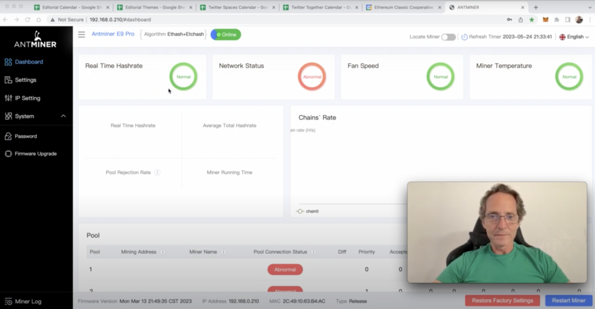
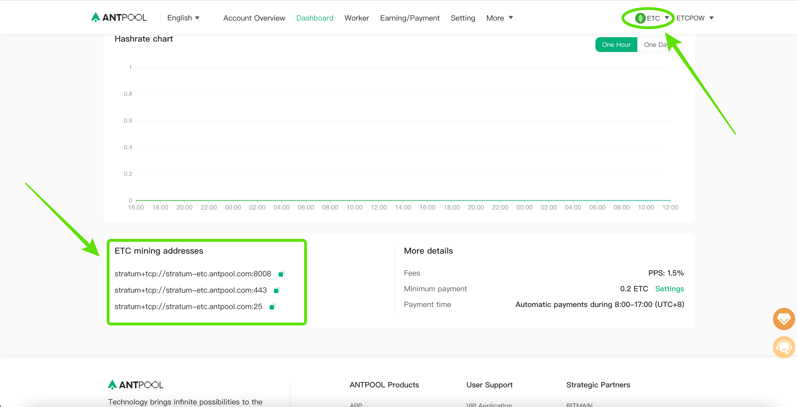
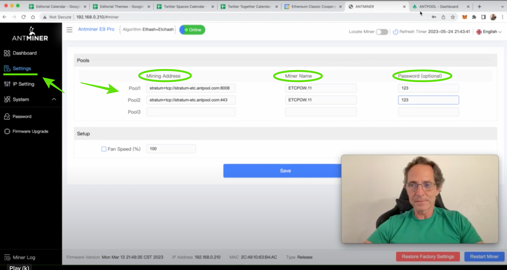
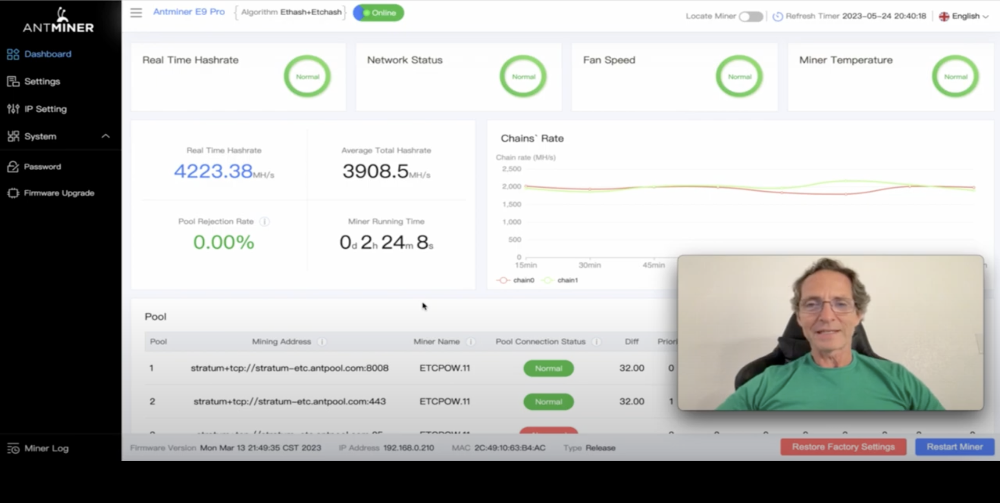
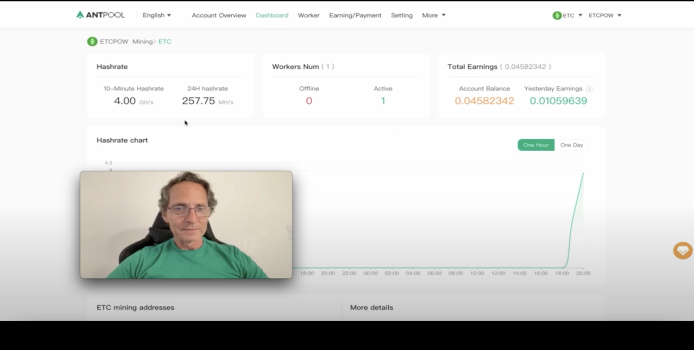

---
**欢迎由此观看访谈:**

<iframe width="560" height="315" src="https://www.youtube.com/embed/K3xokypGLnM?si=di3ykKFTMAGJqyJq" title="YouTube video player" frameborder="0" allow="accelerometer; autoplay; clipboard-write; encrypted-media; gyroscope; picture-in-picture; web-share" allowfullscreen></iframe>

---

在我们之前关于如何使用Antpool通过Antminer E9 Pro挖掘以太经典的帖子中，我们发布了5个视频，解释了开箱、连接、设置、检查统计数据以及如何启动挖掘过程。

在本文中，我们将以文字形式介绍相同的步骤，因为世界各地有许多矿工更喜欢这些指南以文本形式呈现。

这是我们之前帖子的链接：

https://ethereumclassic.org/blog/2023-06-07-mining-ethereum-classic-with-an-antminer-e9-pro-through-antpool

在接下来的章节中，我们将解释上述提到的过程。

## 1. 开箱Antminer E9 Pro

当您打开Antminer E9 Pro的包装时，您会找到一台大型机器，尺寸为22英寸深，8英寸宽，12英寸高（以厘米表示，即56厘米深x 20厘米宽x 31厘米高）。

它有一个以太网端口，用于连接到您的本地互联网路由器，但不带网线，因此您需要自行购买一根。

这台矿机需要3000瓦特的电力，并在220到240伏特电压下运行，因此如果您在电压不同的地方进行挖掘，那么您将需要一个带有两个220/240插座的变压器。

之前提到两个插座，是因为E9 Pro矿机使用两个电源，一个用于风扇，一个用于挖掘板。然而，这台机器不附带电源电缆，所以您也需要购买它们。

如果您打算在家里或办公室进行挖掘，且有正常的空调，或者温度在摄氏75度（约摄氏24度）左右，那么它将正常工作。

## 2. 连接

Antminer E9 Pro的风扇噪音很大，因此如果您在家里或办公室进行挖掘，请确保将其放在一个隔离的位置！

要连接ASIC矿机，首先获取两根电源电缆，并将它们连接到机器上的两个可用插头。然后，将这两根电缆的另一端连接到变压器（如果您在使用的话），多插座延长线，或墙壁上的插座。

其次，通过将以太网电缆插入矿机上的端口，然后插入您的本地WiFi路由器，将矿机连接到路由器。

如果您使用变压器或多插座延长线，请将它们连接到墙上的电源插座。

一旦您将电源连接到矿机，或者打开变压器，机器将立即启动。

您会注意到，次要风扇首先启动，一段时间后，主要风扇也会启动。

## 3. 与本地计算机的设置

要将Antminer E9 Pro设置到您的计算机上以进行管理，两台设备必须连接到同一WiFi路由器。

要打开Antminer界面，请打开浏览器，输入URL 192.168.0.210以访问它。这是您在本地网络中的矿机地址。

界面会立即要求您输入用户ID和密码。默认值为“root”和“root”，所以请将它们输入为您的ID和密码以打开界面。

一旦进入用户界面，出于安全原因，您需要更改密码。为此，请转到左侧菜单中的“System”选项卡，并在那里更改您的密码。

下一步是配置您的矿机，将其指向Antpool矿池。为此，我们将进入“Settings”部分，但首先在下一节中从Antpool获取配置信息。

## 4. 开始挖矿：连接到Antpool

要从Antpool获取配置信息以连接您的矿机到该挖矿池，您需要前往https://antpool.com 并进行注册。

一旦您登录您的帐户，请选择“ETC”作为您要工作的挖矿池，方法是打开右上角的下拉菜单，然后点击Ethereum Classic。

在ETC挖矿页面上，您会看到以下三个矿池地址：

stratum+tcp://stratum-etc.antpool.com:8008
stratum+tcp://stratum-etc.antpool.com:443
stratum+tcp://stratum-etc.antpool.com:25

您需要将每个地址复制并粘贴到Antpool界面上相应的部分。为此，请再次打开您的Antpool应用程序，然后进入“Settings”。

在Antminer界面的设置页面上，您将看到一个表格，用于输入三个URL以通过Antpool挖矿：Pool 1、Pool 2和Pool 3。

在“Mining Address”字段中，逐个输入Antpool给您的挖矿URL。

在“Miner Name”字段中，通过输入您的Antpool帐户ID，然后加上一个点，再加上您为这台机器取的编号，来为这台矿机配置一个名称。

例如，在我的情况下，我将其命名为“ETCPOW.11”，其中ETCPOW是我在Antpool上的帐户ID，11是我为我的矿机指定的编号。

在“Password”字段中，只需输入123，这是这些系统通常使用的密码。

一旦您输入了所有字段，然后点击“Save”。

现在，您已经准备好查看包含挖矿统计信息的仪表板。

## 5. 检查矿工统计信息

请注意，在开始挖矿后，您需要等待数分钟才能在您的Antminer和Antpool仪表板上看到统计信息。

当您再次转到Antminer仪表板时，您将看到“实时算力”，“网络状态”，“风扇速度”和“矿工温度”的指标，这些指标都应该显示为“正常”。

在下面，您将看到链的算力图表，左侧是您的Antminer的特定算力。如果它在3,600到4,000 MH/s之间，那么这是正常范围，因为该机器的目标算力为3,680 MH/s。

在页面底部，您应该看到您的矿机有两块挖矿板，理论容量为每块1,850 MH/s。

当您转到“矿池”部分时，您必须看到矿池正在接受您的工作。要知道这一点，请查看“Accepted”列下是否有Antpool接受的工作数量。如果是这样，那么您的矿机正常工作并已连接到矿池。

当您访问Antpool上的帐户时，您将看到一个与您的矿机上的仪表板平行的仪表板。

在您的帐户上，您将看到一个图表，应该显示矿池正在接收您的工作，并显示您的算力统计信息。

当您转到“Dashboard”选项卡时，您将找到您的工作机的算力，您在该矿池中有多少个工作机，以及您的总收益。

## 6. 祝您成功！

我们愿您在ETC挖矿中取得愉快的成果！

您可以在以下链接中观看整个解释的视频形式：

<iframe width="560" height="315" src="https://www.youtube.com/embed/videoseries?si=eHrz-GRnbNNkVNGG&amp;list=PLIzptAKK7iDTX6Clfd7KoD6W7gSGpb9hv" title="YouTube video player" frameborder="0" allow="accelerometer; autoplay; clipboard-write; encrypted-media; gyroscope; picture-in-picture; web-share" allowfullscreen></iframe>

---

**感谢您阅读本期文章!**

了解更多有关ETC: https://ethereumclassic.org
