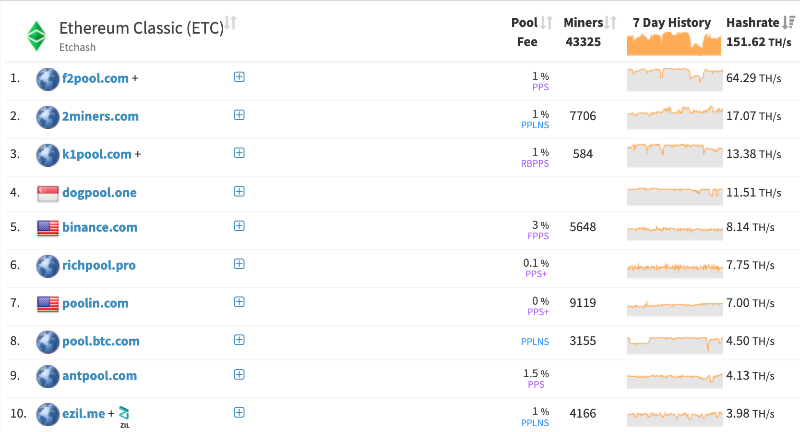
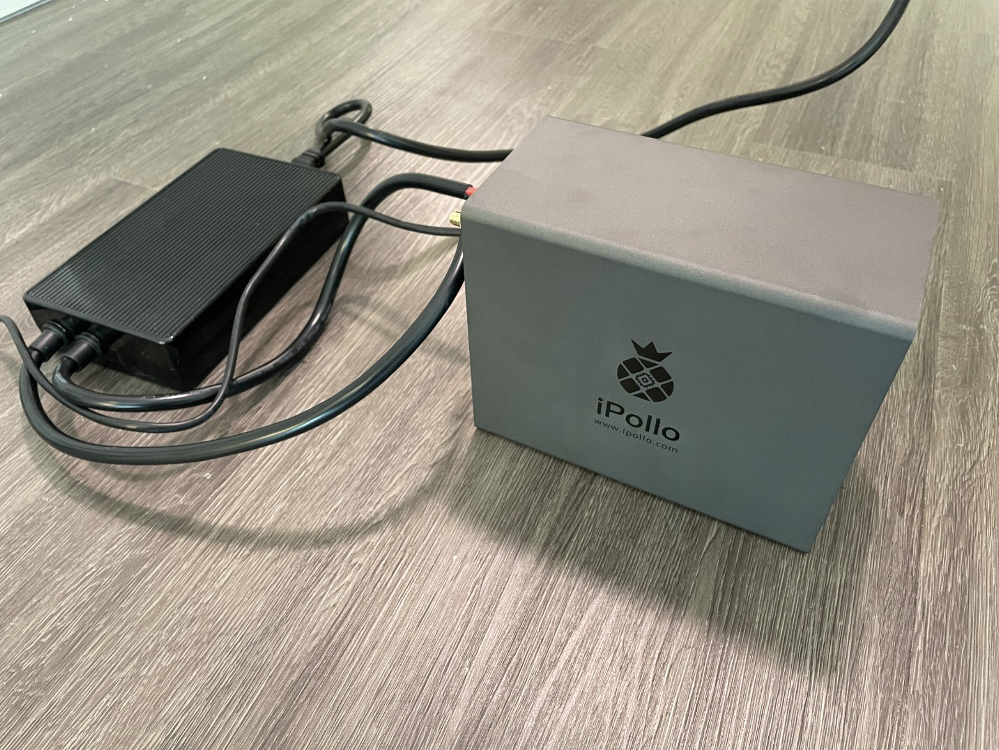
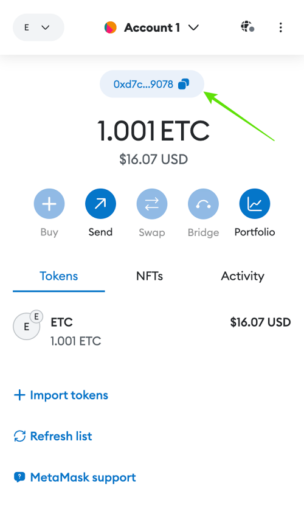
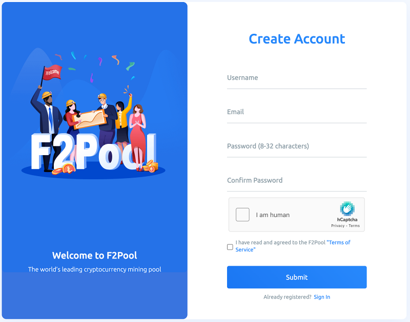
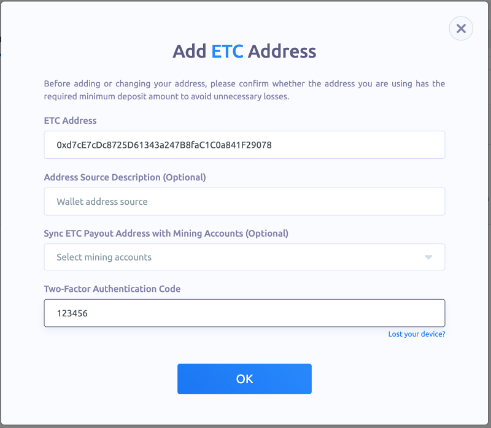
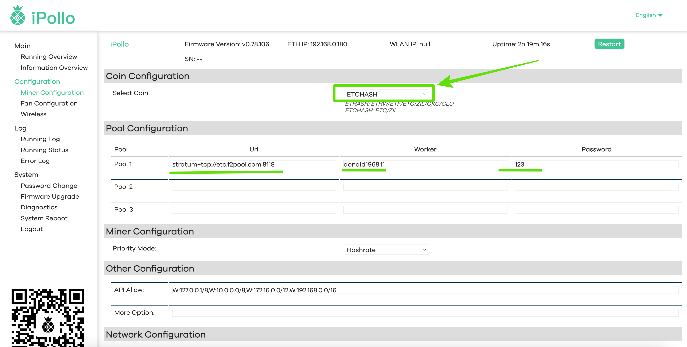
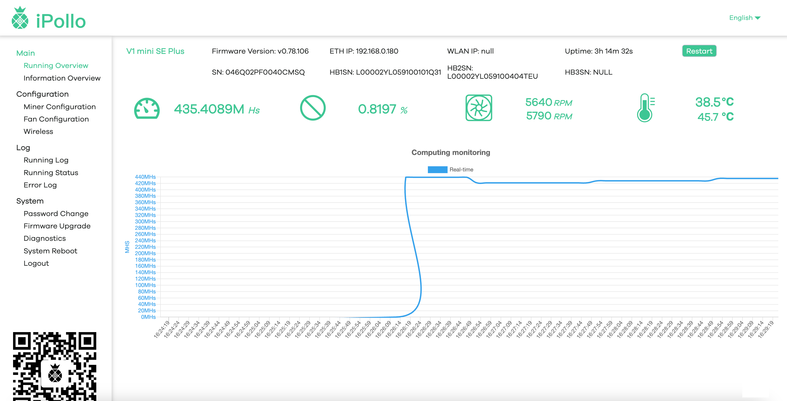
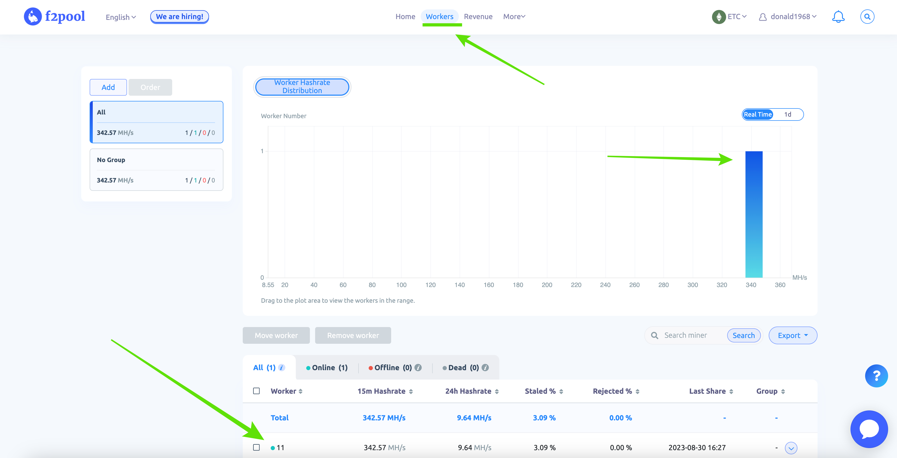
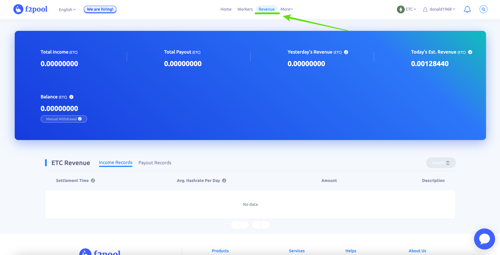

---
**由此观看或收听采访:**

<iframe width="560" height="315" src="https://www.youtube.com/embed/EBRL33Kfgi8?si=1-TUPyyKR00TqGH-" title="YouTube video player" frameborder="0" allow="accelerometer; autoplay; clipboard-write; encrypted-media; gyroscope; picture-in-picture; web-share" allowfullscreen></iframe>

---

F2Pool是以太经典（ETC）中最大的矿池，也是比特币（BTC）中第三大的矿池。

因此，我们认为有必要制作这个指南，以解释如何通过这个矿池开始挖掘ETC。

在这篇文章中，我们将解释如何开始迈出第一步，如何通过配置您的矿工将其指向F2Pool来开始挖掘ETC，以及如何检查您的挖矿统计信息。

## 1. 确保您拥有正确的挖矿设备

我们一直在使用ASIC矿机来创建这些挖掘以太经典的指南。在这个竞争激烈的市场中，ASIC矿机是保持领先地位的最有竞争力的设备。

目前，我们涵盖的三个挖矿硬件品牌是Bitmain的[Antminer](https://shop.bitmain.com/product/detail?pid=00020230318213033303FiTP3CK3062C), [iPollo](https://ipollo.com/products/ipollo-v1-mini-classic-plus-wifi-version), 很快我们将为[Jasminer](http://jasminer.com)的ETC矿机制作指南。

对于这个指南，我们决定使用iPollo V1 Mini SE Plus。

这台矿机使用的是ETCHash挖矿算法，具有280 MH/s的挖矿算力，您可以通过WiFi连接到它来配置。

在接下来的章节中，我们将解释如何设置您的iPollo矿机以通过F2Pool挖掘。

## 2. 获取一个ETC账户

要开始通过F2Pool挖矿，您需要一个ETC地址，以便他们可以向您发送您的挖矿收益。

F2Pool每天支付矿工，前提是他们的账户余额达到0.1 ETC或更多。

您可以使用我们涵盖的支持ETC的钱包之一，这些钱包在[这里](https://ethereumclassic.org/blog/2023-07-12-list-of-wallets-that-support-ethereum-classic)列出了:

- MetaMask 
- Trust Wallet 
- Ledger Nano S 
- MyCrypto
- MyEtherWallet
- Exodus

在这个指南中，我们决定使用我们的MetaMask钱包，并在那里使用我们的地址。

## 3. 在F2Pool上开设一个账户

下一步是在F2Pool上开设一个账户。

请访问以下链接：

https://f2pool.com/user/signup

创建账户的过程不需要验证您的地址或身份，但在安全方面非常严格。

我们必须输入我们的电子邮件，然后进行验证，然后开设账户，还必须通过电子邮件接收更多的验证代码。我们还必须输入我们的手机号码，通过手机号码进行更多的验证。最后，他们还要求我们启用两步验证。

## 4. 将您的ETC地址添加到F2Pool

一旦您的账户已开设，您需要将您的ETC地址添加到您的F2Pool个人资料中，以便他们支付您，正如我们之前所说的。

首先，在屏幕右上角的币种下拉菜单中选择ETC作为您正在挖掘的币种。

之后，点击您的用户名，然后选择“账户设置”。

在下一个屏幕上，您将看到您的用户名，右侧有一个“支付设置”链接。点击那里。

在下一个屏幕上，点击“+ 添加ETC地址”，然后在那里添加您的地址。

然后点击“确定”。

## 5. 添加F2Pool设置到您的矿工并开始挖矿

现在您已经创建并准备好您的F2Pool账户，下一步是配置您的矿工以通过该矿池开始挖掘ETC。

您需要的[数据](https://f2pool.io/mining/guides/how-to-mine-ethereum-classic/)如下：

**矿池URL:** stratum+tcp://etc.f2pool.com:8118

**用户名和矿工:** accountName.workerName

**密码:** Your choice

要配置我们的iPollo，我们转到iPollo界面左侧菜单中的“配置”选项卡，然后选择“ETCHASH”作为挖矿算法。

然后，我们输入了矿池URL、矿工和一个我们编造的密码，即“123”。

我们的矿工是“donald1968.11”，因为“donald1968”是我们在F2Pool上的账户ID，“11”只是我们用来标识这台机器的任意数字。

要开始挖矿，请点击下方的“保存并应用”。

## 6. 检查您的挖矿统计信息

现在您的F2Pool账户和ASIC矿工已配置并连接，并且挖矿已经开始，您需要等待几分钟，让它们进行通信和同步，让工作从您的矿工传输到矿池。

当一段时间过去后，您将在您的矿工仪表板上注意到，指向F2Pool的算力将会增加，工作将开始传输到矿池。

例如，在我们的情况下，您可以在图像中看到，指向F2Pool的算力超过了435 MH/s（我们不知道为什么这款产品会产生如此稳定的高算力，如果按照制造商的规格说明应该产生280 MH/s）。

如果您再次转到F2Pool上的您的账户，您应该会看到您的ETC仪表板，如果点击“矿工”选项卡，工作应该会反映在算力图表中，并且矿工应该在下方标识出来。

如果点击“收益”选项卡，您将看到您的财务统计数据，包括“总收入”、“总支付”、“昨日收入”和“今日预计收入”等指标。

随着时间的推移，您将在这里看到您的收益，只要您的可提取余额达到0.1 ETC，您就可以随时提取您的ETC余额。

–--

祝您挖矿愉快！

---

**感谢您阅读本期文章!**

了解更多有关ETC，欢迎访问: https://ethereumclassic.org
