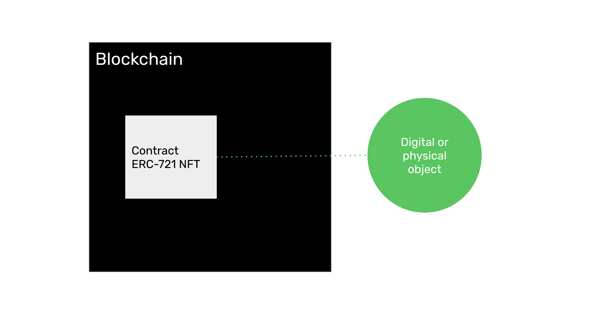
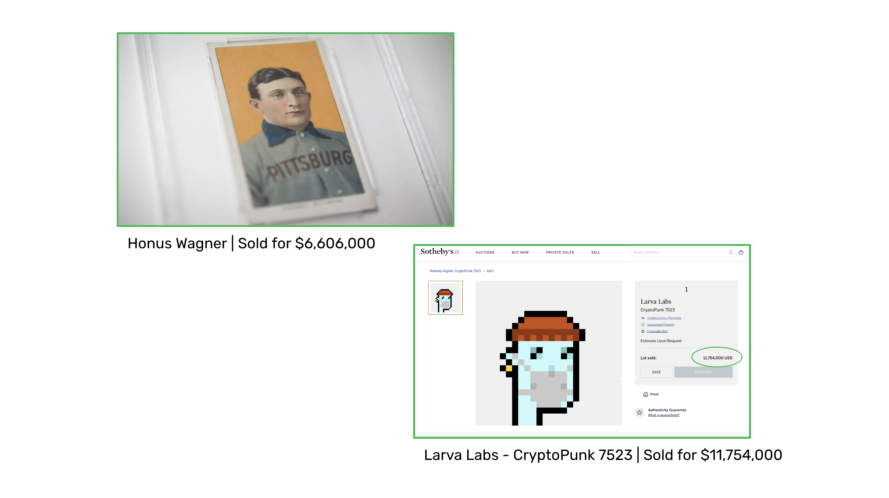
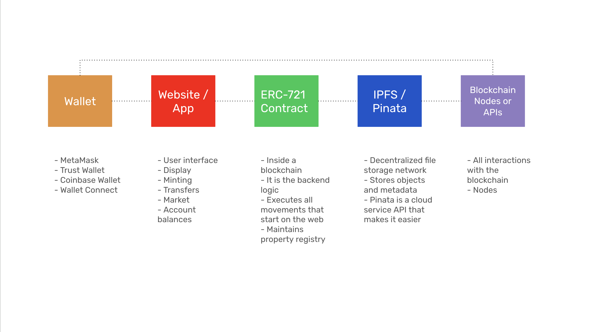
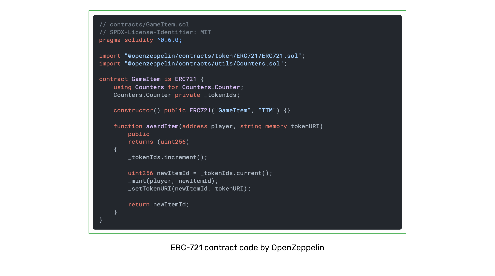

---
**You can listen to or watch this interview here:**

<iframe width="560" height="315" src="https://www.youtube.com/embed/DG2Y8tST2-Q?si=NiU5sb5YOVX73caj" title="YouTube video player" frameborder="0" allow="accelerometer; autoplay; clipboard-write; encrypted-media; gyroscope; picture-in-picture; web-share" allowfullscreen></iframe>

---

One of the major technologies that have caught the attention and been used by the public on the blockchain industry have been NFTs. 

The term “NFT” stands for non-fungible token.

In this class, 35, we will explain NFTs in the following sections. 

The topics that we will cover are:

- What Are Non-Fungible Tokens (NFTs)?
- Examples of Collectable NFTs
- How NFTs Are Built
- The ERC-721 Smart Contract
- Famous NFTs

In the next class, 36, we will explain how property registries and ownership records will work on the blockchain.

## What Are Non-Fungible Tokens (NFTs)?

Non-fungible tokens are smart contracts on a programmable blockchain. The standard used is called the ERC-721. Instead of being ERC-20 standard fungible units, they are non-fungible or unique objects on a blockchain.

NFTs may be associated with physical or digital objects, such as cars or real estate, through metadata.

The important features of this kind of non-fungible objects are that they are transferable, they can be bought and sold, and the blockchain serves as the property registry.

NFTs may serve many use cases. The most well known are digital collectibles, but they could also be associated to other unique things such as intellectual property (music, movies, etc.), movable property (cars, trucks, boats, airplanes, etc.), real estate (homes, apartments, land, farms, etc.), other kinds of registrable goods, cash flows (discounted invoices, promissory notes, etc.), contracts, containers, pallets, and other goods and objects in the supply chain in general.

## Examples of Collectable NFTs

Just like in the real world there exists baseball card collecting, NFTs have enabled the collection of digital cards or images, which sometimes have been called “digital art”.

This is because NFT smart contracts may convert digital images into unique digital objects on the blockchain that are transferable. This uniqueness has attracted collectors who have invested millions in buying these objects.

An example of a highly valued real life collectible is the [Honus Wagner baseball card](https://www.mlb.com/news/rare-t206-honus-wagner-baseball-card-sold-for-7-25-million) that was sold for $7.25 million dollars on August 3 2022.

In the case of NFTs, the image of the Larva Labs [CryptoPunk number 7523](https://www.cnbc.com/2021/06/10/covid-alien-cryptopunk-nft-sells-for-11point7-million-in-sothebys-auction.html) was sold for $11.75 million dollars on June 10 2021.

## How NFTs Are Built

NFTs work by associating crypto wallets such as MetaMask to websites or apps. The websites or apps serve as user interfaces, to display the NFTs, for the primary sales or minting, to do transfers, to buy and sell them in the secondary market, and to check account balances.

The ERC-721 smart contracts are inside a programmable blockchain such as Ethereum Classic (ETC). The smart contract is the backend logic of the system, it executes all movements that originate from the web or app, and maintains the property registry of the NFTs.

The digital objects and metadata of NFTs may be stored in decentralized file storage networks such as IPFS. To manage the creation and stock of NFTs on these networks interfaces like Pinata provide tools and services that make it easier.

Finally, for the system to interact with the underlying blockchain it needs to connect to that blockchain’s nodes who receive and process the transactions.

## The ERC-721 Smart Contract

As explained in class 25 of this course, on programmable blockchains developers may deploy ERC-20 tokens that are fungible tokens which may be used to pay for things, vote on DAOs, or as product or corporate fidelity points, amongst many other use cases.

For unique objects that are not fungible, but that represent things in cyberspace or the real world, the ERC-721 token format was created.

The ERC-721 smart contract holds the metadata of objects inside a blockchain. It is the back end logic of an NFT system which executes all transactions that start on the web or from NFT apps.

The ERC-721 smart contract uses the blockchain’s account system to maintain the property registry of all NFTs.

## Famous NFTs

NFTs were invented in 2017 and the first product to launch was Crytpokitties.

At the time, [Cryptokitties](https://www.cryptokitties.co/) caused excitement and furor as users rushed to buy their NFTs and the transaction count on Ethereum skyrocketed, causing GAS fees to skyrocket as well.

On the Ethereum Classic blockchain one of the first and most popular NFT projects is [ETCPunks](https://etcpunks.com/) which sold 10,000 NFTs at 2 ETC a piece.

–--

In the next class, 36, we will explain how NFTs, as well as ERC-20 tokens, will be used for other important functions.

---

**Thank you for reading this article!**

To learn more about ETC please go to: https://ethereumclassic.org
