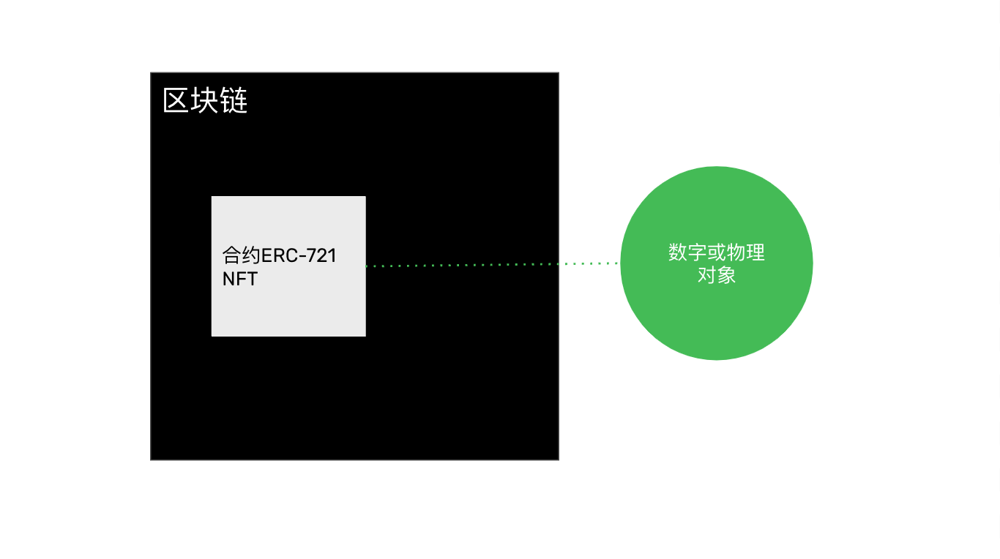
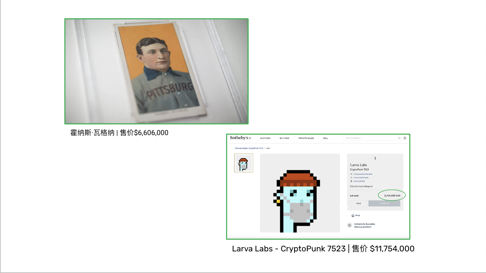
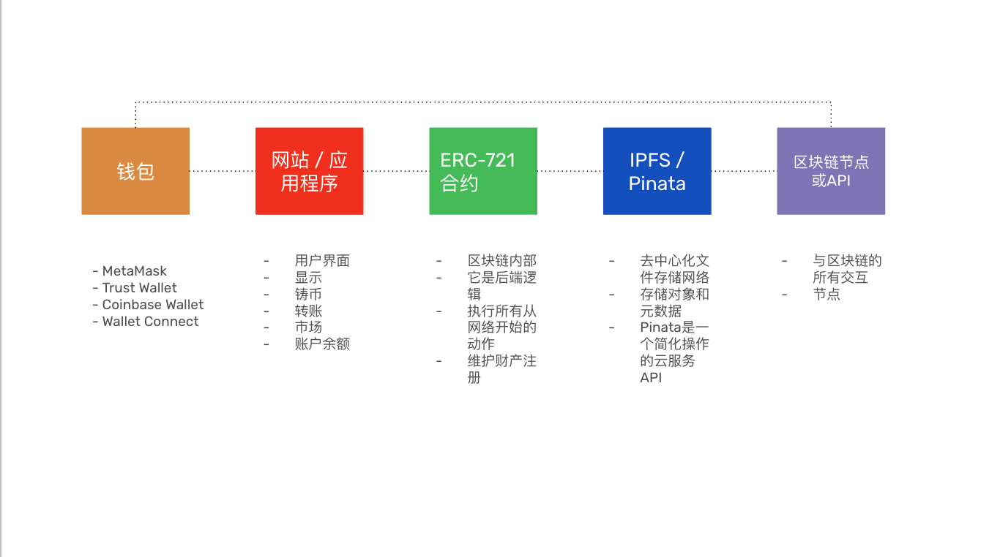
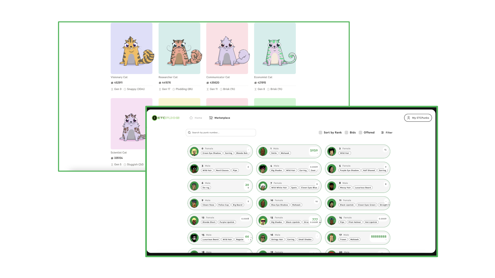

---
**由此收听或观看此次访谈:**

<iframe width="560" height="315" src="https://www.youtube.com/embed/v8Isn4i6Ww8?si=EMyAqiRt7c_SIZOZ" title="YouTube video player" frameborder="0" allow="accelerometer; autoplay; clipboard-write; encrypted-media; gyroscope; picture-in-picture; web-share" allowfullscreen></iframe>

---

在区块链行业中引起公众关注并被广泛使用的一项重要技术是NFTs（非同质化代币）。

术语“NFT”代表非同质化代币。

在本课程第35节中，我们将在以下几个部分中解释NFTs。

我们将涵盖的主题包括：

- 什么是非同质化代币（NFTs）？
- 可收藏的NFTs示例
- NFTs是如何构建的
- ERC-721智能合约
- 著名的NFTs

在下一课，第36课中，我们将解释财产登记和所有权记录如何在区块链上运作。

## 什么是非同质化代币（NFTs）？

非同质化代币是可编程区块链上的智能合约。所使用的标准称为ERC-721。与ERC-20标准的可互换单位不同，它们是区块链上的非同质化或独特对象。

NFTs可以与物理或数字对象关联，例如汽车或房地产，通过元数据。

这种非同质化对象的重要特点是它们可以转让，可以买卖，并且区块链充当财产登记处。

NFTs可以用于许多用途。最知名的是数字收藏品，但它们也可以与其他独特的事物相关联，如知识产权（音乐、电影等）、动产（汽车、卡车、船只、飞机等）、房地产（住宅、公寓、土地、农场等）、其他可登记的货物、现金流（贴现发票、本票等）、合同、容器、托盘以及一般供应链中的其他货物和物体。

## 可收藏的NFTs示例

就像在现实世界中存在棒球卡片收藏一样，NFTs使数字卡片或图像的收藏成为可能，有时被称为“数字艺术”。

这是因为NFT智能合约可以将数字图像转化为区块链上可转让的独特数字对象。这种独特性吸引了投资者，他们已经投资了数百万美元来购买这些对象。

一个高价值的现实世界可收藏示例是于2022年8月3日以725万美元的价格售出的 [Honus Wagner 棒球卡片](https://www.mlb.com/news/rare-t206-honus-wagner-baseball-card-sold-for-7-25-million)。

至于NFTs，在2021年6月10日，Larva Labs的 [CryptoPunk编号7523的图像](https://www.cnbc.com/2021/06/10/covid-alien-cryptopunk-nft-sells-for-11point7-million-in-sothebys-auction.html) 以1175万美元的价格出售。

## NFTs的构建方式

NFTs的构建方式是将加密钱包（如MetaMask）与网站或应用程序关联起来。这些网站或应用程序充当用户界面，用于展示NFTs，进行主要销售或铸币，进行转账，在二级市场上买卖它们，并查看账户余额。

ERC-721智能合约位于可编程区块链内，例如Ethereum Classic（ETC）。智能合约是系统的后端逻辑，执行源自网络或应用程序的所有操作，并维护NFTs的财产注册。

NFTs的数字对象和元数据可以存储在去中心化的文件存储网络（如IPFS）中。为了管理这些网络上NFTs的创建和库存，像Pinata这样的接口提供了简化操作的工具和服务。

最后，为了使系统与基础区块链交互，它需要连接到该区块链的节点，这些节点接收并处理交易。

## ERC-721智能合约

正如本课程第25课所解释的那样，在可编程区块链上，开发人员可以部署ERC-20代币，这些代币是可互换的代币，可用于支付、在DAO上投票，或作为产品或企业忠诚积分等多种用途。

对于不可互换但代表网络空间或现实世界中的物体的唯一对象，创建了ERC-721代币格式。

ERC-721智能合约保存了区块链中对象的元数据。它是NFT系统的后端逻辑，执行所有从网络或NFT应用程序启动的交易。

ERC-721智能合约使用区块链的账户系统来维护所有NFTs的财产注册。

## 著名的NFTs

NFTs于2017年首次问世，第一个产品是Cryptokitties。

当时，Cryptokitties引起了轰动和狂热，用户纷纷购买他们的NFTs，导致以太坊上的交易数量激增，进而导致GAS费用飙升。

在Ethereum Classic区块链上，最早和最受欢迎的NFT项目之一是ETCPunks，以每个2 ETC的价格出售了10,000个NFT。

---

在下一课，第36课中，我们将解释NFTs以及ERC-20代币将如何用于其他重要功能。

---

**感谢您阅读本期文章!**

了解更多有关ETC: https://ethereumclassic.org
