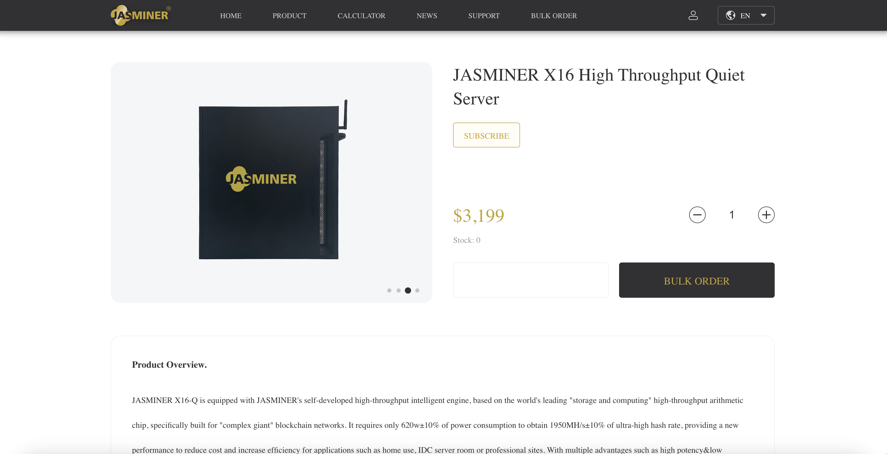
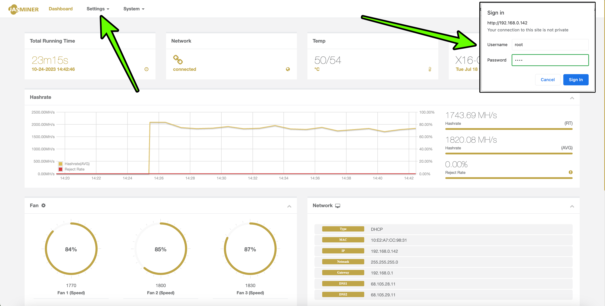
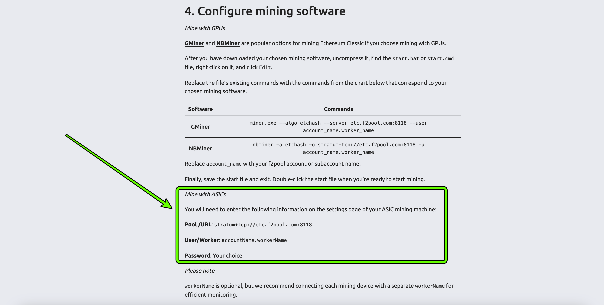

---
**You can listen to or watch this video here:**

<iframe width="560" height="315" src="https://www.youtube.com/embed/U0htDxAIkJw?si=vGxHcXxf0_e8w4IK" title="YouTube video player" frameborder="0" allow="accelerometer; autoplay; clipboard-write; encrypted-media; gyroscope; picture-in-picture; web-share" allowfullscreen></iframe>

---

As a proof of work blockchain, mining is an important function in Ethereum Classic (ETC). 

The miners’ job is to constantly gather transactions, group them into batches, and to do a lot of work, spending a lot of electricity, to create a cryptographic stamp to seal the blocks. 

Then, they send the blocks to the rest of the network, which verifies the transactions and the cryptographic stamps, and pays the miners with newly created ETC coins.

This process is vital to the permissionlessness and censorship resistance of ETC as the proofs of work themselves are the focal points that keep the network decentralized on a global scale.

In this post we will explain how to contribute, and make money, mining ETC using the Jasminer X16-Q High Throughput Quiet Server. 

## 1. Buying the Jasminer X16-Q

The first step is to buy the Jasminer X16-Q. We found three possible places: the Jasminer manufacturer, Amazon, and Miner Bros. 

In the Jasminer website it may say it is “out of stock”, but management told us at the POW Summit that they have units available.

Links to where you may purchase the Jasminer X16-Q are:

- Jasminer.com: https://www.jasminer.com/#/productDetail/908ad3781bff473ba9155276caa84456

- Amazon: https://www.amazon.com/Jasminer-Ethereum-throughput-Compatible-100V-240V/dp/B0CJBJJXC

- Miner Bros: https://www.cryptominerbros.com/product/jasminer-x16-q-ethereum-classic-miner

We have no agreements nor perceive any revenues, fees, or commissions from any brands mentioned in this post.

## 2. Jasminer X16-Q Unboxing

When you receive your Jasminer X16-Q, you will get it with a server power cord, an ethernet cable, and an antenna if you wish to use WiFi to connect it.

In our case, we will connect it through our local WiFi router using the ethernet cable.

We also need a power step up transformer because in our location in Oklahoma, USA we have 110 volt electricity, but the Jasminer uses a 200 to 240 volt input.

As seen in the image, we have our Jasminer ASIC, the ethernet cable, the power cord, our transformer (with its power cord), and our internet router aligned for connection and setup.

## 3. Jasminer X16-Q Connection

The next step to start mining ETC with your Jasminer X16-Q is to connect all the parts and to turn it on.

As seen in the image, you have to connect 3 things:

1. The Jasminer ASIC to the transformer if you are using one (if not, then connect it directly to the wall).

2. The transformer to the power outlet on the wall.

3. The Jasminer ASIC to your router using the ethernet cable.

Once you have all the parts connected turn on the power button on the back of the Jasminer.

## 4. Experience How Quiet the Jasminer X16-Q Is!

One thing that is true to its brand promise is that when you connect and start running your Jasminer, it is incredibly quiet!

In the short video in this section we demonstrate how quiet the ASIC is:

<iframe width="560" height="315" src="https://www.youtube.com/embed/tG_jkCD2JC0?si=qTxjVekhkqs07Bqq" title="YouTube video player" frameborder="0" allow="accelerometer; autoplay; clipboard-write; encrypted-media; gyroscope; picture-in-picture; web-share" allowfullscreen></iframe>

## 5. Finding and Logging in to the Jasminer X16-Q User Interface

When you have all the parts connected and running, then you need to go to your PC and log in to the user interface of your Jasminer X16-Q.

To be able to do this your Jasminer and your PC must be connected to the same router.

The IP address to login to the Jasminer UI is: 

https://192.168.0.142 

The default ID and password are: 

**ID:** root

**Password:** root

When you log in, then you must change your password in the “Settings” tab.

## 6. Getting the Mining Pool Configuration Information

Once you have your Jasminer all setup and ready to mine, then you need to go to your mining pool to get the configuration information to point your Jasminer X16-Q to it.

In our case we will use F2Pool, the largest mining pool in the ETC ecosystem, to configure and point our Jasminer.

The link to find the configuration data is:

https://f2pool.io/mining/guides/how-to-mine-ethereum-classic/

From there you will see, copy, and enter the following data points into your Jasminer:

**Pool URL:** stratum+tcp://etc.f2pool.com:8118

**User/Worker:** accountName.workerName

**Password:** Your choice

In the following section we explain how to do this.

## 7. Configuring the Jasminer X16-Q With the Mining Pool Data

To configure your miner to point to your mining pool, go to the the “Settings” tab again, and then click the “Miner” link.

In the next screen you will see forms with fields to enter the data for several pools. This is for backup in case one pool is down, so your miner can jump to the other.

As F2pool gave us only one ETC pool URL to use, we will add it to the “Pool 1” section.

Copy and paste the pool URL in the corresponding field. Then, the worker name must be your user ID on F2pool, followed by a dot, and then followed by a number or name you may give to your miner.

In our case we used our F2pool user name and the number “28” as the name of our Jasminer:

**donald1968.28**

The password may be whatever you wish, we used “123”.

To save your data press “SUBMIT” at the bottom of the page.

## 8. Checking the Mining Statistics on the Jasminer X16-Q

Once you press “SUBMIT” in the previous step, then you are mining ETC!

To check the statistics of your Jasminer on its UI, you will need to wait for a few minutes until the dashboard populates.

As seen on the image in this section, we have been mining ETC for more than 50 minutes, so the Jasminer dashboard has all the statistics for that period.

The main chart shows the hashrate on a minute by minute basis. It has consistently been around 1900 MH/s which is the capacity of this machine.

Other data that it shows are the time mined, fan speeds, and the network data.

## 9. Checking Mining Statistics on Your Mining Pool

Once you have your miner set up and working with the local statistics confirmed, then you can go to your mining pool statistics page to see how your Jasminer is doing from the mining pool’s perspective.

On your account, you must select “ETC” as the network you want to explore, and then go to the “Workers” link to see your Jasminer statistics.

In the next screen you will see the hash rate of your worker, and below a section with your worker name and its statistics.

If you scroll down, you will see a chart with the aggregate hash rate as time passes by.

## 10. Congratulations!

So, now that you have your Jasminer X16-Q High Throughput Quiet Server all set up and working we congratulate you for becoming an ETC miner!

If you go to your F2pool account to the “Revenue” section, you will see your accumulated rewards in ETC, with tools to manage your money.

Happy mining!

---

**Thank you for reading this article!**

To learn more about Jasminer please go to: https://jasminer.com

To learn more about F2pool please go to: https://www.f2pool.com/

To learn more about ETC please go to: https://ethereumclassic.org
