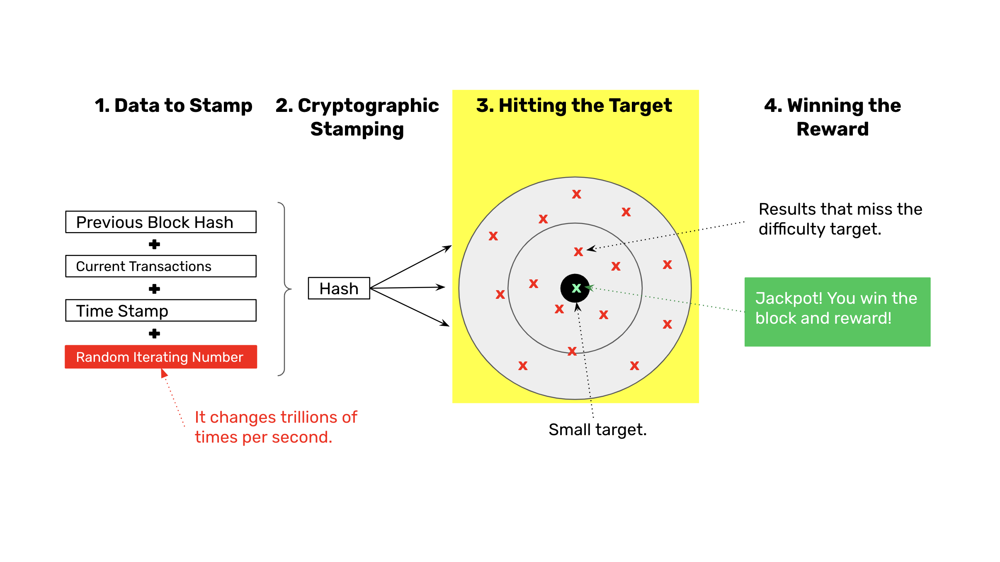
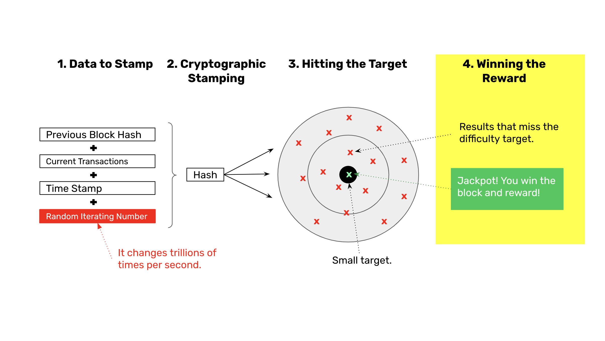

---
**您可以由此收听或观看本期内容:**

<iframe width="560" height="315" src="https://www.youtube.com/embed/1INZgAex-50?si=GAn3l0K6Hg81C540" title="YouTube video player" frameborder="0" allow="accelerometer; autoplay; clipboard-write; encrypted-media; gyroscope; picture-in-picture; web-share" allowfullscreen></iframe>

---

在上一堂课，第2节，我们解释了中本聪在发明比特币时的精彩思想，即工作证明的密码印章不仅可以用来在互联网上创建黄金的类比，称为“比特黄金”，而且POW本身的信息可以成为全球网络的所有节点在同一时间完全孤立地处于数据库相同状态的焦点，无需与任何其他来源或权威咨询。

这是去中心化和工作证明的重要性所在。

在本节课中，我们将解释POW实际是如何工作的，在接下来的几节中，我们将展示一个包含POW过程四个步骤的图表，并解释每个步骤。

## 工作量证明的四步操作

以上是POW过程的完整图表。第一步是对数据进行加密戳或哈希，第二步是哈希本身，第三步是达到协议设定的目标，第四步是赢得奖励。

## 1. 数据加密戳

由于区块链是数据块的链，这些块通过在下一个块中包含前一个块的加密戳或哈希来相互关联。因此，当前的交易被添加到要进行哈希的数据中，加上一个时间戳，最后加上一个我们将在第3步中解释的随机迭代号。

## 2. 密码印章

该过程的第二步是将前一步描述的数据通过密码哈希算法。完成此操作后，为该特定块生成一个新的戳或哈希。这些哈希是非常大的十六进制数，看起来像这样：

`
686f746a95b6f836d7d70567c302c3f9ebb5ee0def3d1220ee9d4e9f34f5e131
`

## 3. 达到目标

第三步是检查哈希数是否达到网络算法强加的目标。如果未命中目标，矿工将返回到上一步，更改随机迭代号，然后生成一个新的哈希并重试，他们每秒每轮可能会这样做数万亿次！

## 4. 赢得奖励

POW方法的第四步是达到目标。当任何矿工达到目标时，他们就赢得了该块的奖励！

## 这场矿工竞争的结果是什么？

因此，总的来说，矿工将交易分组成批次，为其添加时间戳，前一个块的密码戳或哈希以及一个随机迭代号。一旦完成此操作，他们为这个新块创建一个新的密码戳，立即检查它是否命中协议确定的特定目标。

如果未命中目标，矿工将返回，尽快更改随机迭代号并重试。如果他们再次未命中目标，他们将再次尝试，一遍又一遍，直到其中一个矿工达到目标。

他们可能每秒会执行数万亿次尝试，这就是为什么消耗了如此多的能量，并被称为“工作证明”的原因，因为只有通过不断尝试，使用大量的计算能力和电力，统计上才有一个矿工在标准区块时间范围内（比特币为10分钟，以太经典为13秒）命中目标的可能性。

结果是矿工之间的竞争，看谁先达到目标。这是激励他们不断增加计算能力的动力。

参与竞争的矿工越来越多，区块链的集体计算能力就越来越大，不断增长的哈希率提高了系统的安全性。

是不是太精彩了？

通过使用大量工作和电力创建的密码戳更加安全，因为系统的所有节点汇聚到决定下一个块的焦点，攻击变得极其困难。

此外，链中所有块的累积工作作为去中心化的方法。

在接下来的几堂课中，我们将解释如何实现这种安全性、共识和去中心化。

## POW仅是中本聪共识的一部分

然而，POW只是整个共识机制的四个组成部分之一。

在下一堂课中，我们将解释中本聪共识的总体机制！

---

**感谢您阅读本期文章!**

了解更多有关ETC: https://ethereumclassic.org
