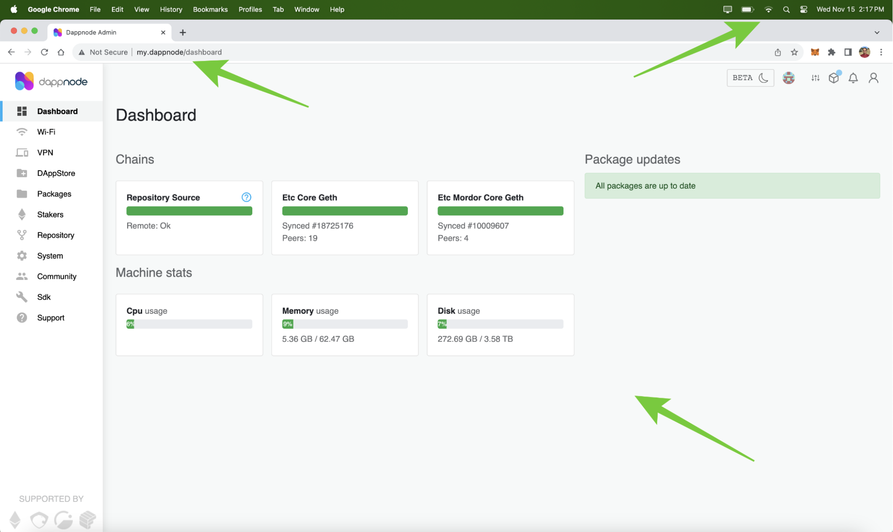
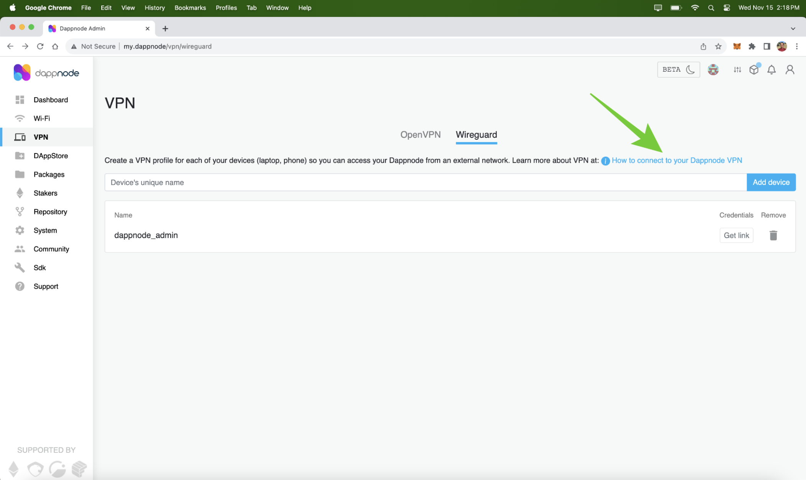
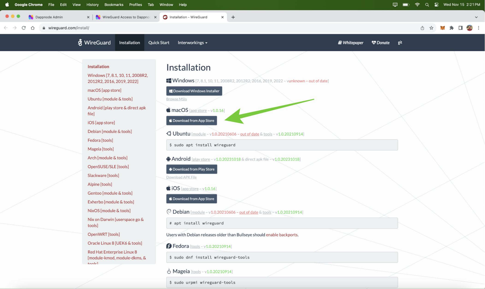
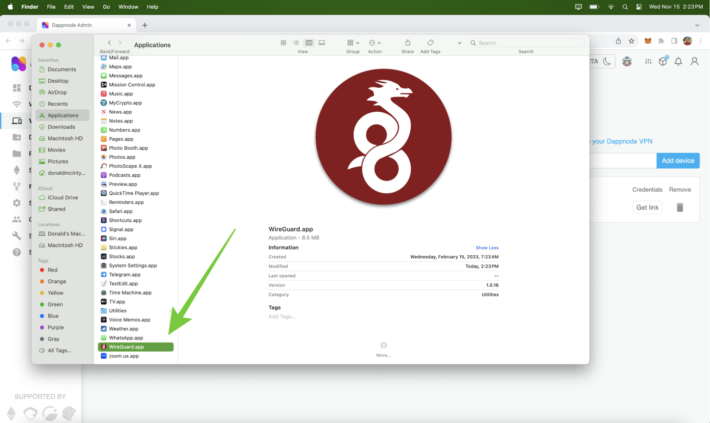
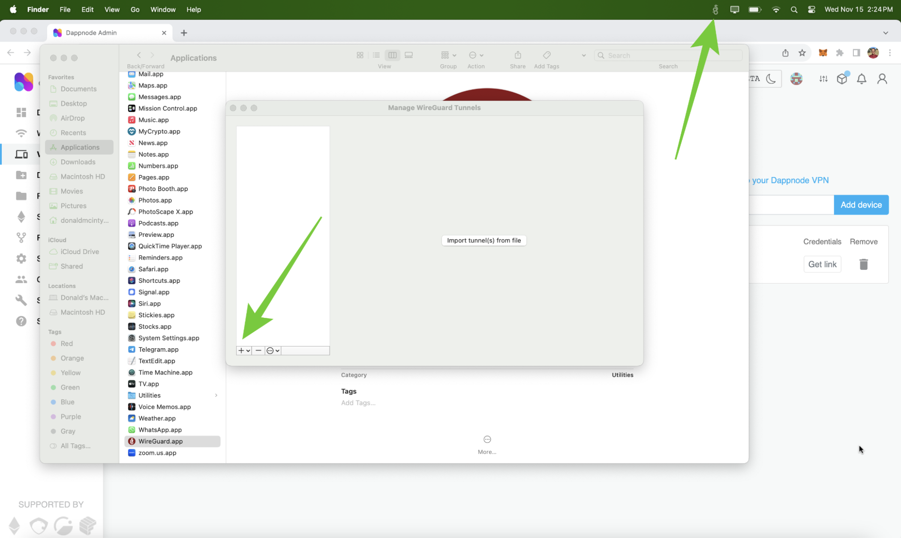
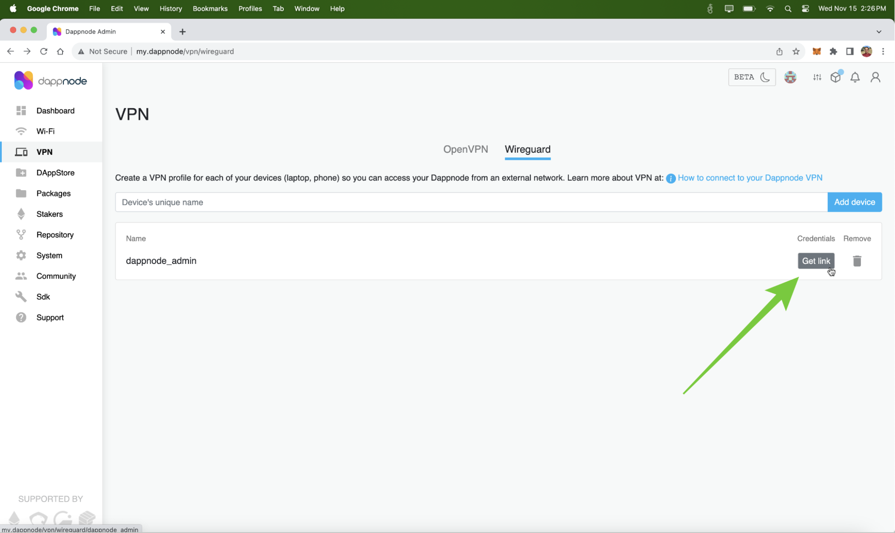
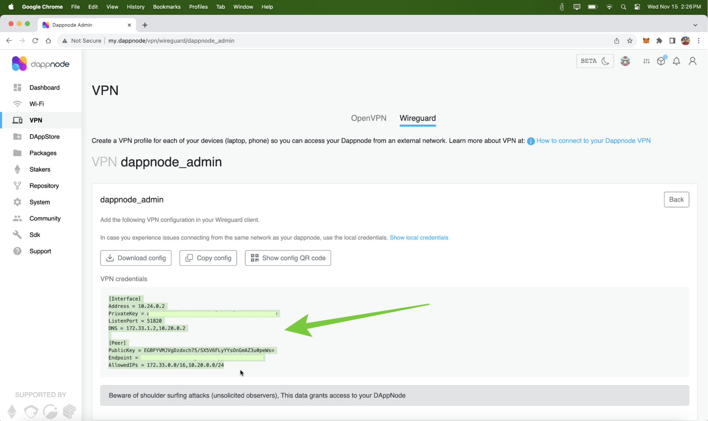
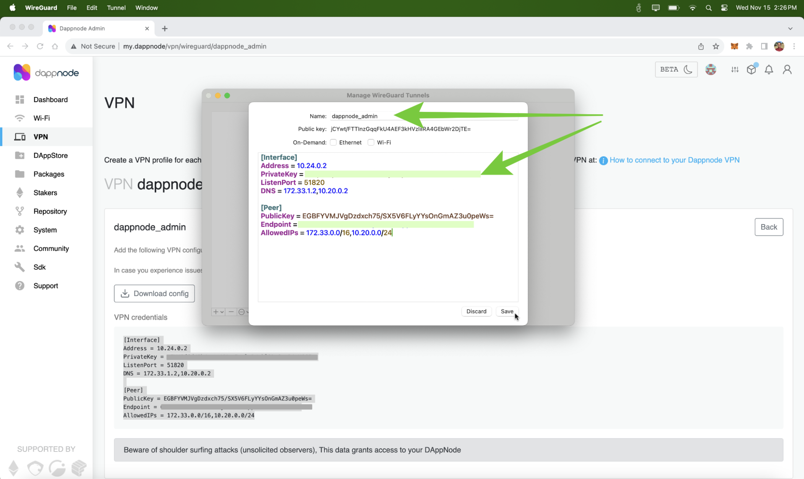

---
**You can listen to or watch this video here:**

[video]

---

The DappNode hardware node is a device that lets users run nodes from their homes or offices. 

The Ethereum Classic (ETC) core developer team maintains ETC client packages in the DappNode DappStore that users may activate to run ETC mainnet and testnet nodes.

One of the features of the DappNode product is that it allows users to access their ETC nodes from remote locations globally using a VPN connection.

In this post we will explain how to connect to your DappNode instance from remote locations using the WireGuard VPN protocol.

If you don’t have a DappNode yet and wish to get one to run ETC nodes, please follow the instructions in the post we wrote about the subject:

How to Run an Ethereum Classic Node Using DappNode

In the following sections we will explain how to connect to your DappNode using the DappNode VPN service.

## 1. Connect to Your DappNode in Your Local WiFi Network

If you already got and set up your DappNode to run your ETC nodes, then access it by connecting to its WiFi network again, and then typing “my.dappnode” on your browser. When the DappNode user interface (UI) opens, you will see the DappNode dashboard with your ETC nodes running.

## 2. Go to the VPM Tab on the Menu and Select the WireGuard Option

To be able to connect to your DappNode remotely, from anywhere in the world using VPN, go to the VPN tab and then select the “WireGuard” option. This is the recommended protocol by DappNode. The DappNode team actually runs VPN servers so their users may connect to their local nodes.

## 3. Go to the WireGuard Connection Documentation

In the WireGuard VPN screen on your DappNode UI, click on the “How to connect to your Dappnode VPN” link. There, you will see all the documentation pertaining to the DappNode WireGuard VPN service.

## 4. Click on the WireGuard Website Link

Once on the documentation, scroll down to section 2 and click on the link to the WireGuard website.

## 5. Click on the WireGuard Client for Your Operating System 

On the WireGuard website, you will see all the client download options for the different operating systems. Click on the one for your operating system to install the WireGuard client on your computer. In our case we used the macOS installation option.

## 6. Download the WireGuard Client

If in your operating system you need to use the App Store, Google Play, or other repository, then install the WireGuard client from there to your computer. In our case we downloaded and installed WireGuard from the Apple App Store.

## 7. Open Your WireGuard Client on Your Computer

Once downloaded and installed, open your WireGuard application on your computer.

## 8. Add a New Tunnel on Your WireGuard Client

Once opened, you will see the WireGuard icon on your desktop screen above or below depending on your operating system. Click on it and select “Manage Tunnels”. Next, you will see the WireGuard box to manage tunnels. Click on the “+” button on the box, or on the option that will let you add a tunnel, but NOT on “Import tunnel(s) from file” button.

## 9. See the WireGuard New Tunnel Form 

In the next step, you will see the new tunnel form. In it, you will enter the WireGuard credentials for your local DappNode and the name of this tunnel, but first we need to get the credentials from our DappNode in the next section.

## 10. Get Your WireGuard Link Credentials From Your DappNode

To get the VPN credentials, go back to your DappNode UI, go again to the VPN tab, to the WireGuard sub-page, and click on the “Get link” button.

## 11. Copy the VPN Credentials of Your DappNode

When the credentials section opens, then copy that text and go back to the WireGuard new channel form.

## 12. Paste the Credentials on WireGuard and Name Your Channel

On the WireGuard form, delete whatever text was there before and paste the new credentials for your DappNode. Also, name this channel in the field above on the form, and them press “Save”. In our case we named our channel “dappnode_admin” and we pasted our credentials, but, for this example, we obfuscated our channel data for security reasons.

## 13. Activate Your Channel

In the next step, your WireGuard client will show your new channel already created. Now, you need to press the “Activate” button to go live with your new VPN connection.

## 14. Connect Remotely to Your DappNode ETC Nodes

Once you activated your new channel on your computer you need to wait a few minutes for the information to propagate to the corresponding servers and clients. Then, you can connect to your DappNode remotely!! As an example, in the image in this section, you will see that the WireGuard client icon is bright white now on our display, and we are connected from a remote location to our local network (my phone’s hotspot). From now on, you may connect to your DappNode from anywhere in the world using any WiFi connection by opening your WireGuard client on your computer and activating your DappNode tunnel!!

---

**Thank you for reading this article!**

To learn more about ETC please go to: https://ethereumclassic.org
