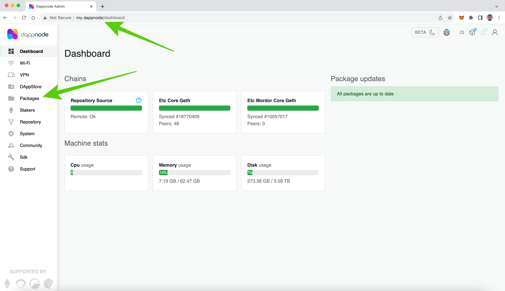
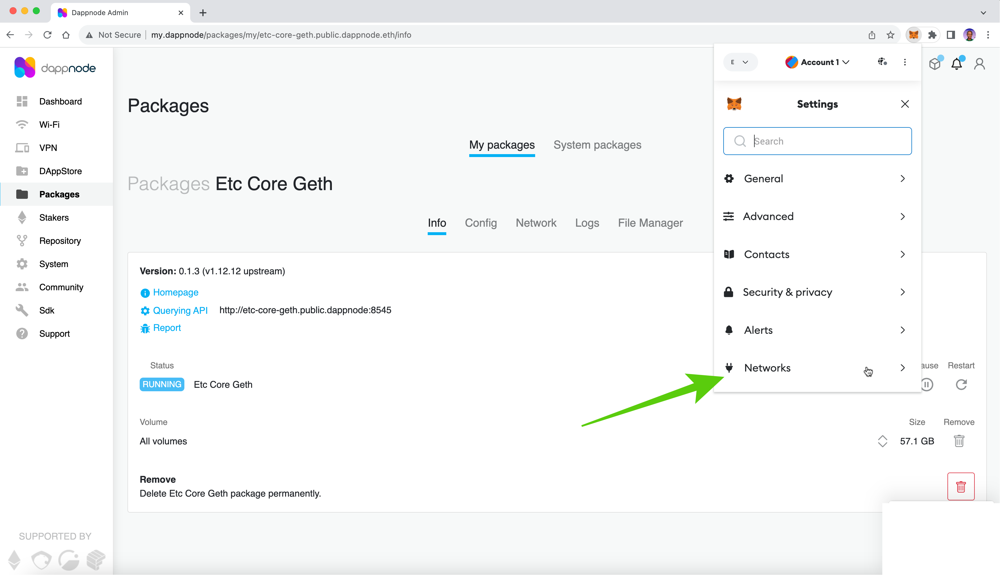
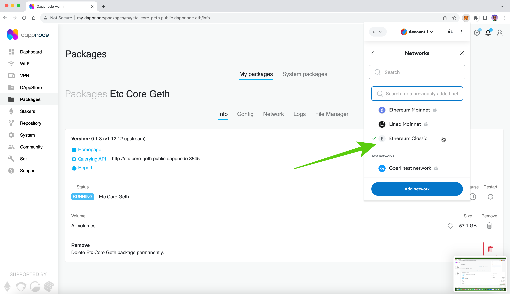
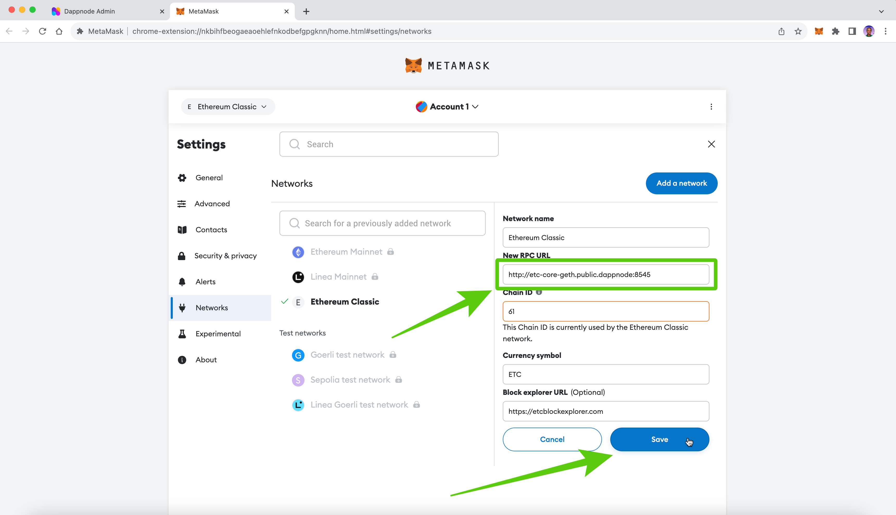

---
**You can listen to or watch this video here:**

<iframe width="560" height="315" src="https://www.youtube.com/embed/4df8281L6F0?si=6yakdKeu3ROAS0Bf" title="YouTube video player" frameborder="0" allow="accelerometer; autoplay; clipboard-write; encrypted-media; gyroscope; picture-in-picture; web-share" allowfullscreen></iframe>

---

A blockchain like Ethereum Classic (ETC) has two kinds of participants: miners and nodes.

Miners produce blocks and are paid a reward in ETC coins on a per block basis for their work.

Nodes receive new transactions from users, provide users with information about their accounts and balances, and verify blocks produced by miners.

Wallets such as MetaMask, Trust Wallet, Emerald, Ledger, and Trezor, need to connect to a node every time you send a transaction to ETC or each time you check your accounts.

However, the security guarantees of the different kinds of connections and setups with nodes are different.

In this post we will explain what are these differences and how to connect your MetaMask wallet to your local ETC node using DappNode. 

## What Is DappNode?

Because running nodes is relatively costly due to the size of the blockchain (an ETC full node size is currently around 57 GB), it is difficult to run them on regular computers, much less on machines that are meant for daily use.

To solve this problem, there are companies that have developed very practical specialized devices that are only dedicated to running blockchain nodes.

DappNode is one such company with its product [DappNode Home](https://dappnode.com/en-us/collections/all) which is a device that connects to the local WiFi network at home or office, and from there users may set up different blockchain nodes, including for the ETC mainnet.

Another service that a DappNode provides is that it can be a local RPC endpoint for your wallets.

## What Is an RPC Endpoint?

Every time wallets, mining pools, solo miners, dapps, developer teams, or other kinds of endpoint users need to send transactions or smart contracts to ETC they need to send them to network nodes that receive the data and then re-transmit them to the rest of the network. 

Nodes are also used to query the blockchain to check accounts and balances.

When a node serves as a window to enter transactions and data to ETC or to provide information about accounts and balances they are called endpoints or RPC endpoints.

“RPC” stands for “Remote Procedure Call” which is usually a protocol that machines use to communicate to operate together.

## What Are RPC Endpoint Providers?

Some people or organizations run their own nodes so they use those, which is the most secure setup as they are located locally, so they are trusted.

However, others prefer to focus on their own business and have third parties provide the service of node operation.

For this, there are [public node services](https://ethereumclassic.org/network/endpoints), which work more or less like cloud services, that run ETC nodes and provide RPC endpoints, which work as URL addresses that accept transactions or queries from the public.

Endpoint users use these services to send their transactions and smart contracts or query the blockchain instead of running their own ETC nodes. This is a less secure setup.

## Wallets Also Provide Endpoint Services

When using wallets such as Trust Wallet, Ledger or Trezor, they have embedded in their software the endpoints that those companies use.

Many wallet providers use public endpoint services such as [Rivet](https://rivet.cloud/) for ETC or [Infura](https://www.infura.io/) for Ethereum.

Other wallets are more open and let users change their endpoints and point their apps to whichever they prefer.

MetaMask is one of this last kind of providers.

## Using Your Own Endpoint Using DappNode

MetaMask users can not only use the RPC endpoints they wish, local or third parties, but they can add and remove blockchain networks from their wallets.

Most MetaMask users that use ETC have added Ethereum Classic as a network to their wallets, something that we explained how to do [here](https://ethereumclassic.org/blog/2022-12-21-using-ethereum-classic-with-metamask).

However, most users have configured their wallets to connect to a public provider called Rivet (mentioned above) as their RPC endpoint.

For more security, users can buy a DappNode, run an ETC node, which we explained how to do [here](https://ethereumclassic.org/blog/2023-04-26-how-run-an-ethereum-classic-node-using-dappnode), and use it as their local and more secure access to the ETC network.

In the following sections we will explain how to connect your MetaMask to your local DappNode as an RPC endpoint.

### 1. Going to Your Local DappNode Interface

Once you have your DappNode set up and running an ETC mainnet node on your local WiFi network, you have to connect to the DappNode user interface by going to the URL “my.dappnode” on your browser. Once there, click on the link “Packages” in the left hand vertical menu.

### 2. Select ETC Core Geth

On the next screen, you will see all the packages and nodes that you are running. On DappNode you may run the ETC mainnet Core Geth node, the ETC tesnet node, and even Bitcoin nodes, or other blockchains. 

To access ETC click on the “ETC Core Geth” package.

### 3. Find and Copy Your Local RPC Endpoint

In the next screen you will see the information for your ETC Core Geth node, including a line with the title ”Querying API”. The URL in that line is the RPC endpoint of your local ETC node running on the DappNode hardware. In our case it is: http://etc-core-geth.public.dappnode:8545.

Copy the RPC endpoint URL.

### 4. Go to Your MetaMask and Open the Main Menu

The next thing you need to do is to paste the RPC endpoint to your MetaMask so it connects to your local DappNode. To do this, open your MetaMask, enter your password, and open the main menu on the top right.

### 5. Go to the Settings Menu

When the menu opens, click on the “Settings” link.

### 6. Go to the Networks Menu

Once on the settings menu, click on the “Networks” link.

### 7. Open the Ethereum Classic Network

In the next screen, you will see all the networks in your MetaMask. One of those networks will be “Ethereum Classic” as you very likely have already configured it before. Click on it. 

### 8. Find and Replace the Current RPC Endpoint URL

In the next screen, you will see the form with all the data corresponding to the ETC network. The second line is the “New RPC URL” field. There, you must have the Rivet or another public endpoint. To use your local DappNode you need to paste your DappNode RPC endpoint URL. In our case we will paste this one: http://etc-core-geth.public.dappnode:8545

### 9. Press Save

Once you pasted your local DappNode RPC endpoint for your local ETC Core Geth node in the “New RPC URL” field, then press “Save”.

Congratulations! Now you can use your MetaMask with your local DappNode ETC node!

---

**Thank you for reading this article!**

To learn more about ETC please go to: https://ethereumclassic.org
