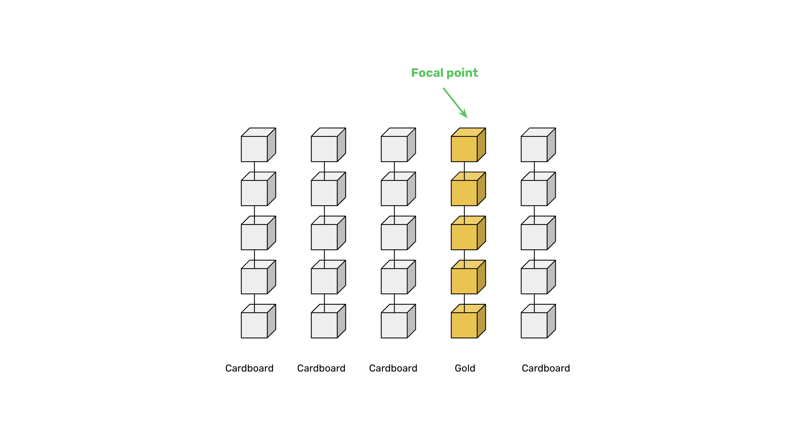

---
**您可以由此收听本期内容:**

<iframe width="560" height="315" src="https://www.youtube.com/embed/y-tA0WKV7PY?si=76iqXIHcxPi44p-A" title="YouTube video player" frameborder="0" allow="accelerometer; autoplay; clipboard-write; encrypted-media; gyroscope; picture-in-picture; web-share" allowfullscreen></iframe>

---

在这门课的第1到第5节中，我们详细解释了工作量证明（POW）的工作原理。

在第6节中，我们解释了以太经典（ETC）相对于比特币（BTC）和以太坊（ETH）的巨大优势。

在第7节中，我们将讨论基于工作量证明的中本聪共识的革命性好处。

我们将解释它如何在系统中实现所有计算机之间的共识，提供所有参与者的焦点，保护交易历史，并创建硬货币。

这些好处的成果是去中心化、无需许可、抗审查和最小信任。

## 1. 工作量证明如何实现共识

工作量证明通过使网络中的所有计算机仅接受完成了所有工作的最新区块，实现了系统中所有计算机之间的共识。

因为任何由冒名顶替者发送的未完成工作的替代区块都将被拒绝，所以所有节点在每一轮中都很容易决定相同的确切区块。

这种方法的类比可以想象成一个人收到许多箱子，但需要决定每一轮哪个箱子最有价值。

在每一轮中，他收到的大多数箱子都是纸板制成的，只有一个是由金子制成的。由于金箱子很容易与纸箱区分开并且最有价值，因此在每一轮中很容易知道哪个是正确的。

## 2. 工作量证明如何提供焦点

工作量证明为世界上的任何计算机提供了一个焦点，以相同的信息进入、退出或重新加入网络；由矿工完成的大量工作；保证了每轮系统中所有计算机之间的完美共识，这是任何新参与者或任何离开并希望重新加入的计算机可以使用的相同信息，只需验证已完成工作即可知道正确的区块链。

任何未完成工作的冒名顶替链都将被拒绝。

例如，如果有人下载并开始运行ETC软件客户端，该节点将开始与区块链中的现有节点通信，并从它们那里接收整个历史的区块。

由于所有区块都包含ETC整个历史上累积的工作，因此几乎不可能让任何恶意行为者欺骗该节点加入替代的邪恶链。

## 3. 工作量证明如何保护交易历史

工作量证明通过需要为包括在区块中的每个交易重新执行相同数量的工作（包括添加的所有区块），保护了所有交易历史。

这阻止了攻击者撤销过去的交易，而且交易变得越老，要撤销就变得越困难。

例如，如果比特币中的每个区块成本为30万美元（包括资本和电费），并且有人想要撤销发生在1000个区块之前的交易，那么它将花费3亿美元的资本和电费来完成这项任务。如果交易距离2,000个区块，那么成本将达到6亿美元，依此类推。

## 4. 工作量证明如何创造数字黄金

工作量证明创造数字黄金，因为创建区块的成本等于创建货币的成本，只有在矿工完成哈希或盖章区块的工作时才向矿工支付奖励。

此外，比特币和ETC等区块链具有固定的货币政策和有限供应。这意味着比特币的历史总供应量为21,000,000枚，ETC为210,700,000枚。

这些加密货币的稀缺性和难以伪造的昂贵性使它们在现实世界中与黄金相似。

## 工作量证明的革命性好处

前面解释的四个好处共同构成了人类所知道的最分散、无需许可、抗审查和最小信任的、因此最安全的网络。

这就是工作量证明的革命之处。

## 工作量证明与基本权利

现在我们知道了POW的工作原理、它的四个革命性的好处以及这些好处的成果——去中心化、无需许可、抗审查和最小信任，我们可以研究这项技术对整个世界的影响。

在我们的下一节，第8节，我们将讨论POW如何在全球范围内促进基本权利。

---

**感谢您阅读本期内容!**

了解更多有关ETC，欢迎访问: https://ethereumclassic.org
