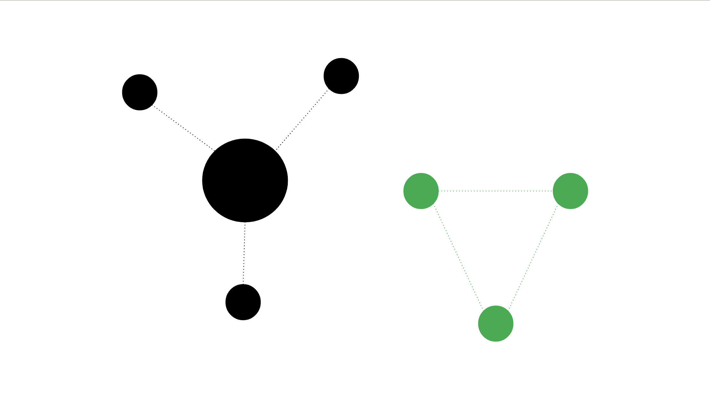

---
**You can listen to or watch this video here:**

<iframe width="560" height="315" src="https://www.youtube.com/embed/s941neFSYN8?si=AbzsckfgktQ6mS5k" title="YouTube video player" frameborder="0" allow="accelerometer; autoplay; clipboard-write; encrypted-media; gyroscope; picture-in-picture; web-share" allowfullscreen></iframe>

---

## All Blockchains When They Start Are Centralized

Every system when it is ideated or first thought is centralized because it is usually one person or a small team who has the idea and puts it into practice.

For example, when Bitcoin was launched in 2009, the only two node operators and miners were Satoshi Nakamoto, the inventor, and Hal Finney, another Cypherpunk who was the only other person running the software.

For at least 2 years Mr. Nakamoto had nearly full control of the software and made changes to it practically unilaterally.

As Ethereum (ETH) and Ethereum Classic (ETC) were one network when it was launched in 2015, both systems were also centralized when they were conceived and first deployed.

## All Blockchains When They Are Small Look Centralized

Not only was Bitcoin centralized at the beginning because the inventor was the main driver of the project, maintainer, and decision maker, but also the network itself was small.

Bitcoin had very few nodes around the world in the early stages and they were usually both verifying nodes and miners. The hashrate of the network was small and the machines creating blocks were mostly home computers and laptops.

In the first year or so, ETH and ETC were also small in terms of node operators and hashrate.

When blockchains are small they look centralized because they have few operators and also, if there are foundations or nonprofits supporting them, they give the that impression because these institutions have the money to hire core developers and pay for basic infrastructure to move the systems forward.

## However, What Is Important Is the Design

Whether Bitcoin, Ethereum, or Ethereum Classic were centralized at the beginning or they looked centralized when they were small is irrelevant.

What is relevant is whether their designs are decentralized when they reach large scales.

As most economic systems and many phenomena in nature respond to power law, therefore [tend to centralization](https://en.wikipedia.org/wiki/Pareto_principle), in computer science operating systems and networks usually tend to centralization.

Nevertheless, the major invention of Bitcoin was a design that actually guaranteed decentralization, thus censorship resistance, permissionlessness, and trust minimization in a peer to peer network.

## Proof of Work Based Nakamoto Consensus Is the Only Decentralized Design

It happens to be that this invention, Proof of Work (POW) Nakamoto Consensus, is the only blockchain design that is decentralized. 

Blockchains such as Bitcoin and ETC use this consensus mechanism and this is why they are orders of magnitude more secure, which means that they depend less on trusted third parties at scale than Proof of Stake (POS) networks such as Ethereum, Cardano, or BNB.

Proof of Work is the only signaling system that enables nodes to independently recognize legitimate blocks and to join the correct chain whenever they wish to disconnect and reconnect or when they want to join for the first time.

All other systems, including Ethereum, need to trust third parties to be able to understand which is the next correct block or the right chain to join.

## Proof of Stake Is Centralized

For these reasons, Proof of Stake lacks the decentralization counter forces that POW has.

Proof of this is that Ethereum has an increasing dependency on trusted third parties, which are the Ethereum Foundation, staking pools, validators, and block builders and the network is currently more than 70% [censored](https://www.coindesk.com/tech/2023/12/06/ethereums-censorship-problem-is-getting-worse/). 

POS has many features that makes it centralized including that it has no objective fork choice method, staking is frictionless thus has strong economies of scale, and most of the network depends on a few participants to decide which is the next correct block and which is the correct chain to follow.

All these features are nearly identical to centralized cloud services.

## Blockchain Mining Is Decentralized at Scale

Some people say that POW suffers of the same centralization biases, but this can’t be further from the truth!

Firstly, Bitcoin has nearly 15 years of operation and has never been centralized. This is enough information for those who follow the pragmatic scientific method of proving things by real life experiments!

Secondly, distribution of electricity generation sources in the world is very dispersed. Therefore, it is not possible for single unified mining operations to have any significant share of the hashrate.

And thirdly, if miners were to misbehave in the network, the rest of node operators would be able to split from them by changing the mining algorithm in the system. In POS this is impossible because the stakers are inside the network, they are not external as miners are in POW.

## Therefore, Ethereum Classic Is Decentralized at Scale

So, some people say that ETC is centralized because it has an institution, the ETC Cooperative, who has capital from a donation from an independent investor, who hires the core developers. Also, because the network has a few hundred economic nodes and hashrate is not yet at the level of Bitcoin.

But these are simplistic and limited analyses. In any case, when ETC captures mindshare, because it is the largest truly decentralized smart contracts blockchain in the world, and people and developers realize that all other systems are centralized and managed by special interests, then Ethereum Classic will rise in price and grow in hashrate, and any impressions of centralization will vanish because its core POW design is decentralized at scale.

---

**Thank you for reading this article!**

To learn more about ETC please go to: https://ethereumclassic.org
