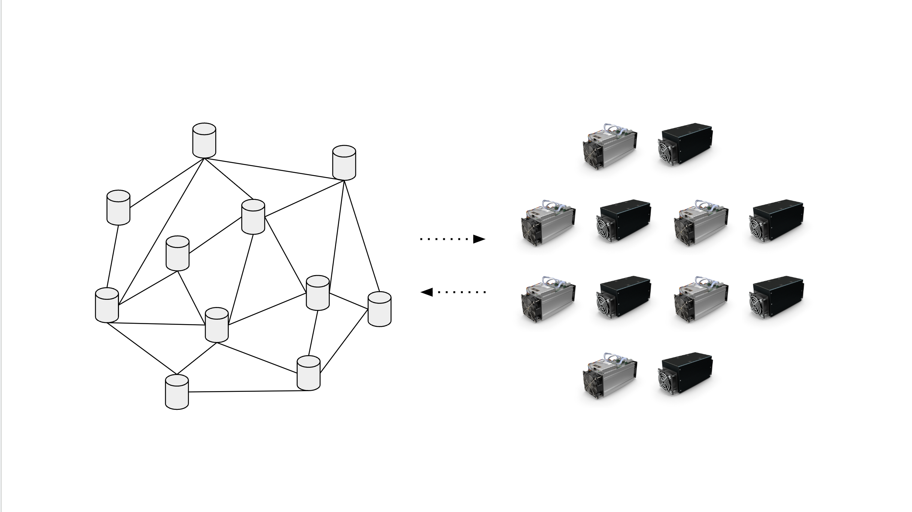

---
**由此收听或观看本期内容:**

<iframe width="560" height="315" src="https://www.youtube.com/embed/c7YjTRkwTqw?si=uXNDD9M_0zfu84BV" title="YouTube video player" frameborder="0" allow="accelerometer; autoplay; clipboard-write; encrypted-media; gyroscope; picture-in-picture; web-share" allowfullscreen></iframe>

---

## 以太经典中节点和矿工的区别

关于以太经典（ETC）的基本结构、节点和矿工的角色，存在很多混淆。人们经常将“节点”称为“矿工”，甚至混用“矿工”和“质押者”与“流动性提供者”和“收益收割者”的术语。

在本文中，我们将通过解释以下主题来澄清一些疑惑：

- ETC的结构
- 什么是节点？
- 什么是矿工？
- 为什么节点和矿工是工作量证明（POW）区块链的完整安全模型
- 定义“挖矿”、“质押”、“LP”和“收益收割者”

## ETC的结构

ETC等区块链实质上是一个全球网络，在网络中的所有参与计算机上复制一个名为区块链的数据库。

这些计算机不断地接收来自用户的新交易。

当任何一台计算机接收到交易时，它立即将其发送到网络中的其他所有计算机，以便所有计算机都能拥有信息的副本。

一些计算机的角色是创建新数据块以添加到数据库中，因此有了“区块链”这个术语。

网络中其余的计算机不断地接收和重新分发新交易，如上所述，并对矿工构建的新区块执行相同的操作。

## 什么是节点？

在以太经典中，不创建区块但不断接收和重新分发新交易，并对矿工构建的新区块执行相同操作的参与计算机被称为“节点”。

节点运行Core Geth ETC软件客户端，遵循所有协议规则。这些计算机重新分发交易和区块，并在本地磁盘驱动器上保留整个区块链或区块链的副本。

节点遍布世界各地，其基本作用是不断验证交易和区块是否正确和真实。

节点的另一个基本作用是在ETC的区块链中创建全球级别的冗余，其中包含所有用户的账户、余额和智能合约，使得几乎不可能关闭或攻击网络，因为它在如此多的地方复制。

## 什么是矿工？

在ETC中，负责创建新交易区块以添加到数据库中的计算机被称为“矿工”。

矿工得名于他们使用大量计算能力，耗费大量电力，为ETC构建数据块，并因此获得ETC作为报酬。

由于这项工作非常密集，而且他们得到的是ETC硬币作为报酬，他们在现实世界中类似于黄金矿工，而硬币则类似于黄金，因此ETC通常被称为“数字黄金”。

矿工的基本作用是通过使用大量工作构建区块来保护网络，从而为攻击者提供了一个攻击的障碍；在网络中的所有计算机之间实现共识，知道每一轮中哪个是正确的区块；并使ETC成为硬币，因为创建硬币的成本等于创建区块的成本。

## 为什么节点和矿工构成完整的安全模型

在以太经典中，节点和矿工的基本作用之间的有趣之处在于，它们共同补充彼此，并实现了一个极其安全且完整的安全模型。

随着节点接收新交易，它们在整个全球网络中复制这些交易。当矿工接收这些交易时，他们将其分组并进行大量工作构建区块。当这些区块创建时，它们立即发送到节点进行验证，以确保矿工在工作中是诚实的，交易是正确的。当所有这些步骤都完成时，区块将包含在数据库中作为链中的最新区块，并向矿工支付ETC硬币。

所有这些流程的结合创造了世界上最安全的操作和存储环境，ETC加密货币及其应用程序在其中托管。

## 定义“挖矿”、“质押”、“LP”和“收益收割者”

现在我们知道在ETC中节点和矿工是什么，我们可以澄清混淆。

要理解的第一件事是，在基本的ETC区块链中，节点和矿工是唯一的参与计算机类型。没有其他类型。

第二点要理解的是，部署在ETC中并为用户提供服务的去中心化应用程序（dapps）不是节点、矿工，也不是区块链网络的一部分。它们实际上是托管在以太经典中的软件应用程序，但并不是其一部分。

当去中心化交易所等dapps使用流动性提供者并支付给他们费用时，这不是挖矿也不是质押。这只是提供流动性并获得回报。

当用户将他们的ETC存入不断寻找各种DeFi应用程序中的最佳收益或费用的dapps时，这不是挖矿也不是质押。这是通过根据它们提供的回报移动资金的收益收割。

当硬件节点产品创建代币以支付运行节点的人时，这不是挖矿。这只是为服务发行一个任意的代币。

最后，在以太经典中没有“质押”这种说法。ETC是一个工作量证明区块链，因此只有挖矿和矿工。

“质押”是一种低安全性的方法，用于在诸如以太坊等权益证明网络中实现共识，其中参与者将资金存入特殊账户，因此“质押”，以获得创建区块和为该功能赚取硬币的权利。

---

**感谢阅读本文！**

要了解有关ETC的更多信息，请访问：https://ethereumclassic.org
