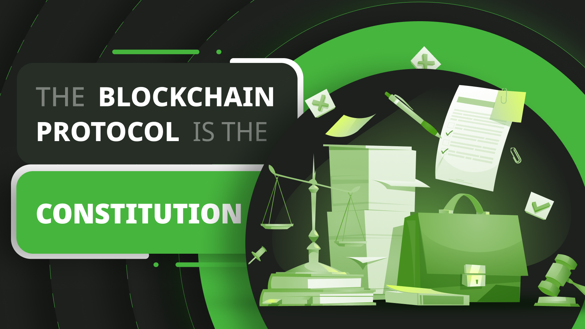

---
**您可以由此收听或观看本期内容:**

<iframe width="560" height="315" src="https://www.youtube.com/embed/Y6qcNnmB5TI?si=Sq4m8kDko_5fQG3m" title="YouTube video player" frameborder="0" allow="accelerometer; autoplay; clipboard-write; encrypted-media; gyroscope; picture-in-picture; web-share" allowfullscreen></iframe>

---

## 我与尼克·萨博的轶事

在2016年，当区块链先驱尼克·萨博和我共同参与一些项目时，我向他建议，或许组织比特币社区的最佳方式是创建一部宪法，因为宪法在国家中运作良好，因此在比特币中也应该能够发挥作用。

他的回应是短而有力的谴责！

从那时起，我意识到与传统系统、我们对有组织社会的概念，或者群体关系和决策过程有关的任何事物，都与区块链上它们应该运作的方式完全相反。

经过这些年在这个行业的经验，深思熟虑，并观察产业参与者及其偏见的自然行为，我将在本文中阐述我对区块链系统治理的看法。

## 创建治理系统的偏见

因为在现代社会中，我们习惯于生活在城市、区域、州、省和国家中，所以我们形成了这样一种观念，即这些组织模型必须是好的，因为我们可以在我们自己的社会中看到它们的成果。

美国宪法的模型及其在世界范围内的传播，推动“共和国”和“民主”的好处在许多地方得到了体现，这影响了加密社区对于为区块链创建宪法，后来称为治理系统的思考。

许多这样的系统已经在实施中，特别是在权益证明或权威证明网络中，社会层面确实对系统有着完全的控制权。

然而，这种偏见也没有逃脱工作量证明区块链的参与者。

## 治理将权力转交回人民手中

问题在于，对于区块链而言，为其创建宪法或治理系统实际上是将权力再次转交给了人民。

事实上，区块链的整个目的是从人们身上拿走权力。区块链是专门设计的系统，旨在减少对可信第三方的依赖。

可信的第三方是安全漏洞，因为它们管理着我们的财富和信息，但它们经常犯错，陷入不良或不负责任的行为，并且很多时候滥用他们的信任地位。

区块链社区和生态系统可能被视为可信的第三方，如果形成正式治理，它们将变得特别危险。

## 范式完全相反：非治理

这就是为什么区块链的中心焦点，特别是工作量证明网络，一直是所谓的“最小化信任”，即尽量减少对这些可信第三方的依赖。

确实，像以太坊经典（ETC）这样的工作量证明区块链的模型完全相反于治理或宪法，正如尼克·萨博本人所创造的术语“非治理”所描述的！

非治理意味着最接近区块链系统的社区对于如何做出决策没有明确的规则。他们只是根据他们认为对他们和整个系统更好的观念来做出决策。

## 在社会中冲突是不好的，在区块链中冲突是好的

的确，在社会中，发展治理系统是绝对自然和必要的，因为另一种选择就是身体暴力，而身体暴力对所有参与者都是非常昂贵和有害的。

然而，对于工作量证明区块链系统而言，这些技术实际上从方程中消除了身体暴力，因为所有参与者以分散的方式全球分布，他们只是根据一组规则（称为协议）进行协作，这些规则由数学和电力的形式进行保护和执行。

尽管如此，在区块链中缺乏治理确实会在系统的方向和未来变化方面产生很多社会摩擦（因此有创建治理结构的偏见）。

但是，由于它们是分散的，并且变革和创新可能带来中心化的风险，所以它们在社会层面遇到冲突实际上是好事，因为这减少了这些风险。

## 区块链不是关于创新或变革

在没有治理或由非治理主导的区块链中，社区冲突的后果是决策变得非常繁琐和缓慢。

然而，正如上文所述，对于那些宣称要保持稳定和安全的区块链而言，这是好事。计算机系统越复杂，攻击面就越大。

同样，引入更多变化和新规则，就会产生更多争论的机会，而更多争论的机会意味着更大的可能性会将不良规则整合到系统中。

区块链的目标是稳定和安全，而不是创新和变革。这对于大多数区块链参与者来说一直是一个难以理解的问题。

## 区块链关乎稳定

稳定并不意味着为了不改变而简单变慢。区块链是保存全球人民账户、余额和智能合约的账本。

这些组成部分对于这些用户意义重大，在许多情况下，它们是他们可以依赖的最基本的权利。这可能仅仅是保护他们储蓄价值、保护和保留他们的财产，甚至保护他们的生命和谋生手段。

因此，稳定和安全意味着确保他们的资产和应用程序能够可靠和一致地存在。这就是为什么 ETC 作为区块链的核心原则是去中心化、不可变性、抗审查性和无许可性。

## 区块链协议即宪法

因为区块链协议，或者说保持其分散运作的一组规则，是稳定而安全的，因此它为全球范围内的用户、运营商和矿工提供了最大的价值。

因为用户、运营商和矿工希望保持这种稳定和安全，所以协议的规则就隐含地成为管理所有参与者行为的规则。

在博弈论和经济学中，他们称这些东西为“激励”。

当一套规则产生能够在长期内维持系统并提供价值的激励时，那么这套规则变得更加确定和有韧性，因为参与者的激励是为了保护和遵循它，实际上成为了他们在特定系统中的“宪法”。

---

**感谢阅读本文！**

要了解更多关于 ETC 的信息，请访问：[https://ethereumclassic.org](https://ethereumclassic.org)
