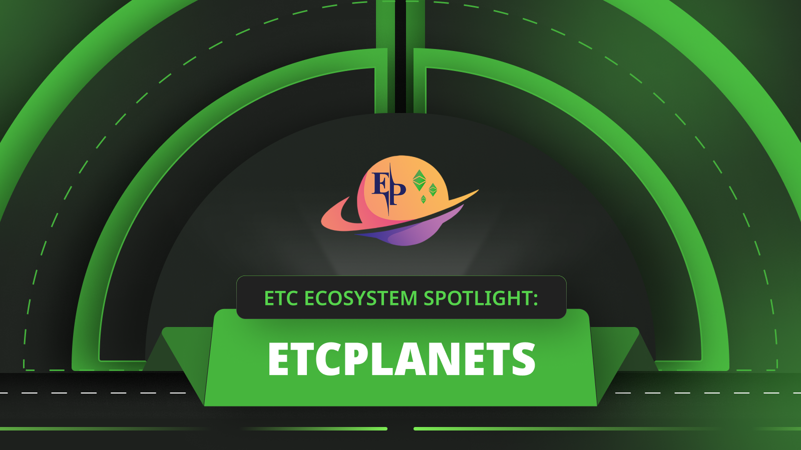
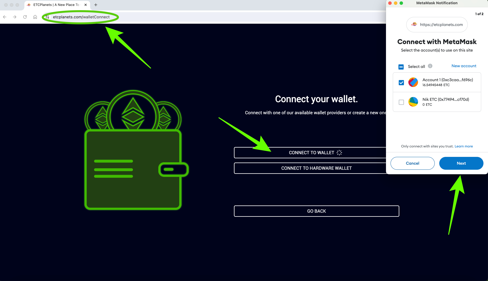

---
**You can listen to or watch this video here:**

<iframe width="560" height="315" src="https://www.youtube.com/embed/onfa9_z2G00?si=4k-jJRNKQDyaN8Wi" title="YouTube video player" frameborder="0" allow="accelerometer; autoplay; clipboard-write; encrypted-media; gyroscope; picture-in-picture; web-share" allowfullscreen></iframe>

---

## What Is ETCPlanets?

ETCPlanets is a decentralized application or dapp on Ethereum Classic (ETC ) created by the [DiakoLabs](https://diakolabs.org/) team.

It is an NFT marketplace that aggregates the most popular NFT collections in ETC.

An NFT collection is usually a series of NFTs created by the same team or artist to sell as digital collectables on ETC, and then they can be traded as individual units in the secondary market.

ETCPlanets is a professionally designed and built marketplace that serves as the secondary market for many of these NFTs.

## What Is an NFT Marketplace?

An NFT marketplace basically aggregates the collections of many NFT creators in one website and offers a more streamlined and efficient user experience both for collectors (the demand side) and creators (the supply side).

Each NFT is listed individually in the exchange and may be traded among collectors.

The marketplace offers not only aggregation, but also price discovery transparency, transaction efficiency, and convenient settlement of NFT trades.

An NFT platform such as ETCPlanets may even be the basic infrastructure that may enable many categories of NFT trading aside from the original collectable market.

These platforms may aggregate real estate, motor vehicle, and other external asset trading as these become represented as NFTs on blockchains such as ETC.

## What Are the Features for Collectors?

The term “collectors” is normally used to describe buyers and traders of NFTs who invest and maintain portfolios of NFTs.

Collectors may have a profile on ETCPlanets with all their NFTs listed on their page and they may categorize and divide them by collections.

Collectors can also track their portfolio activity by assets, collections, the bids that they have placed in the market, and by sold items.

The trading area of ETCPlanets lets collectors place their bids and offers for NFTs.

When the NFT market evolves further, the public will be able to buy and sell apartments, homes, cars, boats, and other external assets through these markets.

## What Are ERC-721 Smart Contracts?

NFTs stands for “non-fungible tokens” and they are smart contracts on programmable blockchains such as ETC. 

The smart contract standard used is called the [ERC-721](https://ethereumclassic.org/blog/2023-09-21-ethereum-classic-course-35-non-fungible-tokens-nfts). Instead of being [ERC-20](https://ethereumclassic.org/blog/2023-06-08-ethereum-classic-course-25-what-are-erc-20-tokens) standard fungible units, they are non-fungible or unique objects on a blockchain.

NFTs may be associated with physical or digital objects, such as cars, real estate, digital images, or online files, through metadata.

The important features of this kind of non-fungible objects are that they are transferable, they can be bought and sold, and the blockchain serves as the property registry.

## What Are ERC-1155 Smart Contracts?

ERC-1155 smart contracts is a standard that combines the ERC-20 smart contract for fungible tokens with the ERC-721 smart contract for non-fungible tokens.

By doing this, creators can offer both fungible and non-fungible tokens inside their dapps in the same smart contract.

Additionally, they can offer multiple kinds of ERC-20 style tokens and ERC-721 style tokens within the same dapp, so this enables them to have much more versatility and saves users a lot of money in gas fees. 

The ERC-1155 standard is optimal for the gaming industry, for example.

ETCPlanets supports both ERC-721 and ERC-1155 tokens for trading on the platform.

## What Is the NFT History Feature?

One cool feature that ETCPlanets has is that as they aggregate collections on their NFT trading dapp, they also aggregate the history information of each asset listed on the platform.

For example, for one NFT they may show its price history, the history of sales, offers and transfers, the users who did the transactions, and the transaction dates.

This information is open to the public.

## What Is the “Create Collection” Feature for?

If you are an NFT creator and want to list your NFTs deployed on the ETC blockchain on ETCPlanets, then you would use the “[Create Collection](https://etcplanets.com/collection/create)” function.

When you click on it, you will see a form to fill out all the data of your collection or assets you wish to list.

Once your collection is created, then it will show as one of the collections available for trading on the ETCPlanets platform.

In the future, real estate developers and car companies will do the same but with homes, apartments, cars, and trucks.

The NFT standard may also be used for renting and leasing these kinds of assets.

## How Can ETC Users Start Using ETCPLanets?

To start using ETCPlanets, you only need an ETC wallet.

First, you need to go to: 

https://etcplanets.com/walletConnect 

And then, you connect your wallet as shown on the image above.

Once you have your wallet associated with the dapp, you can start using all their features as a creator or collector.

---

**Thank you for reading this article!**

To learn more about ETC please go to: https://ethereumclassic.org
