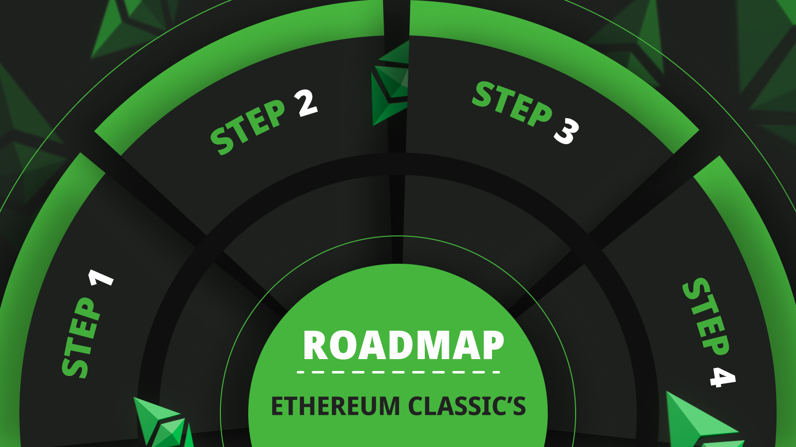

---
**You can listen to or watch this video here:**

<iframe width="560" height="315" src="https://www.youtube.com/embed/zuJGfrp7kGw?si=pQhwEj-GDJkuVwOh" title="YouTube video player" frameborder="0" allow="accelerometer; autoplay; clipboard-write; encrypted-media; gyroscope; picture-in-picture; web-share" allowfullscreen></iframe>

---

On April 8 2023, Istora, an important Ethereum Classic (ETC) contributor, published his [article](https://ethereumclassic.org/blog/2023-04-08-roadmaps-and-pathways) “Roadmaps and Pathways” in which he explains the nature of ETC, that it is decentralized, and because of this decentralization it is only natural that it doesn’t have a formal roadmap.

There is a misconception in the blockchain industry that blockchain projects must have clear, well polished, marketed, and professionally established roadmaps. However, this couldn’t be further from the truth.

Istora very well explains the reasons for this and offers a proposal of things to work on that he would consider important for the ETC ecosystem to tackle in the near future.

In this post I will express my agreement with Istora, add my opinion, and propose a list of the projects I would do first for ETC.

## Decentralized Projects Can’t Have Roadmaps

The idea that projects need roadmaps to be worthy is wrong and is pushed by shallow thinking traders and scammers who promote centralized ICO and VC funded projects under the guise of being decentralized.

Indeed, the fact that they have professional and carefully communicated roadmaps is a revelation of their deception. Decentralized projects can’t have roadmaps because there is no authority to establish and determine what is the roadmap!

Istora said it best:

*“Instead, ETC has a ‘Decentralized Roadmap’, which is continuously open to debate, question, and inevitably changing over time. By rejecting the idea of having a conventional roadmap, the project simply embraces the truth that having a fixed plan is incompatible with this decentralized context.”*

## What Is Rough Consensus?

Truly decentralized projects do not have roadmaps because it is impossible to agree on anything. Changes are decided by what is called ”[rough consensus](https://en.wikipedia.org/wiki/Rough_consensus)”.

Rough consensus in decentralized blockchains means that each node operator, miner, developer, and user will do and follow whatever they want, and when anyone has a good idea, the great majority will embrace it. When the majority embraces an idea, then it usually gets implemented in the system at large. It’s that simple.

In this paradigm, necessarily the flow of new ideas is unstructured and chaotic.

This brings me to another related topic, the topic of “toxicity”: In chaotic, decentralized systems with no central authority to impose order, there will always be disagreements, and the only way to impose one’s will is by toxicity. This is a hallmark of decentralization.

## What Is the ECIP Process?

It is important to note that ETC will [always be](https://ethereumclassic.org/blog/2023-04-04-ethereum-classic-will-always-be-state-of-the-art-technology) state of the art technology. This is precisely the product of a decentralized roadmap, or better said, no roadmap.

Ethereum Classic is part of the EVM standard where there are many blockchains with scientists and developers constantly solving problems and proposing new ideas. 

ETC will always adopt the new changes that: 

a) puts it in parity with the EVM standard, and 

b) are best for ETC’s [decentralist](https://ethereumclassic.org/why-classic/decentralism) philosophy.

The ECIP process (the Ethereum Classic Improvement Proposal process) is the method that is used for all ETC ecosystem participants to propose new ideas and changes. 

Through this process, that has its [own website](https://ecips.ethereumclassic.org/), all new ideas are debated and decided upon.

By observing the ECIP list of proposals is the way of having a view of ETC’s decentralized “pathway”, as Istora well described.

## Advantages of Not Having A Roadmap

Traditional roadmaps are the product of a few limited human minds who get together and try to guess what the world needs.

Decentralized pathways for technologies as ETC have the input of the world and only the best ideas prevail.

Istora summarized it like this: Decentralized pathways have:

- greater flexibility and adaptability,
- community-driven decision-making,
- reduced risk of centralization and resilience to social attacks, and
- learning from other projects' experiences.

## There Are no Disadvantages for Not Having a Roadmap

However, Istora listed some perceived disadvantages to having no formal roadmap. He is right that these are “perceived” because they are not real. Only persons with centralist worldviews have these perceptions.

I personally think there are no disadvantages of decentralized pathways for highly secure blockchains such as ETC, or even Bitcoin for that matter.

Where some see uncertainty, there is actual certainty. Formal roadmaps by committee and developer teams actually represent trusted third party risk, the risk truly secure blockchains precisely aim to get rid of!

“Slow” or “no innovation” is also a falsehood pushed by scammers who promote their projects as “good” because they change a lot. But, the informed observer will see that fast innovation is yet another marker of centralization.

## Proposed Roadmap for 2024

With regard to what I would propose for ETC, here are the following ideas for 2024:

**1. Cancel MESS:** I am happy to report that this [has been done](https://github.com/orgs/ethereumclassic/discussions/522) with the ETC node software of the Spiral hard fork!

**2. Move Core Geth to the Ethereum Classic community repo:** This would restore sovereignty of the community on the node client software.

**3. Solve backward compatibility with the account and EVM [versioning](https://etherplan.com/2019/10/26/backward-compatibility-what-is-account-versioning-in-ethereum-classic/9440/) system:** This would solve the risk of smart contracts breaking each time there is a hard fork.

**4. Develop a tool to easily audit the real supply of ETC:** This would bring certainty to the correct supply number of ETC.

**5. Set the block size to 8 million gas:** This would take away from miners the ability to change the block size, as [happened](https://ethereumclassic.org/blog/2023-12-20-how-do-miners-change-the-gas-limit-in-ethereum-classic) recently.

---

**Thank you for reading this article!**

To learn more about ETC please go to: https://ethereumclassic.org
