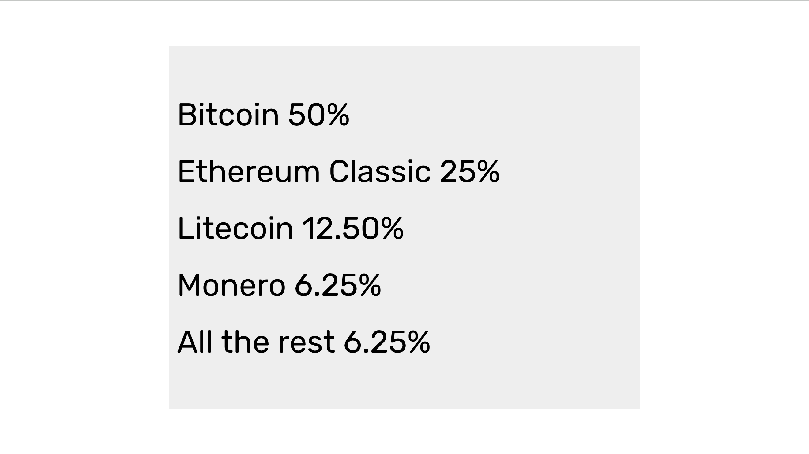

---
**由此收听或观看本期内容:**

<iframe width="560" height="315" src="https://www.youtube.com/embed/-D20HZhwmFc?si=yFYFrweD-DD26QnJ" title="YouTube video player" frameborder="0" allow="accelerometer; autoplay; clipboard-write; encrypted-media; gyroscope; picture-in-picture; web-share" allowfullscreen></iframe>

---

在上一堂第12课中，我们解释了在2020年以太坊（ETH）区块链作为工作量证明（POW）网络发生的一件有趣的事情，即在比特币（BTC）之前，它证明了POW费用模型将奏效的观点！

支持这一观点的论点不仅是在ETH和BTC中多次超过区块奖励的费用，而且由于网络效应和对安全性的追求，用户将愿意支付高昂的费用来使用这些有价值的网络。

同样，在这第13课中，我们将看到网络效应和安全性将决定行业领先的POW区块链的数量和市场份额。

## 区块链就像操作系统

由于区块链就像操作系统，它们可能会表现和定位为操作系统。

操作系统是与其安装的硬件部分相关联的软件代码，用于这些设备中使用的应用程序。

因此，它们代表了开发多个应用程序和提供商可以依赖以构建其应用程序的标准，使它们与彼此兼容并对所有用户熟悉。

同样，区块链，特别是可编程的区块链，是表示开发人员必须如何使用其dapp与彼此互动以及用户找到熟悉和有用的标准的软件系统。

鉴于它们作为全球点对点网络上的操作系统的地位，区块链可能会以这种方式发展。

## 网络效应和安全性将决定它们的市场份额

新的竞争对手可能拥有什么样的功能并不重要，大型区块链参与者将通过它们的网络效应淹没其他竞争者。对于用户而言，在这些平台上找到其他用户比拥有更好的功能甚至更好的用户体验更为重要。

在安全性方面，网络效应和规模会在这些系统中产生更多的安全性。

在区块链行业，安全性意味着对信任第三方的依赖较少，这意味着全球无法审查和无需许可。

因此，用户将权衡法币和股权证明（POS）系统的便宜和低安全性，以换取POW区块链的受欢迎程度和安全性。

## 全球操作系统市场有3或4个大玩家

鉴于全球所有设备上的操作系统市场有3或4个非常大的玩家（Linux是小型企业服务器领域的赢家），我们可以推断，行业的POW区块链部分也将有3或4个大玩家。其他可能会无关紧要。

## 这个趋势在区块链行业中已经可以观察到

总体而言，本文提到的趋势在区块链行业中已经可以观察到。比特币在整个市场中一直保持着约50%的份额。作为第二大链的以太坊一直保持着约25%的份额，从那以后，其他链往往要小得多，或者无关紧要。

## 因此，很可能会有3或4个大型POW区块链

鉴于区块链可能会像操作系统一样行事，它们通常有3或4个大玩家，并且这些趋势已经在市场上可以观察到，我们可以推断，行业的POW区块链部分也将有3或4个大玩家，而其他则可能无关紧要。

与这种观点一致，我们估计比特币将继续在POW部分占据50%的市场份额，然后作为可编程数字黄金系统的以太坊经典将可能占据约25%的份额，然后另一个系统，可能是莱特币，将占据约12.5%的份额，然后也许是门罗，因为它的隐私定位，将占据约6.25%的份额，其他将会跟随，但规模较小。

在接下来的两堂课中，我们将使用全球法定货币进行相同的类比，并解释在区块链行业的各个层面上这些事物将如何发展。

---

**感谢您阅读本文！**

要了解有关ETC的更多信息，请访问：https://ethereumclassic.org
