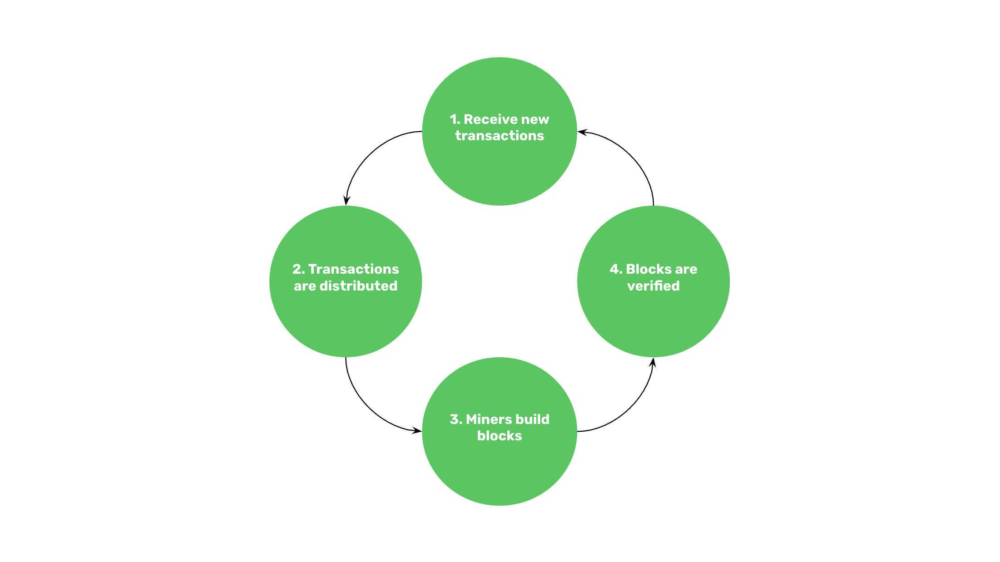

---
**由此收听或观看本期内容:**

<iframe width="560" height="315" src="https://www.youtube.com/embed/WO_SVeDUnN4" title="YouTube video player" frameborder="0" allow="accelerometer; autoplay; clipboard-write; encrypted-media; gyroscope; picture-in-picture; web-share" allowfullscreen></iframe>

---

## “工作量证明”还是“中本聪共识”？

在本期内容中，我们最强调的一点是以太经典（ETC）[是一个工作量证明](https://ethereumclassic.org/blog/2023-10-17-ethereum-classic-is-a-proof-of-work-cryptocurrency-blockchain)（POW）区块链。这是因为POW是迄今为止人类所知最安全的计算机网络共识机制，因此值得提及ETC拥有这一特性！

事实上，比特币（BTC）是全球最大、最安全的区块链，也是一个POW区块链。POW及其对共识的影响是比特币的[主要发明](https://ethereumclassic.org/blog/2023-11-16-etc-proof-of-work-course-2-what-didnt-exist-was-a-secure-consensus-mechanism)。

以太坊（ETH）曾经是一个POW区块链，但现在它颇有争议地迁移到了权益证明（POS），这给该生态系统带来了[许多问题](https://ethereumclassic.org/blog/2023-02-22-ethereum-classic-is-censorship-resistant-ethereum-is-not)。

然而，ETC和BTC实际上并不是真正的“工作量证明”区块链！这是该系统的错误名称。

术语“工作量证明”实际上是指一种利用加密函数创建证明计算机完成了一定工作量的技术。

进行工作的计算机是“证明者”，验证证明的计算机是“验证者”，这是后面将要解释的工作量证明区块链中的两个重要概念。

ETC和BTC使用的共识机制在简化时通常被称为“工作量证明”，但该系统的真正名称是“中本聪共识”。

## 工作量证明只是其中的一步

工作量证明如何最终进入比特币，然后进入以太经典的历史始于Adam Back创建了一种名为[HashCash](http://www.hashcash.org/)的技术，用于防止服务器之间的电子邮件垃圾邮件。

当Nick Szabo看到HashCash的机制时，他立即意识到工作量证明和计算机必须完成的计算工作类似于黄金，因此诞生了[Bit Gold](https://nakamotoinstitute.org/bit-gold/)。

在现实世界中，黄金单位就像黄金矿工完成了大量工作的证明一样，这是在工作量证明区块链中使用术语“挖矿”的原因。

然而，POW并不是共识机制本身，正如我们在前面解释过的，它只是中本聪共识中的一个步骤，尽管是最关键的一个步骤。

## 中本聪共识的四个步骤

中本聪共识包含四个步骤，使点对点网络中的计算机能够以分散的方式就它们管理的信息达成共识。

这些步骤如下：

**1. 网络中的节点接收新交易：** 任何人想要向ETC或BTC发送交易都需要通过网络的一个节点进行。ETC和BTC节点不断地接收新交易。

**2. 网络中的节点分发交易：** 当ETC和BTC的节点收到新交易时，它们会立即将这些交易通过互联网转发给系统中的其他计算机。因此，交易在区块链的所有计算机中得到全面复制。

**3. 矿工构建区块：** ETC和BTC中的一组计算机被称为“矿工”。这些计算机将新交易分组，然后进行工作量证明，用密码学证明对其进行盖章。当交易分组被盖章时，它们被称为“区块”。这些印章的创建非常昂贵，是在POW区块链中使用大量计算能力和电力的原因。

**4. 区块由其他节点验证：** 当矿工创建新的交易区块时，它们是前面提到的“证明者”，因为它们需要将区块发送到网络的其他部分，以便其他计算机可以验证它们是否完成了工作！这就是其他节点被称为“验证者”的原因。当它们验证区块时，它们将其添加到数据库，也称为“区块链”，并用ETC或BTC支付矿工的区块奖励。

## 为什么中本聪共识安全而完整？

使用工作量证明作为中本聪共识机制核心的令人惊奇之处在于，密码学证明本身就是所有计算机需要知道每个新区块是否正确的信息。

安全的假设是，总会有攻击者试图破坏任何有价值的区块链，或者说任何点对点网络。然而，当ETC和BTC的节点从矿工那里接收新区块时，它们知道这些是正确的区块，原因就在于矿工为构建它们投入了如此多的工作和电力。POW就像对不诚实参与者破坏网络设置的一道障碍，因为他们必须进行更多的工作才能发送欺诈性的区块。

这个特性使中本聪共识既安全又完整，因为POW不仅作为共识信息，而且以完全分散的方式执行。

实际上，节点可以随时加入和离开网络，无需与任何人协商，只需检查区块的POW。在发生分裂的情况下，节点也可以通过检查上面完成了更多工作的链来知道哪个是正确的链。

所有这些功能结合在一起，创造了一个无法被审查和无需许可的系统，因为没有管理者、管理员、公司、总统或国王在指导其他人该做什么。每个人都可以随意加入和离开，没有任何控制的可能性！

最后，POW还有价值，因为它作为数字黄金的原始用例也是真实的。由于矿工构建这些证明非常困难，它们被认为是稀缺且有价值的，就像现实世界中的黄金一样。

## 中本聪共识在ETC中是如何工作的？

ETC的中本聪共识设计与比特币的设计几乎相同，但有一些区别。

第一个区别是，ETC使用的不是比特币的[SHA-256](https://en.bitcoin.it/wiki/SHA-256)加密函数，而是一种特定于ETC的函数，称为[ETCHash](https://ecips.ethereumclassic.org/ECIPs/ecip-1099)。

这种区别很关键，因为ETC现在是其哈希函数中最大的区块链，这意味着它很难受到攻击，因为攻击者需要从头开始构建计算基础，而不是轻松地从其他链借用它。

第二个区别是，由于比特币只接收用于将BTC从一个地址移动到另一个地址的交易，而ETC是可编程的，因此其交易更加复杂。

ETC接收用于将ETC从一个地址移动到另一个地址以及更改智能合约状态（也称为dapp，即去中心化应用）的交易，这些应用位于其高度安全的环境中。

ETC之所以能够做到这一点，是因为它具有可组合性，这对于执行复杂的多应用程序交易是非常有价值的，使ETC更加安全、便捷和经济。

事实上，作为全球最大的工作量证明智能合约区块链，以太经典是地球上应用程序最安全的系统。

在地球上，无论是私有的、公共的还是军事的系统，都没有比以太经典更安全的系统。

---

**感谢阅读本文！**

要了解有关ETC的更多信息，请访问：https://ethereumclassic.org
