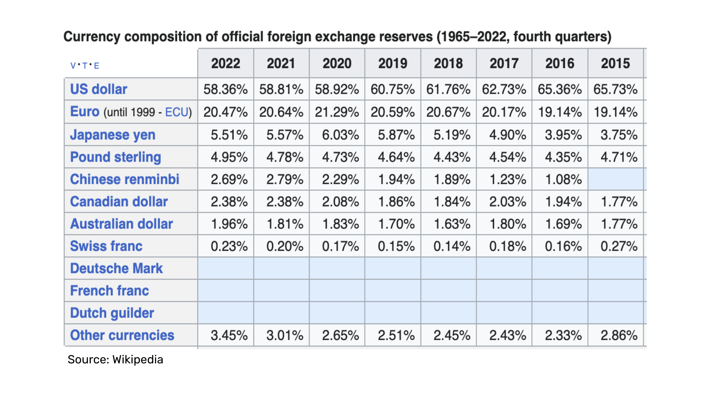
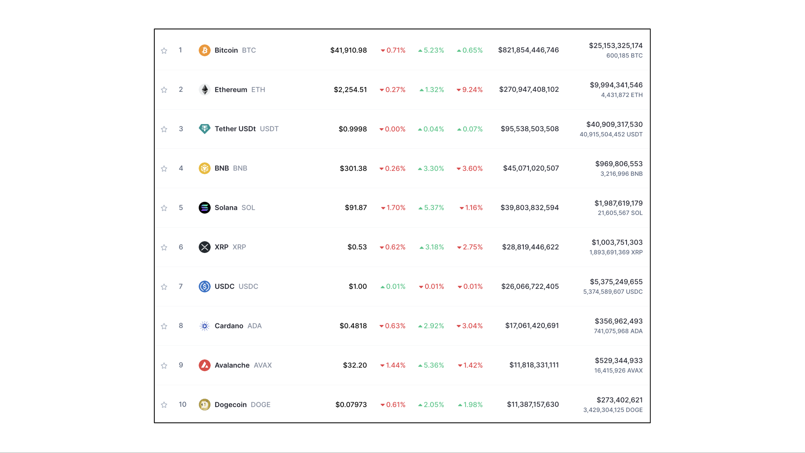

---
**由此收听或观看本期内容:**

https://youtu.be/wb7yyWTa_24

---

在上一节课中，第13节，我们解释了未来世界可能只会有3或4个获胜的工作量证明（POW）区块链的原因。

这些原因围绕着网络效应、标准以及这些因素往往会促使市场使用极少数的领先格式。

因为POW区块链，特别是以太坊经典（ETC），表现得像操作系统一样，那么与当前全球计算机操作系统市场的类比是合理的：有4个主要的参与者，分别是Android、Windows、iOS和OS X；其余都微不足道。

在这第14节课中，我们将继续这个分析，但会将POW区块链与全球储备货币进行比较，看看这些相似之处是否也成立。

## 什么是储备货币？

经济学上对货币的传统描述是，它必须是稀缺的、耐用的、便携的、可分割的、可替代的和可转让的产品。当一个给定经济体的市场采用某种形式的货币时，通常会变成该特定环境中的主要或唯一形式。

由Nick Szabo提出的对POW加密货币的额外定义是，它们需要昂贵才能创建。由POW提供的“不可伪造的昂贵性”确保了其中一个主要属性，即稀缺性。

在全球范围内，当多个经济体相互连接时，通常有一种或几种货币在其中一个或一些参与经济体中被采用为储备货币。

储备货币是那些承诺稀缺性以便向市场提供它们将保持其价值的确定性的货币。

## 为什么会出现储备货币？

一旦某种或几种货币成为储备货币，那么全球范围内的政府、中央银行和私人组织通常会将其采用为价值存储工具。

储备货币的地位使一种货币更受欢迎，它成为计价单位，并用于标价大多数国际交易、合同和债务义务。

由于以下原因，政府和市场参与者做出这些选择，这导致全球储备货币非常有限：

**心理成本：** 如果多个经济体、借款人、债务人、交易商、出口商、进口商和其他经济主体采用许多货币，那么跟踪和处理贸易的心理成本将非常高，财务和支付将变得风险重重且难以管理。

**协调成本：** 如果多个经济体、借款人、债务人、交易商、出口商、进口商和其他经济主体采用许多货币，那么所有这些参与者之间的协调成本将飙升，商业和合同将因变得繁琐和烦琐而萎缩。

**价格简化：** 与心理成本相关，如果全球经济采用了许多货币，那么每种产品都需要有许多价格，使得系统变得混乱且难以理解。

**网络效应：** 一旦达到了经济主体采用一种货币以简化他们的生活并更有效地进行商业和合同，那么该货币对于希望参与全球经济的其他主体来说就变得更有价值。全球范围内使用某种货币的人越多，对其他人来说它就变得更有价值。

由于以上所有原因，全球储备货币势不可挡地出现。

## 当前世界的储备货币是什么？

对于那些可能说区块链不是操作系统，正如我们在上一节中所描述的那样，而是储备货币的人，我们同样可以对储备货币说同样的话。

全球储备货币具有相同的网络效应，同样有3或4个在这一领域获胜的人。

正如本节中的图表所示，前4个全球储备货币，美元、欧元、日元和英镑的联合份额为89.29%。这与操作系统的模式相同。

请注意，全球储备货币的分布是最大的非常大，然后其余的迅速下降，而在第四名之后的其余货币几乎微不足道。

所有这些都证实了这一观点：未来将会有3或4个非常大的POW区块链，因为它们既符合操作系统的模式，又符合全球储备货币的模式。

## 为什么比特币、ETC和其他加密货币将占主导地位

如果我们能得出这样的结论：将会有很少数的获胜的加密货币平台在全球占据最大市场份额，那么我们可以分析这些加密货币不仅将在区块链行业内占主导地位，而且在经济的其他领域也将如此。

正如黄金、白银、铜等金属在过去几个世纪中一直是货币和储备货币一样，很可能比特币、ETC和其他加密货币，如莱特币和门罗币，也将占据这个领域。

法定货币的寿命非常短。硬币加密货币可能只需要两三十年的时间就能在全球范围内取代。

这些形式的货币的主要吸引力不仅在于它们的硬编码稀缺性，而且在于它们是信任最小化的，因此没有霸权国家可以随心所欲地控制其他国家的金融事务。

## 这些趋势在区块链行业中已经可观察到

正如我们在上一节中提到的，从总体上看，这些帖子中提到的趋势在区块链行业中已经可以观察到。比特币长期以来一直占据整个市场的大约50%份额。作为第二大链的以太坊，其份额约为25%，然后其余的趋势往往要小得多，或微不足道。

## 结论

考虑到区块链很可能会像操作系统和储备货币一样运作，这些领域通常有3或4个大玩家，而且这些趋势已经在当前市场上可以观察到，我们可以推断，区块链行业的工作量证明层将会有3或4个大玩家，而其他可能会微不足道。

与这一观点一致，我们估计比特币将继续在POW领域占据50%的份额，然后作为可编程数字黄金系统的以太坊经典可能会占据25%的份额，然后另一个系统，可能是莱特币，将占据12.5%的份额，然后可能是门罗，由于其隐私定位，将占据6.25%的份额，其余将随之而来但规模不太显著。

在我们的下一节课中，我们将解释这些事情将如何在区块链行业的各个层面发挥作用。

---

**感谢阅读本文章！**

要了解更多关于ETC的信息，请访问：https://ethereumclassic.org
