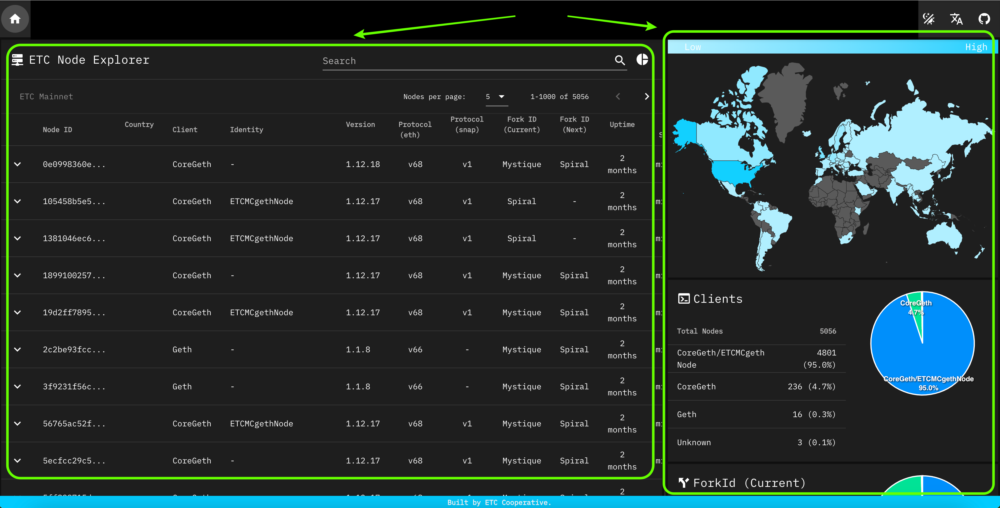
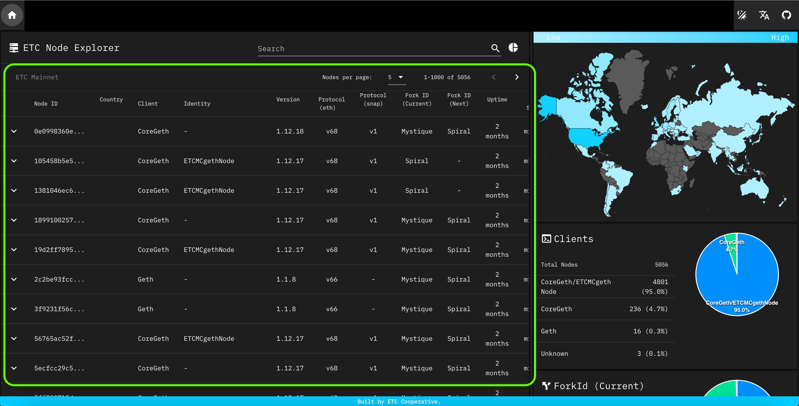
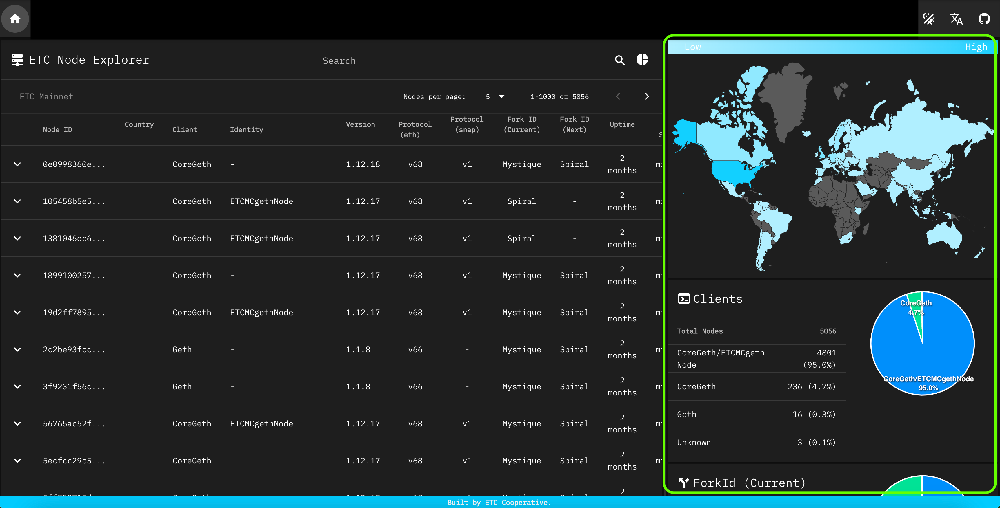

---
**由此收听或观看本期内容:**

<iframe width="560" height="315" src="https://www.youtube.com/embed/PJqTELf20IY" title="YouTube video player" frameborder="0" allow="accelerometer; autoplay; clipboard-write; encrypted-media; gyroscope; picture-in-picture; web-share" allowfullscreen></iframe>

---

节点数量对于任何区块链都非常重要，因为加密货币网络的节点数量越多，它就越[安全](https://ethereumclassic.org/blog/2024-01-16-why-more-nodes-makes-ethereum-classic-more-secure)。

跟踪以太经典（ETC）节点数量的方法是访问[etcnodes.org](https://etcnodes.org/)并在那里查看统计数据。

在本文中，我们将解释如何阅读这些统计数据。

ETCNodes 网站分为两个部分：

- 主要部分，其中包含按节点列出的列表和统计数据，
- 右侧的侧边部分显示带有可视化效果的汇总统计数据。

在以下部分，我们将解释每个统计数据。

## 主要部分

主要部分显示在 ETC 区块链中找到的每个单独节点，并在每个节点的列中显示统计数据。

各列如下：

**节点ID：** ETC 中的每个节点都有一个十六进制数字作为其唯一标识符。主要部分的第一列列出了所有节点的ID。

**国家：** 可以使用节点的IP地址在地理上定位 ETC 中的每个节点。此列列出了每个节点所在的国家。

**客户端：** 为了运行 ETC 节点，世界上任何人都可以下载 ETC 客户端软件节点并执行。但是，随时可能有多个客户端品牌。此列按客户端品牌列出每个节点。

**身份：** 有时，相同的节点客户端软件可能与不同的服务相关联。例如，在 ETC 中，[Core Geth](https://ethereumclassic.org/blog/2022-12-27-core-geth-explained) 客户端集成在产品中，如 [ETCMC](https://ethereumclassic.org/blog/2023-09-05-etc-spotlight-etcmc-ethereum-classic-plug-and-play-node-part-i) 或 [DappNode](https://ethereumclassic.org/blog/2023-04-26-how-run-an-ethereum-classic-node-using-dappnode) 硬件节点。为了识别这些变化，此列列出了每一个。

**版本：** 用于运行 ETC 节点的软件客户端可能来自不同的日期。随着核心开发人员升级软件，他们会为每个更改版本号。此列按版本列出节点。

**协议（eth）：** 节点使用协议相互通信，这些协议也有版本。'eth' 是一种协议，促进节点之间的以太坊区块链信息交换。最新版本是 v68。

**协议（Snap）：** ‘snap’ 协议是节点之间的另一种通信方法，它促进了对等之间的以太坊状态快照的交换。此功能是可选的，此列显示哪个节点已激活并使用了哪个版本。

**分叉ID：** 随着区块链进行升级（也称为“分叉”），网络中可能存在使用较旧软件的节点。此列显示每个节点正在哪个分叉中运行。

**运行时间：** ‘运行时间’ 列表示每个节点自何时连接到网络。

**上次见到：** 由于 ETCNodes 网站通过运行自己的节点来检测节点，因此可以追踪它上次与网络中的每个节点连接的时刻。此列显示此信息。

## 侧边部分

侧边部分是一个垂直的汇总统计数据列表，还以可视形式显示它们。

此网站部分的子部分如下：

**地图：** 由于每个节点可能在地理上定位，因此它们显示在部分顶部的地图中。每个国家都以颜色编码，以指示托管节点数量的数量，包括具体节点数量。

**客户端：** 该子部分显示一个饼图，指示按客户端软件品牌分布的节点。

**分叉ID（当前）：** 该子部分显示一个饼图，其中显示当前在系统中运行的节点按当前分叉ID的分布。

**分叉ID（下一个）：** 如果有一个即将通过分叉升级网络的新版本，则此图显示系统中有多少节点准备好进行下一个升级。

**协议（eth）：** 该子部分显示一个饼图，指示按 'eth' 协议版本分布的节点。

**协议（snap）：** 该子部分显示一个饼图，指示选择使用 'snap' 协议的节点按协议和版本的分布。

---

**感谢阅读本文！**

要了解有关 ETC 的更多信息，请访问：https://ethereumclassic.org
