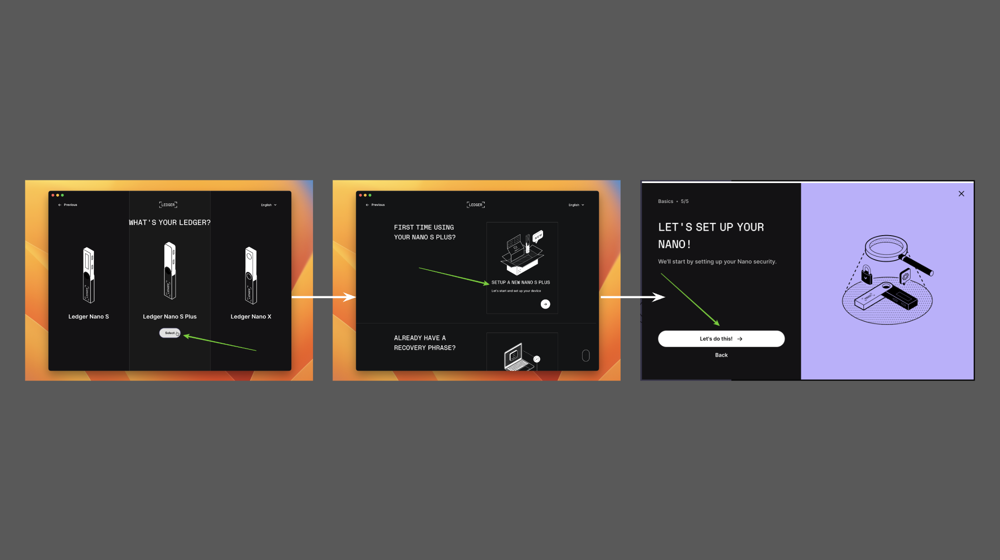
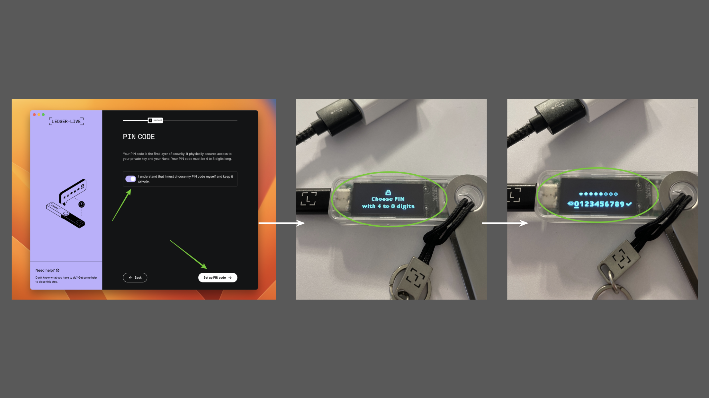
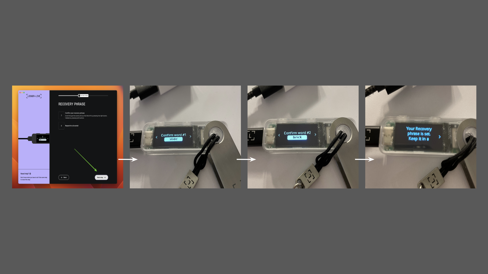
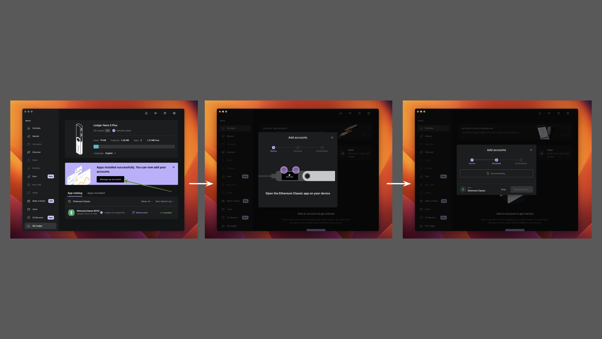

---
**由此收听或观看本期内容:**

<iframe width="560" height="315" src="https://www.youtube.com/embed/gCoMipvQJtY" title="YouTube video player" frameborder="0" allow="accelerometer; autoplay; clipboard-write; encrypted-media; gyroscope; picture-in-picture; web-share" allowfullscreen></iframe>

---

在这篇文章中，我们将解释如何使用Ledger Nano S Plus与Ethereum Classic；硬件钱包和桌面应用程序的使用方法；如何将Ethereum Classic（ETC）区块链应用程序添加到其中，以及如何创建您的第一个ETC地址。

## Ledger硬件和软件组件

Ledger Nano S Plus是一款硬件钱包，因此要使用它，您需要拥有Ledger Nano S Plus设备并在计算机上安装Ledger Live应用程序。您还需要一张卡来写下您的秘密密码，稍后将进行解释。

在本教程中，我们将解释如何设置Ledger Nano S Plus并将Ethereum Classic添加到它以及在计算机上。

我们将在适当的地方展示您的Ledger Nanos S Plus设备和计算机上的并行操作。

## 1. 在计算机上安装Ledger Live应用程序

一切都始于硬件钱包和计算机上的Ledger Live应用程序。要下载该应用程序，您需要访问：

https://www.ledger.com/start

然后，在计算机上打开它并点击“开始”按钮。

## 2. 选择设备和设置样式

在接下来的几步中，Ledger Live将询问您拥有哪种设备型号，是否是首次设置，或者是否已经有以前的恢复短语。由于这篇文章是为Ledger Nano S Plus和新的设置而写的，因此在Ledger Nano S Plus型号上按“选择”，然后点击“设置新Nano S Plus”链接。

完成后，该应用程序将显示一条简短的教育消息。阅读完毕后，点击“开始吧”。

## 3. 准备设置设备并打开它

在下一个屏幕上，计算机上的Ledger Live将解释过程的工作原理以及所需的时间。阅读完毕后，点击“好的，我准备好了！”按钮。之后，它会告诉您将您的Ledger Nano S Plus连接到计算机（在您的Ledger Nano S Plus设备上查看并行操作的下一个屏幕），并按照步骤操作，直到出现“设置为新设备”的消息。

在计算机上的Ledger Live应用程序上点击“下一步”，在您的Ledger Nano S Plus设备上通过同时按下设备顶部的两个按钮来启动“设置为新设备”。

### 同时连接您的Ledger Nano S Plus并设置为新设备

在计算机应用程序上按照步骤操作的同时，将您的Ledger Nano S Plus设备连接到计算机，并在设备上按照步骤和说明操作。

当到达“设置为新设备”的点时，请像右侧图像所示同时按下设备顶部的两个菜单按钮。

## 4. 设置设备PIN码

在下一步中，计算机上的Ledger Live将告诉您需要为设备选择一个四到八位的PIN码。

同时，在您的设备上，您将看到“选择PIN”的消息。按下两个菜单按钮以选择您的PIN。

当您在Ledger Nano S Plus设备上选择并重新确认了您的PIN码后，它将进入下一步。在计算机上的Ledger Live上点击“下一步”，阅读有关您的PIN码的指南，然后点击“开始吧”。

## 5. 记下您的恢复短语

在下一步中，计算机上的Ledger Live将要求您检查并记下您的24个单词的恢复短语。在您的设备上，您需要按下右侧菜单按钮开始该过程。经过一些说明后，您将首先看到“单词＃1”，然后是“单词＃2”，依此类推，直到您达到第24个单词。将它们全部写在Ledger Nano S Plus盒子中提供的卡上。

您最多可以得到三张卡，因此您可以将密码短语复制多达三次，以备份到不同的安全位置。

## 6. 确认您的恢复短语

为了确保您正确地按顺序复制了24个单词的短语，计算机上的Ledger Live将要求您确认每个单词。

与此同时，在您的Ledger Nano S Plus设备上，当您按下右侧菜单按钮时，您将再次看到每个单词。其中一些故意错误，因此您需要使用菜单按钮左右滚动以寻找正确的单词，并通过同时按下两个菜单按钮来确认它们。

当您确认了所有24个单词后，您的Ledger Nano S Plus将告诉您您的恢复短语已设置。

## 7. 隐藏恢复短语并进行真实检查

在下一个屏幕上，Ledger Live将要求您将恢复短语隐藏在安全的地方，如果您复制了多个副本，则可以隐藏在多个地方。之后，它将问您一些问题，以查看您是否理解了系统的安全功能。然后，它将要求您执行“真实检查”以确保您使用的设备是真实且来自原始设备制造商。

真实检查获得批准和确认后，点击“继续”。

## 8. 在您的Ledger Nano S Plus上添加Ethereum Classic应用程序

在下一步中，您将在计算机上的Ledger Live应用程序的主页上看到。要添加Ethereum Classic，我们需要在计算机上的Ledger Live和Ledger Nano S Plus设备内添加ETC应用程序。

要添加ETC，请在提供的字段中搜索“Ethereum Classic”。当“Ethereum Classic（ETC）”出现时，点击其右侧的“安装”按钮。在接下来的屏幕上，Ledger Live将报告出于技术原因将安装Ethereum和Ethereum Classic应用程序。点击“安装应用程序”。在接下来的屏幕上，Ledger Live将显示ETC应用程序已安装。与此过程同时，您还可以在您的Ledger Nano S Plus上看到ETC的安装。

## 9. 在您的Ledger Nano S Plus上添加您的第一个ETC帐户

要将您的第一个ETC地址添加到Ledger Nano S Plus，您需要在我们上一节离开的屏幕上点击“管理我的帐户”按钮。然后，通过同时按下设备顶部的两个按钮打开我们在Ledger Nano S Plus设备中安装的Ethereum Classic应用程序。

在接下来的屏幕上，Ledger Live将在计算机上显示设备和应用程序正在“同步”以设置ETC帐户。

几秒钟后，您的计算机上的Ledger Live将向您显示一个Ethereum Classic地址，以将其添加为新帐户。点击“添加帐户”按钮进行添加。其默认名称将为“Ethereum Classic 1”，但您可以更改它。

在接下来的屏幕上，Ledger Live将报告已成功添加帐户。要继续，请点击“完成”。

最后，通过点击左侧垂直菜单上的“帐户”选项卡，您将进入Ledger Live上的ETC配置页面，您将在顶部看到“Ethereum Classic 1”作为第一个帐户的ETC地址。

---

**感谢您阅读本文！**

要了解有关ETC的更多信息，请访问：https://ethereumclassic.org
