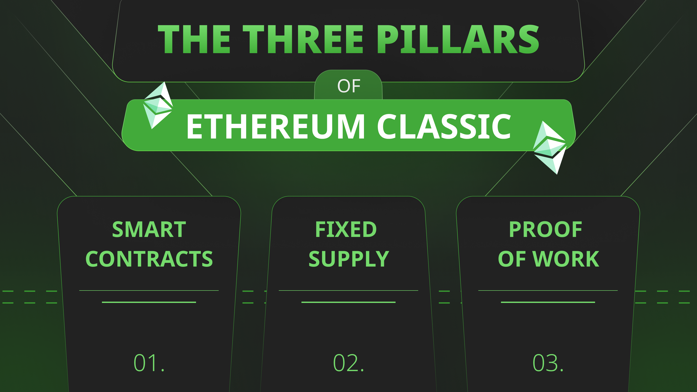

---
**You can listen to or watch this video here:**

<iframe width="560" height="315" src="https://www.youtube.com/embed/xxsdDcjxWuU" title="YouTube video player" frameborder="0" allow="accelerometer; autoplay; clipboard-write; encrypted-media; gyroscope; picture-in-picture; web-share" allowfullscreen></iframe>

---

In the previous class, 15, we explained how proof of work (POW) blockchains such as Bitcoin (BTC) and Ethereum Classic (ETC) will be the base layer of the blockchain industry because of their security and qualities as digital gold.

However, ETC has a unique combination of attributes because it is not only a proof of work blockchain and has a fixed monetary policy, but it is also programmable with smart contracts. 

This unique positioning for ETC has already made it the largest POW smart contracts blockchain in the world, and the fifth largest POW blockchain overall. 

These three pillars enable the true concepts of “Code Is Law” and “Unstoppability”.

In this class, 16, we will explain the three pillars of ETC; POW, a fixed supply, and smart contracts; and why they enable the true concepts of “Code Is Law” and “Unstoppability”.

## Pillar 1: Ethereum Classic Is a Proof of Work Blockchain

Proof of Work is the most secure consensus mechanism for peer-to-peer computer networks such as ETC in the world. There is no other system as secure known to man.

This means that all participating machines in the network can agree (hence the term “consensus”) on the same exact the state of the database, also called the “blockchain”, every 13 seconds in a totally decentralized way, with no possibility of censorship or control by special interests.

“Security” in this context means decentralization, and decentralization means trust minimization, [the main goal](https://ethereumclassic.org/blog/2023-03-08-ethereum-classics-focus-on-trust-minimization) of blockchains such as ETC.

In essence, POW makes ETC the most secure smart contracts blockchain in the world.

## Pillar 2: Ethereum Classic Has a Fixed Supply

Just as trust minimization is a main goal of Ethereum Classic, sound money is equally important.

The ETC coin is sound money because it is scarce, durable, costly to create, portable, divisible, fungible, and transferable.

ETC is scarce in particular because it has a monetary policy integrated in its protocol that diminishes the issuance of coins through block rewards to miners by 20% every 2 years. This determines a [supply cap](https://ethereumclassic.org/blog/2023-10-18-ethereum-classic-has-a-supply-cap-like-bitcoin) of ETC that will ever exist in its history of 210,700,000.

ETC is costly to create because, as a POW blockchain, to issue the coins to pay miners for building the blocks, they have to do a lot of work, similar to gold miners in the real world, hence the term “digital gold” to describe it.

## Pillar 3: Ethereum Classic Has Smart Contracts

When Bitcoin was launched by Satoshi Nakamoto, [he envisioned smart contracts in it](https://ethereumclassic.org/blog/2023-12-14-etc-proof-of-work-course-6-etc-is-btc-philosophy-with-eth-technology) to make it programmable.

However, because of technical problems with its design, Bitcoin did not support smart contracts inside its highly secure environment. 

This is why Vitalik Buterin invented Ethereum Classic, which is [the original Ethereum](https://ethereumclassic.org/blog/2023-01-26-ethereum-classic-course-6-ethereum-classic-is-the-original-chain) blockchain, to be a POW blockchain, with digital gold, and that it could be programmable. 

Hence, ETC is Bitcoin’s philosophy with Ethereum’s technology. In other words, the best of both worlds.

Programmability with smart contracts makes ETC the most versatile and secure blockchain in the world.

## How Do These Pillars Enable “Code Is Law”?

The philosophy of “Code Is Law” in Ethereum Classic means that once smart contract powered decentralized applications, or dapps, are deployed in it, then they become immutable and impossible to change.

Inside ETC’s highly secure environment, “Code Is Law” is an analogy of the laws of physics, not human law.

Outside, in the real world, people may have disputes and seek resolution of these things through their legal systems.

However, inside ETC, it is the combination of POW, a fixed supply, and smart contracts that enable immutability of applications available to anyone on a global scale.

## How Do They Enable “Unstoppability”?

Similarly, the three pillars of ETC enable unstoppability of dapps, accounts, and balances.

Once anyone in the world sends a transaction to ETC, as long as it is received and formed correctly as per protocol rules, it will be processed and executed by the system.

This includes the execution of dapps and it happens in a totally decentralized and permissionless way, on a global scale.

Unstoppability means certainty that people, through their own private keys, will have exclusive long term control of their assets and dapps in Ethereum Classic, without the risk of interference by any third parties or special interests.

## Applications in Ethereum Classic Are the Most Secure Apps in the World

Why are the three pillars of ETC so important?

In summary, Ethereum Classic is the environment where the most secure applications in the world will exist because it is a proof of work blockchain, therefore truly decentralized; it has a fixed monetary policy, therefore it is sound money; and it is programmable, therefore much more versatile and secure than the alternatives.

In addition to these qualities, ETC is a fully replicated blockchain, which increases its safety; and composable, which reduces risks and settlement costs; and is the largest one in the world with this combined design!

These attributes in the same integrated system provide the highest level of decentralization, thus trust minimization, thus security for any application hosted in it.

---

**Thank you for reading this article!**

To learn more about ETC please go to: https://ethereumclassic.org
