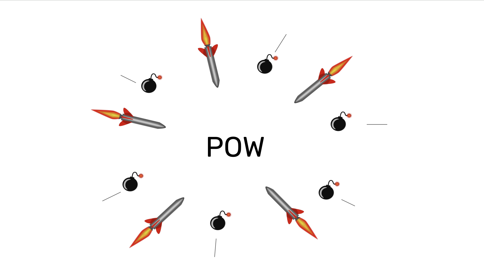

---
**You can listen to or watch this video here**

<iframe width="560" height="315" src="https://www.youtube.com/embed/nPUiAJzR5q0" title="YouTube video player" frameborder="0" allow="accelerometer; autoplay; clipboard-write; encrypted-media; gyroscope; picture-in-picture; web-share" allowfullscreen></iframe>

---

In the previous class, 17, we explained how proof of work (POW) blockchains such as Bitcoin and Ethereum Classic (ETC) have division of power and proof of stake (POS) chains do not.

We saw how the “right to split”, or separate, in the case of the introduction of nefarious rules or controversies, gave these systems a higher level of security.  

In a related topic, in this class, 18, we will learn why POW blockchains will always be under constant social attack because in truly decentralized systems there are no higher authorities to impose order.

In technical discussions or upgrade controversies, each faction must fight for their desired outcomes. 

Additionally, true decentralization is disagreeable to elites and governments. Consequently, toxicity and maximalism are necessary postures to defend the principles of these systems.

## Truly Decentralized Systems Will Never Be Centralized

Proof of work is the only signaling systems that enables true decentralization.

In social groups, if decentralization is achievable without degenerating the systems, then free participants will always choose decentralization. 

Centralization is not a desired state of affairs. 

“Voting”, “Democracy”, and “Republic” are not ideal systems, they are just the least worse we can do. 

But in proof of work systems there cannot be tyrants, kings, constitutions, presidents, or congresses. 

They are not possible because participants will never choose them, because they are not necessary, and they will always prefer to split.

## Proof of Work Ungovernance

Proof of work blockchains actually work better without governance. 

In these systems the “constitution” is the blockchain protocol itself. 

In Bitcoin, for example, that miners can earn BTC by working in building blocks according to the rules is an organizing principle that drives the whole industry which is totally decentralized on a global scale.

In Ethereum Classic, the fact that it is programmable and permissionless directs developers worldwide to build applications on it, following the distributed EVM design, and naturally incentivizing them to defend it.

This is why in POW blockchains there are no leaders or administrators that impose their will. It is just the value and the incentives of the system that guides the global ecosystem to decentralization.

## True Decentralization Means no Authority

In a context of true decentralization, there are no arbiters or authorities to impose order. 

If there are no paternal figures or administrators to impose order in a blockchain, then the factions must fight for their desired outcomes when it comes to changing the rules or implementing upgrades.

Therefore, it is impossible to have “civilized debates” in these scenarios.

It is more or less like when children are with their parents or not. If their parents are present, then they will be much better behaved, but when the parents leave, then they may fight over candy or a sibling may pull the hair of the other.

Genuine decentralization means no authority, and no authority means that brute argumentative force becomes the name of the game.

## No Authority Must Lead to Toxicity

If brute argumentative force becomes the name of the game to defend the principles of these systems, then the so called “toxicity” must be necessary. 

Consequently, all those who criticize toxicity because it hurts their feelings are wrong. 

Toxicity and maximalism are actually rational game-theoretical and evolutionarily stable behaviors in decentralized systems. 

If toxicity is absent during periods of peace, and the factions seem to dissolve, it is not because they failed. It is because they were temporarily not needed. 

But when new threats emerge again, which is inevitable, then, the toxic maximalists will re-emerge as well and will be welcomed as heroes.

Toxicity is good for POW blockchains.

## The Proof of Stake Non-Toxicity Fallacy

Because proof of stake (POS) is centralized, then there are no social attacks on it.

Indeed, in POS participants can’t even split! Therefore, there is no argument to be had other than submitting to the authorities.

This is why so many people find POS “communities” so pleasant, because they seem friendly and inviting. But this is because they are after your money and they deceive you.

Although they may seem non-toxic in the surface, the evil in the systems is their centralization. 

They control you, they submit you, and you have no recourse but to comply. 

The perversion is orders of magnitude worse than the harmless “toxicity” in POW.

## How BlackRock Will Be Neutralized

Many have cheered and welcomed the participation of the global asset management giant BlackRock in the Bitcoin ecosystem. 

Soon this globalist and passionate “Environmental, Social, and Governance” behemoth will also make incursions in other networks such as Ethereum, and eventually ETC.

Being BlackRock a faithful representative of elite philosophy and government power, it is inexorable that they will try to change the rules of these systems to centralize them.

However, because of the reasons explained in this and previous classes, POW blockchains are well equipped to defend their principles and integrity in front of these threats.

Toxicity will certainly push back at their attacks, and things such as the “right to split” and the sheer protection barrier that is POW will defend them.

---

**Thank you for reading this article!**

To learn more about ETC please go to: https://ethereumclassic.org
