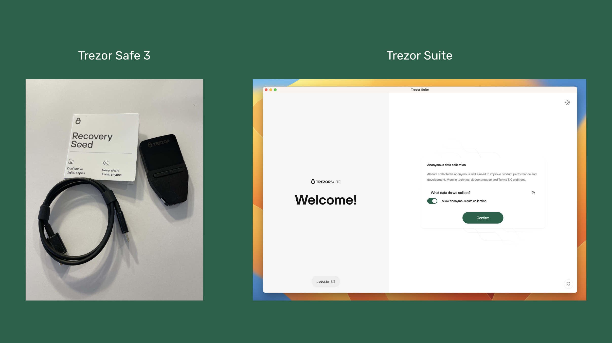
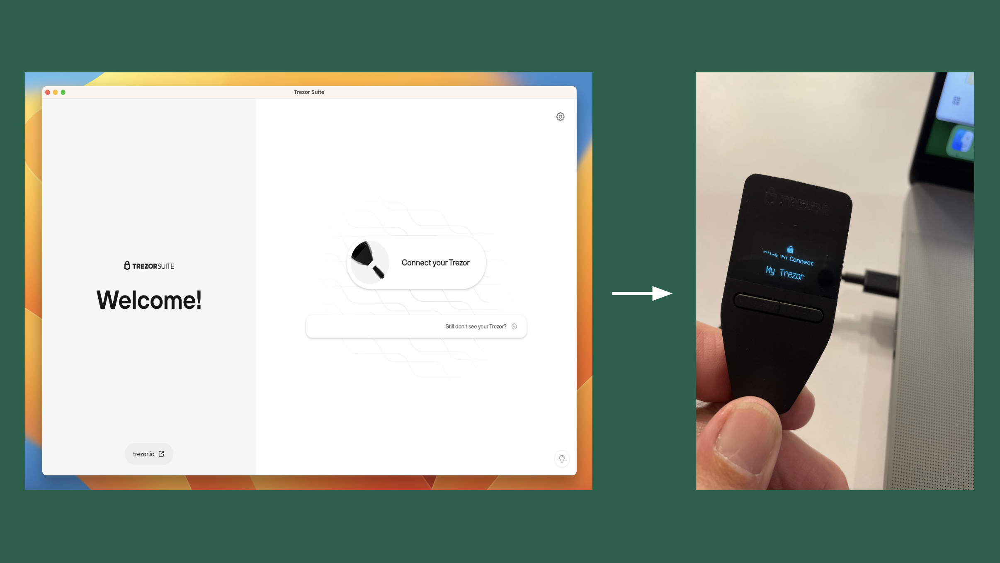
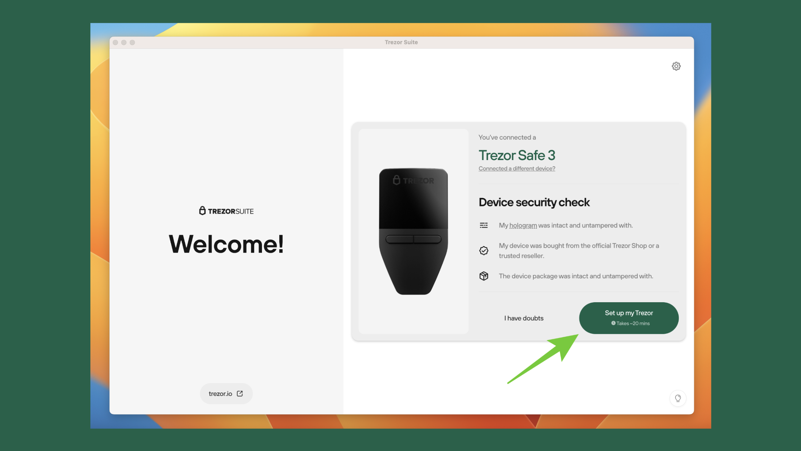
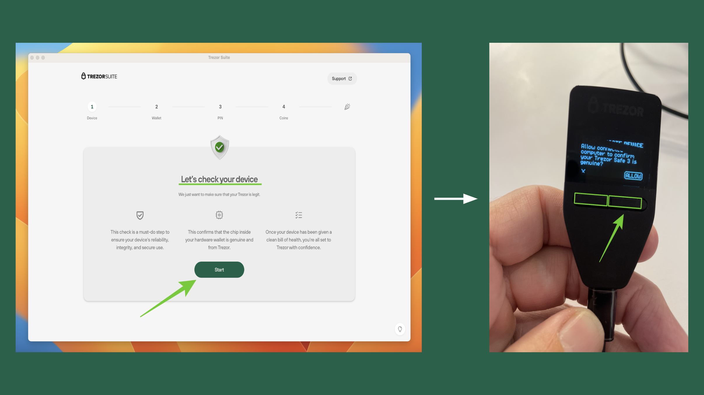
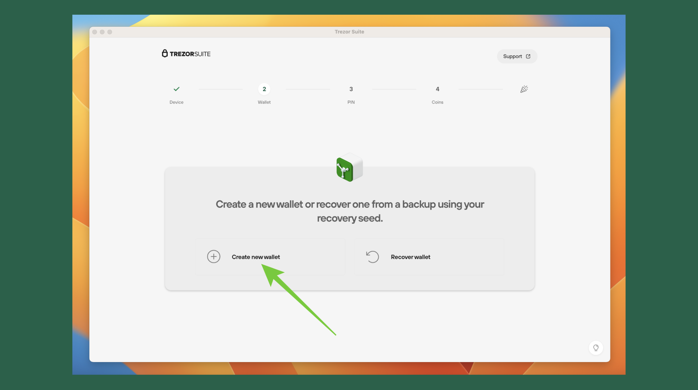
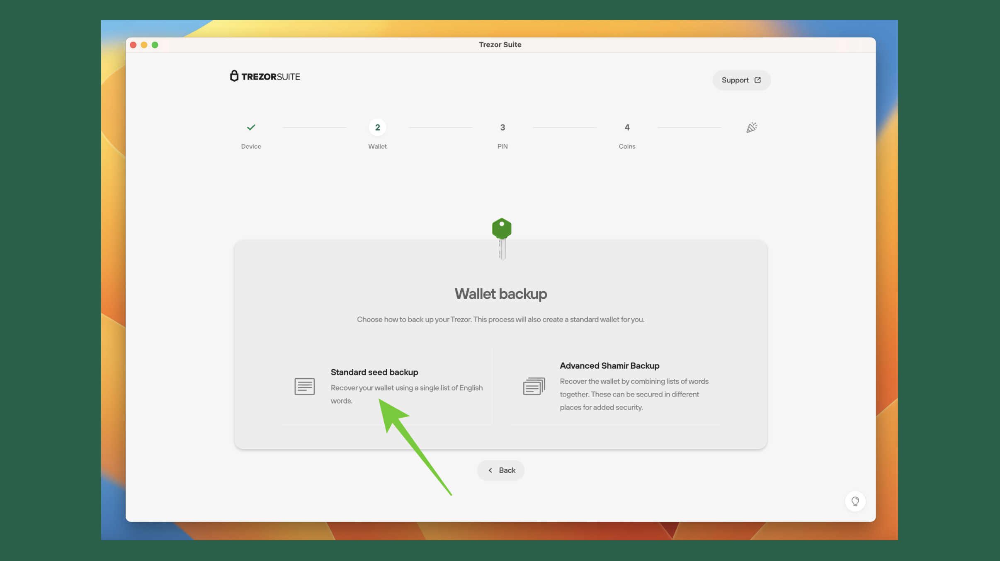
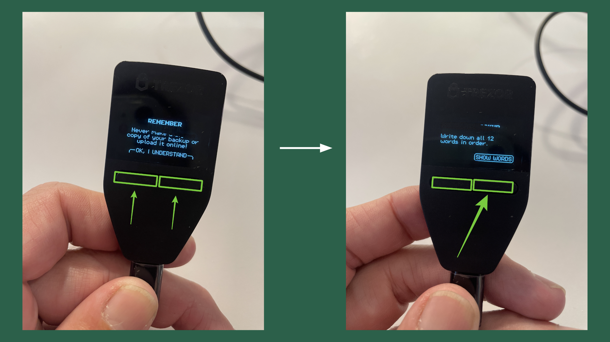

---
**You can listen to or watch this video here:**

<iframe width="560" height="315" src="https://www.youtube.com/embed/xhcDobiwrYk" title="YouTube video player" frameborder="0" allow="accelerometer; autoplay; clipboard-write; encrypted-media; gyroscope; picture-in-picture; web-share" allowfullscreen></iframe>

---

In this post we will explain how to use Ethereum Classic (ETC) with the Trezor Safe 3; the hardware wallet and the desktop app; how to add the ETC coin to it, and how to see your first ETC address.

## The Trezor Hardware and Software Components

Trezor Safe 3 is a hardware wallet, so to use it you need to have your Trezor Safe 3 device and install the Trezor Suite app on your computer. You will also need a card to write your secret passphrase, as will be explained later.

In this tutorial we will explain how to set up your Trezor Safe 3 and to add Ethereum Classic to it and on your computer.

We will show the parallel actions on your Trezor Safe 3 and on your computer where appropriate.

## 1. Install the Trezor Suite App on Your Computer

Everything starts with the hardware wallet and the Trezor Suite app on your computer. To download the app you need to go to:

https://trezor.io/start

Then, open it on your computer.

## 2. Connect Your Trezor Safe 3

The Trezor Suite app will ask you to connect your Trezor Safe 3 to your computer. To do this, connect the cable provided to the device and then to your computer. When you do this, you will see that the device boots and the screen will show the “My Trezor” tagline.

## 3. Device Security Check and Set Up “My Trezor”

In the next screen, Trezor will ask you to check whether your device is secure. For this you need to confirm to yourself whether your device came with the hologram tape intact, that you bought it from Trezor directly or from a trusted dealer, and if the device package was intact when you got it. 

If all these things are confirmed by you, then click on the “Set up my Trezor” button to continue the process.

## 4. Install Firmware

Before continuing, Trezor Suite will ask you to install the firmware into the Trezor Safe 3. For security reasons, it actually comes without the firmware, which is the software that governs the device. 

To install the firmware press on “Install firmware”.

## 5. Device Check

At this juncture, Trezor will perform another security check of your Trezor Safe 3. This time it is not whether you received it in its full integrity and if it was delivered securely. This time it is to check that your connected and installed device is well set up and running, and that the chip inside is a true Trezor original part. 

Press “Start” to perform this security check. Then, press on the button below the “Allow” option on your device as shown in the highlighted image in this section.

## 6. Create New Wallet

After the security check, Trezor Suite will ask you to create a new wallet or to restore an existing wallet using your recovery seed. 

For this tutorial, we will opt for the “Create new wallet” path.

## 7. Standard Seed Backup

The options to create a new wallet on your Trezor Safe 3 are to create a standard passphrase or seed phrase or an advanced Shamir one. In the Shamir option you get separate groups of words that can be stored securely in separate places and then put together to recover your wallet. 

For this tutorial we opted for the “Standard seed backup” method.

## 8. Agree to Create Wallet Backup on the Trezor Device

Next, Trezor Safe 3 will ask you to agree to create a new wallet seed phrase on your device. To do this, press the “CREATE WALLET” button on your Trezor Safe 3 as highlighted in the image.

## 9. Create Backup

Now, Trezor is ready to create the seed phrase to backup your wallet. 

Press on “Create backup” on your computer.

## 10. Begin Backup

But wait! There are more security questions! 

Now that you are going to create the 12 word seed prase to back up your wallet, Trezor just wants to make sure that you understand how this works. They will require you to confirm that you understand three statements regarding the seed phrase back up process.

When you read the statements and checked the boxes, then press “Begin back up”.

## 11. Agree, Understand, and Show Words

In the next step, you need to go to your Trezor Safe 3 and agree that you understand how to keep your 12 words secure. For this press on “OK, I UNDERSTAND” by pressing on both buttons on your device as highlighted in the image in this section.

Next, Trezor Safe 3 will ask you whether to show the words. Press “SHOW WORDS” to begin the process. 

## 12. Scroll Through the Words, Write Them Down, And Confirm

Now you need to see your words on the Trezor Safe 3 device, write them down on the provided cards, and confirm to Trezor that you did these steps.

When you finish the process press on “HOLD TO CONFIRM” on the device to go to the next step.

## 13. Set A PIN

In the next step, you need to set a PIN to use your Trezor Safe 3 from now on. This PIN is used to open your device and sign transactions each time you want to send or receive ETC or other crypto from your hardware wallet.

On the Trezor Suite app on your computer press “Set PIN” and in your device select a PIN as indicated.

## 14. Activate ETC!

Finally, once you have your Trezor Safe 3 and Trezor Suite set up and synchronized, then it is time to add ETC as a coin in your device. To do this, go to your Trezor Suite app on your computer and select ETC out of the list of possible coins.

In the next screen you will see Bitcoin as the default coin and below it ETC. Congratulations! You now have a Trezor Safe 3 configured to use ETC! When you click on the ETC asset, you will see your ETC address in the next page. 

In future guides, we will explain how to send and receive ETC on your Trezor, and other useful functions.

---

**Thank you for reading this article!**

To learn more about ETC please go to: https://ethereumclassic.org
