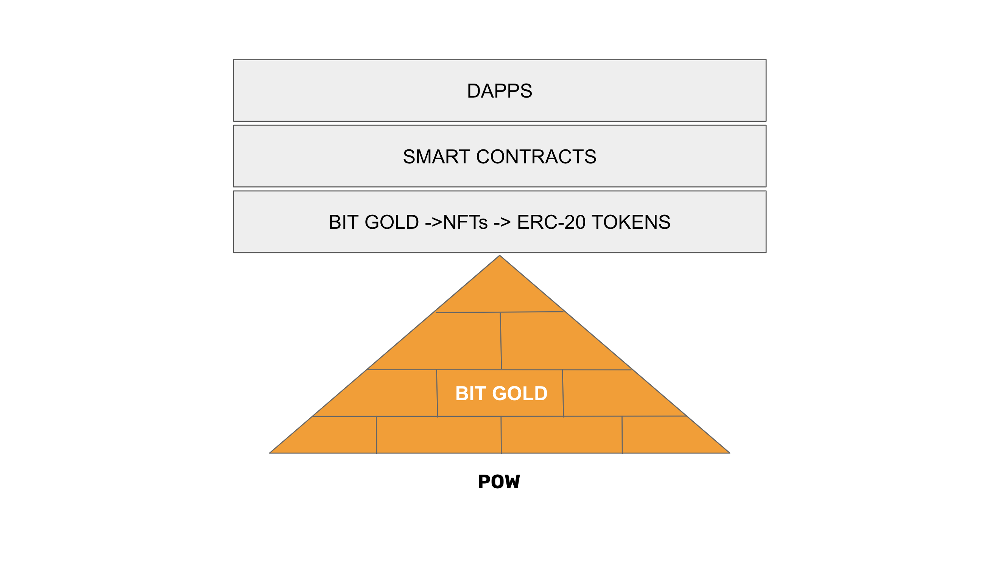

---
**由此收听或观看本期内容:**

<iframe width="560" height="315" src="https://www.youtube.com/embed/Ml0OFmw4k8Y" title="YouTube video player" frameborder="0" allow="accelerometer; autoplay; clipboard-write; encrypted-media; gyroscope; picture-in-picture; web-share" allowfullscreen></iframe>

---

在上一堂课，第19堂课中，我们解释了所有加密货币都是社区法定货币，但至少工作证明（POW）币有一个客观的物理基础，使它们不可伪造地昂贵且稀缺，而权益证明（POS）币则没有客观的基础。

在本堂课，第20堂课中，我们将讨论将[比特金](https://nakamotoinstitute.org/library/bit-gold)集成到以太经典（ETC）中，以消除对货币安全性的任何疑虑。

比特金是最初引发比特币诞生的原始想法。比特金是嵌入在区块链中未被用作货币而是用作保护墙的区块哈希。

ETC支持释放系统中嵌入的比特金所需的所有组件，并创建一个高效的基于比特金的经济体系。

## 所有加密货币都是社区法定货币

重申一下，比特币、ETC、莱特币和所有当前的POW区块链都是社区法定货币，正如我们在上一课中解释的那样。

决定它们发行的是软件参数，比如“每个区块打印X个币，并且每隔Y个区块折扣一次”。

虽然确实在挖掘区块之前无法打印币，但现实情况是，更改这些参数是微不足道的，是一个主观的“社区”决定。

然而，需要指出的是，POW加密货币比POS币更难且更可靠，因为它们是真正分散化的，因此在它们之中很难达成全局共识来随意改变其货币政策。

## 比特金作为消除任何剩余不确定性的方法

尽管如此，POW币在其货币政策中仍存在剩余的不确定性，因为这种不确定性具有纯主观性质。

我提出的解决方案，受尼克·萨博的思想启发，是将比特金集成到诸如ETC之类的网络中。

以太经典和其他POW区块链已经产生了比特金，这些是密封区块的加密哈希。

比特金嵌入在链中，从未用于其他用途，而是作为一道防御墙。

但是，如果将它们转换为NFT并在去中心化交易所中交易，它们就可以释放给公众并变得可转让。

## 使用NFT和ERC-20代币的比特金

ETC非常适合进行这种转变，因为它是可编程的，因此支持NFT、去中心化交易所和ERC-20代币。

NFT将代表比特金哈希，这些是具有不规则价值的非同质化单位。

去中心化交易所将用于交易NFT、下文提到的比特金捆绑包以及对这些捆绑包发行的ERC-20代币。

ERC-20智能合约将用于捆绑一组比特金NFT，以形成相等价值的比特金数量。这与黄金捆绑成标准数量的黄金条，因此它们可以轻松用于交易、转账和支撑其他资产的方式类似。

ERC-20代币将作为可交易和可分割的代币发行，这些代币将作为由比特金支持的币。这与黄金标准在法定货币盛行之前是一样的。

这意味着每当有人想要比特金时，他们只需将他们的ERC-20代币发送回ERC-20智能合约来兑换，代币将被销毁，然后用户将收到代表比特金捆绑包的NFT。

## 将比特金集成到ETC的理由

将比特金集成到ETC中肯定会解决不仅是其社区法定令牌留下的不确定性和其仍然主观的货币政策的可信度问题，还将解决POW区块链所面临的所谓费用模型威胁以及有限供应问题，这两者相关。

费用模型威胁是这样一个观点，即像比特币和ETC这样的POW区块链未来仅靠费用将无法支付其安全预算，因为人们将使用更便宜的方式发送资金。

有限供应问题与此相关，因为这是这样一个观点，即当BTC和ETC的供应和发行逐渐减少时，矿工将仅依赖交易费用来支付运营成本，但如果费用不够高，那么系统可能会失败。

将比特金集成到ETC中将使ETC矿工成为比特金的矿工，就像黄金一样，只要有矿工愿意投资挖矿，比特金将永远存在。

---

**感谢您阅读本文！**

要了解更多关于ETC的信息，请访问：https://ethereumclassic.org
