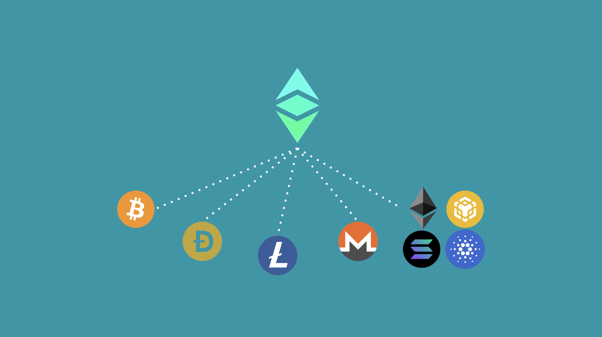

---
**由此收听或观看本期内容:**

<iframe width="560" height="315" src="https://www.youtube.com/embed/BWb6gd924iA" title="YouTube video player" frameborder="0" allow="accelerometer; autoplay; clipboard-write; encrypted-media; gyroscope; picture-in-picture; web-share" allowfullscreen></iframe>

---

## 1. 以太坊和以太坊经典最初是一个工作量证明的区块链

当比特币（BTC）创立时，本意是要在其工作量证明（POW）环境中拥有智能合约。

2013年，Vitalik Buterin提出了如何将智能合约整合到POW区块链的想法，但由于比特币的技术设计，这在比特币中是不可能实现的。

这就是以太坊（ETH）的起源。Buterin先生组建了一个团队，他们进行了众筹来资助开发工作，并从头开始构建了一条区块链，于2015年推出。

当时，没有“以太坊和以太坊经典（ETC）”，因为整个社区都团结在一个项目中，只有一个智能合约区块链。

## 2. 然后以太坊与以太坊经典分道扬镳

2016年，ETH社区因一款名为The DAO的dapp遭受黑客攻击而引发争议。

在那个时候，ETH决定撤销黑客攻击，而社区的一小部分决定继续使用原始未被篡改的链，随后被称为以太坊经典，其代币符号为ETC。

市场上有一个普遍的误解，即ETC是ETH的分叉，但事实却是相反的：ETH是ETC的分叉，因为他们改变了网络规则，并逆转了黑客攻击的资金，破坏了不可变性。但是，ETC没有做出任何更改，因此仍然保持着原始未被篡改的链。

## 3. 代码即法律 vs 社会共识

自从以太坊和以太坊经典分道扬镳以来，它们之间出现了很大的差距。

ETC采取了“代码即法律”的理念，而ETH采取了“社会共识”的理念。

社会共识意味着正如他们在2016年所做的那样：每当链中出现争议或问题时，社区，假定社区是全知、道德良好的，将会纠正这些问题。

但是，这正是区块链不应该做的！这就是为什么ETC采取了一种尽可能客观的理念，即区块链中的任何内容都将是不可变的。任何人类之间的问题必须在法律制度中解决，而不是通过篡改链来解决。

## 4. 股权证明和拯救树木

2016年晚些时候，Vitalik Buterin在一篇[文章](https://medium.com/@VitalikButerin/a-proof-of-stake-design-philosophy-506585978d51)中解释了他为什么喜欢股权证明（POS）而不是POW，因为：

- POW杀死了树木
- POW具有对称的1:1攻击者与防御者比率

事实上，POW非常难以攻击，唯一可能的攻击就是双花攻击，随着用户等待更多的确认，这种攻击变得越来越困难，而区块链的透明性阻止了攻击者这样做，因为他们很容易被发现。

这让POS没有任何优势，除了拯救树木之外，但这本身就是一个谬论，因为不采用POW，POS网络实际上停止了向可再生能源的电力生产迁移，[而POW则不同](https://pubs.acs.org/doi/10.1021/acssuschemeng.2c06077#)！

## 5. 股权证明甚至不具备可扩展性

以太坊基金会宣传POS的另一个巨大优势是，它将提供更多的可扩展性，因为其设计据称使数据库能够分段，从而可以并行处理更多的交易量。

当时以太坊每秒可以处理10到20笔交易，但以太坊基金会谈到如果采用POS，可以处理成千上万笔交易。

事实上，现在以太坊是一个POS链，可能只能处理每秒20到30笔交易！

这意味着POS甚至不具备可扩展性。

## 6. 以太坊迁移到股权证明

由于其“社会共识”哲学；即社区将解决系统中可能出现的任何争议，而不是保持不变性，并让人们在其他地方解决他们的争议；以及ETH社区具有的拯救树木、实现可扩展性和减少ETH发行量的抽象目标；以太坊于2022年9月15日迁移到POS。

当时，以太坊是世界第二大区块链，而所有其他排名中有关重要性的可编程链都已经是POS链，因为它们试图超越以太坊，成为首个据称具备可扩展性和环保的区块链。

## 7. 以太坊经典成为世界上最大的区块链

当以太坊迁移到POS时，ETC的算力约为20 TH/s，但迁移后跃升至200 TH/s以上，随后稳定在约166 TH/s（截至撰写本文时）。

然而，仅凭借保持POW的特性，ETC就成为了全球最大的智能合约区块链。所有在排名中位于其上方的可编程链都是POS，[因此具有中心化和不安全的特性](https://ethereumclassic.org/blog/2023-12-27-ethereum-classic-at-scale-is-decentralized-ethereum-is-centralized)。市场认识到这一点只是时间问题，ETC将主导该领域。

## 8. ETC中的应用是世界上最安全的应用

以太坊经典是世界上最安全的应用环境，因为它是一个工作量证明的区块链，拥有固定的货币政策，可编程、完全复制、可组合，并且是全球最大的区块链之一，[具有这种综合设计](https://ethereumclassic.org/blog/2023-12-05-the-7-keys-to-ethereum-classic-success)。

这些属性在同一综合系统中提供了最高水平的去中心化，从而最小化了信任，为托管在其中的任何应用程序提供了安全性。

---

**感谢您阅读本期文章!**

了解更多有关ETC，欢迎访问: https://ethereumclassic.org
