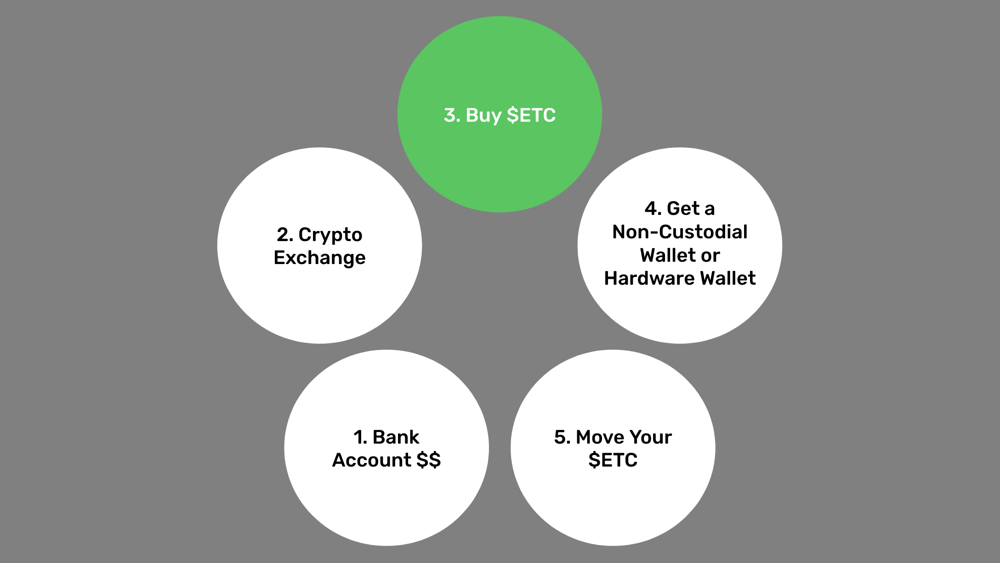
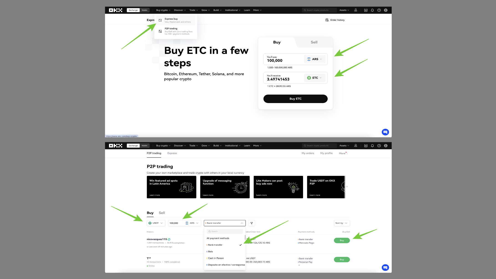
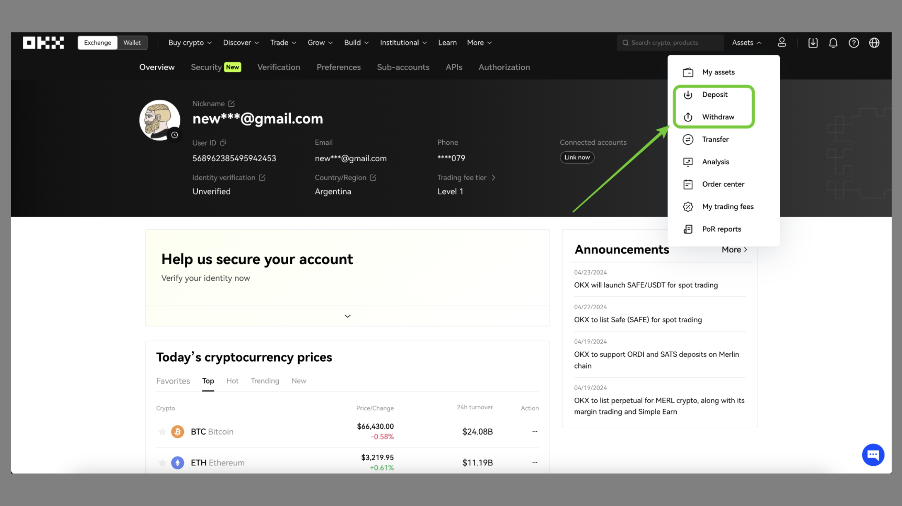
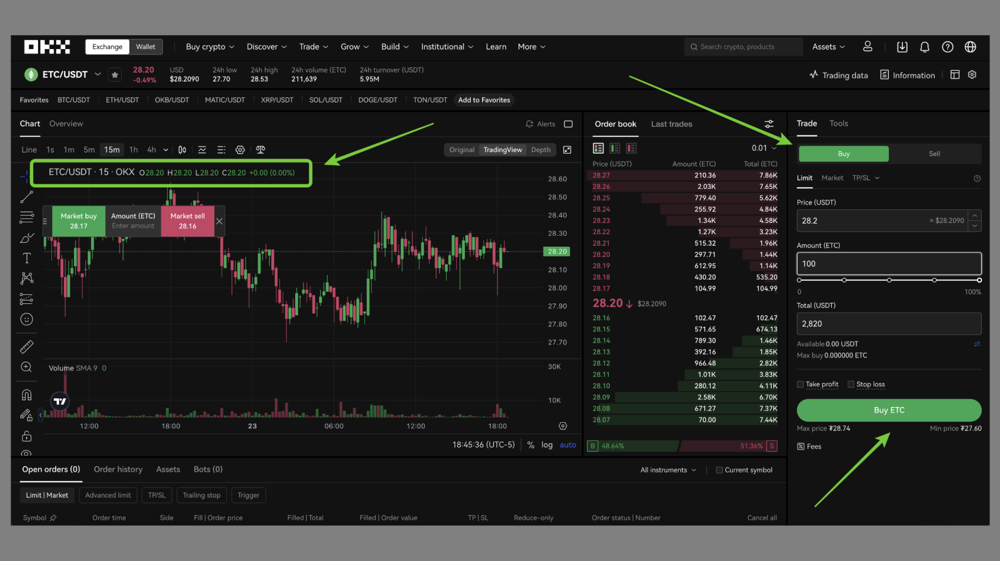
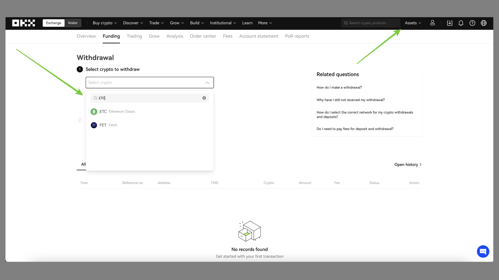

---
**由此收听或观看本期内容:**

<iframe width="560" height="315" src="https://www.youtube.com/embed/fWYUihAcuXs" title="YouTube video player" frameborder="0" allow="accelerometer; autoplay; clipboard-write; encrypted-media; gyroscope; picture-in-picture; web-share" allowfullscreen></iframe>

---

OKX is a centralized cryptocurrency exchange.

A centralized cryptocurrency exchange (CEX) is a virtual location on the internet that serves as a meeting point for trading crypto assets such as Bitcoin (BTC) and Ethereum Classic (ETC).

OKX provides its servers over the internet for its customers to open accounts, send money, and start exchanging BTC, ETC, Ethereum (ETH), and other tokens.

CEXs must follow regulations, so they may be very restrictive, demanding customers to present evidence of identity and residence, performing background checks, and asking what is the source of their funds.

Among the risks of centralized exchanges is that they may go bankrupt and customers may lose their deposits and assets.

OKX in particular is one of the largest cryptocurrency exchanges in the world, it started operations as OKCoin in China in 2013, and has subsequently evolved into a group of companies under the holding firm OK Group. Currently the exchange has its headquarters in the Seychelles, but serves customers in over 100 countries.

## Moving Your ETC to Non-Custodial Wallets

Although you may be using a centralized cryptocurrency exchange for buying and trading in Ethereum Classic, the best way to [manage your ETC](https://ethereumclassic.org/blog/2023-05-31-how-to-start-using-etc-from-scratch) is to buy them in the centralized exchanges but then moving them to [non-custodial wallets](https://ethereumclassic.org/blog/2023-05-04-ethereum-classic-course-20-what-are-custodial-and-non-custodial-wallets) that you control.

The steps are as follows:

1. You start with your cash in your bank account
2. You move your cash to the crypto exchange
3. You buy ETC at the crypto exchange
4. You get a non-custodial wallet or hardware wallet
5. You move all your ETC to your non-custodial wallet

The above method is the most secure method because you end up with your ETC on the blockchain directly, under your own control with your private keys, rather than at the centralized exchange, under their control.

In other words, it is more trust minimized.

## Opening an OKX Account

The first step to create your account on OKX will be to go to [OKX.com](https://www.okx.com/), then press on the “Sign up” button, and proceed with the next steps.

The next steps will involve a process of verification. OKX uses this system to comply with “Know Your Customer”, “Anti-Money Laundering”, and other laws in various countries.

The first thing OKX will ask you for is your personal information. If you live in the United States, OKX.com will reject your application as it only operates outside of the US. For this post, we will show how OKX works out of Argentina to provide a generic international account demonstration.

The first data point that they ask to open an account is your email address so they may send you a code to verify it. The next step is to verify your phone number in the same way.

Then, OKX will ask you for your country of residence and to verify your identity with a government ID and other information.

Again, all these steps are because they need to make sure they know you for compliance reasons.

## Depositing Crypto or Money to OKX

After creating your account on OKX, you can deposit crypto to it.

OKX does not have a feature to connect your local bank account in several countries. For fiat money it has a limited number of currencies that it accepts. These include Euro, Brazil Real, and the Australian Dollar.

However, to deposit crypto, OKX lets you use your credit or debit card and other local options to buy ETC and other cryptocurrencies through a service called “Express buy”. 

Alternatively, users may use the OKX P2P trading platform to buy a limited number of cryptos (only USDT, USDC, BTC, ETH, and DAI in the case of Argentina) and then have those deposited in their accounts.

For this post we will use the option of the P2P trading service.

To buy ETC in this way, you would first need to buy, for example, the stablecoin USDT on the OKX P2P platform.

## OKX as a Wallet

Many people around the world use OKX as their main wallet. This is not the best for securing your crypto as we explained above, but for keeping some of your crypto for trading or to make crypto payments it is acceptable.

It is always best to keep at least 80% of your crypto secure in self custody wallets or hardware wallets.

Nevertheless, OKX does have easy “deposit” and “withdraw” features for crypto in your country.

By using the OKX website or their mobile app, you may keep track of your holdings.

To see your assets on your OKX account you need to go to the “My assets” link.

## Buying ETC on OKX

Once you are all set with the OKX account and you moved USDT, for example, to it, then you will be ready to buy or trade ETC on the exchange.

This is because global crypto markets don’t trade in all the currencies of the world, but in a few reserve currencies, or against other major cryptocurrencies. However, most trade against the stablecoin that tracks the US dollar called “Tether” of which its symbol is ”USDT”.

If you move your local currency to USDT using the OKX “P2P trading” service, then you will be ready to purchase ETC!

To trade USDT for ETC go to the “Trade” menu item on the top horizontal menu. Then, select “Spot” to buy in the cash market, and then “USDT” if that is the stablecoin you have acquired to buy ETC. Then, type “ETC” in the search field provided.

In the next step, you will see the ETC/USDT trading pair screen on OKX with a chart and a ticket form on the right.

To buy ETC fill out the form with your desired amount and then press the “Buy ETC” button.

## Sending ETC

When you buy ETC on OKX they will probably become available to withdraw after your initial purchase of USDT is cleared in your local currency. After this, you will be able to send them to your non-custodial wallet or other destinations.

If you live in a jurisdiction that has instant bank transfers or other fast money transfer systems, you may have your purchased ETC available for withdrawal sooner.

The way to send your ETC to your non-custodial wallet or to any other destination is by clicking on the “Withdraw” link on the “Assets” menu.

Then, on the Withdrawal page, search and select ETC as the coin to send, put the ETC address you wish to send it to, and send it.

## Receiving ETC

To receive ETC, you need to go again to your OKX “Assets” menu, and then click on the “Deposit” link.

In the “Deposit” page, search and select ETC as the coin you wish to deposit, copy the address provided, and use it to send ETC to your account from your non-custodial wallet or to give it to third parties to send you ETC.

## Who Uses OKX for Buying and Selling ETC?

**Investors:** ETC is an excellent long term investment alternative. This has attracted many investors who use exchanges such as OKX to transfer their funds to exchange them for Ethereum Classic. However, these ETC buyers should think of moving their holdings to non-custodial wallets as explained before, so their assets may be more secure.

**Miners:** A segment that uses exchanges frequently to trade ETC are miners. Ethereum Classic miners earn an average of 17,000 ETC per day at the time of this writing, but they have to pay for their operations, which include payroll, data center costs, and electricity costs. For this they usually liquidate some of their daily earnings on exchanges such as OKX to transform them into cash to pay for their bills.

**Speculators:** Trading volumes on ETC are high globally and much of this is by speculators who trade daily on exchanges such as OKX. These participants are beneficial to the ecosystem as they provide liquidity to all other buyers and sellers.

**Merchants:** Although still small, the use of ETC for buying and selling things in the broader economy is growing. Merchants who let their customers purchase items with ETC will use centralized exchanges such as OKX to liquidate their holdings for paying for their business expenses.

---

**Thank you for reading this article!**

To learn more about ETC please go to: https://ethereumclassic.org
