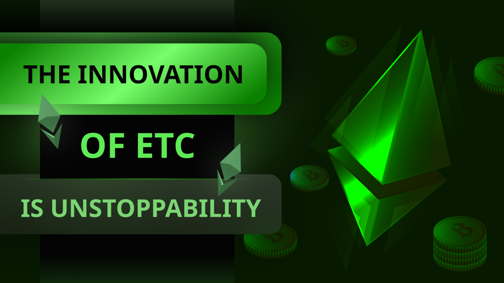

---
**You can listen to or watch this video here:**

<iframe width="560" height="315" src="https://www.youtube.com/embed/eaNNOLm3zPM" title="YouTube video player" frameborder="0" allow="accelerometer; autoplay; clipboard-write; encrypted-media; gyroscope; picture-in-picture; web-share" allowfullscreen></iframe>

---

In the previous class, 24, we explained that proof of work (POW) is not a voting mechanism but a competition to earn the rewards per block. We clarified that subjective systems such as “voting” are limited and subject to abuse, but that objective POW mining and consensus is more of a meritocracy and voluntary participation.

In this class, 25, we will explain one of the fundamental benefits of POW and how, applied to Ethereum Classic (ETC), produces the key innovation of this system when it was invented: Unstoppability of applications.

## The Innovations Enabled by Proof of Work

The new inventions in the blockchain industry are POW and smart contracts. Nothing more.

POW is the revolutionary technology that enabled Bitcoin’s innovation, which is sound internet money
and Ethereum Classic’s innovation, which is the unstoppability of applications.

As we wrote in [class 2](https://ethereumclassic.org/blog/2023-11-16-etc-proof-of-work-course-2-what-didnt-exist-was-a-secure-consensus-mechanism) of this course, proof of work’s amazing effect is true decentralization by being a signaling system that keeps the network of nodes insync in a totally decentralized manner.

POW provides the information necessary for any computer to know which is the correct block in each round and let’s them join and leave the network whenever they wish, permissionlessly, without any need to check with centralized managers or administrators of the system.

## Bitcoin’s Permissionlessness and Sound Internet Money

The new thing that Bitcoin brought to the world, powered by the proof of work consensus mechanism, was this permissionlessness that we mentioned in the previous section and sound internet money.

Cypherpunks [had been searching](https://ethereumclassic.org/blog/2023-01-05-ethereum-classic-course-3-the-first-digital-currency-attempts) for a way to produce trust minimized, scarce, and unforgeable money for a long time. One of the points that was crippling their attempts was the lack of a secure peer-to-peer network that would have higher security guarantees than traditional [Byzantine fault](https://en.wikipedia.org/wiki/Byzantine_fault) networks.

POW finally provided that signaling system that would make the network secure, and, with it, Bitcoin could provide a ledger with accounts and balances that would support a fixed monetary policy to produce an analogy of gold but on the internet, that would be transferable through communications channels.

## Ethereum Classic’s Permissionless Programmability

However, despite Bitcoin being such an amazing development, it couldn’t support smart contracts, which actually was [part of the vision](https://ethereumclassic.org/blog/2023-12-14-etc-proof-of-work-course-6-etc-is-btc-philosophy-with-eth-technology) of Satoshi Nakamoto.

As Ethereum Classic includes Bitcoin’s innovations of POW and a ledger with sound money and does support smart contracts, then ETC’s innovation is to add programmability to permissionlessness and sound internet money. 

With smart contracts inside Ethereum Classic, decentralized applications are much more secure than any type of application running on any other type of network, data center, or cloud service.

## Applications In ETC Are Unstoppable

Because ETC is essentially Bitcoin, but with smart contacts this means that its accounts, balances, and dapps are as immutable and permissionless as Bitcoin.

Arguably, ETC is more trust minimized than Bitcoin if we consider that, to use Bitcoin, apps must necessarily execute programs outside its highly secure internal environment. And, of course, they lose composability. 

ETC is more secure because the apps are hosted and executed inside its highly secure POW environment.

This means that applications in ETC are unstoppable, hence the motto “Code Is Law” that the community uses to describe its philosophy.

## The Additional Security of Composability

In the previous section we mentioned that applications in Bitcoin lose composability because they are hosted in external servers, in separate systems.

“Composability” in ETC means that, because all the decentralized applications are inside the same database and computing environment, complex multi application transactions may be sent and executed simultaneously in the network.

In systems that are separated, multi-application transactions have to be entered separately in each network and they can’t be executed simultaneously because the components are not aware of the state of the others.

In composable systems as ETC, then, transactions are much more secure because, not only are all dapps protected by the same POW environment, but there are no delays or latency between the components, thus the certainty and finality of the executions are much higher.

In non-composable systems, these certainties are impossible to reproduce.

## Applications in Ethereum Classic Are the Most Secure in the World

So, as ETC is Bitcoin but programmable, then what we wrote in class 16 of this course is affirmed;

*“In summary, Ethereum Classic is the environment where the most secure applications in the world will exist because it is a proof of work blockchain, therefore truly decentralized; it has a fixed monetary policy, therefore it is sound money; and it is programmable, therefore much more versatile and secure than the alternatives.*

*In addition to these qualities, ETC is a fully replicated blockchain, which increases its safety; and composable, which reduces risks and settlement costs; and is the largest one in the world with this combined design!*

*These attributes in the same integrated system provide the highest level of decentralization, thus trust minimization, thus security for any application hosted in it.”*

---

**Thank you for reading this article!**

To learn more about ETC please go to: https://ethereumclassic.org
