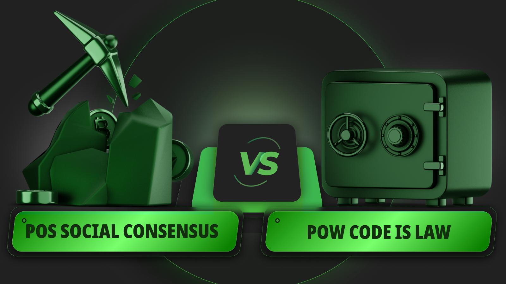
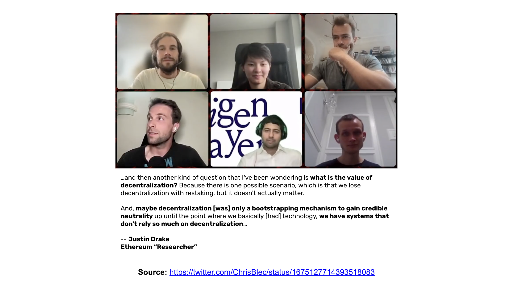
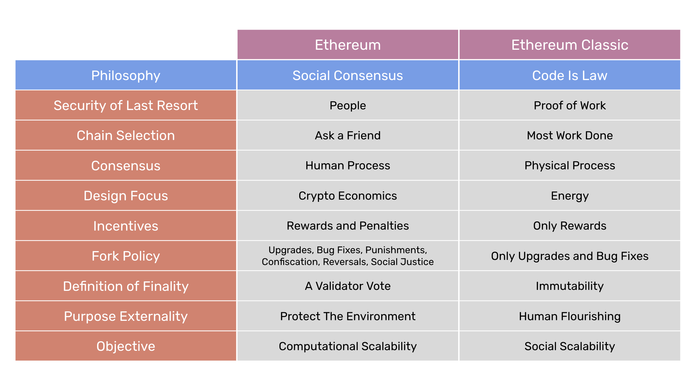

---
**You can listen to or watch this video here:**

<iframe width="560" height="315" src="https://www.youtube.com/embed/AfJBOtaEujo" title="YouTube video player" frameborder="0" allow="accelerometer; autoplay; clipboard-write; encrypted-media; gyroscope; picture-in-picture; web-share" allowfullscreen></iframe>

---

In the previous class, 25, we explained the fundamental benefits of proof of work (POW) and how, applied to Ethereum Classic (ETC), it produces the key innovation of this blockchain when it was invented: Unstoppability of applications.

In this class, 26, we will explain a related topic to “unstoppability” which is the difference in philosophies between a network such as ETC and another such as Ethereum (ETH).

ETH has a philosophy called “Social Consensus” which made it lose a great part of its security, thus making it largely a centralized system.

ETC’s philosophy is called “Code Is Law” which keeps it inline with the ethos of decentralization, immutability, and censorship resistance.

Following we will explain the differences between “Social Consensus” and “Code Is Law”.

## Ethereum Reframed the “Decentralization” Narrative

Because POS is centralized, the Ethereum “community” began reframing the “decentralization” narrative and using the term “Social Consensus”.

In their view decentralization was just a phase in the history of Ethereum to gain trust from the public. After this phase, their vision is that they will rely on something they invented called “credible neutrality”.

This means that the world should believe in the neutrality of the Ethereum community of developers, the staking elites, and the Ethereum Foundation for the management of the system.

In a way, they are implicitly saying something like “let’s keep acting as if Ethereum is decentralized so people keep believing it is secure”.

As evidence of these machinations, in this section we show [a conversation](https://twitter.com/ChrisBlec/status/1675127714393518083) Ethereum founder, Vitalik Buterin, had with Ethereum developers in July of 2023. 

## Social Consensus in a Nutshell

Social Consensus means that “the community” decides when things are wrong, according to their worldviews, so they can change things by social consensus. 

This is, by irregular state changes, changing account balances manually, deleting dapps, censoring “bad actors”, and things like that.

Basically, social consensus brings back in full force the trusted third parties that blockchains were supposed to minimize.

The philosophy by Cypherpunks was that wherever trust was deposited, that trust was going to be abused. It is just human nature.

Social consensus is a sort of gas light argument that says that now wherever trust is deposited, it will not be abused for some magical reason.

## Code Is Law Is True Decentralization

POW is “Code Is Law” which is exactly the opposite. 

Where Social Consensus believes "people are good", Code Is Law believes "trusted third parties are precisely the problem we are trying to solve!"

Code Is Law is a set of principles that are at the top of blockchain design. Everything flows down from the philosophy, or is downstream from the principles.

This kind of mindset only produces rules at the protocol layer that seek to minimize the influence of people or communities as much as possible.

Code Is Law relies primarily on objective physical forces to protect the system.

The decentralization enabled by proof of work, which is designed into the system precisely because of the philosophy of Code Is Law, makes the network trust minimized, thus secure, thus immutable.

## Comparison Table

In this section we show a table we described in [a post](https://ethereumclassic.org/blog/2023-01-25-ethereums-social-consensus-vs-ethereum-classics-code-is-law) we published in January of 2023 where we laid out the differences between Social Consensus and Code Is Law. Below we briefly explain each line in the table.

**Security of Last Resort:** In Social Consensus the belief is that people are the ones who have to deal with security and solve any problems that may arise on the blockchain. In Code Is Law the ultimate resolution is proof of work. Deciding each block in each round is determined by the work done, not by subjective community decisions. If there are conflicts or hacks to smart contracts, those must be resolved off-chain by the parties, but the chain remains immutable.

**Chain Selection:** When new entrants wish to join the network, or when nodes leave and need to connect again, Social Consensus doesn’t have an objective decentralized way to inform them. They need to check with public websites, a friend, or other trusted parties. In Code Is Law, the accumulated proof of work, or “most work done” rule, always determines which is the chain to follow.

**Consensus:** In a Social Consensus system, the way of deciding each block in each round is by a human process that involves a 2/3rds vote from staking validators because networks that don’t use proof of work may be attacked by only 1/3 of dishonest participants. In Code Is Law, consensus is reached with a purely physical and objective process. No voting takes place nor human agency.  

**Design Focus:** The design focus of the safety of Social Consensus systems depends on what they termed “crypto economics” which is basically human financial incentives of the staking elites. In Code Is Law blockchains the design focus to make the system safe is the brute force and sheer energy used to build the POW stamps per block.

**Incentives:** In Social Consensus, the incentives to keep the system secure revolve around rewards to follow the rules and penalties for sending blocks outside of the protocol. This method, coupled with the purely human based and subjective consensus design, is prone to conflict and instability. In Code Is Law, there are only rewards, and all are incentivized to run and win a race of efficiency and computing power.

**Fork Policy:** In Social Consensus systems, because they are prone to centralization and governed by staking and other elites, voluntary forks are motivated not only by desired upgrades and bug fixes, but also by political goals such as punishments, confiscation, reversals, and social justice issues. In Code Is Law, anything that is not desired upgrades or fixing bugs will usually be thoroughly rejected.

**Definition of Finality:** In Social Consensus, finality is defined by a vote of the staking elites. However, this is extremely weak as the chain has no work done, so these participants may trivially make changes and reverse the chain whenever they wish. In Code Is Law, the blockchain is immutable because it is extremely difficult to reverse the chain as to do so would require to do the work all over again.

**Purpose Externality:** In terms of externalities, the philosophy of Social Consensus seeks to conform to political ideologies such as climate change. This was the main driver to create proof of stake as a blockchain consensus mechanism in Ethereum. In Code Is Law, all the design focus and principles are geared toward human flourishing.

**Objective:** Social Consensus seeks for the system to be as scalable as possible regardless of risk and centralization. Any problems that may arise may be solved by decisions at the social layer. In Code Is Law, the objective is to provide social scalability so anyone may use the system freely without risks of censorship or the need of permission by central administrators.

---

**Thank you for reading this article!**

To learn more about ETC please go to: https://ethereumclassic.org
