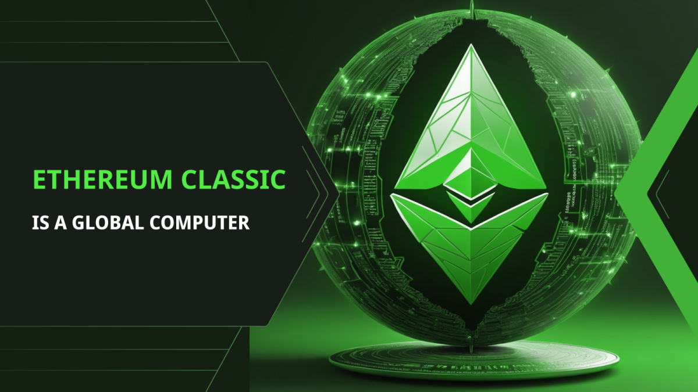

---
**由此收听或观看本期内容:**

<iframe width="560" height="315" src="https://www.youtube.com/embed/kAFzF90DTtY" title="YouTube video player" frameborder="0" allow="accelerometer; autoplay; clipboard-write; encrypted-media; gyroscope; picture-in-picture; web-share" allowfullscreen></iframe>

---

## 比特币作为支付系统

正如我们在[之前的帖子](https://ethereumclassic.org/blog/2024-05-28-bitcoin-is-a-pocket-calculator-ethereum-classic-is-a-computer)中所指出的，比特币的惊人发明实际上并不是数字货币、点对点网络，甚至不是工作证明（POW）。真正的发明是利用工作证明本身作为共识机制，从而在一个真正去中心化的点对点网络中实现健全的数字货币。

工作证明的共识机制打开了一扇门，使得全球范围内的计算机可以在无需中央仲裁者或管理员的情况下同步数据状态。

这是改变一切的关键发现。

然而，比特币是一个非常基本的系统。它只是将硬币从一个账户转移到另一个账户。仅此而已！

因此，可以说比特币实际上是一个支付系统。

## 以太经典作为全球电脑

区块链技术的下一代将是与比特币相同但可编程的。

这就是以太经典（ETC）的设计理念。

ETC具有与比特币相同的基本结构，但包括智能合约。智能合约是由一种称为以太坊虚拟机（EVM）的技术启用的，它使用了一种名为 Solidity 的图灵完备编程语言，以及一种称为 Gas 系统的交易费支付机制。

综合考虑，这些组件在比特币的基本结构之上创建了一个全球计算系统，可用于编程协议的货币。

因此，ETC是一个去中心化的全球电脑，而不是一个支付系统。

## ETC 的局限性

然而，ETC 可能不能被视为一个去中心化的云服务。

传统的中心化云服务将大量的计算能力和存储容量提供给了企业和公众。

这些基础设施可以轻松处理和处理大数据、人工智能和机器学习应用程序。这些技术需要充足的计算能力和数据存储。

ETC，因为所有信息和软件程序的执行必须完全在网络中的所有计算机中复制和并行处理，以保持去中心化，因此非常低效，因此具有有限的数据存储和计算能力。

## 社会可扩展性

然而，这种计算和存储的低效性实际上是有目的的！

在ETC中存在着计算可扩展性与[尼克·萨博](https://en.wikipedia.org/wiki/Nick_Szabo)所谓的[社会可扩展性](https://unenumerated.blogspot.com/2017/02/money-blockchains-and-social-scalability.html)之间的有意取舍。

社会可扩展性意味着系统是无需许可的和抗审查的。这意味着世界上任何人都可以使用它，只要他们遵循协议规则，他们就不会在访问上受到限制。

传统系统可能在计算上扩展以处理大量的计算和数据任务，每天处理大量的交易量，但是因为它们必须集中以提供这种效率，所以它们将根据政治正确性和意识形态偏见施加限制和障碍。

ETC消除了这些障碍，但以计算和数据可扩展性为代价。

## 去中心化应用

因此，如果ETC是一个去中心化的、安全的、无法审查的全球电脑，但效率低下，那它有什么用呢？

事实证明，由于ETC的安全性，仍然有许多有价值的用例。

一些例子可能包括：

**去中心化交易所：** 去中心化交易所是ETC中的关键基础设施，它们提供了一种无需信任第三方的风险和限制的资产交换方式。

**稳定币：** 稳定币已经被证明是一个巨大的用例，特别是在第三世界国家，人们需要一种获取稳定货币的方式，以对冲其急剧贬值的国家货币。

**NFT：** NFT也是关键基础设施，因为它们不仅可以用来代表可以在区块链上交易的艺术作品，还可以代表许多其他类型的资产，甚至是现实世界中的资产。

**资产登记：** 在区块链上可以被表示为NFT的一些资产是房地产和车辆。这些资产将在区块链上购买和销售，资产所有权和针对它们的贷款将在同一操作上无缝执行，将结算时间从天、周或月缩短到秒。

## Web 3

谈到用例，一个去中心化可编程区块链或全球电脑如ETC的应用就是作为去中心化网络应用程序的后端代码。

去中心化网络应用程序或Web 3的概念源于对第一批网站是静态的理解，因此被称为Web 1。然后，社交媒体网站通过启用动态用户生成内容彻底改变了世界的方式，因此被称为Web 2。而下一代将是一个具有去中心化、无法审查的应用程序的网络，这就是为什么它被称为Web 3。

ETC作为一个全球电脑，将作为这些应用程序的核心代码，处理安全性和基础价值，而其他去中心化网络则提供文件存储、图像管理、交易可扩展性等功能。

## 区块链行业的分层未来

随着所有这些不同的组件的发展，区块链行业的拓扑结构将越来越像一个分层的生态系统，其中ETC很可能是一个基础层的安全技术，将处理后端代码和大量的价值。

在这个基础层之上，将会有权益证明和可扩展性解决方案，它们将实现更大规模的小额交易。还将有文件存储和其他解决方案，它们将实现Web3的全部愿景。

在这第二层之上，第三层的去中心化应用程序将提供端用户服务，例如去中心化交易所、存款和贷款服务、NFT、稳定币和资产登记等等。

最后，第四层，或用户面向的层，将是用户用来与所有这些系统进行交互的钱包Web和移动应用程序。

---

**感谢您阅读本文！**

要了解更多关于ETC的信息，请访问：https://ethereumclassic.org
