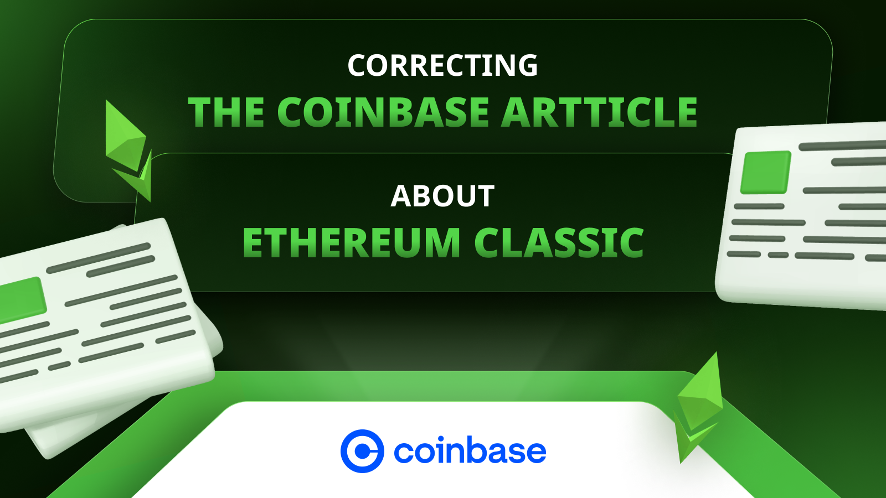

加密货币交易所[Coinbase](https://coinbase.com) 有两篇关于以太坊经典（ETC）的文章，标题为“什么是以太坊经典”和“关于以太坊经典”，可以通过以下链接访问：

什么是以太坊经典：

https://help.coinbase.com/en/coinbase/getting-started/crypto-education/what-is-ethereum-classic

关于以太坊经典：

https://www.coinbase.com/price/ethereum-classic

这两篇文章的内容都包含一些有用的信息，但其中部分内容存在错误或常见的误解，我们希望澄清这些问题。

此外，我们还希望增加一些内容，以更全面地反映 ETC，同时尊重 Coinbase 的报告格式和风格。

在以下部分中，我们将逐一分析 Coinbase 两篇文章的陈述，提出修正的语句和补充内容，并解释我们进行这些更改和补充的理由。

## 文章：什么是以太坊经典？

**Coinbase 的陈述：**

以太坊经典是一种数字货币，是在 2016 年 7 月以太坊区块链硬分叉的结果。一个名为 DAO 的组织（利用了以太坊的智能合约功能）遭到攻击，导致以太坊基金会决定实施硬分叉。此次硬分叉回滚了所有与 DAO 相关的交易，并允许原智能合约的贡献者提取他们的资金。

硬分叉创建的新区块链继承了以太坊的名称，并继续由以太坊基金会开发团队维护。社区的剩余部分继续运行原始的以太坊区块链，该区块链后来被称为“以太坊经典”。

**我们的修正和补充：**

以太坊经典是最初的以太坊区块链，于 2014 年至 2015 年间创建，并于 2015 年 7 月 30 日上线。2016 年 7 月，今天所知的“以太坊”网络从主网（今天称为“以太坊经典”）分离出来。

一个名为 DAO 的组织（利用了以太坊的智能合约功能）遭到攻击，导致以太坊基金会决定实施硬分叉。此次硬分叉回滚了所有与 DAO 相关的交易，并允许原智能合约的贡献者提取他们的资金。

硬分叉创建的新区块链继承了“以太坊”的名称，并继续由以太坊基金会开发团队维护。社区的剩余部分继续运行原始的以太坊区块链，该区块链后来被称为“以太坊经典”。

**理由：**

Coinbase 的这篇文章在大部分内容上是正确的，但仍然存在一个常见的误解，即以太坊经典（ETC）是 2016 年硬分叉的结果。然而，在第二段中已经很好地描述了 ETC 是原始链！

## 文章：关于以太坊经典

### 部分：简介

**Coinbase 的陈述：**

以太坊经典是一种特别关注不可变性的加密货币，常被表达为“代码即法律”。

**我们的修正和补充：**

无变化。

**理由：**

这是一个非常好的标语，用来开始对 ETC 的专业解释。

### 部分：什么是以太坊经典？

**Coinbase 的陈述：**

以太坊经典（ETC）是一个去中心化、开源的区块链网络，于 2016 年 7 月在以太坊网络经历了一次硬分叉后诞生，这次分叉改变了区块链的协议或基本规则，创建了两个独立的区块链：以太坊（ETH）和以太坊经典（ETC）。虽然有时会与以太坊混淆，但以太坊经典现在是一种完全不同的加密货币，具有不同的技术和哲学目标，特别是专注于不可变性，常被表达为“代码即法律”。以太坊经典的建立是为了在一次重大黑客事件后维护原始以太坊区块链的完整性。网络的主要角色是作为智能合约网络，促进去中心化应用程序（DApps）的开发和支持。ETC 是以太坊经典的原生货币，用于为网络上的交易和智能合约提供动力。以太坊经典努力在不人为逆转 DAO 黑客事件结果的情况下维护原始以太坊区块链。它采用工作量证明（PoW）挖矿算法，并不打算像以太坊那样转向权益证明（PoS）共识机制。以太坊经典是一个去中心化的计算系统，可以运行各种应用程序。

**我们的修正和补充：**

以太坊经典（ETC）是一个去中心化、开源的区块链，也是最初的以太坊网络，于 2015 年 7 月上线。今天所知的“以太坊”是在 2016 年网络经历了一次硬分叉后出现的，这次分叉改变了区块链的协议或基本规则，创建了两个独立的区块链：以太坊（ETH）和以太坊经典（ETC）。虽然有时会与以太坊混淆，但以太坊经典现在是一种完全不同的加密货币，具有不同的技术和哲学目标，特别是专注于不可变性，常被表达为“代码即法律”。以太坊经典的建立是为了在一次重大黑客事件后维护原始以太坊区块链的完整性。网络的主要角色是作为智能合约网络，促进去中心化应用程序（DApps）的开发和支持。ETC 是以太坊经典的原生货币，用于为网络上的交易和智能合约提供动力。以太坊经典努力在不人为逆转 DAO 黑客事件结果的情况下维护原始以太坊区块链。它采用工作量证明（PoW）挖矿算法，并不打算像以太坊那样转向权益证明（PoS）共识机制。以太坊经典是一个去中心化的计算系统，可以运行各种应用程序。

**理由：**

我们在本节的初始部分进行了修正，指出 ETC 是原始区块链，而以太坊是 DAO 硬分叉的结果。本节的其余部分是完美的。

### 部分：以太坊经典如何工作？

**Coinbase 的陈述：**

以太坊经典使用类似于比特币的工作量证明（PoW）共识算法运行。与以太坊及其原生单位 ETH 类似，以太坊经典用户支付 ETC 费用来执行智能合约，你可以将其视为保持整个系统运行的燃料（这就是为什么这些费用被称为“gas”）。矿工利用他们的硬件解决复杂的数学方程并验证以太坊经典网络上的交易。第一个解决方程并验证新区块的矿工将获得 ETC 代币形式的区块奖励。每两周，网络会自动修改以太坊经典的挖矿难度，以保持一致的区块生产率。新难度由网络的总计算能力决定，随着越来越多的矿工加入网络，挖掘 ETC 变得越来越困难。与 ETH 类似，新的 ETC 作为矿工的奖励在新的交易区块被添加到区块链时发行到流通供应中。然而，与没有固定供应量的 ETH 不同，ETC 的最大供应量为 210,700,000 枚代币。

**我们的修正和补充：**

以太坊经典使用与比特币类似的工作量证明（PoW）共识算法。与以太坊及其原生单位 ETH 类似，以太坊经典用户支付 ETC 费用来执行智能合约，你可以将其视为保持整个系统运行的燃料（这就是为什么这些费用被称为“gas”）。矿工利用他们的硬件，进行大量的计算工作，消耗大量电力，为每个区块产生一个加密戳或哈希，验证以太坊经典网络上的交易。第一个达到协议规定的目标哈希并验证新区块的矿工将获得以太坊经典代币形式的区块奖励和该区块的交易费用。ETC 根据每个区块的基础进行目标难度调整，以维持一致的区块生产速率。新的难度由网络的总计算能力确定，随着更多矿工加入网络，挖掘 ETC 变得越来越具有挑战性。与 ETH 类似，新的 ETC 作为矿工的奖励发行到流通供应中，随着新的交易区块被添加到区块链。然而，不同于没有固定供应量的 ETH，ETC 的最大供应量为 210,700,000 枚代币。

**理由：**

以太坊经典中的矿工并不是在 PoW 中解决复杂的数学方程，他们只是使用基本的加密功能尝试多次达到协议规定的目标哈希。

矿工以区块奖励和交易费用的形式获得 gas。

ETC 实际上是根据每个区块基础调整挖掘难度，而不是像比特币那样每两周调整一次。

### 部分：以太坊经典的潜在用例是什么？

**Coinbase声明：**

以太坊经典的主要用例是作为去中心化应用程序（DApps）和智能合约的平台。它努力维护“法律即代码”的原则，抵制审查并提供无法停止的应用程序。这将其定位为未来智能合约平台的潜在基础层。以太坊经典还通过保留其原始的PoW算法并遵循其去中心化的理念来区别于以太坊。

**我们的修正和补充：**

以太坊经典的主要用例是作为去中心化应用程序（DApps）和智能合约的平台。它努力维护“法律即代码”的原则，抵制审查并提供无法停止的应用程序。这将其定位为未来智能合约应用程序或去中心化应用程序（DApps）的潜在基础层，或基础层或第一层（L1）区块链。以太坊经典还通过保留其原始的PoW算法并遵循其去中心化的理念来区别于以太坊。以太坊寻求可扩展性并通过社区来保护网络，他们称之为“社会共识”。这使得以太坊经典非常适合高度安全的应用程序，而以太坊则适用于低安全但高交易量的应用程序。

**理由：**

ETC被定位为未来智能合约应用程序或去中心化应用程序（DApps）的潜在基础层，或基础层或第一层（L1）区块链。

我们补充了ETH寻求可扩展性并通过社区来保护网络的部分，他们称之为“社会共识”。这使得ETC非常适合高度安全的应用程序，而以太坊则适用于低安全但高交易量的应用程序。

### 部分：以太坊经典的历史是什么？

**Coinbase声明：**

以太坊经典于2016年7月作为以太坊的硬分叉引入，这是对以太坊协议的根本性更改，导致了两个分支，一个遵循先前的协议（以太坊），另一个遵循新版本（以太坊经典）。这次分叉源于以太坊社区内关于如何解决导致360万ETH被盗的重大黑客攻击的分歧。那些不同意将区块链回滚以抵消黑客攻击影响的决定的人继续使用原始链，即以太坊经典，而其他用户则升级到最新版本的以太坊。以太坊经典在技术路线图和哲学上已经与以太坊分道扬镳。

**我们的修正和补充：**

以太坊经典是原始的以太坊区块链，于2015年7月推出。今天所知的“以太坊”是在2016年作为对原始链的硬分叉而创建的，这是对以太坊协议的根本性更改，导致了两个分支，一个遵循先前的协议（以太坊经典），另一个遵循新版本（以太坊）。这次分叉源于以太坊社区内关于如何解决导致360万ETH被盗的重大黑客攻击的分歧。那些不同意将区块链回滚以抵消黑客攻击影响的决定的人继续使用原始链，即以太坊经典，而其他用户则升级到最新版本的以太坊。以太坊经典在技术路线图和哲学上已经与以太坊分道扬镳。

**理由：**

这一部分的第二部分是正确的，但我们修改了第一部分以反映ETC是原始链，以太坊是从主网分离并于2016年创建的事实。

### 部分：ETC的挖掘方式是怎样的？

**Coinbase声明：**

强大的计算机挖掘（即“创造”）ETC，并将其添加到流通供应中。虽然可以使用广泛可用的图形处理器来挖掘以太坊经典，但除非使用专门用于加密挖掘的ASIC（专用设备），否则很可能不会有利可图。在2016年以太坊经典从以太坊分叉之后，以太坊经典在市场资本化、开发人员和网络安全方面的竞争一直很困难，这些都是以总挖掘力为衡量标准的。在其历史上，以太坊经典已经遭受了许多“51%攻击”，恶意行为者控制了大部分挖掘力，因此可以花费他们不拥有的硬币（也称为双重花费攻击）。

**我们的修正和补充：**

强大的计算机挖掘（即“创造”）ETC，并将其添加到流通供应中。虽然可以使用广泛可用的图形处理器来挖掘以太坊经典，但除非使用专门用于加密挖掘的ASIC（专用设备），否则很可能不会有利可图。在2016年以太坊从以太坊经典分叉之后，以太坊经典在市场资本化、开发人员和网络安全方面的竞争一直很困难，这些都是以总挖掘力为衡量标准的。在其历史上，以太坊经典已经遭受了许多“51%攻击”，恶意行为者控制了大部分挖掘力，因此可以花费他们不拥有的硬币（也称为双重花费攻击）。然而，ETC已经成为世界上最大的工作量证明智能合约区块链，因此不太可能像以前那样受到攻击。

**理由：**

我们更正了关于ETC从ETH分叉的部分，并写入ETH从ETC分叉的内容。然后我们添加了一条评论，描述了ETC已经成为最大的工作量证明智能合约区块链，因此不太可能像以前那样受到攻击。

### 部分：如何购买ETC？

**Coinbase声明：**

您可以通过像Coinbase这样的交易所购买、发送和接收ETC。

**我们的修正和补充：**

本节未提出任何更改。

**理由：**

我们在本节中没有进行任何更正！

### 部分：以太坊经典分叉和DAO事件背后的历史是什么？

**Coinbase声明：**

以太坊经典的历史与数字资产领域的一件值得关注的事件密切相关，这就是DAO事件。在2016年，一个名为“The DAO”的去中心化自治组织在以太坊区块链上启动了。DAO是一个雄心勃勃的项目，旨在利用以太坊的智能合约功能创建一个向全球任何人开放的全球倡议。然而，在其启动几个月后，黑客利用了The DAO代码中的漏洞，并窃取了大量以太币。这一事件引发了以太坊社区内部的激烈辩论，讨论如何应对。大多数人的目标是实施一项硬分叉，这是一个独特的解决方案，涉及改变区块链的代码以返还被窃取的资金。这个决定引起了争议，因为它违反了区块链不可变性的原则。那些不同意硬分叉的人继续使用原始未更改版本的以太坊区块链，这就是后来被称为以太坊经典的区块链。DAO事件和随后的分叉是以太坊历史上值得注意的时刻，影响了其持续发展和当前对区块链安全和项目资金的方法。

**我们的修正和补充：**

以太坊经典和以太坊的历史与数字资产领域的一件值得关注的事件密切相关，这就是DAO事件。在2016年，当时以太坊和以太坊经典是同一个网络时，一个名为“The DAO”的去中心化自治组织在以太坊区块链上启动了。DAO是一个雄心勃勃的项目，旨在利用以太坊的智能合约功能创建一个向全球任何人开放的全球投资基金。然而，在其启动几个月后，黑客利用了The DAO代码中的漏洞，并窃取了大量以太币。这一事件引发了以太坊社区内部的激烈辩论，讨论如何应对。大多数人的目标是实施一项硬分叉，这是一个独特的解决方案，涉及一种非常规的状态更改，将资金从黑客地址移回以返还被窃取的资金。这个决定引起了争议，因为它违反了区块链不可变性的原则。那些不同意硬分叉的人继续使用原始未更改版本的以太坊区块链，这就是后来被称为以太坊经典的区块链。DAO事件和随后的分叉是以太坊历史上值得注意的时刻，影响了其持续发展和当前对区块链安全和项目资金的方法。

**理由：**

在本节开始部分，我们添加了语言以表明ETC和ETH的历史在DAO硬分叉之前是相同的。我们还澄清了DAO是一种全球投资基金。

硬分叉的“解决方案”是进行一种非常规的状态更改，从黑客地址中移除资金以返还给原始的DAO投资者。

本节的最后部分写得很好。

### 部分：以太坊经典的技术和共识机制（工作量证明）是如何运作的？

**Coinbase声明：**

以太坊经典使用一种称为工作量证明（PoW）的共识机制来验证和记录其网络上的交易。 PoW利用计算能力来维护网络安全。它在维护区块链的完整性、促进安全性和实用性方面发挥着关键作用。在以太坊经典中，挖矿者进行计算工作，以使用加密戳封存一个新的交易批次或区块。然后将此工作发送到网络的其他部分进行验证并包含在链中。此过程是去中心化和无需许可的，意味着全球任何节点都可以参与，无论其国家、种族、宗教、语言或政治如何。以太坊经典打算继续利用PoW作为其共识机制，重点在于保持其去中心化性质和网络安全。

**我们的修正和补充：**

以太坊经典使用一种称为“中本聪共识”的基于工作量证明的共识机制来验证和记录其网络上的交易。 PoW利用计算能力来维护网络安全。它在维护区块链的完整性、促进安全性和实用性方面发挥着关键作用。在以太坊经典中，挖矿者进行计算工作，以使用加密戳封存一个新的交易批次或区块。然后将此工作发送到网络的其他部分进行验证并包含在链中。此过程是去中心化和无需许可的，意味着全球任何节点都可以参与，无论其国家、种族、宗教、语言或政治如何。以太坊经典打算继续利用PoW作为其共识机制，重点在于保持其去中心化性质和网络安全。

**理由：**

在这一节中，我们仅在第一行进行了修正，添加了“中本聪共识”作为ETC使用的共识机制的官方名称。本节的其余部分写得非常正确！

### 部分: 智能合约在以太经典区块链上扮演什么角色？

智能合约在以太经典区块链上的作用是监督协议的自治软件应用程序。这些协议可以简单到高度复杂不等。智能合约的概念是由Nick Szabo引入的，早于区块链技术。智能合约本质上是计算机化的交易协议，执行合同条款。它们致力于满足常见的合同条件，减少异常情况，并减少对信任中介的依赖。以太经典（ETC）作为智能合约的平台，使其能够处理众多协议，并注重可靠性和最小化信任的操作。ETC智能合约具有相互交互的能力，这是其设计范围内的一个特点。它们有潜力简化现有的协议，并促进由于开销而具有挑战性的合同。ETC智能合约也被称为去中心化应用程序或dapps。

**理由：**

这一部分大体上是正确的，但我们用"最小化信任"替换了"无需信任"，因为用户仍需要信任ETC的节点运营者和矿工，包括他们的地址、余额和dapps。

### 部分: “开发者可以在以太经典上构建去中心化应用程序（DApps）吗?”

**Coinbase声明：**

是的，开发人员有能力在以太经典上构建去中心化应用程序（DApps）。以太经典包括一个去中心化的图灵完备虚拟机，称为以太虚拟机（EVM），它可以使用一个国际公共节点网络执行脚本。以太经典为开发人员构建DApps提供了必要的工具和功能。它是以太坊区块链的一个版本，其规则和功能略有不同。

**我们的修正和补充：**

是的，开发人员有能力在以太经典上构建去中心化应用程序（DApps）。以太经典包括一个去中心化的图灵完备虚拟机，称为以太虚拟机（EVM），它可以使用全球公共节点网络执行脚本。以太经典为开发人员构建DApps提供了必要的工具和功能。它是以太坊区块链的一个版本，其规则和功能略有不同。

对于开发人员在ETC上构建他们的dapps的好处包括：

- ETC是一个工作量证明的区块链，这使得它真正去中心化和最小化信任，因此DApps为用户提供了安全性和信心。
- ETC是硬货币，因此它会随着时间的推移保持其价值。
- ETC是可编程的，因此在其高度安全的工作量证明环境中具有实用性和治理代币的有价值dapps可以构建。
- ETC是完全复制的，这使得它在全球范围内极其冗余，使得dapps无法被审查，并能够在核战争中生存！
- ETC是可组合的，这意味着可以构建DApp系统，DApps可以与第三方DApps互动，ETC可以一次执行多个应用程序交易，节省gas费用，减少结算时间，增加用户的便利性。
- ETC是世界上最大的工作量证明智能合约区块链，这意味着它极其安全且难以攻击，从而使得DApps更加稳定和持久。
- 因为ETC是工作量证明、可编程、硬货币、完全复制、可组合且在其领域最大，这意味着ETC中的DApps将是世界上最安全的应用程序。

**理由：**

我们将"international"替换为"global"，因为在真正去中心化的区块链（ETC）中，这些公共节点的国籍或司法管辖权是无关紧要的。

我们添加了7个原因，强调了为什么DApp开发人员会选择使用ETC。

### 部分：以太经典网络中实施了哪些更新或变更？

**Coinbase声明：**

以太经典目前拥有一系列功能和兼容性，包括提高网络效率和减少ASIC挖矿影响。一些值得注意的更新包括实施Thanos硬分叉，旨在提高网络效率和减少ASIC挖矿影响。此次更新引入了新功能，如改进的难度调整算法和改进的安全措施。以太经典还致力于通过项目如ECIP-1103来提高与其他区块链的互操作性，该项目专注于跨链通信。另一个值得注意的更新是Spiral更新，计划于2024年1月31日实施。此次更新旨在使以太经典与EVM标准保持一致，促进合约开发和迁移。这些发展努力改善以太经典的整体功能和可用性，使其成为更强大和多功能的平台，用于构建和部署去中心化应用程序。

**我们的更正和补充：**

以太经典目前拥有一系列功能和兼容性，包括提高网络效率和减少ASIC挖矿影响。一些值得注意的更新包括实施Thanos硬分叉，旨在提高网络效率和减少ASIC挖矿影响。此次更新引入了新功能，如改进的难度调整算法和改进的安全措施。以太经典还致力于通过项目如ECIP-1103来提高与其他区块链的互操作性，该项目专注于跨链通信。

以太经典将始终遵循EVM标准。为此，它会不断升级网络，通常是在以太坊升级后约6个月，但仅实施符合其不可变性理念并能够尽可能与EVM标准保持一致的更改。

以太经典的协议升级历史包括：

- Gas重新定价（2016年）
- 哥谭（2017年）
- 亚特兰蒂斯（2019年）
- 阿加尔塔（2020年）
- 凤凰（2020年）
- MESS（2020年）
- Thanos（2020年）
- 玛格尼托（2021年）
- 神秘（2022年）
- 螺旋（2024年）

这些发展努力改善以太经典的整体功能和可用性，使其成为更强大和多功能的平台，用于构建和部署去中心化应用程序。

**修正原因：**

我们删除了关于Spiral升级的信息，因为该升级已经实施。

我们添加了有关ETC升级历史的信息。

### 部分：在以太经典网络中，尤其考虑到其工作证明共识机制，如何维护安全性？

**Coinbase声明：**

以太经典通过一种称为工作证明（PoW）的共识机制维护其网络安全性。这种机制是过去使用过的一种方法，实质上是将电力转化为安全性。这是比特币等第一个流行的区块链中使用的相同机制。从经济博弈论的角度看，一些人认为PoW具有经验和理论上的安全性。在有足够算力的情况下，PoW链表现出了韧性。以太经典旨在继续利用PoW，致力于去中心化和安全性。然而，与所有系统相同，PoW也有其局限性。它容易受到51%攻击的影响，以太经典在多个场合都经历过这种攻击。在对PoW系统的某些解释中，51%攻击被视为一种特性而非错误，接受这种攻击是对哪个版本的链可以被认为“正确”的客观计算机可验证规则的承认。以太经典对PoW和去中心化的方法使其与其他采用不同共识机制（如权益证明）的网络区分开来。

自从以太坊迁移到权益证明共识机制后，以太经典已成为全球最大的工作证明智能合约区块链，这使其比以前更不容易受到51%攻击的威胁。

**我们的更正和补充：**

以太经典通过一种称为工作量证明（PoW）的共识机制来维护其网络安全性。这种机制是过去利用的一种方法，基本上是将电力转化为安全性。这是第一个流行的区块链比特币所使用的相同机制。一些人认为，从经济博弈理论的角度来看，PoW被认为具有实证和理论安全性。通过足够的哈希率，PoW链已经展示出了弹性。以太经典致力于继续利用PoW，坚持去中心化和安全性。然而，像所有系统一样，PoW也有其局限性。它容易受到51%攻击的影响，而以太经典在多次场合经历了这种攻击。在一些对PoW系统的解释中，51%攻击被视为一种特性而不是错误，接受它们是对客观可验证的规则的一种权衡，这些规则确定哪个版本的链可以被认为是“正确的”。以太经典对于PoW和去中心化的方法使其与使用不同共识机制的其他网络（例如权益证明）区分开来。

自以太坊迁移至权益证明共识机制后，ETC已成为全球最大的工作量证明智能合约区块链，这使得它对51%攻击的脆弱性大大降低了。

**修正原因：**

我们将“为...而做出的权衡”一词替换为“对...的承认”，因为工作量证明（POW）实际上是全球最安全的共识系统，因此它并没有为了51%攻击的可能性而做出任何降低安全性的权衡。权益证明（POS）和权益证书（POA）系统的安全性要低得多，这些系统才是实际上做出了显著的权衡，以换取节省资源或可扩展性。

我们在本节的结尾添加了一句话，解释了以太经典对51%攻击的脆弱性大大降低了。

### 部分：以太经典网络中开发者如何构建去中心化应用（DApps）？

**Coinbase声明：**

是的，开发者有能力在以太经典上构建去中心化应用（DApps）。以太经典包含一个名为以太虚拟机（EVM）的去中心化图灵完备虚拟机，可以使用全球公共节点执行脚本。以太经典为开发者提供了构建DApps所需的工具和功能。它是以太坊区块链的一个版本，遵循略有不同的规则和特性。

**我们的修正和补充：**

是的，开发者有能力在以太经典上构建去中心化应用（DApps）。以太经典包含一个名为以太虚拟机（EVM）的去中心化图灵完备虚拟机，可以使用全球公共节点执行脚本。以太经典为开发者提供了构建DApps所需的工具和功能。它是以太坊区块链的一个版本，遵循略有不同的规则和特性。

对于开发者在ETC上构建DApps的好处包括：

- ETC是一个工作证明区块链，这使得它真正去中心化且最小化信任，因此DApps为用户提供了安全性和信心。
- ETC是硬货币，因此其价值会随时间保持稳定。
- ETC是可编程的，因此可以在其高度安全的工作证明环境中构建具有实用性和治理代币的有价值DApps。
- ETC是完全复制的，这使其在全球范围内极具冗余性，使DApps无法被审查且能够在核战争中生存！
- ETC是可组合的，这意味着可以构建DApp系统，DApps可以与第三方DApps互动，并且ETC可以同时执行多个应用程序交易，节省燃气费，减少结算时间，并增加用户的便利性。
- ETC是全球最大的工作证明智能合约区块链，这意味着它非常安全且难以攻击，这使得DApps更加稳定和持久。
- 因为ETC是工作证明、可编程、硬货币、完全复制、可组合以及在其领域最大的，这意味着在ETC上的DApps将是全球最安全的应用程序。

**修正原因：**

我们更正了一些语法和表达，以便更清楚地表达DApp开发者为何选择使用ETC。

我们将术语“trade-off for”替换为“the acknowledgement of”，因为POW实际上是世界上最安全的共识系统，因此它并没有在减少安全性以换取可能的51%攻击方面做出任何妥协。权益证明（POS）和权益授权（POA）系统的安全性低得多，而这些系统则明显做出了妥协，以换取节省能源或可扩展性，使它们在安全性方面不那么安全。

我们在这一部分的末尾添加了一句话，解释了以太经典对51%攻击的脆弱性要小得多。

### 部分：以太经典的运营方法是什么，它如何管理代币分配？

**Coinbase声明：**

以太经典的运营方法旨在维护系统的稳定性。最初，以太经典和以太坊是一个区块链，运营方法包括每个区块分配5个ETC/ETH以承认矿工的工作。在2016年，以太坊从以太经典分离后，ETC社区采用了一种模仿比特币的新运营方法。这种方法在2017年12月的区块5,000,000上得到了应用。该方法包括一个预分配，时代，区块奖励，叔块，减产，供应上限和股票-流动比率。预分配为72,009,990个ETC/ETH，这是目前ETC供应的一部分。每个时代持续5,000,000个区块，每5,000,000个区块，ETC将每个区块的分配减少20％。区块奖励从5开始，并随之降低。ETC的供应上限将在199,000,000到210,700,000之间。股票-流动比率是预测市场中代币分配的一种指标。股票-流动比率是一种度量标准，其含义取决于市场动态。

**我们的修正和补充：**

以太经典的运营方法旨在维护系统的稳定性。最初，以太经典和以太坊是一个区块链，运营方法包括每个区块分配5个ETC/ETH以承认矿工的工作。在2016年，以太坊从以太经典分离后，ETC社区采用了一种模仿比特币的新运营方法。这种方法在2017年12月的区块5,000,000上得到了应用。该方法包括原始的预分配，时代，区块奖励，叔块，减产，供应上限。

**修正原因：**

将术语“a pre-distribution”改为“the pre-distribution”，因为这是自区块链起源以来就已经做过的事情，当时ETC和ETH还是一个网络。

我们删除了有关“股票-流动比率”的提及，因为这实际上并不是货币政策的一部分，而是投资者进行的一种衡量。其余信息都是正确的！

### 部分：以太经典区块链上有哪些值得注意的项目或倡议？

**Coinbase声明：**

以太经典（ETC）着重于去中心化和不可变性，意味着区块链的数据保持不变。这导致了以太经典生态系统内各种项目和倡议的发展。其中包括去中心化自治组织（DAO）和稳定币，这些数字货币旨在保持价格稳定。开发人员可以在ETC上编写智能合约，当满足特定条件时自动执行，从而创建这些去中心化应用程序。以太经典生态系统是以太经典区块链平台周围组织起来的开发人员、用户、企业和服务的集合体，他们共同努力开发和增强平台，同时创建不断发展的去中心化基础设施。

**我们的修正和补充：**

以太经典（ETC）着重于去中心化和不可变性，意味着区块链的数据保持不变。这导致了以太经典生态系统内各种项目和倡议的发展。其中包括NFTs、去中心化自治组织（DAO）、去中心化交易所、稳定币、域名服务、游戏和铭文。开发人员可以在ETC上编写智能合约，当满足特定条件时自动执行，从而创建这些去中心化应用程序。以太经典生态系统是以太经典区块链平台周围组织起来的开发人员、用户、企业和服务的集合体，他们共同努力开发和增强平台，同时创建不断发展的去中心化基础设施。

**修正原因：**

我们假设Coinbase不希望具体提及在ETC上构建的DApp的名称或品牌，因此我们只是在这一部分扩展了ETC上构建的应用类型列表。我们包括了NFTs、去中心化自治组织（DAO）、去中心化交易所、稳定币、域名服务、游戏和铭文，这些都是目前在ETC上运行的应用程序类型。

### 部分：以太经典面临了哪些挑战或批评，它是如何应对的？

**Coinbase声明：**

以太经典（ETC）自成立以来遇到了许多挑战和批评。其中一个主要批评是与以太坊相比，其被认为缺乏开发者活动，引发对其是否能跟上区块链领域持续发展的质疑。以太经典还面临安全问题，特别是51%攻击，这是工作量证明（PoW）区块链的共同关注点。一些开发人员在2020年网络上发生一系列51%攻击后对以太经典失去了信心。由于挖矿过程，PoW共识机制引发了环境问题。以太经典还存在可扩展性限制，仅能处理每秒12到15笔交易（tps），在速度和可扩展性成为因素的情况下。用户和开发者支持平台的认知不足也可能使网络难以推动新的更新和发展。为了解决这些挑战，以太经典计划实施几项升级和改进，包括实施Thanos硬分叉和引入一种名为MESS的新共识算法。开发团队意图通过引入一个名为Emerald的新钱包来增强用户体验。团队试图考虑平台的新去中心化应用程序（DApp）和用例。

**我们的修正和补充：**

自从以太坊与以太经典分开以来，以太经典（ETC）遇到了许多挑战和批评。其中一个主要批评是与以太坊相比，其被认为缺乏开发者活动，引发对其是否能跟上区块链领域持续发展的质疑。以太经典还面临安全问题，特别是51%攻击，这是工作量证明（PoW）区块链的共同关注点。一些开发人员在2020年网络上发生一系列51%攻击后对以太经典失去了信心。由于挖矿过程，PoW共识机制引发了环境问题。以太经典还存在可扩展性限制，仅能处理每秒15到20笔交易（tps），在速度和可扩展性成为因素的情况下。

以太经典应对这些被认知为的挑战的方式是坚持其不可变性理念，将工作量证明作为其共识机制，并让市场逐渐意识到，工作量证明和权威证明系统是中心化的，因此不安全。事实上，ETC实际上是全球最大的工作量证明智能合约区块链，并且是全球第五大工作量证明区块链，因此长期战略是有效的！

**修正原因：**

我们删除了对Thanos升级和MESS功能的提及。Thanos早已实施，MESS功能实际上已被停用，因为ETC的增长和实力。

我们删除了认为缺乏用户和开发者使网络难以推动新升级的参考，因为这不是一个因素。ETC实际上与EVM标准和所有以太坊升级保持最新！

ETC将始终是最先进的技术，因为它与所有EVM区块链共享相同的技术。保持网络更新是微不足道的。

我们在这一部分添加了ETC应对被认知为的挑战的方式。

---

**感谢您阅读本文！**

要了解更多关于ETC的信息，请访问：https://ethereumclassic.org
