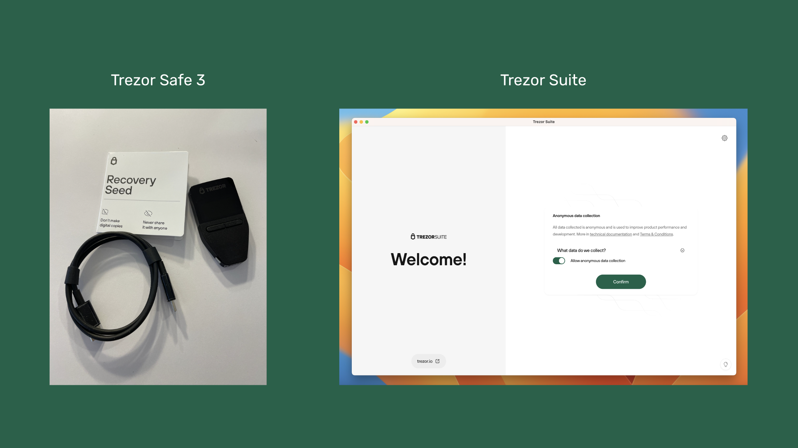
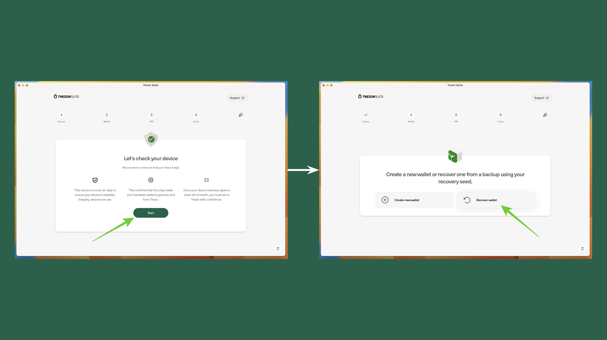
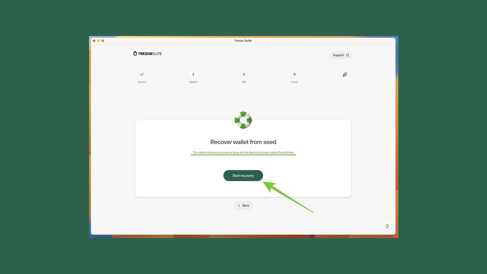
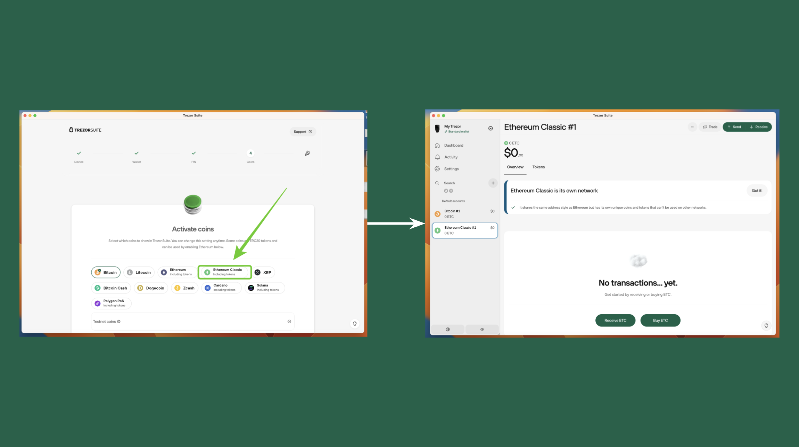

---
**You can listen to or watch this video here:**

<iframe width="560" height="315" src="https://www.youtube.com/embed/cd-Mea3UrRg" title="YouTube video player" frameborder="0" allow="accelerometer; autoplay; clipboard-write; encrypted-media; gyroscope; picture-in-picture; web-share" allowfullscreen></iframe>

---

In this post we will explain how to recover your ETC addresses on the Trezor Safe 3 using your secret passphrase. This is needed if your Trezor Safe 3 was lost, compromised, or damaged. 

The secret passphrase or mnemonic phrase is a group of 12, 18, or 24 words that you should have written on paper and stored in a safe place as we explained in [our post](https://ethereumclassic.org/blog/2024-03-27-using-ethereum-classic-with-trezor) about using ETC with Trezor Safe 3.

## The Trezor Hardware and Software Components

Trezor Safe 3 is a hardware wallet, so to recover it you need to acquire a new Trezor Safe 3 device and install the Trezor Suite app again on your computer. You will also need the card where you wrote your 12, 18, or 24 word secret passphrase, or mnemonic phrase, when you installed it the first time.

In the following sections we will explain the steps to recover your ETC addresses using your Trezor secret passphrase.

We will show the parallel actions on your Trezor Safe 3 and on your computer where appropriate.

## 1. Go to the Trezor Start Page and Get the Trezor Suite App

When you unbox and connect your new Trezor Safe 3 to your computer, the first thing it will ask you is to go to https://trezor.io/start.

When you go there on your computer browser, download the Trezor Suite app for your operating system and open it.

## 2. Open Trezor Suite and Install Firmware

When you open your Trezor Suite on you computer, it will display the device security check. After you read and go through the check press the “Set up my Trezor” button.

In the next screen, press on “Install firmware”.

## 3. Device Check, Tutorial, and Recover Wallet

In the next few screens Trezor will perform a device check. On the device, accept the device check.

Then, Trezor will ask you to go through a tutorial. This is for new users, so you can skip the tutorial.

Once you skip the tutorial, you will see a screen with the options “Create new wallet” or “Recover wallet”. As we are recovering your ETC addresses using your 12, 18, or 24 word secret passphrase, then we need to press on “Recover wallet”.

## 4. Start Recovery

In the next screen, Trezor Suite will prompt you to start the recovery. It will also let you know that the entire recovery process will happen on your Trezor Safe 3 device. 

To start with the recovery process, press on “Start recovery”.

## 5. Select the Number Words

In the next step on your Trezor Safe 3 device, you will go through a series of prompts to recover your wallet. When you get to the point of selecting the number of words to restore your backup, we will select 12 words as the option for this example as we chose that number of words for our secret passphrase when we set up our Trezor for the first time.

However, you may have 18 or 24 words, so select those instead if that is the case.

When you selected the number of words to recover, press the two buttons on your device at the same time as indicated in the image.

## 6. Type In Your 12, 18, or 24 Words

After reading the instructions on your Trezor Safe 3 device, start typing the words to recover your ETC addresses.

You will only need to type 2 to 4 letters of each word. When you type 2 to 4 letters of each word, the device will show you options of words to select from after you enter a few letters. From the words shown, always be careful to choose the one that corresponds to your passphrase in each round.

## 7. Success!

After you entered your 12, 18, or 24 word secret passphrase on your Trezor Safe 3 device, it will prompt you that your attempt was successful. From here you need to go to your Trezor Suite app on your computer to finish the recovery process.

## 8. Set a PIN or Skip

In the next screen, Trezor Suite will prompt you to set a PIN as you set it up before when you had your previous Trezor Safe 3 device.

Press on “Set PIN” or “Skip” if you prefer not to set up a PIN for your Trezor.

## 9. Activate ETC

Finally, after you set up a PIN or you skip that step, your Trezor Suite app will ask you to activate coins. 

To add your old ETC address again, click on the “Ethereum Classic” button and go through the process of activating ETC and adding an address.

If you had more than one ETC address, you can repeat the process as many times as you wish and all your addresses will be restored.

---

**Thank you for reading this article!**

To learn more about ETC please go to: https://ethereumclassic.org
