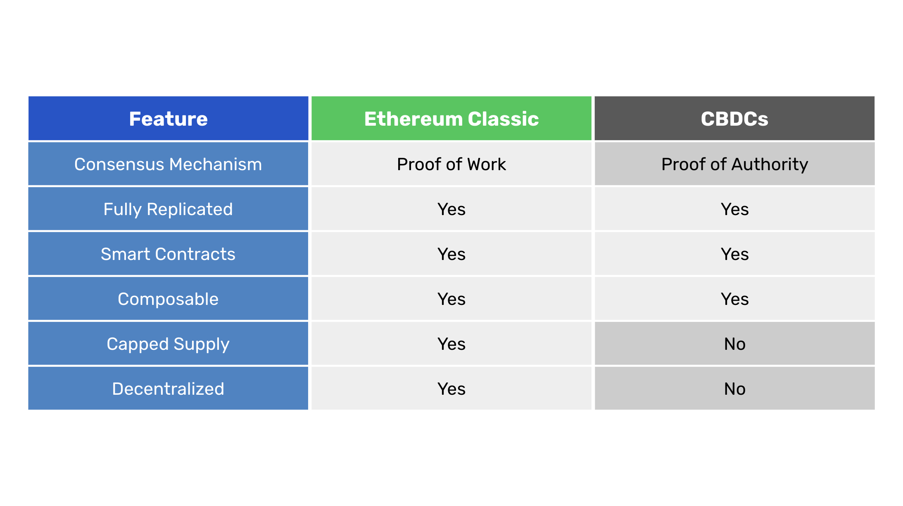
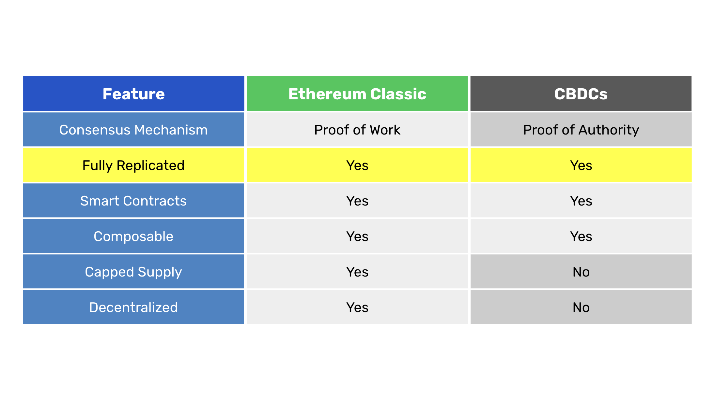
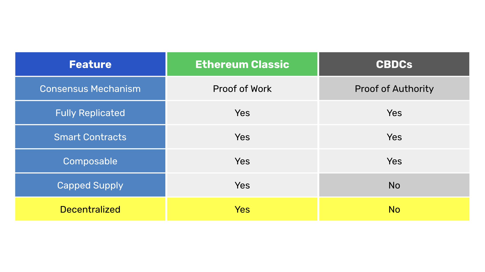

---
**You can listen to or watch this video here:**

<iframe width="560" height="315" src="https://www.youtube.com/embed/IDr_mPliX70" title="YouTube video player" frameborder="0" allow="accelerometer; autoplay; clipboard-write; encrypted-media; gyroscope; picture-in-picture; web-share" allowfullscreen></iframe>

---

As central banks all over the world race to launch their Central Bank Digital Currencies (CBDCs) to please the global elites such as the [World Economic Forum](https://www.weforum.org/publications/modernizing-financial-markets-with-wcbdc/), we as citizens have no other recourse but to learn and understand what these new technologies will entail to our life, liberty, and property.

To explain what are CBDCs, a good way of going about it is to compare them with Ethereum Classic (ETC).

ETC is the most secure and advanced blockchain technology in the world and CBDCs seek to imitate its design but to add to them their central control and planning devices.

Bitcoin was not a useful model to follow by them as it was so basic that it didn’t enable any kind of central planning scheme.

However, the EVM model invented by Vitalik Buterin, which is the design that ETC follows, is very versatile and is only truly decentralized when it works with the proof of work based Nakamoto Consensus mechanism.

Not even Ethereum (ETH) is decentralized today. 

ETH decided to migrate from POW to proof of stake (POS) in 2022, which converted it into a hybrid between ETC and CBDCs. 

However, this hybrid, as it doesn’t use any work to achieve decentralization, is easily capturable by government and special interests as CBDCs already are by definition and construction.

In the next sections we will make a comparison of ETC with CBDCs to illustrate the incredible similarities of these systems, but at the same time the critical differences between them which basically mean the difference between freedom or tyranny.

## Comparison Table

The table above lists the features we will compare between ETC and CBDCs, and we mark how they meet each specification. 

Below we will explain the comparisons line by line.

### Consensus Mechanism

As we said above, the only way to make a blockchain network decentralized is by using proof of work as the consensus mechanism. This reality produces three segments in the blockchain industry: POW decentralized blockchains such as Bitcoin and Ethereum Classic; POS or proof of authority (POA) networks such as Ethereum and Ripple; and strictly POA central planning government systems such as CBDCs.

Although it may seem that non-government POS and POA cryptocurrencies may be some sort of hybrid in the middle, this is just an optical illusion. POS and POA networks are as capturable by government and special interests as are financial institutions. There is no trust minimization in those systems either.

POW means that miners do a lot of computational work to build blocks; POS means that stakers put money to build blocks; POA means that trusted entities can build blocks; and CBDCs mean that government licensed banks and entities may build blocks in those systems.

We could say that CBDCs are hyper centralized.

### Fully Replicated

The core of the security of blockchains is that the data is fully replicated in all participating nodes of the network. This was something that governments and banks hated initially because it involves opening to the public the information of all the accounts, products, and applications that their users employ.

What’s more, this transparency also significantly reduces the lock-in that banks have over their customers and reveals the weight of their heavy pricing and fees.

However, now financial systems, central banks, and governments, especially security and spy agencies, have become very attracted to these technologies because the transparency and global replication of the information is an enormous opportunity for surveillance and control of the population.

In traditional financial systems, all the data is divided in separate data centers controlled by different financial institutions.

For example, Bank of America has their data centers with their product and customer information, JP Morgan has their own separate systems, credit card companies have their own transaction processing networks, and payment apps such as PayPal and Stripe keep the state of their customer accounts and balances in their own clouds.

All these separated and uncoordinated systems represent a Gordian knot such that it is very difficult and expensive for government and surveillance systems to capture all the information in an efficient and timely way.

However, a fully replicated blockchain such as ETC means that all participating nodes in the system have all the information of what is going on in the network.

CBDCs imitate this feature, making them as fully replicated as ETC, because now all participating nodes in those systems will have all the information of what is going on in the economy with a level of detail and granularity that had never been achieved before.

Not only this, but fully replicated blockchains transmit the information of customer transactions to all nodes in the system in real time in a matter of milliseconds on a global scale.

This means that when any person in the world uses a CBDC to do a transaction, that transaction will be known in real time by their local government, their security and spy agencies, their national government, and even by multilateral institutions such as the UN, W.H.O, and the World Bank!

### Smart Contracts

As EVM technology, ETC and CBDCs support smart contracts meaning that they are programmable.

Programmability is amazing to give versatility to cryptocurrencies, but can also be used in centralized systems as CBDCs to exercise more control on citizens.

For example, today to enforce a confiscation or to suspend the use of an account, the authority or government in question has to send messages to all financial institutions to freeze the assets of the customers or inhibit their accounts.

As programmable blockchains have all the decentralized applications in the same system, and these dapps may interact in clusters, now authorities or governments may just send one transaction to the blockchain and all node operators will know in a matter of seconds what users, addresses, and assets to intervene.

The combination of full replication and programmability gives incredible power to the levels of government listed in the previous section that will know all this activity.

Once they have this level of power they will be able to profile each person in the world by their social score, carbon footprint, whether they took a mandated medical prescription, by political association, and many other ways. 

All these measurement constructs are instruments of tyranny, totally subjective and broad, that will enhance their ability to arbitrarily enforce their worldviews and oppression.

### Composable

As fully replicated and programmable blockchains, both ETC and CBDCs are composable.

Composability means that users can interact with multiple dapps at the same time as complex multi-app transactions may be performed in single transaction executions.

Again, all this is accessible and seen by all participating nodes in the system, and these nodes may be tech companies that respond to the global elites, security and spy agencies, local and national governments, and even multilateral organizations.

Composability in CBDCs enhances even more the ability of central planners to surveil users and control their transactions.

It is incredible to note that full replication, smart contracts, and composability have such opposing effects upon the public depending on which system they are using.

On ETC, because it is a POW and truly decentralized blockchain, users enjoy the benefits of security, programmability, and composability to make their savings and wealth safer, to minimize the dependability on trusted third parties, and to reduce costs and settlement risks.

However, when using CBDCs, those same features actually represent the full extent to which central planners and controllers can impose their will on entire populations.

For example, on CBDCs tech companies, surveillance agencies, and multilateral organizations can coordinate to impose their political agendas. 

These include climate change policies; global health emergency restrictions; diversity, equity, and inclusion doctrines; environmental, social, and governance corporate constraints; anti semitism; and any other kind of arbitrary philosophy or ideology.

In the near future, through CBDCs, governments and political activists will be able to control whether people buy meat, they send donations to churches, or if they fill their tanks with gas.

CBDCs are a dream come true to central planners!

### Capped Supply

In terms of differences, one thing that CBDCs will never imitate from ETC will be its capped supply. 

If there is something that tyranny needs to finance its ways indefinitely is endless money printing.

As the world’s reserve currencies; such as the US dollar, the Chinese yuan, British pound, the Euro, and the Japanese yen; will be transformed into CBDCs, then their reserve status will allow for these nations and states to continue manipulating their economies through interest rates and monetary supply changes.

To the contrary, ETC will not only represent liberty but will also protect the value of its users’ wealth by being [digital gold](https://ethereumclassic.org/blog/2023-11-22-ethereum-classic-is-programmable-digital-gold).

### Decentralized

Needless to mention, ETC is truly decentralized and CBDCs are hyper-centralized.

Again, this is because POW is the only consensus mechanism that permits decentralization.

In a CBDC, the only way to participate as a node in the system is to receive permission from the central bank that controls it.

In POW, any computer in the world may download the ETC software and start running a node or begin mining.

Nodes and miners in ETC can join and leave the network anonymously, without the need of consulting with any third party or asking for permission, and without the risk of censorship.

In CBDCs both financial providers and users must go through cumbersome and bureaucratic processes to even open accounts in their systems!

In a world where cultural, political, and ideological differences are objectively deepening, and where technology is enabling the possibility of central planning and control of entire populations, it is not far fetched to imagine that persecution for those who wish not to comply with the different forms of mass hysteria that will prevail in society will be persecuted in various forms.

Groups will suffer the full force of cancellation, even incarceration, and possibly worse just for not following the irrational and arbitrary dictates of government and special interests. 

In this scenario it is certainly important to understand the differences between these technologies to be able to discern.

---

**Thank you for reading this article!**

To learn more about ETC please go to: https://ethereumclassic.org
