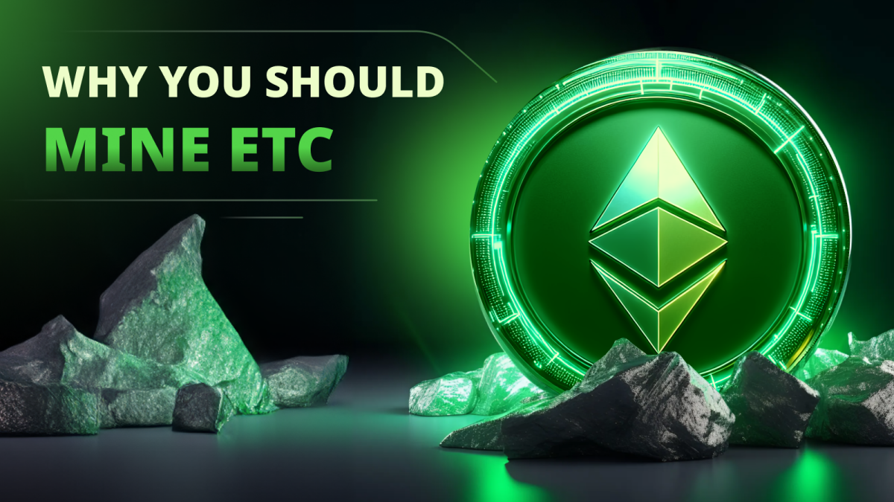
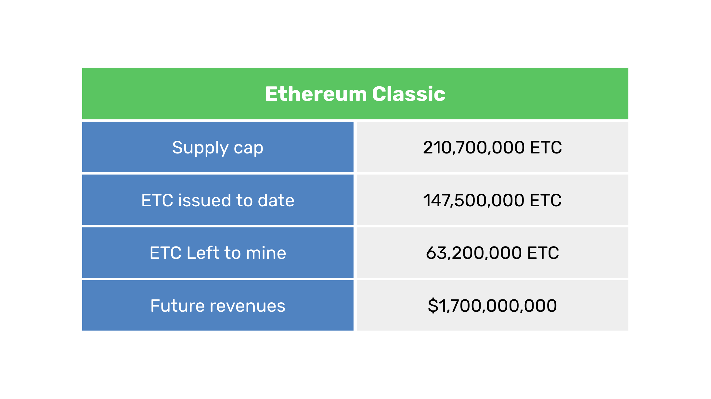
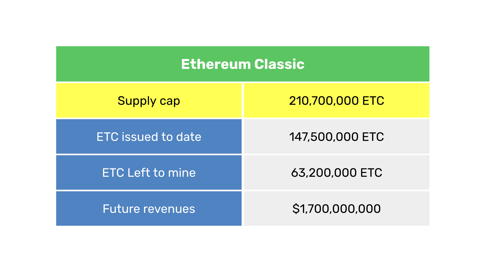
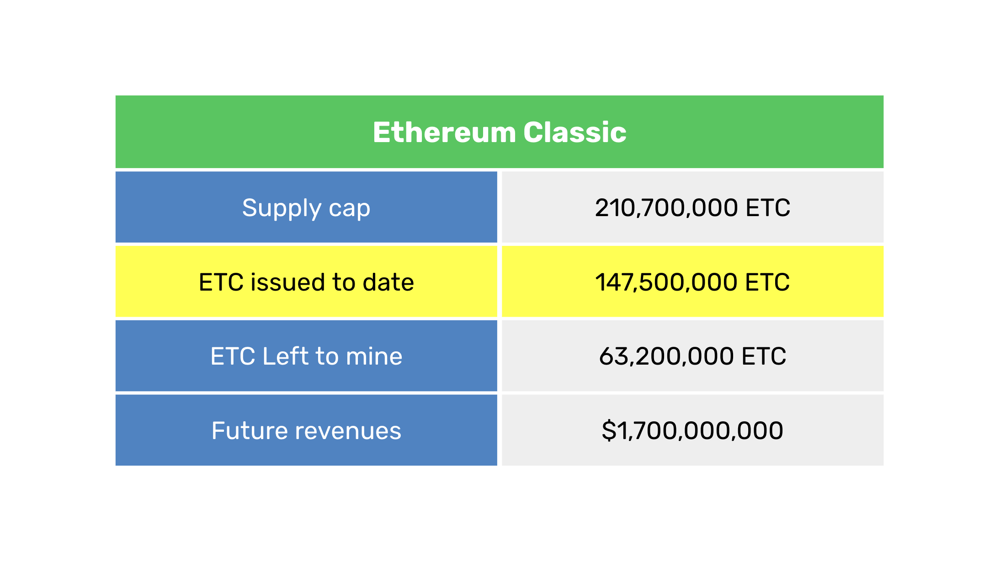
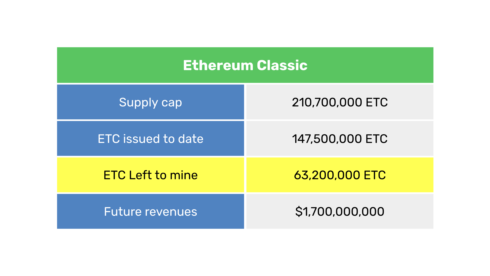

---
**You can listen to or watch this video here:**

<iframe width="560" height="315" src="https://www.youtube.com/embed/q0PKDo_FFyM" title="YouTube video player" frameborder="0" allow="accelerometer; autoplay; clipboard-write; encrypted-media; gyroscope; picture-in-picture; web-share" allowfullscreen></iframe>

---

Mining is the basic native business of proof of work (POW) blockchains.

Miners provide computing power in the form of hashrate to blockchains so that each block may be stamped at a very high cost.

These stamps are the only information all nodes and other miners in the system need to know to confirm which is the correct block in each round in a completely decentralized way.

This system has been working uninterruptedly in Bitcoin (BTC) for 15 years and in Ethereum Classic (ETC) for 9 years.

The incentives that miners have to put their machines to work for a blockchain such as ETC are the rewards per block.

These rewards are the payments per block in the form of newly created ETC, and the fees of all the transactions included in each block.

The reason you should be mining ETC is for the earnings opportunity that it represents!

Indeed, ETC will generate plenty of revenues for years to come and those who mine it will reap the benefits of its success and growth.

In the table above we listed the four major metrics to follow to quantify the total available market of ETC in terms of block rewards, which does not include the transaction fees which promise to be as large!

In the next sections we will explain each metric and their significance for miners.

## Supply Cap

One of Bitcoin’s salient features is that it has a fixed supply that was set since the beginning. The system started paying 50 BTC per block in 2009 and reduced that payment by 50% every 210,000 blocks.

By doing the math, one may calculate that Bitcoin will reach a supply cap of 21,000,000 BTC sometime in the 2130s.

Ethereum Classic adopted a similar monetary policy in 2017. ETC started paying 5 ETC per block and from then on, every 5,000,000 blocks, it is reducing that payment by 20%.

By doing the math, one may calculate that Ethereum Classic will reach a supply cap of 210,700,000 by the same time as Bitcoin.

This supply cap in ETC makes it digital gold, so for miners mining this digital gold is the key of their business.

## ETC Issued to Date

When Ethereum and Ethereum Classic were one blockchain in 2015, the network was launched with a premine of 72,009,990 coins. This is the initial stock of ETC that was issued before it started.

At the time of this writing, we are on block 20,081,198 and the total supply of ETC is nearly 147.5 million ETC or 147,494,079.63 ETC to be exact.

This stock is comprised of the following components:

- Premine: 72,009,990
- Block rewards: 73,966,294
- Uncle blocks: 1,517,796

The uncle blocks are a small portion of the issuance that are paid to miners who, from time to time, make valid blocks at the same time as others but that are not included in the canonical chain.

The issued to date metric is important to figure out the left to mine metric.

## ETC Left to Mine

The ETC left to mine metric is the key to miners because it quantifies the total available market for the business!

This is calculated by subtracting the ETC issued to date number to the supply cap number. 

If there is a total number of ETC that will ever exist, which is 210.7 million, then if we subtract from that the total stock already issued, which is 147.5 million, we will get the ETC left to mine in the future.

This number is 63,200,000 ETC.

However, the ETC left to mine is not spread evenly over the years until the 2130s. Because of the decreasing monetary policy, around 50% of the ETC left to mine will be paid to miners in the next 10 years. This is a great opportunity!

## Future Revenues

If we multiply the ETC left to mine by the average price of ETC in the last few weeks we will come up with a figure in dollars of around $1,7 billion.

This means that if nothing changes, miners in ETC will earn $1,700,000,000 of which 50% will be earned in the next 10 years. 

However, there are two thing that miners must consider with regard to ETC. The first is that it is a blockchain that will likely continue growing, which means that the price of ETC will likely rise and make these revenue estimates pale in comparison.

The second consideration is that miners may accumulate ETC as reserves as they mine it and this will likely constitute a great investment in the future.

## Mining Equipment

To start your journey as an ETC miner you must buy specialized computers called ASICs.

For your convenience we have covered some brands that you may find useful:

**BITMAIN Antminer:** https://ethereumclassic.org/blog/2023-06-07-mining-ethereum-classic-with-an-antminer-e9-pro-through-antpool

**Jasminer:** https://ethereumclassic.org/blog/2023-11-07-mining-ethereum-classic-with-the-jasminer-x16-q-high-throughput-quiet-miner

**iPollo:** https://ethereumclassic.org/blog/2023-03-14-mining-ethereum-classic-with-an-ipollo-asic-through-2miners-pool

## Mining Pools

Once you have your mining gear, you will need to connect your machines to mining pools.

We have also covered mining pools on this website:

**F2pool:** https://ethereumclassic.org/blog/2023-09-13-mining-ethereum-classic-through-f2pool

**Mining pools in general:** https://ethereumclassic.org/blog/2024-03-06-what-do-mining-pools-do-in-ethereum-classic 

We hope that this information will be useful to help you start your business mining ETC!

---

**Thank you for reading this article!**

To learn more about ETC please go to: https://ethereumclassic.org
